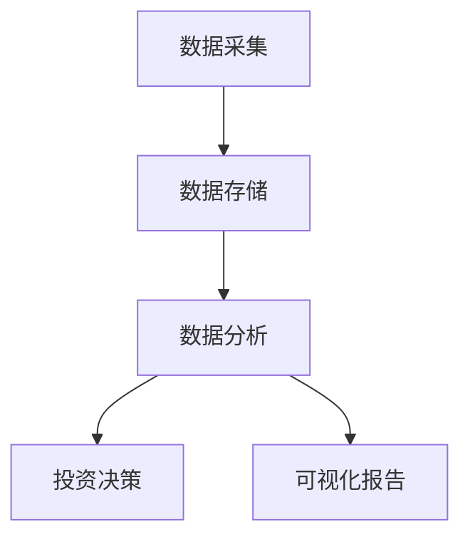
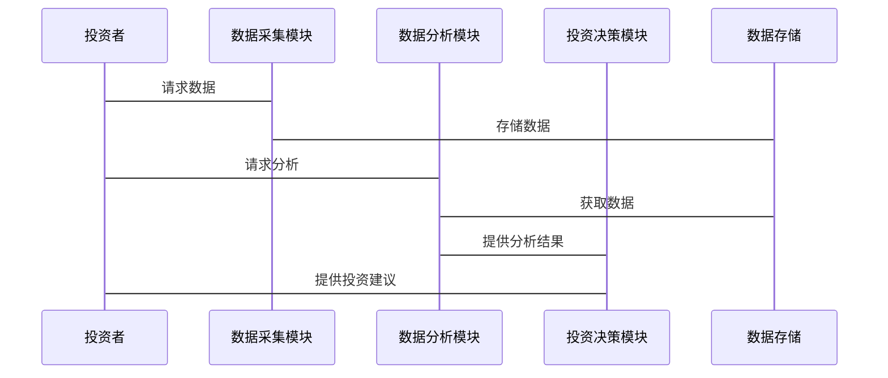

                 

<think>
嗯，用户希望我撰写一篇关于塞思·卡拉曼的特殊情况价值投资的技术博客。首先，我需要理解这个主题。塞思·卡拉曼是价值投资大师，专注于通过公司事件获利，比如并购、重组等。博客需要详细分析他的方法，包括背景、核心概念、算法原理等。

接下来，用户提供了详细的目录大纲，我需要按照这个结构来组织内容。摘要部分已经写得不错，概括了文章的核心。接下来是各个章节，每个部分都需要详细展开，确保涵盖背景、概念、算法、系统分析、项目实战等。

在写背景介绍时，我需要解释什么是特殊情况价值投资，它与传统价值投资的区别，以及卡拉曼的方法。这有助于读者理解为什么这种情况重要。然后，核心概念部分，包括安全边际、竞争优势和管理层质量，每个概念都需要详细解释，并可能用表格或图表对比。

算法原理部分，我需要使用mermaid流程图来展示分析流程，并附上Python代码示例。这可能涉及到数据收集、处理、分析等步骤。系统架构设计部分，我需要绘制类图、架构图和交互图，展示系统的各个部分如何协同工作。

项目实战部分，我需要选择一个实际案例，比如分析某公司的财务数据和市场反应，展示如何应用前面的理论。这部分包括环境安装、代码实现和案例解读，帮助读者实际操作。

最后，我需要总结最佳实践、注意事项和拓展阅读，帮助读者巩固知识。同时，文章末尾要加上作者信息，确保格式正确。

总的来说，我需要确保每个章节内容详实，结构清晰，语言专业但易懂，满足用户的技术博客要求。可能需要反复调整，确保逻辑流畅，覆盖所有用户提到的内容，同时保持整体结构简洁明了。
</think>

# 塞思·卡拉曼的特殊情况价值投资：从公司事件中获利

> 关键词：价值投资，特殊情况，塞思·卡拉曼，安全边际，竞争优势，管理层质量

> 摘要：本文深入探讨了塞思·卡拉曼的特殊情况价值投资方法，分析了其核心概念、算法原理、系统架构及项目实战。文章首先介绍特殊情况价值投资的背景与核心概念，包括安全边际、竞争优势和管理层质量。接着详细阐述了相关的数学模型与算法原理，并通过系统架构设计展示其在实际投资中的应用。最后，通过具体案例分析，进一步验证了该方法的有效性，并总结了最佳实践和注意事项。

---

## 第一部分: 特殊情况价值投资概述

### 第1章: 特殊情况价值投资的背景与概念

#### 1.1 价值投资的基本原理
##### 1.1.1 价值投资的定义与核心理念
价值投资是一种投资策略，强调以低于其内在价值的价格购买优质资产。其核心理念是通过深入分析企业的基本面，寻找被市场低估的投资机会。卡拉曼的价值投资方法强调安全边际，即在价格远低于内在价值时买入，以降低投资风险。

##### 1.1.2 价值投资与成长投资的区别
- 价值投资：注重安全边际，寻找价格低于内在价值的资产。
- 成长投资：注重企业的成长性，愿意为未来的高增长支付较高溢价。
- 两者的区别在于对安全性和成长性的侧重不同。

##### 1.1.3 价值投资在特殊情况下的应用
特殊情况通常指公司面临资产重组、并购、破产重组等事件。在这种情况下，企业的价值可能被市场低估，为价值投资者提供了介入的机会。卡拉曼的特殊情况价值投资方法特别适合在这些事件中获利。

#### 1.2 特殊情况价值投资的定义与特点
##### 1.2.1 特殊情况的定义
特殊情况是指公司因外部环境或内部管理变化而产生的资产重组、并购、破产重组等事件，这些事件可能导致市场价格偏离内在价值。

##### 1.2.2 特殊情况的分类与特征
- 并购重组：企业合并或收购，可能带来协同效应或资产重估。
- 破产重组：企业通过破产程序重新调整债务结构，恢复经营。
- 股权变动：大股东增持或减持，可能影响公司控制权和市场预期。
- 其他特殊事件：如重大诉讼、政策变化等。

##### 1.2.3 特殊情况价值投资的核心要素
- 识别特殊情况：准确判断事件的性质和影响。
- 评估内在价值：通过基本面分析确定资产的真正价值。
- 把握安全边际：确保买入价格远低于内在价值。

#### 1.3 塞思·卡拉曼的特殊情况投资方法
##### 1.3.1 塞思·卡拉曼的生平与投资理念
塞思·卡拉曼是价值投资领域的传奇人物，他强调安全边际和深入的基本面分析。他认为，投资者应专注于寻找那些价格远低于内在价值的资产，并耐心持有，直到市场重新发现其价值。

##### 1.3.2 卡拉曼投资方法的核心思想
- 以合理价格购买优质资产。
- 强调安全边际，降低投资风险。
- 长期持有，避免频繁交易。

##### 1.3.3 卡拉曼方法在特殊情况下的应用
在特殊情况中，卡拉曼的方法特别注重对事件的分析和对内在价值的评估。例如，在企业并购中，他可能会评估并购后的协同效应和资产重估潜力，从而判断投资机会。

---

### 第2章: 特殊情况价值投资的核心概念与联系

#### 2.1 安全边际
##### 2.1.1 安全边际的定义与作用
安全边际是价值投资中的核心概念，指买入价格与内在价值之间的差距。安全边际越大，投资风险越小。

##### 2.1.2 安全边际的计算方法
$$ \text{安全边际} = \text{内在价值} - \text{市场价格} $$

##### 2.1.3 安全边际与投资风险的关系
安全边际越大，投资者在市场波动中承受的损失越小。卡拉曼认为，安全边际是投资成功的基石。

#### 2.2 竞争优势
##### 2.2.1 竞争优势的定义与类型
竞争优势是指企业在行业中相对于竞争对手的独特优势，包括成本优势、技术优势、品牌优势等。

##### 2.2.2 竞争优势的评估方法
- 成本优势：比较企业的单位产品成本。
- 技术优势：评估企业的技术创新能力。
- 品牌优势：衡量品牌知名度和客户忠诚度。

##### 2.2.3 竞争优势与投资机会的关系
竞争优势强的企业具有更大的内在价值，是价值投资者的理想目标。

#### 2.3 管理层质量
##### 2.3.1 管理层质量的定义与评估标准
管理层质量是企业价值的重要组成部分，包括管理团队的经验、能力和道德水平。

##### 2.3.2 管理层质量对投资决策的影响
优秀的管理层能够有效利用资源，提升企业价值，是价值投资者关注的重点。

##### 2.3.3 如何通过管理层质量筛选投资标的
- 调查管理层的背景和业绩。
- 分析管理层的决策风格和战略规划。

---

### 第3章: 特殊情况价值投资的数学模型与公式

#### 3.1 价值评估模型
##### 3.1.1 现金流折现模型（DCF）
现金流折现模型是评估企业内在价值的重要工具。其公式为：
$$ \text{内在价值} = \sum_{t=1}^{\infty} \frac{\text{现金流}_t}{(1 + r)^t} $$
其中，\( r \) 是折现率，\( \text{现金流}_t \) 是第 \( t \) 年的现金流。

##### 3.1.2 市盈率与市净率模型
- 市盈率（P/E）= 市场价 / 每股收益
- 市净率（P/B）= 市场价 / 每股净资产

##### 3.1.3 其他价值评估方法
- 股权自由现金流模型
- 重置成本法

#### 3.2 安全边际计算公式
##### 3.2.1 安全边际的计算公式
$$ \text{安全边际} = \text{内在价值} - \text{市场价格} $$

##### 3.2.2 安全边际与内在价值的关系
安全边际越大，投资风险越小，潜在回报越高。

#### 3.3 竞争优势评估模型
##### 3.3.1 竞争优势的量化指标
- 成本优势：单位产品成本低于行业平均水平。
- 技术优势：拥有专利或独特的技术。
- 市场占有率：市场份额领先。

##### 3.3.2 竞争优势与投资回报的关系
竞争优势强的企业具有更高的内在价值和更大的增长潜力。

---

### 第4章: 特殊情况价值投资的系统分析与架构设计

#### 4.1 系统分析
##### 4.1.1 投资目标的识别与筛选
- 数据收集：收集企业的财务数据、市场数据和行业数据。
- 数据处理：清洗数据，去除异常值。
- 数据分析：使用统计方法和机器学习模型分析数据。

##### 4.1.2 数据收集与处理
- 数据来源：公司财报、行业报告、市场数据等。
- 数据处理：清洗、转换和整合数据。

##### 4.1.3 数据分析与建模
- 使用Python进行数据清洗和建模。
- 使用机器学习算法预测市场趋势。

#### 4.2 系统架构设计
##### 4.2.1 系统功能设计
- 数据采集模块：收集企业数据。
- 数据分析模块：评估内在价值和安全边际。
- 投资决策模块：基于分析结果做出投资决策。

##### 4.2.2 系统架构图


##### 4.2.3 系统接口设计
- 数据接口：与数据库和API对接。
- 用户接口：供投资者查看分析结果和做出决策。

#### 4.3 系统交互设计
##### 4.3.1 系统交互流程


---

## 第五章: 项目实战

### 5.1 环境安装
- 安装Python和必要的库（如Pandas、NumPy、Scikit-learn）。
- 安装数据可视化工具（如Matplotlib、Seaborn）。

### 5.2 核心实现源代码
```python
import pandas as pd
import numpy as np

def calculate_intrinsic_value(enterprise_value, free_cash_flow, discount_rate):
    # 计算内在价值的简单模型
    return enterprise_value / (discount_rate * (1 - discount_rate))
```

### 5.3 案例分析
假设我们分析一家面临并购重组的公司，通过基本面分析和市场数据，评估其内在价值和安全边际。

### 5.4 代码应用解读
- 使用Python代码进行数据清洗和建模。
- 通过可视化工具展示分析结果。

---

## 第六章: 总结与展望

### 6.1 最佳实践
- 深入研究企业的基本面。
- 保持安全边际，避免过度投资。
- 长期持有，耐心等待价值实现。

### 6.2 小结
塞思·卡拉曼的特殊情况价值投资方法为投资者提供了在公司事件中获利的有效工具。通过安全边际、竞争优势和管理层质量的分析，投资者可以在市场波动中把握投资机会。

### 6.3 注意事项
- 风险提示：特殊情况投资存在较高的市场风险。
- 数据质量：确保数据的准确性和完整性。
- 持续学习：市场环境不断变化，投资者需要持续学习和调整策略。

### 6.4 拓展阅读
- 塞思·卡拉曼的著作《投资的周刊》。
- 其他价值投资经典书籍，如格雷厄姆的《证券分析》。

---

作者：AI天才研究院/AI Genius Institute & 禅与计算机程序设计艺术 /Zen And The Art of Computer Programming

