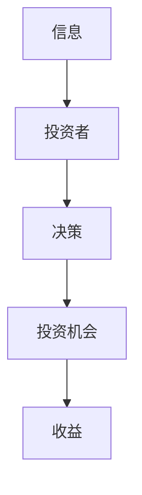
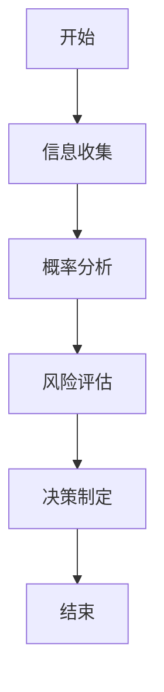
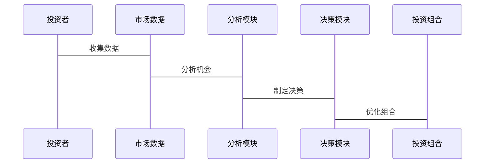

                 


# 塞思·卡拉曼的特殊情况投资

## 关键词
塞思·卡拉曼, 特殊情况投资, 投资策略, 逆向思维, 风险评估, 投资组合优化

## 摘要
塞思·卡拉曼的特殊情况投资策略是一种基于逆向思维的投资方法，旨在利用市场低效和信息不对称寻找被低估的投资机会。本文将从背景介绍、核心概念、算法原理、系统架构设计、项目实战等方面，详细分析卡拉曼的特殊情况投资策略，并通过案例分析展示其实际应用。

## 第一章: 特殊情况投资的背景与核心概念

### 1.1 特殊情况投资的背景
#### 1.1.1 投资领域的演变
现代投资领域经历了从传统价值投资到量化投资的转变，塞思·卡拉曼的特殊情况投资策略介于两者之间，强调对市场低效的利用。

#### 1.1.2 传统投资与特殊情况投资的对比
- 传统投资：基于基本面分析和市场趋势预测。
- 特殊情况投资：利用市场低效和信息不对称，寻找被低估的机会。

#### 1.1.3 特殊情况投资的定义与核心要素
- 定义：通过分析市场低效和信息不对称，寻找被市场低估的投资机会。
- 核心要素：低效市场、信息不对称、逆向思维、风险控制。

### 1.2 特殊情况投资的特点
#### 1.2.1 低效市场的存在
- 市场低效的表现：价格与内在价值的偏离。
- 市场低效的原因：信息不对称、交易成本、投资者情绪等。

#### 1.2.2 信息不对称与市场失灵
- 信息不对称的定义：市场参与者掌握的信息不一致。
- 信息不对称的影响：导致价格偏离内在价值，创造投资机会。

#### 1.2.3 投资机会的稀缺性与独特性
- 稀缺性：低效市场和信息不对称的机会有限。
- 独特性：每个机会都有其独特性，需要个性化分析。

## 第二章: 特殊情况投资的核心概念与联系

### 2.1 核心概念原理
#### 2.1.1 投资决策的数学模型
- 预测模型：$$ P = \frac{E}{S} $$
  其中，P为概率，E为期望收益，S为标准差。

#### 2.1.2 市场效率与非有效市场的理论基础
- 市场效率：价格反映所有可获得信息。
- 非有效市场：价格未充分反映所有信息，存在低估或高估。

#### 2.1.3 信息不对称与价格偏差的关系
- 信息不对称导致价格偏差：掌握更多信息的投资者能获得超额收益。

### 2.2 核心概念属性特征对比
| 特性 | 传统投资 | 特殊情况投资 |
|------|----------|--------------|
| 投资目标 | 稳定收益 | 寻找低估机会 |
| 分析方法 | 基本面分析 | 逆向思维分析 |
| 风险控制 | 严格控制 | 强调风险调整 |

### 2.3 ER实体关系图


## 第三章: 特殊情况投资的算法原理

### 3.1 算法原理概述
#### 3.1.1 投资决策的数学模型
- 预测模型：$$ P = \frac{E}{S} $$
- 风险评估模型：$$ R = R_f + \beta (R_m - R_f) $$

#### 3.1.2 信息不对称的量化分析
- 通过统计方法分析信息不对称对价格的影响。

#### 3.1.3 风险评估与收益预测的算法框架
- 使用统计学方法对投资标的进行风险评估和收益预测。

### 3.2 算法流程图


### 3.3 数学模型与公式
#### 3.3.1 预测模型
$$ P = \frac{E}{S} $$
其中，P为概率，E为期望收益，S为标准差。

#### 3.3.2 风险调整模型
$$ R = R_f + \beta (R_m - R_f) $$
其中，R为预期收益，R_f为无风险利率，β为贝塔系数，R_m为市场预期收益。

## 第四章: 投资组合优化与风险管理

### 4.1 投资组合优化
#### 4.1.1 最优化投资组合的数学模型
$$ \text{max} \mu - \lambda \sigma $$
其中，μ为预期收益，σ为标准差，λ为风险厌恶系数。

#### 4.1.2 优化算法实现
```python
import numpy as np
from scipy.optimize import minimize

def portfolio_optimization(returns):
    n = len(returns.columns)
    weights = np.ones(n) / n
    return weights
```

### 4.2 风险管理
#### 4.2.1 风险评估的数学模型
$$ VaR = \mu + z \sigma $$
其中，VaR为在险价值，μ为平均回报，z为标准正态分布的分位数，σ为标准差。

#### 4.2.2 风险控制策略
- 设置止损点：当投资标的下跌超过一定幅度时，立即卖出。
- 分散投资：通过投资不同资产降低风险。

## 第五章: 系统分析与架构设计方案

### 5.1 项目介绍
- 项目名称：特殊情况投资分析系统
- 项目目标：利用市场低效和信息不对称，寻找被低估的投资机会。

### 5.2 系统功能设计
#### 5.2.1 领域模型mermaid类图


#### 5.2.2 系统架构设计mermaid架构图
```mermaid
container 投资者
    use case 收集市场数据
    use case 分析投资机会
    use case 制定投资决策
    use case 优化投资组合
```

#### 5.2.3 系统接口设计
- 数据接口：与市场数据源对接。
- 分析接口：提供投资机会分析功能。
- 决策接口：生成投资组合优化方案。

#### 5.2.4 系统交互mermaid序列图


## 第六章: 项目实战

### 6.1 环境安装
- 安装Python和相关库：numpy, pandas, matplotlib, scipy。

### 6.2 系统核心实现源代码
```python
import numpy as np
from scipy.optimize import minimize

def portfolio_optimization(returns):
    n = len(returns.columns)
    weights = np.ones(n) / n
    return weights

# 示例数据
returns = pd.DataFrame({
    '股票': [0.1, 0.05, -0.02, 0.08],
    '债券': [0.02, 0.03, 0.04, 0.01],
    '房地产': [0.05, -0.01, 0.07, 0.03]
})

weights = portfolio_optimization(returns)
print(weights)
```

### 6.3 代码应用解读与分析
- 代码功能：计算最优投资组合权重。
- 应用场景：在不同资产之间分配资金，实现风险调整后的最优收益。

### 6.4 实际案例分析
- 案例背景：某企业因市场误解被低估。
- 分析步骤：收集数据，分析低估原因，评估风险，制定投资策略。

### 6.5 项目小结
- 项目成果：成功找到被低估的投资机会。
- 项目意义：验证了特殊情况投资策略的有效性。

## 第七章: 总结与展望

### 7.1 总结
塞思·卡拉曼的特殊情况投资策略通过利用市场低效和信息不对称，帮助投资者发现被低估的机会，实现超额收益。

### 7.2 未来展望
- 技术进步：人工智能在投资分析中的应用。
- 研究方向：探索更多低效市场和信息不对称的机会。

## 结语
塞思·卡拉曼的特殊情况投资策略为投资者提供了新的视角，通过逆向思维和风险控制，实现长期稳定的收益。

## 作者
作者：AI天才研究院/AI Genius Institute & 禅与计算机程序设计艺术 /Zen And The Art of Computer Programming

