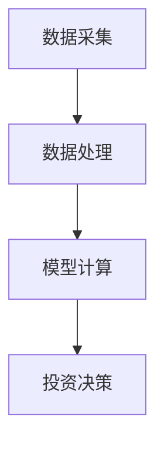

                 

<think>
好，我需要帮用户撰写一篇关于《塞思卡拉曼的价值投资实践案例》的技术博客文章。用户希望文章结构清晰、逻辑严谨，并且包含丰富的技术细节和实际案例。我得按照用户提供的大纲逐步展开，确保每个部分都涵盖必要的内容。

首先，我得明确文章的核心内容和关键词。关键词包括价值投资、塞思·卡拉曼、内在价值、安全边际、投资策略等。摘要部分需要简明扼要地概括文章的主要内容，即介绍塞思·卡拉曼的价值投资理论，分析其核心概念，并通过实际案例展示其应用。

接下来，按照目录大纲，我需要详细撰写每个章节。首先是背景介绍，解释价值投资的起源和发展，以及塞思·卡拉曼的贡献。这部分需要包括一些基本概念，如安全边际和内在价值，以及它们在投资中的重要性。

然后是核心概念与评估模型，详细讲解塞思·卡拉曼的价值评估模型，包括其结构、优缺点，以及如何在实际中应用。这部分需要结合数学公式和算法，可能需要使用LaTeX来展示公式，并用mermaid绘制流程图来说明模型的运作。

接下来是系统化分析与架构设计，讨论如何构建一个投资系统，包括数据收集、策略制定和风险管理。这部分可能需要设计系统架构图，展示各个模块之间的关系，以及如何实现安全边际和内在价值的计算。

然后是项目实战与案例分析，通过具体案例展示如何应用塞思·卡拉曼的理论进行投资分析。这部分需要包括环境安装、代码实现和案例分析，帮助读者理解理论的实际应用。

最后是总结与展望，回顾文章的主要内容，并提出未来的研究方向或改进建议。

在撰写过程中，我需要注意使用清晰简洁的语言，确保每个部分都有足够的细节，但又不过于冗长。同时，图表的使用要适当，帮助读者更好地理解复杂的概念。比如，使用mermaid绘制流程图和架构图，以及LaTeX展示数学公式，可以让文章更具专业性和可读性。

总的来说，我需要一步步按照用户的要求，逐步展开每个章节的内容，确保文章结构完整，逻辑清晰，同时包含丰富的技术细节和实际案例，以满足读者的需求。
</think>

# 塞思卡拉曼的价值投资实践案例

**关键词：** 塞思·卡拉曼、价值投资、内在价值、安全边际、投资策略、实践案例

**摘要：**  
本文深入探讨了塞思·卡拉曼的价值投资理论与实践案例，详细分析了其核心概念、评估模型以及实际应用。文章从价值投资的起源与发展入手，介绍了塞思·卡拉曼的投资哲学，重点阐述了内在价值和安全边际的计算方法，并通过实际案例展示了其投资策略的应用。同时，本文还结合系统化分析与架构设计，探讨了如何将价值投资理念转化为可执行的投资系统。

---

# 第1章: 价值投资的定义与背景

## 1.1 价值投资的起源与核心理念

### 1.1.1 价值投资的起源与发展  
价值投资是一种以基本面分析为基础的投资策略，起源于20世纪初。它强调以低于内在价值的价格购买优质资产，以期在长期获得超额收益。价值投资的核心理念是关注市场的非理性波动，寻找被市场低估的投资标的。

### 1.1.2 价值投资的核心理念与原则  
价值投资的核心理念包括：  
1. **安全边际**：以低于内在价值的价格买入资产，确保投资的安全性。  
2. **长期视角**：关注企业的长期价值，而非短期市场波动。  
3. **逆向思维**：在市场恐慌时寻找机会，在市场狂热时保持冷静。  

### 1.1.3 价值投资与其它投资策略的区别  
价值投资与成长投资、指数投资等策略的区别在于，它更注重对企业基本面的深入分析，追求安全边际和内在价值的发现。  

---

## 1.2 塞思·卡拉曼的背景与贡献  

### 1.2.1 塞思·卡拉曼的生平简介  
塞思·卡拉曼（Seth K. Carman）是一位知名的价值投资者，以其严谨的投资方法和长期的业绩表现而闻名。他的投资理念深受本杰明·格雷厄姆（Benjamin Graham）的影响，但又在实践中进行了创新和发展。

### 1.2.2 塞思·卡拉曼在价值投资领域的贡献  
卡拉曼的主要贡献在于他对安全边际和内在价值的深入研究，以及将这些理论应用于实际投资的系统化方法。他的投资模型强调对企业的财务状况、行业地位和管理层质量的全面评估。

### 1.2.3 塞思·卡拉曼投资哲学的核心思想  
卡拉曼的投资哲学可以总结为：  
1. **注重安全边际**：买入价格远低于内在价值的资产，以降低投资风险。  
2. **长期持有优质资产**：选择具有强大竞争优势和稳定现金流的企业。  
3. **避免市场情绪干扰**：坚持基本面分析，不被市场波动所左右。  

---

## 1.3 价值投资的适用场景与局限性  

### 1.3.1 价值投资的适用场景  
价值投资适用于市场处于低估状态，尤其是当市场出现非理性下跌时，投资者可以利用价值投资策略寻找被低估的资产。

### 1.3.2 价值投资的局限性  
1. **需要深度研究**：价值投资要求投资者对企业基本面有深入的理解，这需要时间和精力。  
2. **市场周期性影响**：在市场过热时，价值投资者可能需要等待较长时间才能找到合适的标的。  

### 1.3.3 价值投资与其他投资策略的结合  
价值投资可以与其他策略（如股息投资、事件驱动投资）结合，以优化投资组合的收益和风险。

---

## 1.4 本章小结  
本章介绍了价值投资的起源、核心理念以及塞思·卡拉曼的投资哲学。通过分析价值投资的适用场景和局限性，读者可以更好地理解其在实际投资中的应用。

---

# 第2章: 价值投资的核心概念与评估模型  

## 2.1 安全边际的定义与作用  

### 2.1.1 安全边际的定义  
安全边际是指资产的市场价格与内在价值之间的差距。它反映了市场对资产的估值偏差，是价值投资中降低风险的重要因素。

### 2.1.2 安全边际在投资中的作用  
安全边际的作用包括：  
1. **降低投资风险**：通过买入低于内在价值的资产，减少市场波动对投资的影响。  
2. **提高投资收益**：当市场价格回归内在价值时，投资者可以获得超额收益。  

### 2.1.3 安全边际的计算方法  
安全边际 = 内在价值 - 市场价格  

---

## 2.2 内在价值的评估方法  

### 2.2.1 内在价值的定义  
内在价值是指资产在合理市场条件下应有的价值，通常通过对企业未来现金流的折现来计算。

### 2.2.2 内在价值的计算公式  
$$
\text{内在价值} = \sum_{t=1}^{n} \frac{\text{现金流}_t}{(1 + r)^t}
$$  
其中，\( r \) 为折现率，\( n \) 为预测的现金流期限。

### 2.2.3 内在价值与市场价格的关系  
当市场价格低于内在价值时，资产被低估，适合买入；当市场价格高于内在价值时，资产被高估，适合卖出。

---

## 2.3 塞思·卡拉曼的价值评估模型  

### 2.3.1 模型的构成与核心要素  
卡拉曼的价值评估模型包括以下几个核心要素：  
1. **企业基本面**：包括收入、利润、现金流等财务指标。  
2. **行业地位**：包括企业在行业中的竞争地位和市场占有率。  
3. **管理层质量**：包括管理层的背景、能力和战略决策。  

### 2.3.2 模型的优缺点分析  
**优点**：  
- 结合了定量分析和定性分析，全面评估企业的价值。  
- 强调安全边际，降低了投资风险。  

**缺点**：  
- 模型的复杂性较高，需要大量的数据支持和深入的分析。  

### 2.3.3 模型的实际应用案例  
假设我们评估一家企业的内在价值，以下是具体步骤：  
1. **收集数据**：包括企业的财务报表、行业数据等。  
2. **计算现金流**：预测未来5年的现金流。  
3. **计算内在价值**：使用现金流折现法计算内在价值。  
4. **计算安全边际**：比较市场价格与内在价值，确定安全边际。  

---

## 2.4 本章小结  
本章详细介绍了安全边际和内在价值的概念，并结合塞思·卡拉曼的价值评估模型，展示了如何通过这些核心概念进行投资决策。

---

# 第3章: 价值投资的系统化分析与架构设计  

## 3.1 投资系统的核心要素  

### 3.1.1 数据收集与处理  
数据收集包括企业的财务数据、行业数据和市场数据。数据处理包括清洗、转换和分析。

### 3.1.2 投资策略的制定  
投资策略包括资产配置、买入时机和卖出时机的确定。

### 3.1.3 风险管理与控制  
风险管理包括止损设置和投资组合的分散化。

---

## 3.2 投资系统的架构设计  

### 3.2.1 系统功能模块划分  
- 数据采集模块：负责收集和处理数据。  
- 模型计算模块：负责计算内在价值和安全边际。  
- 投资决策模块：根据计算结果制定投资策略。  

### 3.2.2 系统架构的流程图  


### 3.2.3 系统接口设计与交互  
系统接口包括数据输入接口、计算接口和决策接口。

---

## 3.3 投资系统的优化与改进  

### 3.3.1 系统性能的优化  
优化数据库查询和算法效率，提高系统的运行速度。

### 3.3.2 系统功能的扩展  
增加更多的分析模块，如风险分析和情景分析。

### 3.3.3 系统的风险控制与调整  
通过动态调整止损点和权重分配，降低投资风险。

---

## 3.4 本章小结  
本章从系统化的角度，探讨了价值投资的实现过程，包括数据收集、模型计算和投资决策等模块的设计与优化。

---

# 第4章: 价值投资的项目实战与案例分析  

## 4.1 项目环境的安装与配置  

### 4.1.1 投资分析工具的安装  
安装Python编程环境和数据分析工具（如Pandas、NumPy）。

### 4.1.2 数据源的获取与处理  
从可靠的数据源获取企业的财务数据和市场数据。

### 4.1.3 系统环境的配置  
配置投资系统的运行环境，包括数据库和算法模块。

---

## 4.2 投资系统的核心实现  

### 4.2.1 内在价值的计算代码  
```python
def calculate_intrinsic_value(cash_flows, discount_rate):
    intrinsic_value = sum(cash_flow / (1 + discount_rate) ** t for t, cash_flow in enumerate(cash_flows))
    return intrinsic_value
```

### 4.2.2 安全边际的计算代码  
```python
def calculate_margin_of_safety(intrinsic_value, market_price):
    margin_of_safety = intrinsic_value - market_price
    return margin_of_safety
```

### 4.2.3 投资策略的实现代码  
```python
def investment_strategy(intrinsic_values, market_prices):
    opportunities = []
    for i in range(len(intrinsic_values)):
        margin = calculate_margin_of_safety(intrinsic_values[i], market_prices[i])
        if margin > 0:
            opportunities.append(i)
    return opportunities
```

---

## 4.3 实际案例的分析与解读  

### 4.3.1 案例背景与数据来源  
以某制造业企业为例，假设其未来5年的现金流分别为：100万、120万、140万、160万、180万，折现率为10%。

### 4.3.2 案例分析的详细步骤  
1. 计算内在价值：  
$$
\text{内在价值} = \frac{100}{1.1} + \frac{120}{1.1^2} + \frac{140}{1.1^3} + \frac{160}{1.1^4} + \frac{180}{1.1^5} \approx 464.8 \text{万元}
$$  
2. 市场价格假设为350万元，安全边际为：  
$$
\text{安全边际} = 464.8 - 350 = 114.8 \text{万元}
$$  

### 4.3.3 案例结果与总结  
由于安全边际为正，该企业被低估，适合买入。

---

## 4.4 本章小结  
本章通过实际案例，展示了如何将塞思·卡拉曼的价值投资理论应用于实际投资决策。

---

# 第5章: 价值投资的总结与展望  

## 5.1 价值投资的实战技巧与注意事项  

### 5.1.1 如何选择优质标的  
选择具有强大竞争优势和稳定现金流的企业。

### 5.1.2 如何评估企业的内在价值  
使用现金流折现法等方法进行评估。

### 5.1.3 如何控制投资风险  
设置止损点和分散投资。

---

## 5.2 价值投资的注意事项  

### 5.2.1 避免的常见误区  
1. 过度关注短期市场波动。  
2. 忽视企业的财务健康状况。  

### 5.2.2 投资中的心理控制  
保持理性，避免贪婪和恐惧。

### 5.2.3 长期与短期投资的平衡  
结合长期投资和短期调整，优化投资组合。

---

## 5.3 总结与展望  

### 5.3.1 总结  
塞思·卡拉曼的价值投资理论强调安全边际和内在价值，通过系统化的分析和长期持有优质资产，实现稳健的投资收益。

### 5.3.2 展望  
未来，价值投资将更加依赖于数据和技术，结合人工智能和大数据分析，进一步优化投资决策。

---

# 作者：AI天才研究院/AI Genius Institute & 禅与计算机程序设计艺术 /Zen And The Art of Computer Programming

