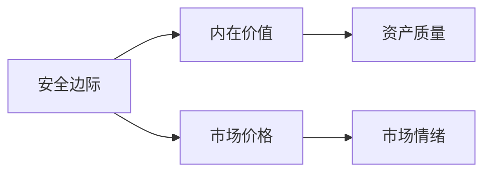
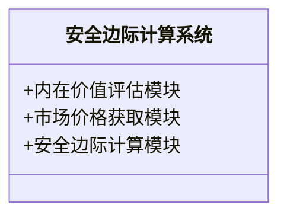
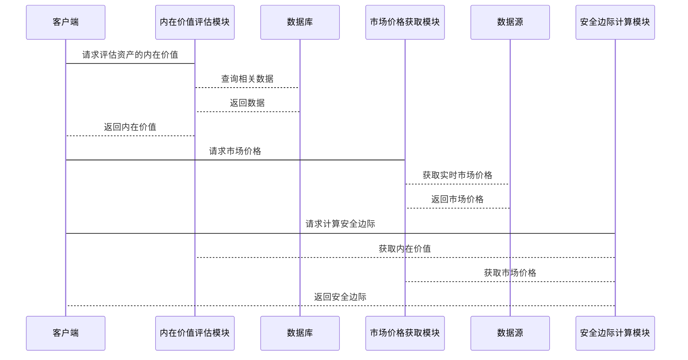

                 


# 塞思卡拉曼的安全边际计算

## 关键词：安全边际，投资理论，风险管理，价值评估，计算方法

## 摘要：塞思·卡拉曼的安全边际计算是一种用于评估资产内在价值与市场价格差异的方法，旨在通过安全边际来确定投资机会和风险。本文将从安全边际的基本概念、核心原理、计算方法、系统设计、实际案例分析以及最佳实践等方面进行详细探讨，帮助读者全面理解安全边际计算的原理和应用。

---

# 目录

## 第一部分: 安全边际计算的背景与核心概念

### 第1章: 安全边际的基本概念

#### 1.1 安全边际的定义
- 安全边际的概念
- 安全边际的核心要素
- 安全边际在投资中的重要性

#### 1.2 安全边际的历史发展
- 塞思·卡拉曼的贡献
- 安全边际理论的演变
- 当代安全边际计算的发展趋势

#### 1.3 安全边际与投资决策
- 安全边际在价值投资中的地位
- 安全边际与风险管理的关系
- 不同市场环境下的应用

### 第2章: 安全边际的核心原理

#### 2.1 内在价值的评估方法
- 内在价值的定义与计算
- 市场价格与内在价值的差异
- 安全边际的计算公式

#### 2.2 安全边际的属性特征对比
- 安全边际的属性分析
- 不同计算方法的对比
- 安全边际与风险收益比的关联

#### 2.3 安全边际的ER实体关系图


## 第二部分: 安全边际计算的算法原理

### 第3章: 安全边际计算的流程与方法

#### 3.1 安全边际计算的流程图


#### 3.2 内在价值的计算方法
- 现金流折现法
- 市盈率法
- 其他评估方法

#### 3.3 安全边际的计算公式
$$ \text{安全边际} = \text{内在价值} - \text{市场价格} $$

#### 3.4 代码实现
```python
def calculate_margin_of_safety(intrinsic_value, market_price):
    return intrinsic_value - market_price

# 示例
intrinsic_value = 100
market_price = 80
margin_of_safety = calculate_margin_of_safety(intrinsic_value, market_price)
print(f"安全边际为: {margin_of_safety}")
```

## 第三部分: 安全边际计算的系统架构设计

### 第4章: 安全边际计算系统的功能设计

#### 4.1 系统功能概述
- 内在价值评估模块
- 市场价格获取模块
- 安全边际计算模块

#### 4.2 系统功能的Mermaid类图


#### 4.3 系统架构设计
- 单体架构与分布式架构的对比
- 微服务架构的应用
- 系统的可扩展性和可维护性

#### 4.4 系统接口设计
- API接口定义
- 接口调用流程
- 接口的安全性设计

#### 4.5 系统交互的Mermaid序列图


## 第四部分: 安全边际计算的项目实战

### 第5章: 实际项目中的安全边际计算

#### 5.1 项目环境安装
- 安装必要的Python库
- 数据获取工具的安装
- 开发环境的配置

#### 5.2 核心代码实现
```python
import pandas as pd
import numpy as np

def calculate_margin_of_safety(intrinsic_values, market_prices):
    return intrinsic_values - market_prices

# 示例数据
data = {
    '资产': ['A', 'B', 'C'],
    '内在价值': [120, 150, 100],
    '市场价格': [100, 120, 80]
}
df = pd.DataFrame(data)

# 计算安全边际
df['安全边际'] = calculate_margin_of_safety(df['内在价值'], df['市场价格'])
print(df)
```

#### 5.3 代码解读与分析
- 数据输入与处理
- 安全边际的计算过程
- 结果的可视化与分析

#### 5.4 实际案例分析
- 案例背景介绍
- 数据收集与处理
- 计算过程与结果分析
- 案例总结与启示

## 第五部分: 安全边际计算的最佳实践与总结

### 第6章: 最佳实践与注意事项

#### 6.1 安全边际计算中的常见问题
- 数据的准确性与完整性
- 模型的适用性与局限性
- 计算过程中的潜在风险

#### 6.2 提高安全边际计算准确性的方法
- 数据来源的选择
- 模型的优化与调整
- 结果的验证与校准

#### 6.3 小结与展望
- 安全边际计算的总结
- 未来的发展方向
- 对投资者的建议

## 参考文献与拓展阅读
- 塞思·卡拉曼的原著
- 相关学术论文
- 行业报告与分析

## 作者：AI天才研究院/AI Genius Institute & 禅与计算机程序设计艺术/Zen And The Art of Computer Programming

