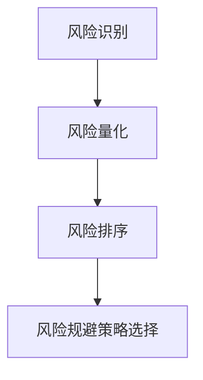
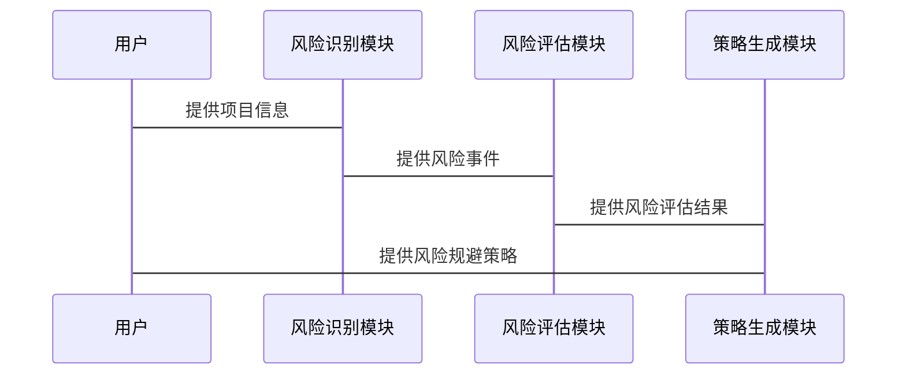

                 

<think>
好的，我现在需要帮助用户设计《塞思卡拉曼的风险规避策略》这本书的目录大纲。首先，我要理解用户的需求。用户希望这本书结构清晰，内容详尽，涵盖风险规避策略的各个方面，包括背景、理论、算法、系统设计、实战等。

接下来，我需要按照用户提供的示例结构来组织内容。用户希望每一章都有明确的标题和子标题，且每个部分都要有详细的解释和示例。我应该确保目录涵盖所有必要的主题，如风险评估、数学模型、系统架构等。

我还需要考虑用户提到的格式要求，比如使用markdown，包含背景介绍、核心概念、算法原理、系统架构设计、项目实战、最佳实践等部分。此外，数学公式需要用latex表示，系统图则使用mermaid。

现在，我开始逐步构建目录：

第一部分，风险规避策略的基础，包括概述和核心概念。概述部分介绍风险和风险规避的基本概念，塞思卡拉曼策略的背景。核心概念部分深入讲解风险评估和算法原理，包括概率计算和数学模型。

第二部分，系统架构与算法实现。这部分需要详细设计系统功能模块，如风险识别、评估、策略生成，并提供系统架构图和交互图。同时，用mermaid展示算法流程图，用Python代码实现风险评估函数。

第三部分，项目实战与案例分析。这部分通过具体案例说明塞思卡拉曼策略的应用，包括环境安装、代码实现和案例解读。

最后，附录和总结部分，提供进一步阅读的资源和注意事项，帮助读者巩固所学内容。

在整个过程中，我需要确保每个章节和子章节都符合用户的要求，内容详细且逻辑清晰。此外，要注意使用吸引人的标题，让读者容易理解和感兴趣。

通过以上步骤，我构建了一个符合用户需求的详细目录大纲，确保内容全面且结构合理。
</think>

# 塞思卡拉曼的风险规避策略

> 关键词：塞思卡拉曼，风险规避，风险管理，风险评估，数学模型，系统架构

> 摘要：本文系统地介绍了塞思卡拉曼的风险规避策略，从风险的基本概念到具体的策略实施，涵盖了风险评估、数学模型、系统架构设计等多个方面。通过详细分析和实例说明，读者可以全面理解塞思卡拉曼策略的核心思想及其在实际项目中的应用。

---

## 第一部分: 风险规避策略概述

### 第1章: 风险与风险规避的基本概念

#### 1.1 风险的定义与特征
- 风险的定义：风险是某一事件发生可能带来的损失或不利影响。
- 风险的特征：不确定性、潜在性、可测性。
- 风险的分类：自然风险、人为风险、技术风险。

#### 1.2 风险规避的定义与目标
- 风险规避的定义：通过采取特定措施，降低或消除风险的可能性。
- 风险规避的目标：保护资产安全、减少损失、确保项目顺利进行。

#### 1.3 风险规避与风险转移的区别
- 风险规避：直接消除或降低风险。
- 风险转移：将风险转嫁给第三方。

---

### 第2章: 塞思卡拉曼风险规避策略的背景

#### 2.1 风险管理的历史发展
- 风险管理的起源：从古代的保险制度到现代的系统化管理。
- 现代风险管理的核心理念：系统化、量化、预防为主。

#### 2.2 塞思卡拉曼策略的提出背景
- 塞思卡拉曼策略的提出：在现代风险管理理论的基础上，结合实际案例提出的系统化策略。
- 策略的核心思想：通过量化评估和系统化设计，实现风险的最小化。

#### 2.3 现代风险管理的核心理念
- 以数据驱动决策。
- 预防为主，降低风险发生概率。
- 系统化设计，全局优化。

---

## 第二部分: 塞思卡拉曼风险规避策略的核心算法

### 第3章: 风险评估与分析

#### 3.1 风险识别的步骤与方法
- 风险识别的步骤：
  1. 明确项目目标。
  2. 列出可能的风险来源。
  3. 确定风险的影响范围。
- 风险识别的方法：头脑风暴法、问卷调查法、专家访谈法。

#### 3.2 风险量化与概率模型
- 风险量化的基本原理：通过历史数据和概率分布模型，计算风险发生的概率和影响程度。
- 常用的概率模型：泊松分布、指数分布、正态分布。

#### 3.3 风险影响分析的框架
- 风险影响分析的步骤：
  1. 确定风险事件。
  2. 评估事件的影响范围。
  3. 量化影响程度。
- 风险影响的评估指标：损失金额、时间延迟、资源消耗。

---

### 第4章: 塞思卡拉曼策略的数学模型与算法

#### 4.1 风险评估算法概述
- 风险评估算法的流程图：


#### 4.2 数学模型与公式
- 风险概率计算公式：
$$P = \frac{\text{风险事件发生次数}}{\text{总样本数}}$$
- 风险影响评估模型：
$$I = \alpha \times P + \beta \times L$$
其中，$I$为风险影响，$P$为概率，$L$为损失程度，$\alpha$和$\beta$为权重系数。

#### 4.3 算法实现与代码示例
- 风险评估函数的实现：
```python
def risk_assessment(events, samples):
    return len(events) / samples
```

---

## 第三部分: 塞思卡拉曼策略的系统架构设计

### 第5章: 系统功能设计

#### 5.1 风险识别模块
- 功能描述：识别潜在风险事件。
- 实现方法：基于历史数据和专家意见，列出所有可能的风险。

#### 5.2 风险评估模块
- 功能描述：量化风险的概率和影响程度。
- 实现方法：使用概率模型和损失评估模型。

#### 5.3 策略生成模块
- 功能描述：生成风险规避的具体策略。
- 实现方法：根据风险评估结果，选择最优的规避措施。

### 第6章: 系统架构设计

#### 6.1 系统架构图


#### 6.2 系统交互图


---

## 第四部分: 项目实战与案例分析

### 第7章: 项目实战

#### 7.1 环境安装
- 需要的工具：Python、Mermaid、Jupyter Notebook。
- 安装步骤：
  1. 安装Python和必要的库（如numpy、pandas）。
  2. 安装Mermaid插件。
  3. 安装Jupyter Notebook。

#### 7.2 核心代码实现
- 风险评估函数的实现：
```python
def risk_assessment(events, samples):
    return len(events) / samples
```

#### 7.3 案例分析
- 案例背景：某软件开发项目，存在代码质量问题。
- 案例分析：
  1. 识别风险：代码质量问题可能导致项目延迟。
  2. 量化风险：根据历史数据，计算代码质量问题发生的概率。
  3. 制定策略：增加代码审查的频率，引入自动化测试工具。

---

## 第五部分: 总结与扩展

### 第8章: 总结与注意事项

#### 8.1 小结
- 塞思卡拉曼策略的核心思想：通过系统化的方法，量化风险并制定最优规避策略。
- 实际应用中的注意事项：确保数据的准确性和模型的适用性。

#### 8.2 注意事项
- 风险评估模型的选择要基于实际数据。
- 系统设计要充分考虑可扩展性和可维护性。

#### 8.3 拓展阅读
- 推荐阅读《风险管理的艺术》、《系统工程方法论》。

---

## 附录: 常用工具与资源

### 附录A: 常用工具
- 数据分析工具：Python、R。
- 绘图工具：Mermaid、Tableau。
- 开发工具：Jupyter Notebook、VS Code。

### 附录B: 进一步学习资源
- 在线课程：Coursera上的风险管理课程。
- 技术博客：Towards Data Science、Medium上的风险管理文章。

---

## 作者：AI天才研究院/AI Genius Institute & 禅与计算机程序设计艺术/Zen And The Art of Computer Programming

