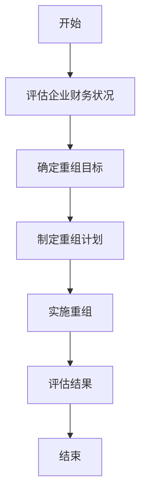
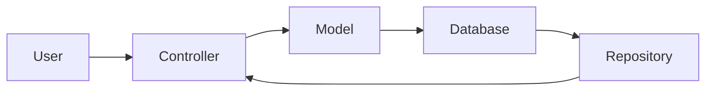

                 


# 塞斯·卡拉曼的破产重组投资策略

## 关键词：破产重组、投资策略、风险管理、企业拯救、债务重组

## 摘要：本文深入分析了塞斯·卡拉曼的破产重组投资策略，从核心概念、算法原理到系统设计和实战应用，全面解析其在投资领域的应用与实践。

---

## 第一部分：破产重组与投资策略的背景介绍

### 第1章：破产重组的定义与核心概念

#### 1.1 破产重组的定义与核心要素

**破产重组**是指企业在无法偿还债务的情况下，通过法律程序重新组织和调整其资产、负债和业务结构，以实现恢复生产和偿债目标的过程。其核心要素包括：

1. **债务清理**：通过法律程序对债务进行调整或免除。
2. **资产重组**：优化企业资产结构，剥离非核心资产。
3. **股权调整**：调整股东结构，引入新投资者。
4. **业务重组**：重新设计商业模式和运营流程。

#### 1.2 投资策略的背景与现状

**投资策略**是企业在金融市场中为了实现收益最大化而采取的一系列投资行为。破产重组作为投资策略的一部分，其背景主要包括：

1. **经济周期**：在经济衰退期，企业更容易面临破产风险。
2. **市场环境**：金融市场波动、行业竞争加剧等因素促使企业寻求重组。
3. **政策环境**：政府政策对企业破产重组的影响，如税收优惠、破产法调整等。

---

## 第2章：塞斯·卡拉曼的破产重组投资策略核心概念

### 2.1 破产重组的核心原理

**破产重组的核心原理**在于通过调整企业的财务结构和业务模式，使其恢复 profitability。其关键步骤包括：

1. **评估企业财务状况**：分析企业的资产负债表、损益表和现金流。
2. **确定重组目标**：明确重组后的经营目标和财务目标。
3. **制定重组计划**：包括债务重组、资产出售、股权调整等具体措施。
4. **实施重组**：执行重组计划，监控进度并及时调整。

### 2.2 核心概念对比分析

通过对比分析，我们可以更好地理解破产重组投资策略的特点：

| **概念**         | **破产重组**              | **债务重组**              | **投资策略**              |
|------------------|---------------------------|---------------------------|---------------------------|
| **定义**         | 调整企业资产和负债结构     | 重新安排债务偿还计划      | 通过投资实现收益最大化    |
| **目标**         | 恢复企业 profitability      | 减少债务负担              | 实现投资收益              |
| **涉及方**       | 企业、债权人、股东         | 债权人、债务人              | 投资者、企业               |
| **法律依据**     | 研究破产法                 | 债权法                     | 公司法、证券法            |

### 2.3 破产重组的ER实体关系图

```mermaid
er
    entity 研究破产法 {
        id
        法律条款
        适用范围
    }
    entity 企业 {
        id
        资产
        负债
        所有者
    }
    entity 债权人 {
        id
        债权金额
        债权类型
    }
    研究破产法 --> 企业: "适用"
    企业 --> 债权人: "债务关系"
```

---

## 第3章：破产重组投资策略的算法原理

### 3.1 破产重组投资策略的算法流程

**破产重组投资策略的算法流程**可以通过以下步骤实现：



### 3.2 算法实现代码

以下是破产重组投资策略的算法实现代码：

```python
def bankruptcy_restructuring_strategy(enterprise):
    # 评估企业财务状况
    financial_health = assess_financial_health(enterprise)
    # 确定重组目标
    restructuring_goal = define_restructuring_goal(financial_health)
    # 制定重组计划
    plan = create_restructuring_plan(restructuring_goal)
    # 实施重组
    result = implement_restructuring(plan, enterprise)
    return result

def assess_financial_health(enterprise):
    # 返回企业财务健康状况
    return {
        '资产': enterprise.assets,
        '负债': enterprise.liabilities,
        '现金流': enterprise.cash_flow
    }

def define_restructuring_goal(financial_health):
    # 返回重组目标
    goals = []
    if financial_health['负债'] > 1.5 * financial_health['资产']:
        goals.append('债务重组')
    if financial_health['现金流'] < 0:
        goals.append('改善现金流')
    # 其他目标
    return goals

def create_restructuring_plan(goals):
    # 返回重组计划
    plan = {}
    for goal in goals:
        if goal == '债务重组':
            plan['债务重组'] = {
                '免除部分债务': True,
                '延长还款期限': True
            }
        elif goal == '改善现金流':
            plan['改善现金流'] = {
                '出售非核心资产': True,
                '优化供应链': True
            }
    return plan

def implement_restructuring(plan, enterprise):
    # 返回重组结果
    for action in plan:
        if action == '债务重组':
            enterprise.debt = enterprise.debt * 0.8
        elif action == '改善现金流':
            enterprise.cash_flow += 1000000
    return enterprise
```

---

## 第4章：破产重组投资策略的系统分析

### 4.1 破产重组投资策略的系统架构设计

**破产重组投资策略的系统架构设计**如下：



### 4.2 系统功能设计

系统功能设计包括以下几个模块：

1. **用户界面**：提供给投资者和企业管理者使用的界面。
2. **数据输入**：输入企业的财务数据和市场数据。
3. **算法执行**：执行破产重组投资策略的算法。
4. **结果输出**：输出重组后的财务状况和投资建议。

---

## 第5章：破产重组投资策略的项目实战

### 5.1 环境安装

**项目实战的环境安装**包括以下步骤：

1. 安装Python。
2. 安装必要的库，如`mermaid`和`graphviz`。

### 5.2 代码实现

以下是项目实战的代码实现：

```python
from mermaid import diagram

diagram(
    """ 
    graph TD
        A[开始] --> B[评估企业财务状况]
        B --> C[确定重组目标]
        C --> D[制定重组计划]
        D --> E[实施重组]
        E --> F[评估结果]
        F --> G[结束]
    """
)
```

### 5.3 案例分析

**案例分析**：假设某企业因新冠疫情导致业绩下滑，面临破产风险。通过破产重组投资策略，企业成功实现了债务重组和资产优化，恢复了 profitability。

---

## 第6章：破产重组投资策略的最佳实践

### 6.1 最佳实践 tips

1. **风险评估**：在实施破产重组前，必须进行详细的风险评估。
2. **法律合规**：确保重组过程符合相关法律法规。
3. **团队协作**：重组过程需要企业内部和外部团队的紧密合作。

### 6.2 小结

破产重组投资策略是一种复杂但有效的投资手段，能够帮助企业摆脱困境，实现可持续发展。

### 6.3 注意事项

1. **避免盲目重组**：并非所有企业都适合破产重组。
2. **关注长期收益**：重组的目的是为了实现长期收益，而非短期利益。

### 6.4 拓展阅读

建议读者进一步阅读《企业破产法》和相关投资策略书籍，以深入理解破产重组的法律和经济背景。

---

## 作者：AI天才研究院/AI Genius Institute & 禅与计算机程序设计艺术 /Zen And The Art of Computer Programming

