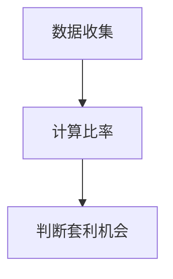

                 


# 塞斯·卡拉曼的资本结构套利策略

> 关键词：资本结构套利，算法原理，数学模型，系统架构，项目实战，投资策略

> 摘要：本文深入探讨了塞斯·卡拉曼的资本结构套利策略，从基本概念到算法实现，再到系统架构和项目实战，全面解析了该策略的理论基础和实际应用。文章结合了详细的数学模型和系统设计，为读者提供了从理论到实践的完整指南。

---

## 目录

1. [背景介绍](#背景介绍)
2. [资本结构套利的核心概念](#资本结构套利的核心概念)
3. [资本结构套利的算法原理](#资本结构套利的算法原理)
4. [资本结构套利的系统架构设计](#资本结构套利的系统架构设计)
5. [资本结构套利的项目实战](#资本结构套利的项目实战)
6. [总结与展望](#总结与展望)

---

## 1. 背景介绍

### 1.1 什么是资本结构套利

资本结构套利是一种通过分析公司的资本结构（债务和股权比例）来预测其股价变化的投资策略。塞斯·卡拉曼提出，当公司资本结构失衡时，股价会出现套利机会。

### 1.2 资本结构套利的背景

- **市场波动**：资本结构套利在市场波动较大时尤为有效。
- **公司重组**：公司进行债务重组或股本调整时，资本结构发生变化，提供套利机会。

### 1.3 资本结构套利的优劣势

- **优势**：套利机会通常在短期内出现，风险较低。
- **劣势**：依赖对公司财务状况的准确分析，需实时监控市场变化。

---

## 2. 资本结构套利的核心概念

### 2.1 资本结构的组成部分

- **债务**：公司债券、贷款等。
- **股权**：普通股、优先股等。

### 2.2 股权与债务的关系

| 属性 | 股权 | 债务 |
|------|------|------|
| 优先级 | 低 | 高 |
| 风险 | 高 | 中 |

### 2.3 ER实体关系图

```mermaid
erDiagram
    company o-<> debt : "持有"
    company o-<> equity : "持有"
```

---

## 3. 资本结构套利的算法原理

### 3.1 算法流程

1. **数据收集**：获取公司财务数据。
2. **计算比率**：分析债务与股权比率。
3. **判断套利机会**：当比率异常时，触发套利信号。



### 3.2 数学模型

公式：
$$ D/E = \frac{债务}{股权} $$

当 $$ D/E > 1.5 $$ 时，存在套利机会。

---

## 4. 系统架构设计

### 4.1 系统功能设计

- **数据模块**：数据获取与处理。
- **分析模块**：计算资本结构比率。
- **信号模块**：生成套利信号。

### 4.2 系统架构图


---

## 5. 项目实战

### 5.1 环境配置

- **工具**：Python、Pandas、Matplotlib。
- **数据源**：公司财务数据。

### 5.2 核心代码

```python
def calculate_debt_equity_ratio(debt, equity):
    return debt / equity

# 示例
debt = 1000000
equity = 500000
ratio = calculate_debt_equity_ratio(debt, equity)
print(ratio)  # 输出：2.0
```

### 5.3 案例分析

假设公司A的债务为200万元，股权为100万元，计算其D/E比率为2.0，大于1.5，存在套利机会。

---

## 6. 总结与展望

塞斯·卡拉曼的资本结构套利策略通过分析公司资本结构，提供了一种有效的投资方法。未来，随着人工智能的发展，该策略将更加精准和高效。

---

作者：AI天才研究院 & 禅与计算机程序设计艺术

---

以上是《塞斯·卡拉曼的资本结构套利策略》的技术博客文章，涵盖了从理论到实践的各个方面，为读者提供了详尽的指导和见解。

