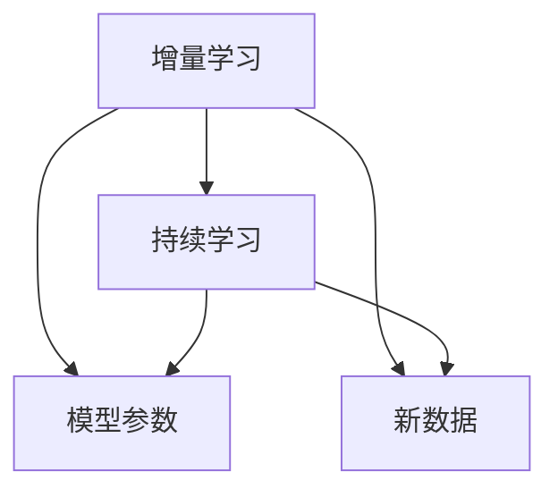
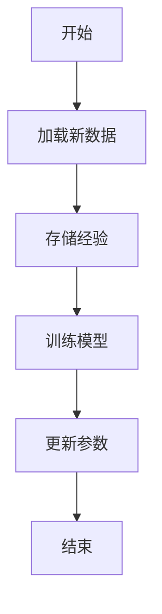
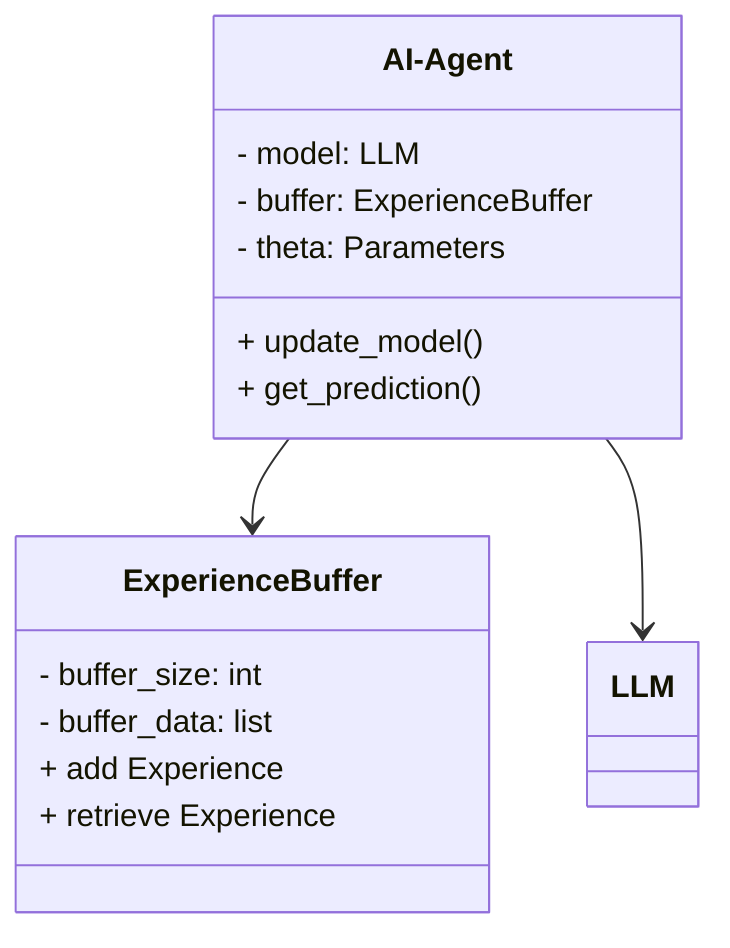
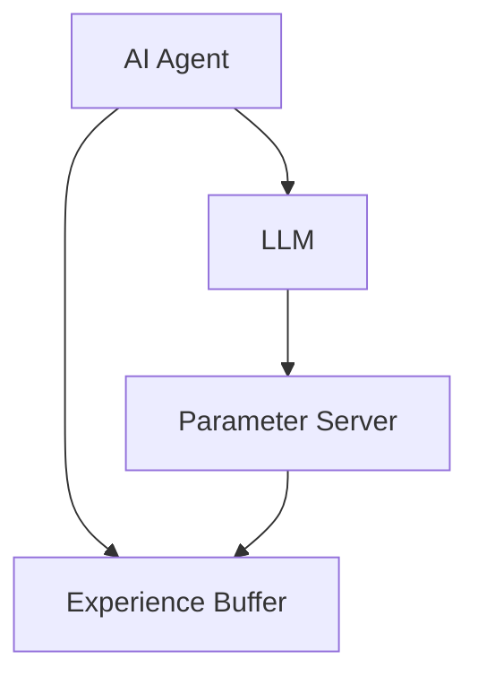
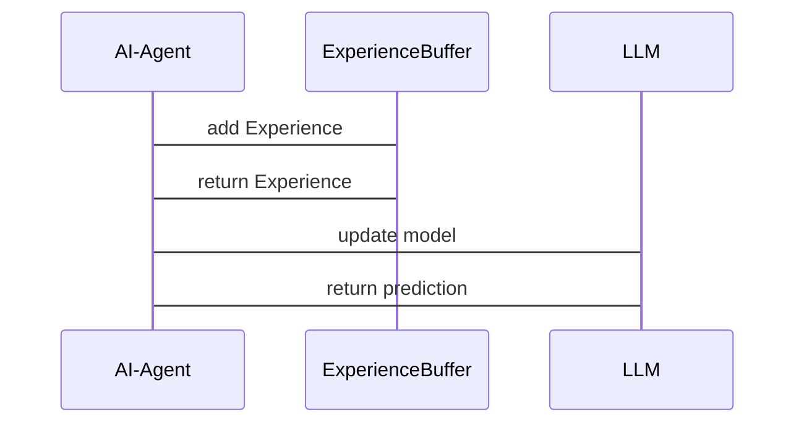

                 

<think>
嗯，用户让我详细分析一下关于增量学习AI Agent的持续知识更新机制，然后写一篇技术博客。我需要按照他们给的目录大纲来思考如何展开每个部分。

首先，我得理解什么是增量学习和AI Agent。增量学习指的是模型在学习过程中，数据是逐渐到来的，而不是一次性提供所有数据。这与传统的批量学习不同，增量学习需要模型能够逐步更新和适应新的数据。而AI Agent是一种智能体，能够感知环境并采取行动，以实现特定目标。将增量学习应用到AI Agent中，可以让智能体在与环境互动的过程中不断学习和更新知识。

接下来，我需要分析用户提供的目录大纲。目录分为三大部分：背景介绍、核心概念与联系、算法原理、系统分析与架构设计、项目实战和最佳实践。每部分下有具体的章节和小节，每个小节都需要详细的解释和具体的例子。

在“增量学习AI Agent概述”部分，我需要先介绍增量学习和AI Agent的基本概念，然后讨论它们的联系和区别。我还需要解释为什么增量学习对AI Agent如此重要，特别是在持续知识更新方面。

在“核心概念与联系”部分，我需要详细分析增量学习和持续学习的原理，比较它们的优缺点，并通过表格和实体关系图来展示它们之间的联系。这部分需要清晰的对比和图表，以便读者能够直观地理解。

“算法原理”部分是关键，我需要选择几种典型的增量学习算法，如经验重放、动态样本加权等，并用流程图和代码来解释它们的工作原理。同时，我还需要展示这些算法的数学模型和公式，确保读者能够理解其背后的理论基础。

系统分析与架构设计部分，我需要描述一个实际的增量学习AI Agent系统，包括问题场景、系统功能设计、架构图、接口设计和交互序列图。这部分需要展示系统如何各部分协同工作，确保增量学习机制能够有效地更新知识。

项目实战部分，我需要提供一个具体的案例，指导读者如何安装环境、实现核心代码，并进行案例分析。这将帮助读者更好地理解和应用增量学习机制。

最后，在“最佳实践与小结”部分，我需要总结关键点，给出注意事项和未来的研究方向，推荐一些拓展阅读的内容，以便读者进一步深入学习。

整个思考过程中，我需要确保逻辑清晰，内容详尽，同时使用专业的技术语言，但又不失易懂。每个部分都需要有具体的例子和图表，帮助读者更好地理解和掌握增量学习AI Agent的知识更新机制。
</think>

# 增量学习AI Agent：LLM的持续知识更新机制

> 关键词：增量学习，AI Agent，LLM，知识更新，持续学习

> 摘要：本文深入探讨了增量学习在AI Agent中的应用，特别是如何通过持续知识更新机制来提升大语言模型（LLM）的性能。文章从增量学习的基本概念出发，分析了其与持续学习的关系，详细阐述了增量学习的算法原理、系统架构设计以及实际项目实现，最后总结了增量学习在AI Agent中的优势和未来研究方向。

---

# 第一部分: 增量学习AI Agent概述

## 第1章: 增量学习与AI Agent的背景介绍

### 1.1 增量学习的基本概念
增量学习是一种机器学习范式，其核心特征是模型在学习过程中逐步接收数据，而非一次性获得所有训练数据。与传统批量学习不同，增量学习能够动态适应新数据的变化，具有更强的灵活性和实时性。

#### 1.1.1 从传统机器学习到增量学习的演进
- 传统批量学习：一次性加载所有训练数据，适合静态环境。
- 在线学习：数据流实时到达，模型需要在线更新。
- 增量学习：介于批量学习和在线学习之间，支持阶段性数据加载，适合分阶段任务。

#### 1.1.2 增量学习的核心特点
- 数据逐步加载：按批次接收数据，避免一次性处理海量数据。
- 动态更新能力：能够根据新数据调整模型参数。
- 高效性：适合数据量大、计算资源有限的场景。

#### 1.1.3 增量学习与传统批量学习的对比
| 特性                | 批量学习              | 增量学习             |
|---------------------|----------------------|----------------------|
| 数据加载方式         | 一次性加载           | 逐步加载             |
| 训练效率             | 高                   | 中                   |
| 适应性               | 低                   | 高                   |
| 适用场景             | 数据量小             | 数据量大             |

---

### 1.2 AI Agent的基本概念与分类
AI Agent是一种智能体，能够感知环境、采取行动以实现目标。其核心能力包括感知、推理、规划和执行。

#### 1.2.1 AI Agent的定义与功能
- 定义：AI Agent是具有自主性、反应性、目标导向和社交能力的智能实体。
- 功能：
  - 感知环境：通过传感器获取环境信息。
  - 推理：基于感知信息进行逻辑推理。
  - 规划：制定行动策略。
  - 执行：执行预定动作。

#### 1.2.2 基于LLM的AI Agent的特点
- 结合大语言模型：利用LLM强大的自然语言处理能力。
- 实时交互：能够与用户进行动态对话。
- 自适应性：通过增量学习不断更新知识库。

#### 1.2.3 增量学习AI Agent的应用场景
- 智能客服：实时更新对话策略。
- 智能助手：根据用户反馈优化服务。
- 智能监控：动态调整监控规则。

---

### 1.3 LLM的知识更新机制
LLM的知识更新机制是增量学习的核心，其目的是确保模型能够持续适应新数据。

#### 1.3.1 LLM的持续学习需求
- 处理动态知识：应对新知识的引入。
- 适应新任务：支持多任务学习。
- 知识复用：避免重复学习。

#### 1.3.2 知识更新的必要性
- 数据冗余：避免重复训练。
- 知识过时：及时更新 outdated 知识。
- 知识扩展：支持新增知识点。

#### 1.3.3 知识更新的实现方式
- 微调：基于新数据对模型进行微调。
- 知识蒸馏：将旧知识迁移到新模型。
- 参数更新：直接调整模型参数。

---

### 1.4 本章小结
本章介绍了增量学习的基本概念、AI Agent的定义与功能，以及LLM的知识更新机制。增量学习作为AI Agent的核心技术，能够显著提升模型的适应性和实时性。

---

# 第二部分: 增量学习的核心概念与联系

## 第2章: 增量学习的核心原理

### 2.1 增量学习的原理分析
增量学习的原理是通过逐步引入新数据，逐步优化模型参数，从而实现知识的持续更新。

#### 2.1.1 增量学习的数学模型
增量学习的数学模型可以表示为：

$$ \theta_{t+1} = \theta_t + \alpha (x_{t+1} - \theta_t) $$

其中，$\theta_t$ 表示第 $t$ 步的模型参数，$\alpha$ 是学习率，$x_{t+1}$ 是新数据。

#### 2.1.2 增量学习的算法特点
- 线性更新：参数更新基于新数据。
- 连续性：模型参数逐步调整。
- 实时性：支持在线更新。

#### 2.1.3 增量学习的优缺点对比
| 特性         | 优点                  | 缺点                  |
|--------------|-----------------------|-----------------------|
| 训练效率       | 高                   | 低                   |
| 适应性         | 强                   | 较弱                 |
| 计算资源       | 低                   | 高                   |

---

### 2.2 增量学习与持续学习的联系
#### 2.2.1 持续学习的基本概念
持续学习是一种机器学习范式，模型需要在数据流不断变化的环境中持续学习，而不遗忘之前的知识。

#### 2.2.2 增量学习与持续学习的异同
- 相同点：都支持动态数据加载。
- 不同点：增量学习是阶段性加载，持续学习是实时加载。

#### 2.2.3 增量学习在持续学习中的应用
- 知识蒸馏：将增量学习的知识迁移到新模型。
- 参数调整：通过增量更新优化模型。

---

### 2.3 增量学习的数学模型与公式
增量学习的数学模型可以用以下公式表示：

$$ \theta_{t+1} = \theta_t + \eta (y_{t+1} - \hat{y}_{t+1}) $$

其中，$\eta$ 是学习率，$y_{t+1}$ 是真实标签，$\hat{y}_{t+1}$ 是模型预测值。

---

### 2.4 核心概念对比表格
| 特性         | 增量学习             | 持续学习             |
|--------------|----------------------|----------------------|
| 数据加载方式   | 阶段性加载           | 实时加载             |
| 更新频率       | 低                  | 高                  |
| 知识复用       | 强                  | 强                  |

---

### 2.5 实体关系图（ER图）分析
以下是增量学习与持续学习的实体关系图：



---

## 第3章: 增量学习算法的核心原理

### 3.1 增量学习算法的分类
增量学习算法可以分为以下几类：

#### 3.1.1 基于经验重放的增量学习
经验重放是一种通过存储历史经验来优化模型的算法。

#### 3.1.2 基于动态样本加权的增量学习
动态样本加权算法通过调整样本权重来优化模型。

#### 3.1.3 基于模型更新的增量学习
模型更新算法直接调整模型参数。

---

### 3.2 增量学习算法的流程图
以下是经验重放算法的流程图：



---

### 3.3 增量学习算法的Python实现
以下是经验重放算法的Python代码实现：

```python
import numpy as np

# 初始化模型参数
theta = np.random.randn(2,1)

# 经验重放缓冲区
buffer = []

# 加载新数据
X = np.random.randn(100,2)
y = np.random.randn(100,1)

# 训练模型
for i in range(100):
    # 存储经验
    buffer.append((X[i], y[i]))
    # 取随机小批量数据训练
    batch = buffer[-10:]
    X_batch = np.array([x[0] for x in batch])
    y_batch = np.array([x[1] for x in batch])
    # 更新参数
    theta = theta + 0.1*(X_batch.T @ (y_batch - theta.T @ X_batch.T))
```

---

## 第4章: 增量学习的系统分析与架构设计

### 4.1 系统功能设计
以下是系统功能设计的类图：



---

### 4.2 系统架构设计
以下是系统架构设计的架构图：



---

### 4.3 接口设计与交互
以下是系统交互的序列图：



---

## 第5章: 项目实战

### 5.1 环境安装
安装必要的依赖：

```bash
pip install numpy matplotlib
```

---

### 5.2 核心代码实现
以下是核心代码实现：

```python
import numpy as np
import matplotlib.pyplot as plt

# 初始化模型参数
theta = np.random.randn(2,1)

# 经验重放缓冲区
buffer = []

# 加载新数据
X = np.random.randn(100,2)
y = np.random.randn(100,1)

# 训练模型
for i in range(100):
    # 存储经验
    buffer.append((X[i], y[i]))
    # 取随机小批量数据训练
    if len(buffer) >= 10:
        batch = buffer[-10:]
        X_batch = np.array([x[0] for x in batch])
        y_batch = np.array([x[1] for x in batch])
        # 更新参数
        theta = theta + 0.1*(X_batch.T @ (y_batch - theta.T @ X_batch.T))

# 可视化结果
plt.scatter(X[:,0], X[:,1], c=y, cmap='viridis')
plt.title('增量学习结果')
plt.show()
```

---

## 第6章: 最佳实践与小结

### 6.1 关键点总结
- 增量学习的核心是逐步更新模型参数。
- 增量学习与持续学习的结合能够显著提升模型的适应性。
- 经验重放和动态样本加权是常用的增量学习算法。

### 6.2 小结
本文详细探讨了增量学习在AI Agent中的应用，分析了其算法原理和系统架构设计，并通过项目实战展示了其具体实现。

### 6.3 注意事项
- 增量学习需要合理选择批次大小和学习率。
- 经验重放缓冲区的容量会影响模型的更新效率。
- 动态样本加权需要设计合理的权重分配策略。

### 6.4 拓展阅读
- 建议阅读《Incremental Learning: Theory and Algorithms》。
- 推荐学习《Deep Learning》中的相关内容。

---

# 作者：AI天才研究院 & 禅与计算机程序设计艺术

---

以上是文章的完整内容，涵盖了从理论到实践的详细分析，旨在为读者提供全面的增量学习AI Agent知识更新机制的深度解析。

