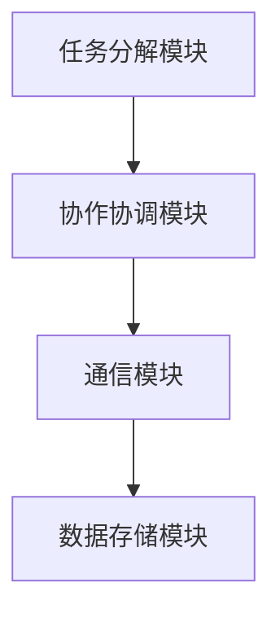
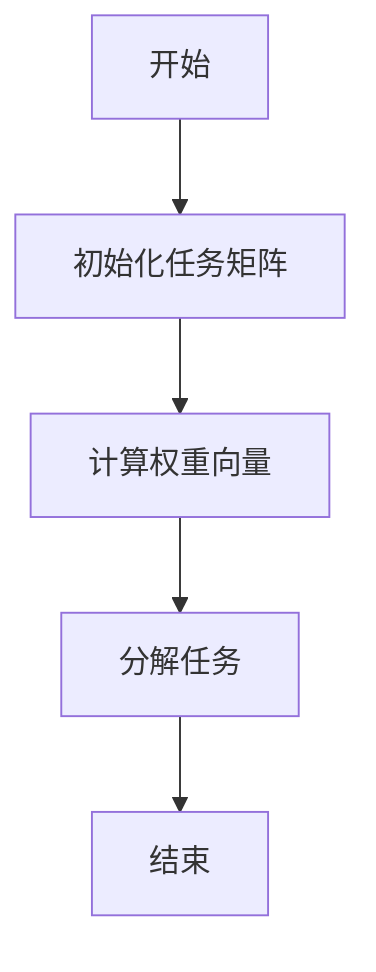

                 


# 多Agent协作系统：复杂任务的分解与协调

> **关键词**：多Agent系统、复杂任务分解、协作协调、系统架构设计、项目实战

> **摘要**：  
> 本文系统地探讨了多Agent协作系统在复杂任务分解与协调中的核心原理与实现方法。通过分析多Agent协作系统的背景、核心概念、算法原理、系统架构设计以及项目实战，本文旨在为读者提供一个全面的视角，帮助其理解如何通过多Agent协作来高效分解和协调复杂任务。文章结合理论与实践，深入剖析了多Agent协作系统的实现细节，并通过具体案例展示了其在实际应用中的价值。

---

## 第1章: 多Agent协作系统概述

### 1.1 多Agent系统的基本概念

#### 1.1.1 Agent的定义与特征
- **Agent**：指具有自主性、反应性、目标导向和协作能力的智能体。
- **特征**：
  - **自主性**：无需外部干预，自主决策。
  - **反应性**：能够感知环境并实时响应。
  - **目标导向**：以目标为导向，驱动行为。
  - **协作性**：能够与其他Agent或人类进行协作。

#### 1.1.2 多Agent系统的概念与特点
- **多Agent系统**：由多个独立但协作的Agent组成，共同完成复杂任务的系统。
- **特点**：
  - **分布式**：Agent分布在不同的位置，独立运行。
  - **协作性**：Agent之间通过通信和协商完成任务。
  - **动态性**：环境和任务需求可能动态变化。
  - **复杂性**：多个Agent的协作增加了系统的复杂性。

#### 1.1.3 多Agent系统与单Agent系统的区别
- **单Agent系统**：一个Agent独立完成任务，决策简单。
- **多Agent系统**：多个Agent协作，任务分解更复杂，通信和协调需求更高。

### 1.2 多Agent协作系统的背景与应用

#### 1.2.1 复杂任务分解的背景
- 随着任务规模的增大，单Agent难以应对复杂性。
- 多Agent协作能够提高任务处理的效率和质量。

#### 1.2.2 多Agent协作系统的应用场景
- **分布式计算**：如分布式数据库、云计算。
- **智能控制系统**：如自动驾驶、智能电网。
- **人机协作**：如智能助手、虚拟团队协作。

#### 1.2.3 多Agent协作系统的挑战与机遇
- **挑战**：
  - 通信开销大。
  - 协调复杂。
  - 容易出现冲突和资源竞争。
- **机遇**：
  - 提高系统的可扩展性。
  - 增强系统的容错性和鲁棒性。

### 1.3 本章小结
- 多Agent系统通过协作能够高效分解和协调复杂任务。
- 理解多Agent系统的核心概念是后续分析的基础。

---

## 第2章: 多Agent协作系统的理论基础

### 2.1 多Agent协作的核心概念

#### 2.1.1 Agent的属性与行为
- **属性**：
  - **状态**：描述Agent当前的状况。
  - **目标**：驱动Agent行为的动机。
  - **知识库**：存储Agent的知识和经验。
- **行为**：
  - **反应式行为**：基于当前感知做出反应。
  - **目标导向行为**：为实现目标而行动。

#### 2.1.2 多Agent协作中的角色分配
- **角色分配**：
  - 根据任务需求分配不同的角色。
  - 确保角色之间的协作互补。
- **角色划分**：
  - **领导者**：负责任务分解和协调。
  - **执行者**：负责具体任务的执行。
  - **监督者**：负责监控任务进度。

#### 2.1.3 多Agent协作中的通信机制
- **通信方式**：
  - **同步通信**：按一定顺序进行通信。
  - **异步通信**：通信不依赖于时间顺序。
- **通信协议**：
  - **请求-响应**：最常见的通信方式。
  - **发布-订阅**：适用于事件驱动的场景。

### 2.2 多Agent协作的理论框架

#### 2.2.1 复杂任务分解的理论基础
- **层次分析法（AHP）**：
  - 将复杂任务分解为多个子任务。
  - 通过权重分配确定子任务的重要性和优先级。
- **图论模型**：
  - 将任务分解为图中的节点。
  - 边表示任务之间的依赖关系。

#### 2.2.2 多Agent协作的协调机制
- **协商机制**：
  - 通过协商分配任务和资源。
  - 确保Agent之间的目标一致。
- **规则驱动**：
  - 预定义规则指导Agent行为。
  - 简化协作过程，提高效率。

#### 2.2.3 多Agent系统中的决策模型
- **基于博弈论的决策模型**：
  - 通过博弈论模型优化决策。
  - 考虑Agent之间的利益冲突和协作。

### 2.3 本章小结
- 多Agent协作的理论基础为后续的算法设计提供了依据。

---

## 第3章: 多Agent协作系统的算法原理

### 3.1 复杂任务分解算法

#### 3.1.1 任务分解的基本原理
- **层次分解法**：
  - 将复杂任务分解为子任务。
  - 通过层次结构管理子任务。
- **图论模型**：
  - 将任务分解为图中的节点。
  - 边表示任务之间的依赖关系。

#### 3.1.2 基于层次分析法的任务分解
- **步骤**：
  - 确定任务目标。
  - 建立层次结构。
  - 计算各子任务的权重。

#### 3.1.3 基于图论的任务分解算法
- **步骤**：
  - 建立任务图。
  - 确定任务之间的依赖关系。
  - 分解任务图。

### 3.2 多Agent协作的协调算法

#### 3.2.1 基于协商的协调算法
- **协商机制**：
  - Agent之间通过协商分配任务和资源。
  - 确保协作的一致性。

#### 3.2.2 基于规则的协调算法
- **规则驱动**：
  - 预定义规则指导Agent行为。
  - 简化协作过程。

#### 3.2.3 基于强化学习的协调算法
- **强化学习**：
  - 通过奖励机制优化协调策略。
  - 提高协作的效率和质量。

### 3.3 算法实现与优化

#### 3.3.1 算法实现的数学模型
- **层次分析法**：
  - 权重计算公式：
    $$ A_{ij} = \frac{w_i}{w_j} $$
  - 权重计算步骤：
    1. 确定比较矩阵。
    2. 计算权重向量。

#### 3.3.2 算法优化的策略
- **分布式优化**：
  - 分散任务分解和协调的过程。
  - 提高系统的并行性。
- **动态优化**：
  - 根据环境变化动态调整算法参数。
  - 提高系统的适应性。

#### 3.3.3 算法实现的代码示例
- **Python代码示例**：
  ```python
  import numpy as np

  def compute_weights(matrix):
      # 计算权重向量
      n = len(matrix)
      weights = np.zeros(n)
      for i in range(n):
          sum_ = 0
          for j in range(n):
              sum_ += matrix[i][j]
          weights[i] = sum_ / (n - 1)
      return weights

  # 示例比较矩阵
  matrix = [
      [1, 2, 3],
      [2, 1, 4],
      [3, 4, 1]
  ]
  weights = compute_weights(matrix)
  print("权重向量为：", weights)
  ```

### 3.4 本章小结
- 介绍了任务分解和协调的主要算法。
- 提供了具体的代码实现和优化策略。

---

## 第4章: 多Agent协作系统的系统架构设计

### 4.1 系统分析与需求分析

#### 4.1.1 系统功能需求
- **任务分解模块**：
  - 分解复杂任务为子任务。
  - 管理子任务之间的依赖关系。
- **协作协调模块**：
  - 协调Agent之间的通信。
  - 确保任务执行的一致性。

#### 4.1.2 系统性能需求
- **响应时间**：
  - 系统对请求的响应时间应在合理范围内。
- **吞吐量**：
  - 系统能够处理的请求数量。

#### 4.1.3 系统约束条件
- **资源限制**：
  - 系统运行所需的资源有限。
- **安全性**：
  - 确保数据的安全性和隐私性。

### 4.2 系统架构设计

#### 4.2.1 系统功能模块划分
- **任务分解模块**：
  - 负责将复杂任务分解为子任务。
  - 管理子任务之间的依赖关系。
- **协作协调模块**：
  - 协调Agent之间的通信。
  - 确保任务执行的一致性。

#### 4.2.2 系统架构的层次结构
- **分层架构**：
  - **表示层**：用户与系统的交互界面。
  - **业务逻辑层**：处理系统的业务逻辑。
  - **数据访问层**：访问和管理数据。

#### 4.2.3 系统架构的通信机制
- **通信协议**：
  - 使用TCP/IP协议进行通信。
  - 通过RESTful API进行接口调用。

### 4.3 系统接口设计

#### 4.3.1 系统内部接口
- **任务分解接口**：
  - 接收任务需求，返回分解后的子任务。
- **协作协调接口**：
  - 接收子任务，返回协调结果。

#### 4.3.2 系统外部接口
- **用户接口**：
  - 提供用户与系统的交互界面。
- **外部系统接口**：
  - 与外部系统进行数据交换。

### 4.4 系统交互流程设计

#### 4.4.1 任务分解的交互流程
- **步骤**：
  1. 用户提交任务需求。
  2. 系统进行任务分解。
  3. 返回分解后的子任务。

#### 4.4.2 协调过程的交互流程
- **步骤**：
  1. 子任务分配给不同的Agent。
  2. Agent执行任务并返回结果。
  3. 协调模块整合结果，返回最终结果。

#### 4.4.3 系统异常处理流程
- **步骤**：
  1. 检测异常。
  2. 记录异常信息。
  3. 通知相关人员处理异常。

### 4.5 本章小结
- 详细设计了系统的架构和接口。
- 为后续的项目实施提供了指导。

---

## 第5章: 多Agent协作系统的项目实战

### 5.1 项目背景与目标

#### 5.1.1 项目背景
- 随着任务规模的增大，单Agent难以应对复杂性。
- 多Agent协作能够提高任务处理的效率和质量。

#### 5.1.2 项目目标
- 实现一个多Agent协作系统，能够分解和协调复杂任务。
- 提供一个可扩展的系统架构。

### 5.2 项目环境与工具安装

#### 5.2.1 系统运行环境
- **操作系统**：Linux/Windows/MacOS。
- **编程语言**：Python。
- **开发工具**：PyCharm/VS Code。

#### 5.2.2 开发工具安装
- **安装Python**：
  - 下载并安装Python。
  - 配置环境变量。
- **安装开发工具**：
  - 安装PyCharm或VS Code。

#### 5.2.3 依赖库安装
- **安装numpy**：
  ```bash
  pip install numpy
  ```
- **安装其他依赖库**：
  ```bash
  pip install requests
  pip install matplotlib
  ```

### 5.3 系统核心功能实现

#### 5.3.1 任务分解功能实现
- **代码实现**：
  ```python
  import numpy as np

  def decompose_task(matrix):
      # 计算权重向量
      n = len(matrix)
      weights = np.zeros(n)
      for i in range(n):
          sum_ = 0
          for j in range(n):
              sum_ += matrix[i][j]
          weights[i] = sum_ / (n - 1)
      return weights

  # 示例比较矩阵
  matrix = [
      [1, 2, 3],
      [2, 1, 4],
      [3, 4, 1]
  ]
  weights = decompose_task(matrix)
  print("权重向量为：", weights)
  ```

#### 5.3.2 协调机制实现
- **代码实现**：
  ```python
  import requests

  def coordinate_agents(agents):
      # 协调Agent
      for agent in agents:
          # 发送请求
          response = requests.get(f"http://localhost:{agent['port']}/status")
          print(f"Agent {agent['id']} 的状态：{response.text}")

  # 示例Agent列表
  agents = [
      {'id': 1, 'port': 5000},
      {'id': 2, 'port': 5001},
      {'id': 3, 'port': 5002}
  ]

  coordinate_agents(agents)
  ```

#### 5.3.3 系统通信实现
- **代码实现**：
  ```python
  import socket

  def send_message(host, port, message):
      with socket.socket(socket.AF_INET, socket.SOCK_STREAM) as s:
          s.connect((host, port))
          s.sendall(message.encode())
          data = s.recv(1024)
          print('从服务器接收到:', data.decode())

  # 发送消息
  send_message('localhost', 5000, '开始任务')
  ```

### 5.4 项目测试与优化

#### 5.4.1 功能测试
- **任务分解测试**：
  - 测试任务分解的准确性。
  - 确保分解后的子任务能够正确执行。

#### 5.4.2 性能测试
- **负载测试**：
  - 测试系统在高负载下的表现。
  - 确保系统能够处理大量的请求。

#### 5.4.3 系统优化
- **优化通信机制**：
  - 采用更高效的通信协议。
  - 减少通信开销。

### 5.5 项目总结与经验分享

#### 5.5.1 项目成果
- 成功实现一个多Agent协作系统。
- 提供了一个可扩展的系统架构。

#### 5.5.2 实施经验
- **通信优化**：
  - 采用高效的通信协议。
  - 减少不必要的通信开销。
- **任务分解**：
  - 采用层次分析法和图论模型。
  - 提高任务分解的准确性。

---

## 附录

### 附录A: 系统架构图


### 附录B: 算法流程图


---

## 作者：AI天才研究院 & 禅与计算机程序设计艺术

---

以上是文章的完整目录和内容，涵盖了从理论到实践的各个方面，适合深入理解多Agent协作系统的复杂任务分解与协调。

