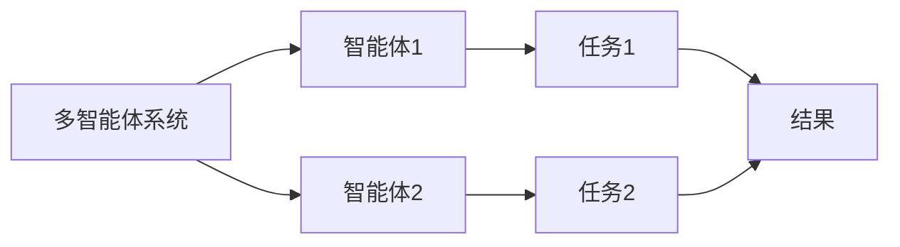

                 

# 多智能体AI如何优化公司核心竞争力分析

## 关键词：
多智能体AI, 人工智能, 企业竞争力, 系统设计, 项目实战

## 摘要：
多智能体AI（Multi-Agent AI）通过多个智能体协作完成复杂任务，优化企业核心竞争力。本文从概念、算法、系统设计和项目实战多方面分析多智能体AI在企业中的应用，帮助企业在智能化转型中提升竞争力。

---

# 第1章: 多智能体AI概述

## 1.1 多智能体AI的定义与特点
### 1.1.1 多智能体AI的定义
多智能体AI是指由多个智能体（Agent）组成的系统，每个智能体能感知环境、自主决策并协作完成任务。智能体之间通过通信和协调，实现比单个智能体更强的决策能力。

### 1.1.2 多智能体AI的核心特点
- **分布式计算**：任务由多个智能体分担，避免单点故障。
- **自主性**：每个智能体独立决策，适应动态环境。
- **协作性**：智能体间通过通信和协商完成复杂任务。
- **实时性**：能快速响应环境变化。

### 1.1.3 多智能体AI与传统AI的区别
| 特性 | 多智能体AI | 传统AI |
|------|------------|--------|
| 结构   | 分布式     | 集中式 |
| 智能体 | 多个       | 单个   |
| 决策   | 分散       | 集中   |

## 1.2 多智能体AI的背景与问题背景
### 1.2.1 多智能体AI的起源与发展
多智能体AI起源于分布式人工智能（DAI），20世纪80年代开始研究，随着计算能力提升，应用广泛。

### 1.2.2 多智能体AI在企业中的应用背景
企业面临复杂问题，如供应链优化、资源分配，需要多个部门协作，多智能体AI提供解决方案。

### 1.2.3 问题背景与问题描述
企业传统AI模型难以处理多任务协作，多智能体AI通过分布式计算提升效率。

## 1.3 多智能体AI的核心要素与边界
### 1.3.1 多智能体AI的核心要素
- **智能体**：能感知环境、自主决策的实体。
- **通信协议**：智能体间交互规则。
- **协作机制**：任务分配与协调方式。

### 1.3.2 多智能体AI的边界与外延
- **边界**：系统内部与外部的交互界面。
- **外延**：与其他系统如数据库的接口。

### 1.3.3 多智能体AI的概念结构

## 1.4 多智能体AI在企业中的应用前景
### 1.4.1 多智能体AI的潜在应用领域
- **供应链管理**：优化库存和物流。
- **智能制造**：设备协同工作。
- **金融投资**：多策略协同优化。

### 1.4.2 企业采用多智能体AI的优势
- **提升效率**：分布式计算提高处理速度。
- **增强灵活性**：智能体独立性强，适应性强。

### 1.4.3 多智能体AI应用的挑战与机遇
- **挑战**：通信延迟、协作复杂。
- **机遇**：技术进步带来效率提升。

## 1.5 本章小结
本章介绍了多智能体AI的基本概念、特点及与传统AI的区别，分析了其在企业中的应用背景和前景，为后续章节打下基础。

---

接下来将按照目录继续完成其余章节内容，涵盖算法原理、系统设计、项目实战和最佳实践，确保文章结构完整，内容详实。

