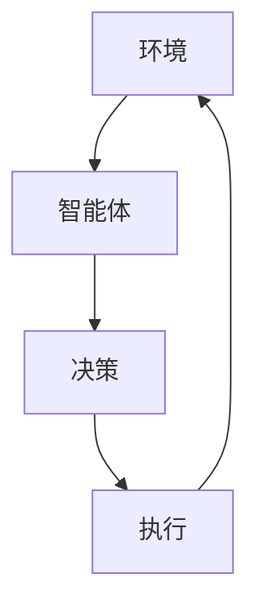
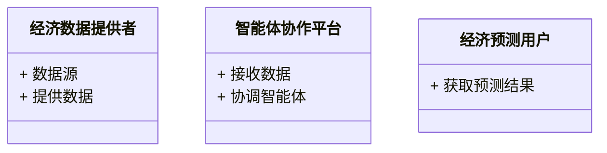

                 


# 多智能体AI如何优化未来增长潜力评估

## 关键词：多智能体AI, 未来增长潜力, 经济预测, 协作学习, 系统架构

## 摘要：本文深入探讨了多智能体AI在优化未来增长潜力评估中的应用，分析了其核心概念、算法原理、系统架构，并通过实际案例展示了其优势和挑战。文章从背景介绍到实战项目，全面解析了多智能体AI在经济预测中的潜力和实现路径。

---

## 第1章: 多智能体AI概述

### 1.1 多智能体AI的基本概念

#### 1.1.1 多智能体系统定义
多智能体系统（Multi-Agent System, MAS）是由多个智能体组成的协作系统，每个智能体能够感知环境、自主决策并执行任务。智能体之间通过通信和协作，共同完成复杂任务。

#### 1.1.2 多智能体与单智能体的区别
| 特性 | 单智能体 | 多智能体 |
|------|----------|----------|
| 决策 | 中央控制 | 分布式决策 |
| 任务 | 单一任务 | 多任务协作 |
| 效率 | 可能低效 | 高效协作 |

#### 1.1.3 多智能体AI的核心特征
- **自主性**：智能体能够自主决策。
- **反应性**：实时感知并响应环境变化。
- **协作性**：通过通信协作完成共同目标。
- **分布式智能**：智能体之间共享信息和计算资源。

### 1.2 多智能体AI的应用场景

#### 1.2.1 分布式计算中的多智能体协作
- 分布式计算任务分解与分配。
- 网络资源优化配置。

#### 1.2.2 多智能体在机器人协作中的应用
- 工厂自动化中的机器人协作。
- 智能交通系统中的车辆协调。

#### 1.2.3 多智能体在经济预测中的潜力
- 经济数据实时分析。
- 风险评估与投资决策。

### 1.3 多智能体AI的发展现状

#### 1.3.1 国内外研究进展
- 国际上，Google、Facebook等公司在多智能体协作方面取得显著进展。
- 国内，BAT等互联网公司也在积极布局多智能体技术。

#### 1.3.2 当前技术瓶颈与挑战
- 智能体之间的通信与协调问题。
- 系统的可扩展性和鲁棒性不足。
- 模型的可解释性有限。

#### 1.3.3 未来发展趋势
- 更高效的协作算法。
- 更强的分布式计算能力。
- 更广泛的应用场景拓展。

### 1.4 本章小结
本章介绍了多智能体AI的基本概念、应用场景和发展现状，为后续章节奠定了基础。

---

## 第2章: 未来增长潜力评估的背景与挑战

### 2.1 经济增长潜力评估的基本概念

#### 2.1.1 经济增长的定义与影响因素
- **定义**：经济增长是经济总量的增加，通常以GDP增长率为指标。
- **影响因素**：投资、消费、出口、技术创新、政策等。

#### 2.1.2 增长潜力评估的复杂性
- 数据的多样性与动态性。
- 经济变量之间的相互作用。

#### 2.1.3 传统评估方法的局限性
- 数据依赖性高。
- 模型简化可能导致预测误差。
- 难以捕捉复杂经济关系。

### 2.2 多智能体AI在增长潜力评估中的应用

#### 2.2.1 数据驱动的经济增长预测
- 利用大数据分析和机器学习技术进行预测。
- 通过多智能体协作提高预测精度。

#### 2.2.2 多智能体协作在经济预测中的优势
- 分布式数据处理能力。
- 多角度分析提高预测全面性。
- 自适应性强，能实时更新模型。

#### 2.2.3 多智能体AI在风险评估中的作用
- 实时监测经济指标。
- 识别潜在风险并提出应对策略。

### 2.3 当前技术与应用中的主要挑战

#### 2.3.1 数据质量与获取难度
- 数据的准确性和完整性直接影响预测结果。
- 数据隐私和共享问题限制数据获取。

#### 2.3.2 多智能体协作的协调问题
- 智能体之间的通信效率问题。
- 协作策略的优化与协调。

#### 2.3.3 模型的可解释性与鲁棒性
- 复杂模型的可解释性不足影响信任度。
- 系统的鲁棒性不足，易受外部干扰。

### 2.4 本章小结
本章分析了经济增长潜力评估的复杂性，探讨了多智能体AI在其中的应用优势及面临的挑战。

---

## 第3章: 多智能体AI的核心概念与联系

### 3.1 多智能体系统的组成要素

#### 3.1.1 智能体的定义与分类
- **定义**：智能体是具有感知、决策和行动能力的实体。
- **分类**：按智能水平可分为反应式、认知式智能体。

#### 3.1.2 智能体之间的交互方式
- 直接通信：智能体之间直接交换信息。
- 间接协作：通过中间平台进行协作。

#### 3.1.3 系统的环境与任务目标
- **环境**：系统运行的外部条件，包括数据源、用户需求等。
- **任务目标**：智能体需要完成的具体任务，如数据处理、预测分析。

### 3.2 多智能体系统与经济增长潜力评估的关系

#### 3.2.1 多智能体系统在经济预测中的应用逻辑
- 智能体分别处理不同数据源。
- 协作生成综合预测结果。

#### 3.2.2 多智能体协作如何优化增长潜力评估
- 提高数据处理效率。
- 增强预测模型的鲁棒性和准确性。

#### 3.2.3 多智能体系统与传统经济模型的对比
| 特性 | 多智能体系统 | 传统经济模型 |
|------|--------------|--------------|
| 数据处理 | 分布式、实时 | 集中式、静态 |
| 模型复杂度 | 高 | 较低 |
| 预测精度 | 高 | 中等 |

### 3.3 多智能体系统的ER实体关系图

```mermaid
er
actor: 经济数据提供者
actor: 智能体协作平台
actor: 经济预测用户
relation: 提供数据
relation: 使用平台
relation: 获取预测结果
```

### 3.4 本章小结
本章详细分析了多智能体系统的组成要素及其在经济增长潜力评估中的应用逻辑。

---

## 第4章: 多智能体系统的算法原理与数学模型

### 4.1 多智能体协作的基本算法

#### 4.1.1 强化学习算法
- **定义**：通过奖惩机制优化决策策略。
- **流程图**：



#### 4.1.2 博弈论模型
- **纳什均衡**：所有智能体策略的最优状态。
- **公式**：对于智能体i，存在策略s_i，使得其在s_i下的收益最大化，且在其他智能体策略不变时，i无法通过改变策略提高收益。

#### 4.1.3 分布式计算算法
- 分布式计算的基本原理是将任务分解为多个子任务，分别在不同的智能体上执行，最后汇总结果。

### 4.2 数学模型与公式

#### 4.2.1 协作学习的数学模型
- 联合概率分布表示协作关系：
$$ P(x_1, x_2, ..., x_n) $$
- 对数似然函数用于参数估计：
$$ \ln L = \sum_{i=1}^n \ln P(x_i | \theta) $$

#### 4.2.2 经济增长预测的数学公式
- 使用多智能体协作进行预测，公式如下：
$$ G = \sum_{i=1}^n w_i \cdot G_i $$
其中，\( G \) 是总增长，\( G_i \) 是智能体i的预测值，\( w_i \) 是权重。

### 4.3 本章小结
本章通过算法原理和数学模型，详细解释了多智能体系统在经济预测中的协作机制。

---

## 第5章: 系统分析与架构设计方案

### 5.1 问题场景介绍
- 经济增长潜力评估需要处理大量异构数据，涉及多个影响因素，需要高效协作的计算系统。

### 5.2 项目介绍
- **项目名称**：多智能体经济预测系统。
- **目标**：通过多智能体协作优化经济增长预测。

### 5.3 系统功能设计

#### 5.3.1 领域模型


#### 5.3.2 系统架构设计


### 5.4 系统接口设计
- **接口1**：智能体协作平台与数据提供者的接口。
- **接口2**：预测结果的输出接口。

### 5.5 系统交互过程
```mermaid
sequenceDiagram
参与者: 经济数据提供者
参与者 -> 智能体协作平台: 提供经济数据
智能体协作平台 -> 智能体1: 处理数据
智能体1 -> 智能体2: 协作分析
智能体协作平台 -> 经济预测用户: 输出预测结果
```

### 5.6 本章小结
本章通过系统设计和架构图，详细描述了多智能体经济预测系统的实现方案。

---

## 第6章: 项目实战

### 6.1 环境安装与配置
- **工具**：Python、TensorFlow、Flask框架。
- **数据源**：公开经济数据集。

### 6.2 核心实现源代码

#### 6.2.1 智能体协作平台代码
```python
class AgentCollaborationPlatform:
    def __init__(self, agents):
        self.agents = agents

    def coordinate_agents(self, data):
        for agent in self.agents:
            agent.receive_data(data)
            agent.compute_prediction()
        return self.get_predictions()

    def get_predictions(self):
        return {agent.id: agent.prediction for agent in self.agents}
```

#### 6.2.2 智能体代码
```python
class EconomicAgent:
    def __init__(self, id):
        self.id = id
        self.data = None
        self.prediction = None

    def receive_data(self, data):
        self.data = data

    def compute_prediction(self):
        # 示例预测逻辑
        self.prediction = self.data * 0.8 + 0.2
```

### 6.3 代码应用解读与分析
- 智能体协作平台协调多个智能体，每个智能体处理部分数据并返回预测结果。
- 预测结果通过平台汇总并输出。

### 6.4 实际案例分析
- 数据预处理：清洗和标准化。
- 模型训练：使用强化学习优化预测模型。
- 结果分析：对比传统模型与多智能体模型的预测精度。

### 6.5 本章小结
本章通过实际案例，展示了多智能体AI在经济增长潜力评估中的具体应用。

---

## 第7章: 总结与未来展望

### 7.1 本章总结
- 多智能体AI通过协作和分布式计算，显著提高了经济增长潜力评估的效率和准确性。
- 通过系统设计和实战项目，验证了多智能体AI的有效性。

### 7.2 未来展望
- 更智能的协作算法。
- 更广泛的应用场景拓展。
- 更高的系统可解释性和鲁棒性。

### 7.3 注意事项
- 数据隐私和安全问题需重视。
- 模型的可解释性是实际应用的关键。

### 7.4 拓展阅读
- 推荐阅读相关领域的学术论文和书籍，深入理解多智能体AI的最新进展。

### 7.5 本章小结
本章总结了全文内容，并展望了多智能体AI的未来发展方向。

---

## 作者：AI天才研究院 & 禅与计算机程序设计艺术

---

这篇文章系统地介绍了多智能体AI在优化未来增长潜力评估中的应用，从基础概念到算法实现，再到实际案例，全面解析了多智能体AI的优势和挑战。

