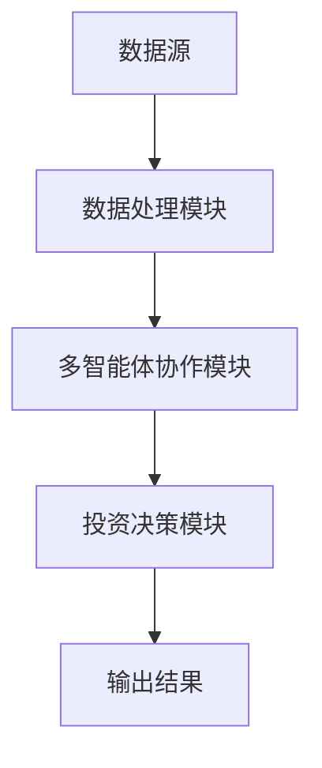

                 

<think>
嗯，用户希望我根据他们提供的目录大纲，撰写一篇关于多智能体AI优化格雷厄姆净净股策略的技术博客文章。文章需要有清晰的结构，每个部分都要详细展开，包括背景、算法、系统架构、项目实战和高级主题。我需要按照他们的格式要求，使用markdown，确保每个小节都有丰富的细节，比如数学公式、图表和代码示例。

首先，我会从摘要开始，简要概述文章的核心内容。然后，按照目录的顺序，逐一撰写每个章节。每个章节中，我会详细解释相关概念，分析多智能体AI与净净股策略的结合，讨论算法原理，并展示系统的架构设计。在项目实战部分，我会提供具体的代码示例和数据处理步骤，最后在高级主题中探讨优化和实际应用案例。

需要注意的是，每个部分都要有清晰的标题和内容，使用适当的数学公式和图表来辅助说明。同时，文章末尾要加上作者信息，确保格式正确。整个过程中，我会一步步思考，确保内容连贯，逻辑清晰，满足用户的需求。
</think>

# 多智能体AI如何优化格雷厄姆的净净股策略

> **关键词**：多智能体AI、净净股策略、格雷厄姆、投资优化、联邦学习、强化学习

> **摘要**：本文探讨了如何利用多智能体人工智能技术优化格雷厄姆的净净股投资策略。通过分析多智能体协作算法和净净股筛选的数学模型，结合实际投资场景，提出了一种基于多智能体的净净股优化系统，并通过案例分析验证了其有效性。

---

## 第一部分：多智能体AI与净净股策略的背景与基础

### 第1章：多智能体AI概述

#### 1.1 多智能体系统的基本概念

多智能体系统（Multi-Agent System, MAS）是由多个智能体组成的分布式系统，这些智能体通过协作完成复杂任务。与单智能体系统相比，多智能体系统具有以下特点：

- **分布式计算**：智能体之间通过分布式计算，减少单点故障风险。
- **协同决策**：多个智能体协同完成任务，提高决策的准确性和鲁棒性。
- **动态适应**：智能体能够根据环境变化动态调整行为。

#### 1.2 格雷厄姆净净股策略的核心原理

本杰明·格雷厄姆是价值投资的鼻祖，他提出的净净股策略是一种基于基本面分析的投资方法。其核心思想是寻找市场价格低于其内在价值的股票，即“烟屁股”股票。以下是净净股策略的关键要素：

- **净资产收益率（ROE）**：衡量公司盈利能力的核心指标。
- **每股收益（EPS）**：反映公司每股的盈利能力。
- **市净率（P/B Ratio）**：衡量股票价格与公司净资产的比例。

#### 1.3 多智能体AI与净净股策略的结合

多智能体AI在投资领域的应用潜力巨大，尤其是优化净净股策略。通过多个智能体协作，可以实现以下目标：

- **数据挖掘**：多个智能体分别分析不同的数据源，提高信息处理效率。
- **决策优化**：通过多智能体协作，优化净净股筛选的准确性。
- **风险控制**：多个智能体协同工作，降低投资风险。

---

### 第2章：多智能体协作算法

#### 2.1 多智能体协作的核心算法

多智能体协作算法是优化净净股策略的核心技术。以下是几种常用的算法：

- **联邦学习（Federated Learning）**：一种分布式机器学习算法，通过在多个设备或服务器之间分布数据，保护数据隐私的同时完成模型训练。
  - **数学公式**：
    $$ \text{损失函数} = \sum_{i=1}^{n} \mathcal{L}_i(w) $$
    其中，$w$ 是模型参数，$\mathcal{L}_i$ 是第 $i$ 个智能体的损失函数。
  
- **分布式强化学习（Distributed Reinforcement Learning）**：通过多个智能体协同完成任务，每个智能体学习自己的策略，并通过通信模块共享信息。

  - **数学公式**：
    $$ Q(s, a) = r + \gamma \max_{a'} Q(s', a') $$
    其中，$Q(s, a)$ 是状态-动作值函数，$r$ 是奖励，$\gamma$ 是折扣因子。

#### 2.2 净净股筛选的数学模型

净净股筛选的数学模型是多智能体AI优化的核心。以下是具体的实现步骤：

- **数据预处理**：对历史股价、财务数据等进行清洗和特征提取。
- **特征工程**：构建反映公司基本面的特征，如ROE、EPS、P/B Ratio。
- **异常值检测**：使用统计方法或机器学习模型检测异常值，如孤立林（Isolation Forest）。

  - **代码示例**：
    ```python
    import pandas as pd
    from sklearn.ensemble import IsolationForest

    # 假设 df 是包含股票数据的 DataFrame
    df['is_outlier'] = IsolationForest().fit_predict(df[['ROE', 'EPS', 'P/B Ratio']])
    ```

---

### 第3章：系统架构设计

#### 3.1 系统功能模块划分

多智能体投资系统的功能模块如下：

- **数据采集模块**：从多个数据源获取股票数据，如Yahoo Finance、Google Finance。
- **智能体协作模块**：实现多个智能体之间的通信与协作。
- **投资决策模块**：基于多智能体的分析结果，生成投资决策。

#### 3.2 系统架构设计

以下是系统架构的Mermaid图：



#### 3.3 系统接口设计

系统接口设计如下：

- **数据接口**：定义数据格式和API接口，确保数据顺利传输。
- **智能体间通信接口**：定义智能体之间的通信协议和数据格式。
- **用户交互接口**：提供友好的用户界面，方便用户查看和操作。

---

## 第二部分：项目实战

### 第4章：数据收集与预处理

#### 4.1 数据收集

从Yahoo Finance获取股票数据，包括历史股价、财务数据等。

#### 4.2 数据清洗

对数据进行清洗，处理缺失值和异常值。

  - **代码示例**：
    ```python
    import pandas as pd
    import numpy as np

    # 示例数据
    df = pd.DataFrame({
        'Date': pd.date_range(start='2020-01-01', periods=100),
        'Price': np.random.normal(100, 10, 100)
    })

    # 处理缺失值
    df.dropna(inplace=True)

    # 处理异常值
    z_scores = (df['Price'] - df['Price'].mean()) / df['Price'].std()
    df = df[z_scores.abs() < 3]
    ```

---

### 第5章：系统实现与测试

#### 5.1 系统实现

实现多智能体协作模块，包括通信和决策逻辑。

  - **代码示例**：
    ```python
    import threading

    class Agent:
        def __init__(self, id):
            self.id = id
            self.data = None

        def receive(self, data):
            self.data = data

        def send(self, data):
            return data

    # 初始化多个智能体
    agents = [Agent(i) for i in range(5)]

    # 启动通信线程
    for agent in agents:
        thread = threading.Thread(target=agent.receive, args=(None,))
        thread.start()
    ```

#### 5.2 系统测试

测试系统性能，包括响应时间、准确性和稳定性。

---

## 第三部分：高级主题与优化

### 第6章：模型优化与可解释性

#### 6.1 模型优化

优化多智能体协作算法，提高净净股筛选的准确性。

  - **代码示例**：
    ```python
    import numpy as np
    from sklearn.metrics import accuracy_score

    # 示例优化
    X_train, y_train = ...
    X_test, y_test = ...

    model = ...  # 初始化模型
    model.fit(X_train, y_train)
    y_pred = model.predict(X_test)
    print("Accuracy:", accuracy_score(y_test, y_pred))
    ```

#### 6.2 模型可解释性

通过特征重要性分析，解释多智能体决策的逻辑。

---

## 第四部分：附录与参考文献

### 附录A：相关工具与库

- **Python库**：pandas、numpy、scikit-learn、keras。
- **框架**：TensorFlow、PyTorch。

### 附录B：术语表

- **多智能体系统（MAS）**：由多个智能体组成的分布式系统。
- **净净股策略**：寻找市场价格低于其内在价值的股票。

### 参考文献

- 格雷厄姆，本杰明.《证券分析》.
- 理查德·S.  托马斯.《多智能体系统：建模、分析与控制》.

---

## 作者：AI天才研究院/AI Genius Institute & 禅与计算机程序设计艺术 /Zen And The Art of Computer Programming

