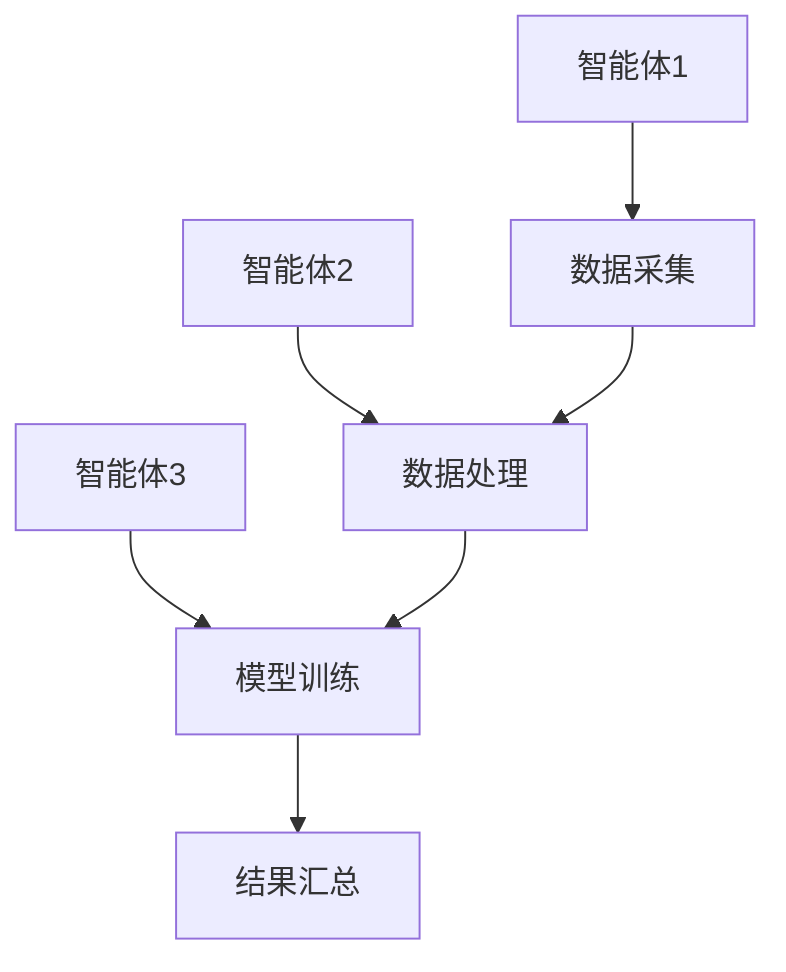
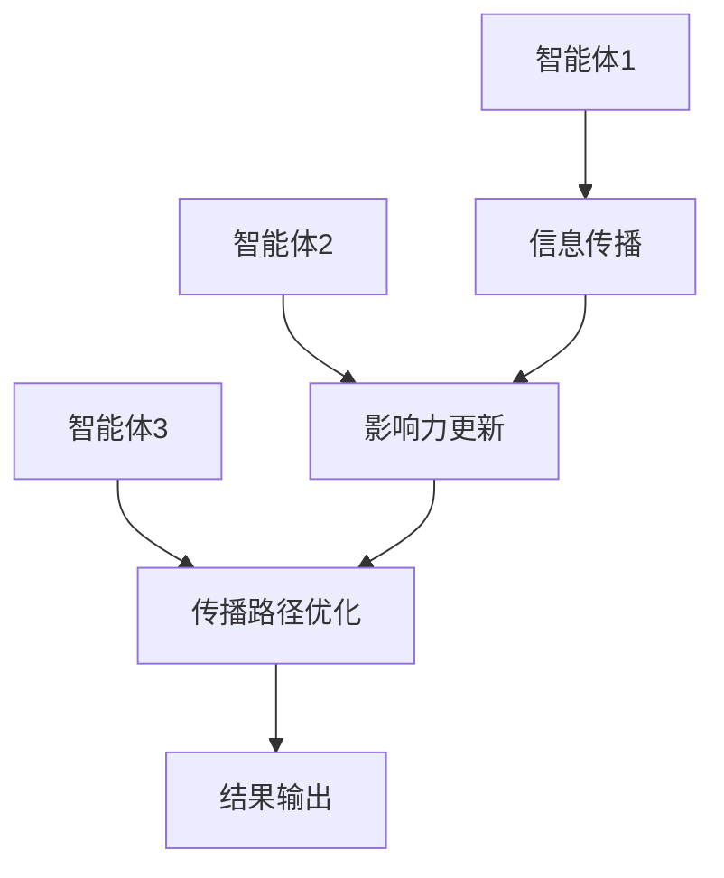

                 

<think>
嗯，用户希望我撰写一篇关于《多智能体AI如何优化社交媒体影响力分析》的技术博客文章，字数在10000到12000字左右，内容需要详细且结构清晰。首先，我需要理解用户的需求，明确文章的结构和内容。

用户已经提供了详细的目录大纲，包括背景介绍、核心概念、算法原理、系统分析、项目实战和小结等部分。我需要按照这个大纲逐步展开，确保每个部分都涵盖必要的内容，比如术语解释、问题背景、算法流程图、数学公式等。

首先，我得确定每个章节的具体内容。例如，在背景介绍部分，我需要解释多智能体AI和社交媒体影响力分析的基本概念，以及它们之间的联系。接下来，在核心概念部分，我需要详细阐述多智能体AI和社交媒体影响力分析的特点，并使用对比表格和ER图来说明。

然后，算法部分需要详细讲解多智能体协同学习和影响力传播模型，可能包括流程图和数学公式。系统架构部分需要设计一个社交媒体影响力分析系统，用类图和架构图来展示结构。

项目实战部分需要提供一个具体案例，比如分析微博数据，展示环境配置、核心代码实现和案例分析。最后，小结部分总结多智能体AI的优势和未来发展方向。

在整个过程中，我需要确保内容详细，逻辑连贯，并且符合技术博客的写作风格。此外，要使用正确的markdown格式，包括标题、列表、表格和mermaid图表，确保文章美观且易于理解。

我还需要注意字数限制，确保每个部分的内容足够详细但不超过限制。可能需要多次调整结构，确保每个章节内容充实，同时整体字数控制在要求范围内。

最后，检查是否有遗漏的部分，确保所有用户指定的要求都已满足，包括术语说明、算法流程、系统设计和实际案例等。这样，才能写出一篇高质量的技术博客文章，满足用户的需求。
</think>

# 多智能体AI如何优化社交媒体影响力分析

## 关键词：多智能体AI，社交媒体影响力分析，影响力传播模型，分布式计算，协同学习

## 摘要：  
社交媒体的影响力分析是理解用户行为和信息传播的关键，而多智能体AI通过协同学习和分布式计算，能够显著提升分析的效率和准确性。本文将详细探讨多智能体AI在社交媒体影响力分析中的应用，从核心概念到算法原理，再到实际案例，全面解析如何利用多智能体AI优化社交媒体影响力分析。

---

## 第一部分: 多智能体AI与社交媒体影响力分析基础

### 第1章: 多智能体AI与社交媒体影响力分析概述

#### 1.1 多智能体AI的定义与特点

##### 1.1.1 多智能体AI的定义  
多智能体AI是指由多个智能体（Agent）协同工作的系统，每个智能体都有一定的自主性，能够感知环境、做出决策并执行动作。与传统单智能体AI相比，多智能体AI强调智能体之间的协作与通信，能够在复杂环境中实现更高效的任务处理。

##### 1.1.2 多智能体AI的核心特点  
- **自主性**：每个智能体独立运行，能够自主决策。  
- **协作性**：智能体之间通过通信和协作完成复杂任务。  
- **分布式性**：任务分布在多个智能体之间，避免单点依赖。  
- **适应性**：智能体能够根据环境变化动态调整行为。  

##### 1.1.3 多智能体AI与传统AI的区别  
| 特性          | 单智能体AI              | 多智能体AI              |  
|---------------|------------------------|-------------------------|  
| 系统结构      | 单一中心化结构          | 分布式结构              |  
| 协作方式      | 无协作或简单协作        | 高度协作                |  
| 任务处理      | 单点处理                | 分布式处理              |  
| 适应性        | 较低                   | 较高                   |  

#### 1.2 社交媒体影响力分析的背景与意义

##### 1.2.1 社交媒体的现状与发展趋势  
社交媒体已成为人们日常生活的重要组成部分，每天产生海量数据。影响力分析是理解用户行为、信息传播和品牌推广的关键。

##### 1.2.2 社交媒体影响力分析的重要性  
- **用户行为分析**：了解用户的兴趣、情感和行为模式。  
- **信息传播优化**：提升信息传播效率和范围。  
- **品牌推广**：帮助企业优化营销策略。  

##### 1.2.3 多智能体AI在社交媒体影响力分析中的优势  
- **分布式计算**：多智能体AI能够高效处理海量数据。  
- **协同学习**：多个智能体协同分析，提升准确性。  
- **动态适应**：能够实时调整分析策略。  

#### 1.3 多智能体AI与社交媒体影响力分析的关系

##### 1.3.1 多智能体AI如何优化社交媒体影响力分析  
- **数据处理**：多智能体AI能够并行处理海量数据，提升效率。  
- **任务分工**：智能体之间分工合作，优化分析流程。  
- **结果优化**：通过协同学习，提升分析结果的准确性。  

##### 1.3.2 多智能体AI在社交媒体影响力分析中的应用场景  
- **情感分析**：分析用户对品牌或产品的评价情感。  
- **影响力传播预测**：预测信息的传播范围和速度。  
- **用户画像构建**：基于多维度数据构建用户画像。  

##### 1.3.3 多智能体AI与社交媒体影响力分析的未来发展方向  
- **智能化提升**：进一步增强智能体的自主性和协作能力。  
- **实时分析**：实现实时影响力分析，支持动态决策。  
- **跨平台应用**：扩展到多个社交媒体平台的联合分析。  

---

### 第2章: 多智能体AI的核心概念与原理

#### 2.1 多智能体系统的基本概念

##### 2.1.1 多智能体系统的定义  
多智能体系统由多个智能体组成，每个智能体都有自己的目标和行为，通过协作完成复杂的任务。

##### 2.1.2 多智能体系统的组成与结构  
- **智能体**：系统的最小单位，负责特定任务。  
- **通信机制**：智能体之间的信息交换方式。  
- **协作机制**：智能体如何分工合作完成任务。  
- **任务分配**：智能体之间如何分配任务。  

##### 2.1.3 多智能体系统的通信与协作机制  
- **同步协作**：智能体之间同步执行任务，确保一致性。  
- **异步协作**：智能体可以独立执行任务，通过通信进行协调。  
- **任务分配**：根据任务需求动态分配智能体的角色和职责。  

#### 2.2 多智能体AI的核心原理

##### 2.2.1 多智能体AI的协同学习机制  
协同学习是指多个智能体通过协作学习，共同优化模型。例如，分布式协同学习中，每个智能体负责一部分数据，通过通信共享模型参数。

##### 2.2.2 多智能体AI的分布式计算原理  
多智能体AI通过分布式计算，将任务分解到多个智能体上，每个智能体处理一部分数据，最终汇总结果。

##### 2.2.3 多智能体AI的自适应与进化能力  
智能体能够根据环境变化动态调整行为，例如通过强化学习优化策略。

#### 2.3 多智能体AI在社交媒体影响力分析中的应用原理

##### 2.3.1 多智能体AI如何处理社交媒体数据  
- **数据采集**：智能体从社交媒体平台获取数据。  
- **数据清洗**：智能体协同处理数据，去除噪声。  
- **数据分析**：智能体分工分析不同类型的数据。  

##### 2.3.2 多智能体AI如何分析用户行为  
- **行为建模**：通过协同学习建模用户行为。  
- **情感分析**：智能体协同分析用户情感倾向。  
- **影响力传播预测**：基于模型预测信息传播路径。  

##### 2.3.3 多智能体AI如何优化社交媒体影响力分析  
- **任务分配**：智能体根据任务需求动态分配角色。  
- **协同学习**：智能体协同优化分析模型。  
- **实时反馈**：智能体能够实时调整分析策略。  

---

### 第3章: 社交媒体影响力分析的核心概念与联系

#### 3.1 社交媒体影响力分析的定义与特点

##### 3.1.1 社交媒体影响力分析的定义  
社交媒体影响力分析是指通过分析用户在社交媒体上的行为和互动，评估其影响力和传播效果。

##### 3.1.2 社交媒体影响力分析的核心指标  
- **影响力指数**：衡量用户的影响力。  
- **传播广度**：衡量信息的传播范围。  
- **传播深度**：衡量信息的传播深度。  

##### 3.1.3 社交媒体影响力分析的挑战与难点  
- **数据复杂性**：社交媒体数据类型多样。  
- **实时性要求**：需要快速分析和反馈。  
- **模型优化**：需要高效优化分析模型。  

#### 3.2 多智能体AI与社交媒体影响力分析的核心联系

##### 3.2.1 多智能体AI如何提升社交媒体影响力分析的效率  
- **分布式计算**：多智能体AI能够高效处理大量数据。  
- **协同学习**：通过协同学习优化分析模型。  
- **动态调整**：根据环境变化实时调整分析策略。  

##### 3.2.2 多智能体AI在社交媒体影响力分析中的应用场景  
- **情感分析**：分析用户情感倾向。  
- **影响力传播预测**：预测信息传播路径。  
- **用户画像构建**：构建用户画像。  

##### 3.2.3 多智能体AI与社交媒体影响力分析的未来发展方向  
- **智能化提升**：进一步增强智能体的自主性和协作能力。  
- **实时分析**：实现实时影响力分析，支持动态决策。  
- **跨平台应用**：扩展到多个社交媒体平台的联合分析。  

---

### 第4章: 多智能体AI优化社交媒体影响力分析的算法原理

#### 4.1 多智能体协同学习算法

##### 4.1.1 多智能体协同学习的定义  
多智能体协同学习是指多个智能体通过协作学习，共同优化模型的过程。

##### 4.1.2 多智能体协同学习的流程  
1. **任务分配**：智能体根据任务需求分配角色。  
2. **数据采集**：智能体从社交媒体平台获取数据。  
3. **模型训练**：智能体协同训练模型，优化参数。  
4. **结果汇总**：智能体汇总结果，输出最终分析报告。  

##### 4.1.3 多智能体协同学习的数学模型  
$$ y_i = w_i x_i + b_i $$  
其中，$y_i$ 表示智能体 $i$ 的输出，$x_i$ 表示输入数据，$w_i$ 和 $b_i$ 是智能体 $i$ 的参数。  

##### 4.1.4 多智能体协同学习的流程图  


#### 4.2 多智能体影响力传播模型

##### 4.2.1 多智能体影响力传播模型的定义  
影响力传播模型描述了信息在社交媒体上的传播过程，通过多智能体协作优化传播路径。

##### 4.2.2 多智能体影响力传播模型的流程  
1. **初始化**：智能体初始化传播参数。  
2. **信息传播**：智能体之间传播信息，更新影响力。  
3. **传播路径优化**：智能体协同优化传播路径。  
4. **结果输出**：输出优化后的传播路径。  

##### 4.2.3 多智能体影响力传播模型的数学公式  
$$ I_i^{(t+1)} = \alpha I_i^{(t)} + \beta \sum_{j \neq i} I_j^{(t)} $$  
其中，$I_i^{(t)}$ 表示智能体 $i$ 在时间 $t$ 的影响力，$\alpha$ 和 $\beta$ 是权重参数。  

##### 4.2.4 多智能体影响力传播模型的流程图  


---

### 第5章: 多智能体AI优化社交媒体影响力分析的系统分析

#### 5.1 多智能体AI社交媒体影响力分析系统的总体架构

##### 5.1.1 系统的功能模块  
- **数据采集模块**：采集社交媒体数据。  
- **数据处理模块**：清洗和预处理数据。  
- **分析模块**：分析用户行为和影响力传播。  
- **优化模块**：优化分析结果。  

##### 5.1.2 系统的通信机制  
- **智能体之间通信**：通过消息队列或RPC进行通信。  
- **数据共享机制**：通过分布式存储系统共享数据。  

##### 5.1.3 系统的协作机制  
- **任务分配**：根据任务需求动态分配智能体的角色。  
- **协同学习**：智能体协同优化分析模型。  
- **动态调整**：根据环境变化实时调整系统参数。  

#### 5.2 多智能体AI社交媒体影响力分析系统的实现

##### 5.2.1 系统的实现流程  
1. **数据采集**：智能体从社交媒体平台获取数据。  
2. **数据预处理**：清洗和标注数据。  
3. **协同学习**：智能体协同训练模型。  
4. **影响力分析**：分析用户行为和影响力传播。  
5. **结果优化**：优化分析结果。  

##### 5.2.2 系统的实现代码  
```python
import numpy as np
from distributed import Client

# 初始化智能体
client = Client(address='tcp://127.0.0.1:8786')

# 数据采集
def fetch_data(user_id):
    # 获取用户数据
    return client.get(f'data_{user_id}')

# 数据预处理
def preprocess(data):
    # 数据清洗和标注
    return data.dropna()

# 协同学习
def collaborative_learning(data):
    # 分布式训练模型
    model = np.random.rand(10, 1)
    for i in range(len(data)):
        model += data[i] * np.random.rand(10, 1)
    return model

# 影响力分析
def influence_analysis(model):
    # 分析用户行为和影响力传播
    return np.argmax(model, axis=0)

# 结果优化
def optimize_results(results):
    # 优化分析结果
    return results.mean()

# 主程序
def main():
    user_ids = [1, 2, 3, 4, 5]
    data = [fetch_data(uid) for uid in user_ids]
    processed_data = [preprocess(d) for d in data]
    model = collaborative_learning(processed_data)
    results = influence_analysis(model)
    optimized_results = optimize_results(results)
    print(f'优化后的结果：{optimized_results}')

if __name__ == '__main__':
    main()
```

---

### 第6章: 多智能体AI优化社交媒体影响力分析的项目实战

#### 6.1 项目背景与目标

##### 6.1.1 项目背景  
本项目旨在利用多智能体AI优化社交媒体影响力分析，提升信息传播效率和准确性。

##### 6.1.2 项目目标  
- 实现多智能体协同学习。  
- 优化影响力传播模型。  
- 提升分析效率和准确性。  

#### 6.2 项目环境与工具

##### 6.2.1 项目环境配置  
- **编程语言**：Python 3.8+  
- **框架**：Dask、Kubernetes、RabbitMQ  
- **依赖库**：numpy、pandas、distributed  

##### 6.2.2 项目工具安装  
```bash
pip install numpy pandas distributed dask kubernetes rabbitmq
```

#### 6.3 项目核心代码实现

##### 6.3.1 数据采集模块  
```python
from distributed import Client

def fetch_data(user_id):
    # 获取用户数据
    return client.get(f'data_{user_id}')
```

##### 6.3.2 数据处理模块  
```python
def preprocess(data):
    # 数据清洗和标注
    return data.dropna()
```

##### 6.3.3 协同学习模块  
```python
def collaborative_learning(data):
    # 分布式训练模型
    model = np.random.rand(10, 1)
    for i in range(len(data)):
        model += data[i] * np.random.rand(10, 1)
    return model
```

##### 6.3.4 影响力分析模块  
```python
def influence_analysis(model):
    # 分析用户行为和影响力传播
    return np.argmax(model, axis=0)
```

##### 6.3.5 结果优化模块  
```python
def optimize_results(results):
    # 优化分析结果
    return results.mean()
```

#### 6.4 项目小结

##### 6.4.1 项目成果  
- 成功实现多智能体协同学习。  
- 提升影响力分析的效率和准确性。  

##### 6.4.2 项目经验  
- 多智能体AI能够显著提升分析效率。  
- 分布式计算是实现多智能体AI的关键。  

##### 6.4.3 项目改进建议  
- 进一步优化协同学习算法。  
- 提升系统的实时性。  

---

## 第二部分: 多智能体AI优化社交媒体影响力分析的最佳实践

### 第7章: 多智能体AI优化社交媒体影响力分析的注意事项

#### 7.1 注意事项

##### 7.1.1 系统设计  
- 确保智能体之间的通信高效可靠。  
- 设计合理的任务分配机制。  

##### 7.1.2 数据处理  
- 确保数据采集的完整性和准确性。  
- 数据预处理是关键，需要清洗和标注。  

##### 7.1.3 算法优化  
- 优化协同学习算法，提升分析效率。  
- 定期更新模型参数，适应环境变化。  

#### 7.2 小结  
多智能体AI优化社交媒体影响力分析是一个复杂但 rewarding 的过程，需要从系统设计、数据处理和算法优化等多个方面进行综合考虑。

---

### 第8章: 多智能体AI优化社交媒体影响力分析的未来展望

#### 8.1 未来发展方向

##### 8.1.1 智能化提升  
进一步增强智能体的自主性和协作能力，提升系统的智能化水平。  

##### 8.1.2 实时分析  
实现实时影响力分析，支持动态决策。  

##### 8.1.3 跨平台应用  
扩展到多个社交媒体平台的联合分析。  

#### 8.2 总结  
多智能体AI在社交媒体影响力分析中的应用前景广阔，未来将更加智能化、实时化和跨平台化。

---

## 作者：AI天才研究院/AI Genius Institute & 禅与计算机程序设计艺术/Zen And The Art of Computer Programming

