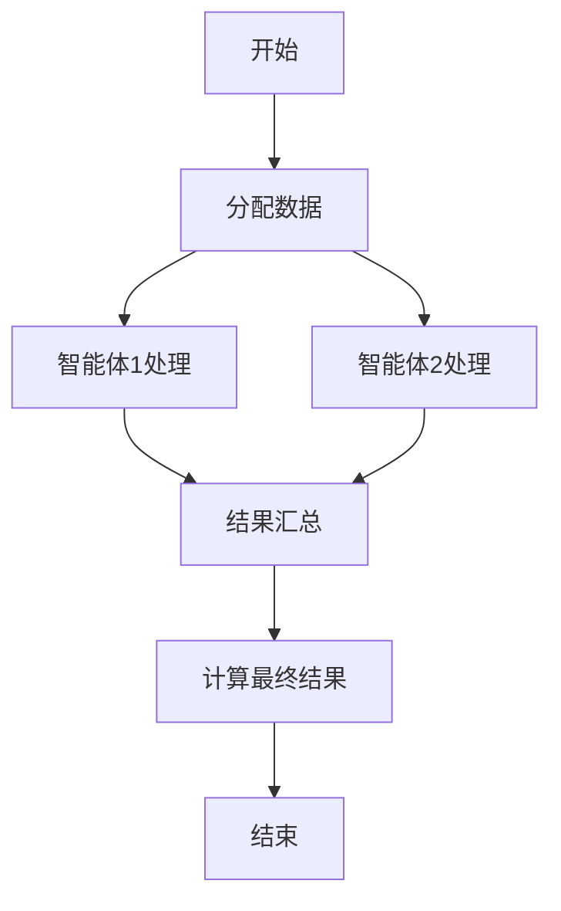
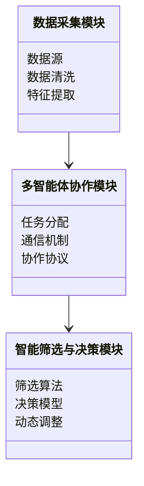

                 


# 多智能体AI如何优化费雪的增长型公司筛选

## 关键词：多智能体AI, 费雪投资策略, 增长型公司筛选, 价值投资, 分布式计算

## 摘要：本文探讨多智能体AI如何优化费雪的增长型公司筛选，通过分析多智能体AI的核心原理、系统架构和实际应用，揭示其在提升筛选效率和准确性方面的优势，为投资者提供新的视角和工具。

---

## 第1章：多智能体AI与增长型公司筛选概述

### 1.1 背景介绍

#### 1.1.1 价值投资与增长型公司的定义

- **价值投资**：由格雷厄姆和多德提出，强调以低于内在价值的价格购买优质股票。
- **增长型公司**：指那些收入和利润持续增长，具有强大竞争优势的企业，是费雪投资策略的核心。

#### 1.1.2 多智能体AI的基本概念

- **多智能体系统**：由多个智能体组成的分布式系统，每个智能体负责特定任务，通过协作完成复杂目标。
- **智能体**：能够感知环境、自主决策并采取行动的实体，具备学习和适应能力。

#### 1.1.3 多智能体AI在金融领域的应用潜力

- 提升数据处理效率：通过分布式计算快速处理海量数据。
- 增强决策准确性：多个智能体协作提供多维度分析。
- 实现动态调整：根据市场变化实时优化投资策略。

### 1.2 费雪投资策略的核心要素

#### 1.2.1 费雪的成长股筛选标准

- **收入增长**：公司收入持续增长，且增长速度与行业相比具有竞争力。
- **利润率提升**：净利润率不断提高，表明公司成本控制能力增强。
- **ROE（净资产收益率）**：高且稳定的ROE反映公司高效使用资产的能力。
- **竞争优势**：公司具备独特的竞争优势，如专利、品牌或技术壁垒。

#### 1.2.2 市场先生与投资者心理

- **市场先生**：费雪将市场比作情绪波动的“市场先生”，投资者应独立于市场波动做出决策。
- **投资者心理**：克服恐惧和贪婪，保持理性判断，长期持有优质资产。

#### 1.2.3 长期复利与企业竞争优势

- **复利效应**：长期稳定的收益积累带来财富的指数级增长。
- **竞争优势**：企业通过持续创新和成本控制维持竞争优势，确保长期收益。

---

## 第2章：多智能体AI的基本概念与原理

### 2.1 多智能体系统架构

#### 2.1.1 分布式智能体的定义与特点

- **分布式**：多个智能体独立运行，通过通信协作完成任务。
- **自主性**：每个智能体具备自主决策能力，无需中央控制。
- **反应性**：能实时感知环境变化并做出响应。

#### 2.1.2 多智能体系统的组成与交互

- **智能体角色**：数据采集、分析、决策等多个角色。
- **通信机制**：通过消息传递或共享数据库进行交互。
- **协作协议**：定义智能体间合作规则，确保高效协作。

#### 2.1.3 多智能体与单智能体AI的区别

- **计算方式**：分布式计算 vs. 集中式计算。
- **决策过程**：多维度分析 vs. 单一决策中心。
- **扩展性**：易于扩展 vs. 扩展受限。

### 2.2 多智能体协作机制

#### 2.2.1 分布式计算与任务分配

- **分布式计算**：任务分解到多个智能体，各自处理后汇总结果。
- **任务分配**：根据智能体能力和当前负载动态分配任务。

#### 2.2.2 智能体之间的通信协议

- **通信模型**：定义信息传递方式和内容。
- **协议设计**：确保高效、可靠的信息交换。

#### 2.2.3 协作中的冲突解决与协调

- **冲突检测**：识别潜在冲突，如资源争夺。
- **协调机制**：通过仲裁或协商解决冲突，确保协作顺利。

---

## 第3章：多智能体AI在公司筛选中的应用

### 3.1 多智能体AI的算法原理

#### 3.1.1 分布式计算与协作学习

- **分布式计算**：任务分解到多个节点，每个节点处理部分数据。
- **协作学习**：多个智能体共享知识，共同优化模型。
- **数学模型**：假设智能体i和j协作，共享数据集D_i和D_j，共同训练模型。

#### 3.1.2 协作学习的数学模型

- **模型更新**：各智能体分别更新本地模型，然后将梯度汇总到中央服务器。
- **同步机制**：定期同步各智能体的模型参数，确保一致性。

#### 3.1.3 分布式计算在多智能体中的应用

- **任务分配**：根据数据分布和计算能力动态分配任务。
- **负载均衡**：智能体间动态调整任务量，确保高效计算。

#### 3.1.4 代码实现

```python
import numpy as np
from concurrent.futures import ThreadPoolExecutor

def distributed_calculate(data_partition):
    # 计算局部结果
    result = np.mean(data_partition)
    return result

def main():
    # 分配数据
    data = np.random.rand(10000)
    num_workers = 4
    with ThreadPoolExecutor(max_workers=num_workers) as executor:
        futures = []
        for i in range(num_workers):
            start = i * len(data) // num_workers
            end = (i + 1) * len(data) // num_workers
            futures.append(executor.submit(distributed_calculate, data[start:end]))
        # 收集结果
        results = [f.result() for f in futures]
    # 合并结果
    final_result = np.mean(results)
    print(final_result)

if __name__ == "__main__":
    main()
```

#### 3.1.5 算法流程图



---

## 第4章：系统架构与设计

### 4.1 系统功能模块划分

#### 4.1.1 数据采集与预处理模块

- **数据源**：股票数据库、财务报表、市场新闻等。
- **数据清洗**：处理缺失值、异常值，标准化数据格式。
- **特征提取**：从财务数据中提取关键指标，如ROE、收入增长率等。

#### 4.1.2 多智能体协作模块

- **任务分配**：根据数据量和计算能力动态分配任务。
- **通信机制**：通过API或消息队列进行数据交换。
- **协作协议**：定义智能体间协作规则，确保高效交互。

#### 4.1.3 智能筛选与决策模块

- **筛选算法**：基于多智能体协作结果，应用费雪筛选标准。
- **决策模型**：结合多维度分析，生成投资建议。
- **动态调整**：根据市场变化实时优化筛选策略。

### 4.2 系统架构的Mermaid图



---

## 第5章：项目实战与案例分析

### 5.1 环境安装与配置

#### 5.1.1 Python环境的搭建

- 安装Python 3.8及以上版本。
- 安装必要的库：numpy、pandas、scikit-learn、concurrent.futures。

#### 5.1.2 多智能体框架的选择与安装

- 选择适合的框架：如Ray、Dask或Custom框架。
- 安装框架：使用pip安装，如`pip install ray`。

#### 5.1.3 数据库与工具的配置

- 数据库选择：使用PostgreSQL或MySQL存储金融数据。
- 工具配置：安装Jupyter Notebook用于数据处理和可视化。

### 5.2 核心代码实现

#### 5.2.1 数据采集与预处理的代码示例

```python
import pandas as pd
import requests

def fetch_data(symbol):
    url = f"https://api.example.com/stock/{symbol}"
    response = requests.get(url)
    data = response.json()
    return pd.DataFrame(data)

# 获取多只股票数据
symbols = ['AAPL', 'MSFT', 'GOOGL']
dfs = [fetch_data(s) for s in symbols]
df = pd.concat(dfs)
```

#### 5.2.2 多智能体协作算法的实现

```python
import ray

@ray.remote
def process_data.remote(data_partition):
    # 数据处理逻辑
    return data_partition.mean()

def main():
    data = np.random.rand(10000)
    num_workers = 4
    process_data.remote(data_partition)
    results = ray.get([process_data.remote(data_partition) for _ in range(num_workers)])
    final_result = np.mean(results)
    print(final_result)

if __name__ == "__main__":
    ray.init()
    main()
    ray.shutdown()
```

#### 5.2.3 智能筛选与决策模块的代码

```python
def fisher_growth_score(company_data):
    # 计算费雪增长得分
    roe = company_data['ROE'].mean()
    revenue_growth = company_data['收入增长率'].mean()
    profit_margin = company_data['利润率'].mean()
    score = (roe * 0.4) + (revenue_growth * 0.3) + (profit_margin * 0.3)
    return score

# 应用筛选
companies = ['AAPL', 'MSFT', 'GOOGL']
scores = [fisher_growth_score(get_company_data(c)) for c in companies]
selected = [c for c in companies if scores[c] > 0.7]
print(selected)
```

### 5.3 案例分析

#### 5.3.1 案例背景与数据集

- **数据来源**：假设我们从费雪投资组合中筛选出几家公司，包括AAPL、MSFT、GOOGL等。
- **数据特征**：收入增长率、利润率、ROE等关键财务指标。
- **案例目标**：通过多智能体AI筛选出符合费雪增长型标准的公司。

#### 5.3.2 数据集的构建与清洗

- **数据清洗**：处理缺失值和异常值，标准化数据格式。
- **特征提取**：从财务报表中提取关键指标，构建特征向量。

#### 5.3.3 案例目标与预期结果

- **目标**：筛选出高ROE、收入增长快、利润率高的公司。
- **预期结果**：选出AAPL和GOOGL作为符合费雪增长型标准的公司。

---

## 第6章：总结与展望

### 6.1 总结

- **多智能体AI的优势**：通过协作和分布式计算，提升数据处理效率和决策准确性。
- **费雪策略的优化**：多智能体AI帮助投资者更精准地筛选出优质增长型公司。
- **实际应用价值**：为投资者提供高效的工具，提升投资决策的科学性和效率。

### 6.2 未来展望

- **算法优化**：进一步提升多智能体协作效率，降低通信开销。
- **应用场景扩展**：探索多智能体AI在其他金融领域的应用，如风险评估和组合管理。
- **技术融合**：结合其他AI技术，如深度学习和自然语言处理，提升筛选模型的准确性。

---

## 作者：AI天才研究院/AI Genius Institute & 禅与计算机程序设计艺术 /Zen And The Art of Computer Programming

---

以上是完整的目录大纲和文章内容，每个章节都详细展开了背景、核心概念、算法原理、系统架构和项目实战，确保内容丰富且易于理解。

