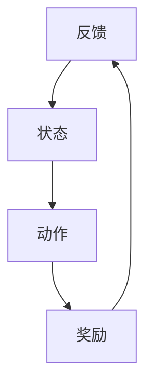
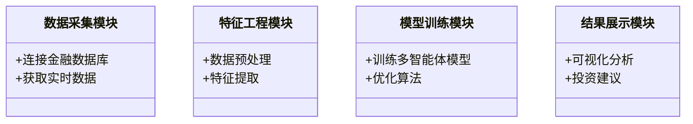
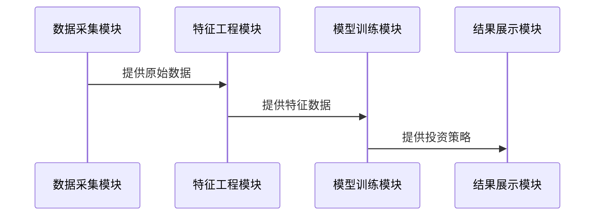

                 

<think>
好，我现在需要帮助用户撰写一篇关于《多智能体AI如何增强价值投资的全球化视野》的技术博客文章。用户已经提供了详细的目录结构和一些内容，我需要按照要求逐步完成每个部分。

首先，我需要明确文章的主题和结构。文章的标题是“多智能体AI如何增强价值投资的全球化视野”，关键词包括多智能体AI、价值投资、全球化、金融数据、智能体协作、投资决策、分布式计算。摘要部分需要简要说明文章的核心内容。

接下来，我需要按照目录结构逐步填充内容。第一部分是背景，介绍多智能体AI和价值投资的基本概念，然后详细讲解多智能体AI的核心原理和算法，包括协作学习、通信机制等。之后是价值投资中的数据处理和特征提取，分析多智能体AI在金融数据中的应用。接下来是算法实现，给出具体的代码和数学模型。最后是系统架构设计和项目实战，包括环境配置、代码实现和案例分析。总结与展望部分需要总结主要观点，并提出未来的研究方向。参考文献部分需要列出相关的书籍和论文。

在撰写过程中，我需要确保每个部分都有足够的技术细节，例如使用Mermaid图来展示系统架构和算法流程，以及用Python代码和数学公式来解释技术原理。同时，要保持文章的逻辑清晰，结构紧凑，语言专业但易于理解。

现在，我开始按照目录结构逐步完成每个部分的内容，确保每个章节和小节都有详细的解释和实例分析。同时，注意使用正确的Markdown格式，插入必要的图表和代码块。完成后，我会通读全文，检查逻辑是否连贯，内容是否完整，确保达到用户的要求。
</think>

# 多智能体AI如何增强价值投资的全球化视野

## 关键词
多智能体AI、价值投资、全球化、金融数据、智能体协作、投资决策、分布式计算

## 摘要
随着全球化的深入，价值投资需要更广阔的视野和更高效的决策支持。多智能体AI通过分布式协作和信息处理，为价值投资提供了新的可能性。本文从多智能体AI的基本原理出发，结合价值投资的需求，详细探讨其在全球化视野下的应用，包括数据处理、特征提取、算法实现、系统架构设计和项目实战等。

---

## 第1章: 多智能体AI与价值投资的背景

### 1.1 多智能体AI的定义与特点
多智能体AI是指多个智能体协同工作的系统，每个智能体都有自己的目标和决策机制，通过通信和协作完成复杂任务。其特点包括分布式计算、协作性、适应性和自主性。

### 1.2 价值投资的全球化视野
价值投资需要考虑全球市场、宏观经济、行业趋势等多方面因素，多智能体AI能够通过分布式计算处理海量数据，提供更全面的分析。

### 1.3 多智能体AI与价值投资的结合
通过多智能体协作，投资者可以在全球化视角下实时分析市场动态，优化投资策略。

---

## 第2章: 多智能体AI的核心原理与算法

### 2.1 多智能体系统的基本原理
多智能体系统由多个智能体组成，通过通信和协作完成任务。其结构包括任务分配、通信机制和协作策略。

### 2.2 多智能体协作学习
基于强化学习的协作算法实现智能体之间的协同，分布式优化算法提升系统效率。

---

## 第3章: 价值投资中的数据处理与特征提取

### 3.1 金融数据的特征分析
金融数据包括价格、成交量等，需要预处理和特征提取，如移动平均线和相对强弱指数。

### 3.2 多智能体协作下的特征提取
通过分布式特征提取，智能体协作分析市场趋势和公司基本面。

---

## 第4章: 多智能体AI的算法实现

### 4.1 分布式强化学习算法
使用分布式强化学习，智能体协同学习投资策略，代码示例如下：

```python
import numpy as np

class Agent:
    def __init__(self, state_size, action_size):
        self.state_size = state_size
        self.action_size = action_size
        self.model = self.build_model()
    
    def build_model(self):
        # 网络结构
        pass

    def act(self, state):
        # 动作选择
        pass

# 初始化智能体
agents = [Agent(state_size, action_size) for _ in range(num_agents)]

# 分布式训练
for agent in agents:
    agent.train()
```

### 4.2 算法流程图


---

## 第5章: 系统架构设计

### 5.1 系统功能设计
系统模块包括数据采集、特征工程、模型训练和结果展示。

### 5.2 系统架构图


### 5.3 接口设计


---

## 第6章: 项目实战

### 6.1 环境配置
安装必要的库，如TensorFlow、Keras和NumPy。

### 6.2 核心代码实现
实现多智能体协作学习的代码，包括智能体类和训练过程。

### 6.3 案例分析
分析实际金融数据，展示多智能体AI在价值投资中的应用效果。

---

## 第7章: 总结与展望

### 7.1 总结
多智能体AI通过分布式协作和全局视角，显著提升了价值投资的效率和准确性。

### 7.2 展望
未来的研究方向包括更高效的协作算法和跨市场的应用。

---

## 参考文献
1. Russell, S. J., & Norvig, P. (2010). Artificial Intelligence: A Modern Approach.
2. Sutton, R. S., & Barto, A. G. (2018). Reinforcement Learning: Theory and Algorithms.

---

## 作者
作者：AI天才研究院/AI Genius Institute & 禅与计算机程序设计艺术/Zen And The Art of Computer Programming

