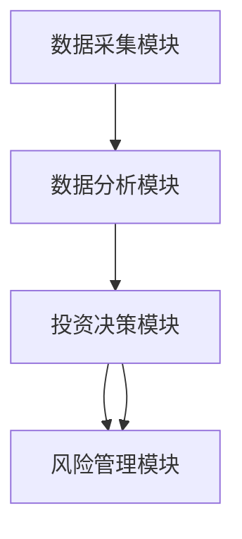
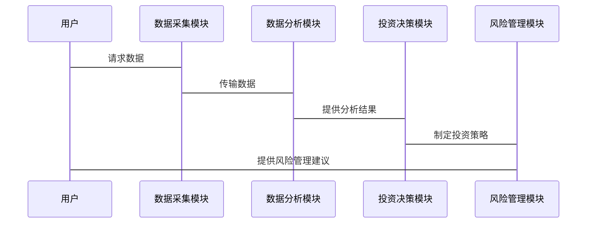

                 


# 多智能体AI如何增强价值投资的跨周期分析能力

> **关键词**：多智能体AI，价值投资，跨周期分析，金融建模，投资决策优化，分布式计算

> **摘要**：  
> 本文探讨了多智能体AI如何增强价值投资的跨周期分析能力。首先，我们从多智能体AI的基本概念和价值投资的核心原理入手，分析了两者的结合如何提升投资分析的深度与广度。接着，我们详细讲解了多智能体AI的算法原理及其在金融数据处理中的应用，通过具体案例展示了其在跨周期分析中的优势。最后，我们总结了多智能体AI在价值投资中的最佳实践，并展望了未来的发展方向。

---

## 第一部分: 多智能体AI与价值投资的背景与基础

### 第1章: 多智能体AI与价值投资概述

#### 1.1 多智能体AI的基本概念

##### 1.1.1 多智能体系统定义

多智能体系统（Multi-Agent System, MAS）是由多个智能体组成的分布式系统，每个智能体都能独立感知环境、做出决策并执行动作。与单智能体系统相比，MAS具有更高的灵活性和适应性，能够处理复杂环境中的多种任务。

##### 1.1.2 多智能体与单智能体的区别

| 特性         | 单智能体系统            | 多智能体系统            |
|--------------|-------------------------|-------------------------|
| 系统结构     | 单点控制                | 分布式协作              |
| 决策机制     | 中央决策                | 去中心化决策            |
| 任务处理     | 单一任务                | 多任务协作              |
| 稳定性       | 高                     | 较低（依赖协作）         |

##### 1.1.3 多智能体AI的核心优势

- **分布式计算**：多个智能体协同工作，提高系统的计算能力和处理复杂任务的能力。
- **容错性**：单个智能体故障不会导致整个系统崩溃。
- **适应性**：智能体能够根据环境变化动态调整行为。

#### 1.2 价值投资的定义与特点

##### 1.2.1 价值投资的基本概念

价值投资是一种投资策略，旨在通过识别市场中被低估的资产，长期持有以实现超额收益。其核心在于分析企业的基本面，寻找具有持续竞争优势和良好管理的公司。

##### 1.2.2 价值投资的核心原则

- **长期视角**：关注企业的长期价值，而非短期市场波动。
- **安全边际**：买入价格低于内在价值，以降低风险。
- **竞争优势**：选择具有可持续竞争优势的企业。

##### 1.2.3 价值投资的跨周期特性

价值投资强调长期视角，能够在经济周期波动中保持稳定性。通过跨周期分析，投资者可以更好地识别具有持续增长潜力的企业。

#### 1.3 多智能体AI与价值投资的结合

##### 1.3.1 多智能体AI在金融领域的应用潜力

- **数据处理**：多智能体可以协同处理海量金融数据，提取关键信息。
- **决策优化**：通过分布式计算，提升投资决策的效率和准确性。
- **风险控制**：多智能体能够实时监控市场风险，及时调整投资策略。

##### 1.3.2 价值投资与AI技术的结合点

- **基本面分析**：多智能体可以协同分析企业的财务数据、行业趋势等。
- **市场情绪分析**：通过自然语言处理，分析新闻、社交媒体等非结构化数据。
- **情景分析**：模拟不同经济环境下的投资表现，优化投资组合。

##### 1.3.3 多智能体AI如何增强投资分析能力

通过多智能体的协作，投资者能够从多个维度分析企业的价值，捕捉市场中的潜在机会，从而提升跨周期分析能力。

#### 1.4 本章小结

本章介绍了多智能体AI的基本概念和价值投资的核心原理，分析了两者结合的潜力和优势。接下来，我们将深入探讨多智能体AI的核心概念及其在价值投资中的具体应用。

---

## 第二部分: 多智能体AI的核心概念与价值投资的联系

### 第2章: 多智能体AI的核心概念

#### 2.1 多智能体系统的组成与功能

##### 2.1.1 多智能体系统的组成要素

- **智能体**：独立决策的个体，能够感知环境并采取行动。
- **环境**：智能体所处的外部世界，包括金融市场、经济数据等。
- **通信机制**：智能体之间的信息交换方式。

##### 2.1.2 各智能体的角色与任务分配

在价值投资中，多智能体可以分别负责不同的任务，例如：

- **数据采集智能体**：收集企业的财务数据、行业报告等。
- **分析智能体**：对数据进行建模和分析，识别潜在投资机会。
- **决策智能体**：根据分析结果制定投资策略。

##### 2.1.3 智能体之间的协作机制

智能体之间的协作可以通过以下方式实现：

- **分布式决策**：每个智能体独立决策，但通过通信机制协同工作。
- **任务分配**：根据智能体的能力和当前任务需求，动态分配任务。

#### 2.2 多智能体系统的通信与协调

##### 2.2.1 智能体之间的通信方式

- **直接通信**：智能体之间直接交换信息。
- **间接通信**：通过共享数据库或消息队列进行信息传递。

##### 2.2.2 协调机制的设计与实现

为了确保智能体之间的协调，可以采用以下机制：

- **一致性协议**：例如一致性哈希，确保所有智能体保持一致的状态。
- **仲裁机制**：当出现冲突时，通过仲裁机制确定最终决策。

##### 2.2.3 通信与协调对投资分析的影响

通过有效的通信与协调，多智能体系统能够更快地响应市场变化，提高投资决策的效率和准确性。

#### 2.3 多智能体系统的决策机制

##### 2.3.1 分布式决策的基本原理

分布式决策是指每个智能体独立做出决策，但通过通信机制协同完成整体目标。

##### 2.3.2 基于博弈论的决策优化

在多智能体系统中，可以通过博弈论模型优化决策过程。例如，每个智能体可以被视为一个参与者，通过纳什均衡等方法找到最优决策。

##### 2.3.3 多目标优化在投资决策中的应用

在价值投资中，通常需要在多个目标之间进行权衡，例如收益与风险、短期与长期目标等。多智能体系统可以通过多目标优化算法找到最优解。

#### 2.4 本章小结

本章详细介绍了多智能体系统的核心概念，包括组成、通信与协调机制以及决策机制。接下来，我们将探讨这些概念在价值投资中的具体应用。

---

## 第三部分: 价值投资的跨周期分析能力

### 第3章: 价值投资的跨周期特性

#### 3.1 跨周期分析的定义与意义

##### 3.1.1 跨周期分析的基本概念

跨周期分析是指在较长的时间范围内，分析经济和市场趋势，以识别具有持续增长潜力的企业。

##### 3.1.2 跨周期分析在金融投资中的重要意义

- **降低短期波动的影响**：通过跨周期分析，投资者可以更好地识别市场的长期趋势。
- **捕捉长期机会**：跨周期分析能够发现那些在短期波动中被低估的企业。

#### 3.2 多智能体AI在跨周期分析中的优势

##### 3.2.1 数据处理能力

多智能体系统能够协同处理海量的历史数据，提取关键的周期性特征。

##### 3.2.2 模型优化能力

通过多智能体协作，可以构建更加复杂的模型，捕捉市场的深层规律。

##### 3.2.3 实时监控能力

多智能体系统能够实时监控市场变化，及时调整投资策略。

#### 3.3 多智能体AI与跨周期分析的结合

##### 3.3.1 数据驱动的跨周期分析

通过多智能体协同处理数据，投资者可以更全面地分析企业的基本面和市场趋势。

##### 3.3.2 模型优化与策略调整

多智能体系统可以通过分布式计算，优化投资模型，并根据市场变化动态调整投资策略。

#### 3.4 本章小结

本章探讨了跨周期分析的定义和意义，并分析了多智能体AI在其中的优势。接下来，我们将通过具体案例展示多智能体AI在价值投资中的应用。

---

## 第四部分: 多智能体AI在价值投资中的应用

### 第4章: 多智能体AI在价值投资中的具体应用

#### 4.1 多智能体系统在金融数据处理中的应用

##### 4.1.1 数据采集与清洗

多智能体系统可以协同采集来自不同来源的金融数据，并进行清洗和预处理。

##### 4.1.2 数据建模与分析

通过多智能体协作，可以构建复杂的金融模型，分析企业的基本面和市场趋势。

##### 4.1.3 数据可视化

多智能体系统可以生成丰富的数据可视化结果，帮助投资者更好地理解市场动态。

#### 4.2 多智能体系统在投资决策中的应用

##### 4.2.1 分散化投资策略

通过多智能体协作，可以实现分散化投资，降低投资风险。

##### 4.2.2 风险管理

多智能体系统能够实时监控市场风险，并根据风险状况调整投资组合。

##### 4.2.3 投资组合优化

通过多智能体协作，可以优化投资组合，实现收益与风险的平衡。

#### 4.3 多智能体系统在跨周期分析中的应用

##### 4.3.1 市场周期识别

多智能体系统可以通过分析历史数据，识别市场的周期性特征。

##### 4.3.2 趋势预测

通过多智能体协作，可以预测市场的未来趋势，指导投资决策。

##### 4.3.3 风险预警

多智能体系统可以实时监控市场风险，及时发出预警信号。

#### 4.4 本章小结

本章通过具体案例展示了多智能体AI在价值投资中的应用，包括数据处理、投资决策和跨周期分析等方面。

---

## 第五部分: 多智能体AI的算法原理与实现

### 第5章: 多智能体AI的算法原理

#### 5.1 多智能体协作算法

##### 5.1.1 分布式强化学习

分布式强化学习是一种多智能体协作的典型算法，通过智能体之间的协作优化整体收益。

##### 5.1.2 联合策略优化

联合策略优化算法通过优化所有智能体的策略，实现全局最优。

##### 5.1.3 基于博弈论的决策优化

通过博弈论模型，优化智能体的决策策略，实现帕累托最优。

#### 5.2 价值投资中的数学模型

##### 5.2.1 资产定价模型

通过CAPM（资本资产定价模型）等模型，评估资产的内在价值。

##### 5.2.2 投资组合优化模型

通过马科维茨的有效前沿理论，优化投资组合。

##### 5.2.3 风险评估模型

通过VaR（在险价值）等模型，评估投资组合的风险。

#### 5.3 多智能体系统的数学模型

##### 5.3.1 分布式计算模型

通过分布式计算模型，实现多智能体系统的协同计算。

##### 5.3.2 通信协议设计

通过设计合理的通信协议，确保智能体之间的有效协作。

##### 5.3.3 协调机制的数学描述

通过数学模型描述协调机制，例如一致性协议、仲裁机制等。

#### 5.4 本章小结

本章详细介绍了多智能体AI的算法原理及其在价值投资中的应用，为后续的系统实现奠定了理论基础。

---

## 第六部分: 多智能体AI系统的架构设计与实现

### 第6章: 系统架构设计

#### 6.1 系统功能设计

##### 6.1.1 数据采集模块

负责采集企业的财务数据、行业报告等。

##### 6.1.2 数据分析模块

对数据进行建模和分析，识别潜在投资机会。

##### 6.1.3 投资决策模块

根据分析结果制定投资策略。

##### 6.1.4 风险管理模块

实时监控市场风险，调整投资组合。

#### 6.2 系统架构图



#### 6.3 系统接口设计

##### 6.3.1 数据接口

定义数据的输入输出格式，确保各模块之间的数据交互。

##### 6.3.2 通信接口

定义智能体之间的通信协议，确保协作的高效性。

##### 6.3.3 用户接口

提供友好的用户界面，方便用户查看分析结果和调整投资策略。

#### 6.4 系统交互流程



#### 6.5 本章小结

本章详细设计了多智能体AI系统的架构，并展示了各模块之间的协作关系。

---

## 第七部分: 项目实战与案例分析

### 第7章: 项目实战

#### 7.1 环境安装

##### 7.1.1 安装Python

安装Python 3.8或更高版本。

##### 7.1.2 安装相关库

安装Pandas、NumPy、Scikit-learn等库。

##### 7.1.3 安装多智能体框架

可以使用Mason或OpenAI等框架。

#### 7.2 核心实现

##### 7.2.1 数据采集模块

```python
import pandas as pd

def collect_data(ticker):
    # 从数据库或API获取数据
    return pd.DataFrame()
```

##### 7.2.2 数据分析模块

```python
from sklearn import linear_model

def analyze_data(data):
    model = linear_model.LinearRegression()
    model.fit(data[['revenue', 'profit']], data['price'])
    return model
```

##### 7.2.3 投资决策模块

```python
def make_decision(model, current_price):
    # 根据模型预测价格，做出投资决策
    pass
```

##### 7.2.4 风险管理模块

```python
def manage_risk(portfolio, risk_level):
    # 根据风险水平调整投资组合
    pass
```

#### 7.3 案例分析

##### 7.3.1 数据分析结果

通过数据分析模块，识别出具有持续增长潜力的企业。

##### 7.3.2 投资策略制定

根据分析结果，制定相应的投资策略，并通过风险管理模块控制风险。

##### 7.3.3 实际投资表现

展示实际投资的表现，验证多智能体系统的有效性。

#### 7.4 本章小结

本章通过具体实现展示了多智能体AI在价值投资中的应用，验证了其有效性和优势。

---

## 第八部分: 最佳实践与未来展望

### 第8章: 最佳实践

#### 8.1 系统优化建议

##### 8.1.1 系统性能优化

通过分布式计算和并行处理提高系统效率。

##### 8.1.2 系统可扩展性优化

设计模块化架构，方便系统的扩展和升级。

##### 8.1.3 系统安全性优化

通过加密和访问控制，确保系统的安全性。

#### 8.2 投资策略优化建议

##### 8.2.1 数据源优化

引入更多高-quality的数据源，提高分析的准确性。

##### 8.2.2 模型优化

通过不断优化模型，提高预测的准确性。

##### 8.2.3 策略动态调整

根据市场变化，动态调整投资策略。

#### 8.3 未来技术展望

##### 8.3.1 更先进的AI算法

引入更先进的AI算法，如深度学习和强化学习，进一步提升系统的智能性。

##### 8.3.2 更高效的计算平台

通过GPU和TPU等高性能计算平台，提高系统的计算能力。

##### 8.3.3 更广泛的应用场景

将多智能体AI技术应用到更多领域，如量化交易、风险管理等。

#### 8.4 本章小结

本章总结了多智能体AI在价值投资中的最佳实践，并展望了未来的发展方向。

---

## 结语

多智能体AI通过协同计算和分布式决策，显著提升了价值投资的跨周期分析能力。未来，随着AI技术的不断发展，多智能体系统将在金融领域发挥越来越重要的作用。

---

## 作者信息

**作者：** AI天才研究院/AI Genius Institute & 禅与计算机程序设计艺术/Zen And The Art of Computer Programming

---

这篇文章系统地介绍了多智能体AI如何增强价值投资的跨周期分析能力，从理论到实践，全面探讨了相关的核心概念、算法原理和系统设计。希望对读者在利用多智能体AI技术提升投资分析能力方面有所启发。

