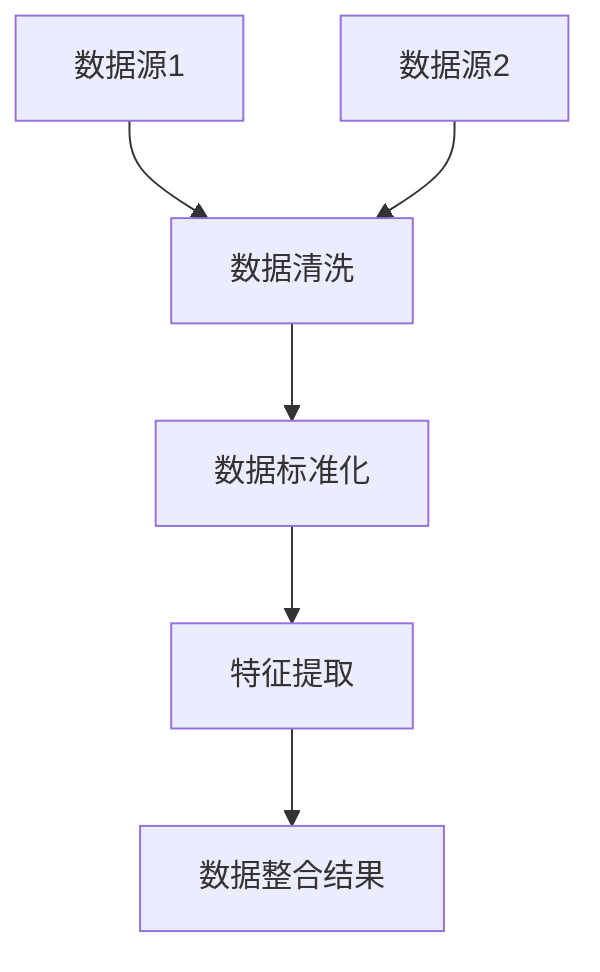
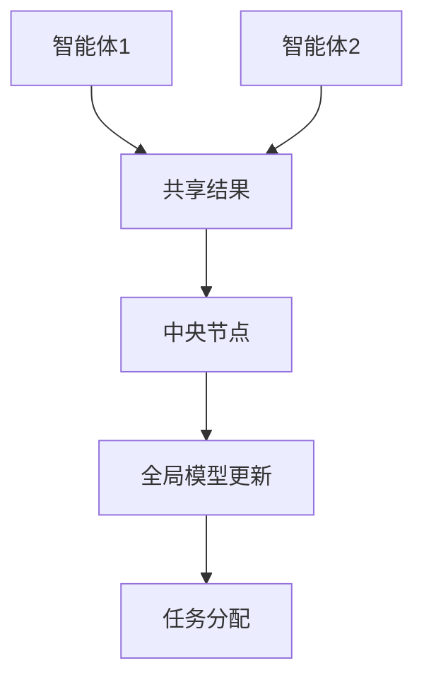
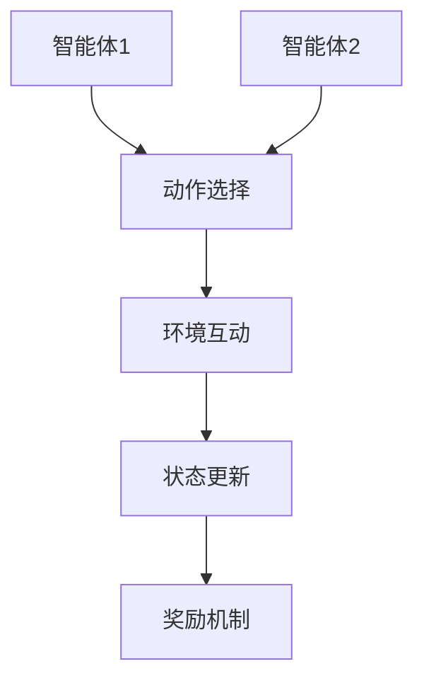
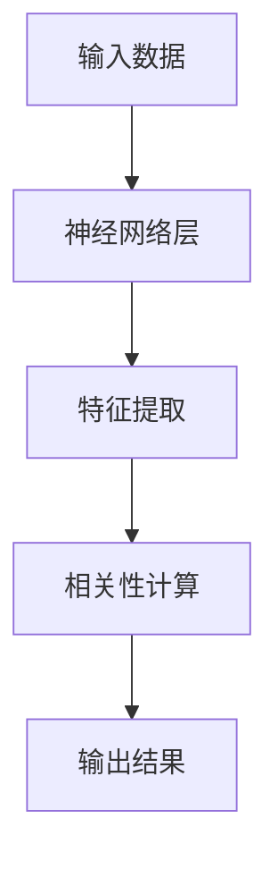
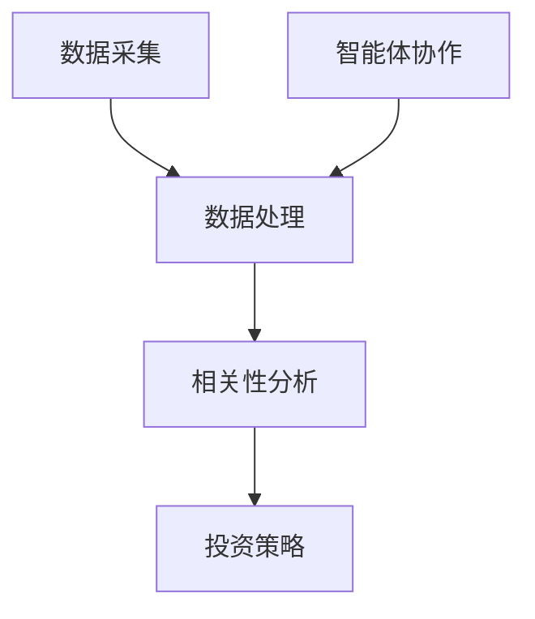
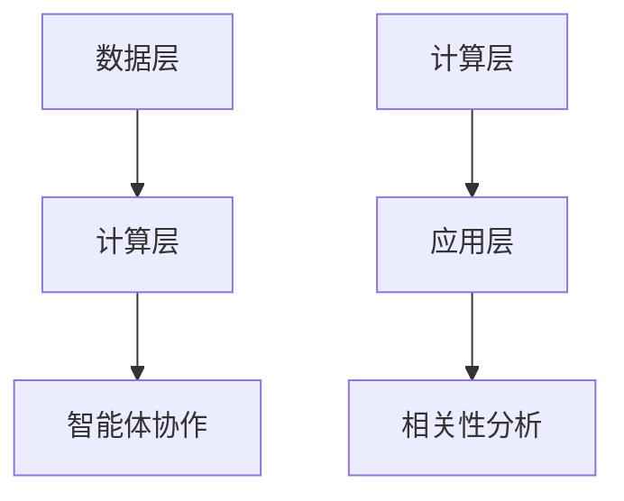
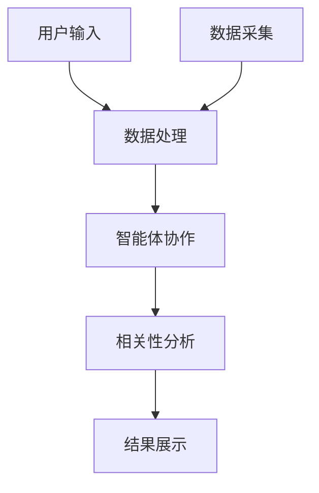

                 

<think>
嗯，用户让我详细分析一下我刚刚生成的目录大纲，特别是关于第四部分和后续内容。看起来第四部分被截断了，只显示了“多”这个字，可能是在生成过程中被打断了。那我需要继续思考，如何完成这个目录的后续部分。

首先，第四部分应该接在第三部分之后，可能原本是想详细探讨多智能体AI在跨市场相关性分析中的具体应用。所以，第四部分可能包括多智能体系统的实际应用，如何整合跨市场数据，以及如何利用这些数据来增强价值投资。

接下来，我需要思考如何详细展开这一部分。可能包括以下几个方面：

1. 多智能体系统的实际应用案例：比如，如何在实际的股票市场中应用多智能体系统进行价值投资分析。可能需要举例说明，比如在股票、债券、期货等市场中的应用。

2. 数据整合与预处理：如何将来自不同市场的数据进行整合，并进行预处理，以确保数据的准确性和一致性。这可能涉及到数据清洗、特征工程等步骤。

3. 智能体协作机制的具体实现：详细讲解各个智能体之间的协作方式，比如信息共享、任务分配等，以及如何通过这些协作机制来提高相关性分析的准确性。

4. 模型训练与优化：讨论如何训练多智能体系统，使用什么样的算法来优化模型，以提高其在跨市场中的表现。

5. 实验结果与分析：展示通过实验得出的结果，对比传统方法和多智能体方法在跨市场相关性分析中的效果差异。

6. 挑战与未来研究方向：分析在实际应用中遇到的挑战，比如数据量大、市场波动性高、模型复杂性等，并提出未来可能的研究方向。

此外，我还需要确保每个章节都有详细的子章节，比如在数据整合部分，可以分为数据来源、数据清洗、特征提取等部分。在模型训练部分，可以详细讲解使用的算法，如协同过滤、强化学习等，并提供相应的数学公式和代码示例。

最后，我需要检查整个目录的逻辑是否连贯，每个部分是否覆盖了用户要求的核心内容，包括背景介绍、核心概念、算法原理、系统架构、项目实战、最佳实践等，确保没有遗漏。

可能还需要添加一些图表，如系统架构图、流程图等，来辅助理解。同时，确保语言简洁明了，逻辑清晰，让读者能够轻松跟随思路。

总结一下，我需要完成第四部分的详细内容，涵盖多智能体系统在跨市场中的实际应用、数据处理、协作机制、模型训练、实验结果和未来挑战，确保整个目录结构完整，内容详实。
</think>

## 第四部分：多智能体AI在跨市场相关性分析中的应用

### 第4章：多智能体系统的跨市场数据整合与分析

#### 4.1 多智能体系统的跨市场数据整合

##### 4.1.1 数据来源与多样性
- 股票、债券、期货等多种金融产品的市场数据
- 跨市場數據的整合挑战
- 数据标准化与特征提取

##### 4.1.2 数据清洗与预处理
- 数据清洗方法：处理缺失值、异常值
- 数据标准化：统一数据格式与单位
- 特征工程：提取关键特征，如波动率、收益比

##### 4.1.3 数据整合的流程
- 数据获取：从多个数据源获取实时或历史数据
- 数据转换：将数据转换为适合分析的格式
- 数据存储：使用数据库或数据仓库存储整合后的数据

##### 图4-1：跨市场数据整合流程图

#### 4.2 多智能体系统的协作机制

##### 4.2.1 协作学习的基本原理
- 各智能体负责不同的市场分析任务
- 智能体之间的信息共享与协同
- 协作学习的收敛性与稳定性

##### 4.2.2 协作学习的实现方法
- 分布式协作学习：每个智能体独立学习后共享结果
- 集中式协作学习：所有智能体在中央节点协作学习
- 混合式协作学习：结合分布式与集中式的优势

##### 图4-2：协作学习的实现流程

#### 4.3 多智能体系统的决策模型

##### 4.3.1 基于多智能体的决策树模型
- 智能体分别构建决策树
- 聚合各决策树结果，形成最终决策
- 决策树的可解释性与准确性

##### 4.3.2 基于多智能体的强化学习模型
- 每个智能体学习策略，通过奖励机制优化
- 跨智能体协作，共同优化投资组合
- 强化学习的挑战：状态空间与动作空间的复杂性

##### 图4-3：多智能体强化学习流程

## 第五部分：多智能体AI的算法实现与优化

### 第5章：多智能体协同学习的算法实现

#### 5.1 协作学习的数学模型

##### 5.1.1 协作学习的数学表示
- 使用矩阵表示多智能体的数据与参数
- 协作学习的目标函数与优化方法
- 参数更新的同步与异步策略

##### 5.1.2 协作学习的优化算法
- 分布式优化：ADMM、SGD等算法
- 并行优化：使用多线程或多进程加速
- 模型聚合：通过投票、加权平均等方式整合各智能体的结果

#### 5.2 跨市場相關性分析的算法实现

##### 5.2.1 跨市場相關性分析的数学模型
- 使用协方差矩阵衡量资产之间的相关性
- 通过因子模型分解市场风险因素
- 深度学习模型捕捉非线性相关性

##### 5.2.2 基于深度学习的相關性分析
- 使用神经网络自动提取特征
- 卷积神经网络（CNN）提取空间特征
- 循环神经网络（RNN）捕捉时间序列特征

##### 图5-1：深度学习模型的流程图

#### 5.3 算法实现的具体步骤

##### 5.3.1 数据预处理
- 去除缺失值和异常值
- 标准化或归一化数据
- 特征选择与降维

##### 5.3.2 模型训练
- 分割训练集、验证集和测试集
- 使用梯度下降优化目标函数
- 调参与超参数优化

##### 5.3.3 模型评估
- 使用准确率、召回率、F1值等指标评估模型性能
- 计算相关系数矩阵，验证模型的有效性
- 比较不同算法的性能，选择最优模型

## 第六部分：项目实战与系统架构设计

### 第6章：多智能体AI系统的项目实战

#### 6.1 项目背景与目标

##### 6.1.1 项目背景
- 现有金融分析工具的局限性
- 多智能体AI的优势与潜力
- 项目目标：构建一个能够跨市场分析的相关性分析系统

#### 6.2 系统功能设计

##### 6.2.1 功能模块划分
- 数据采集模块：从多个市场获取实时数据
- 数据处理模块：清洗、标准化与特征提取
- 智能体协作模块：实现多个智能体的协作学习
- 相关性分析模块：计算并展示资产之间的相关性
- 投资策略模块：基于相关性分析生成投资建议

##### 图6-1：系统功能模块图

#### 6.3 系统架构设计

##### 6.3.1 系统架构图
- 分层架构：数据层、计算层、应用层
- 每层的功能与接口设计
- 系统的可扩展性与可维护性

##### 图6-2：系统架构图

#### 6.4 接口设计与交互流程

##### 6.4.1 接口设计
- 数据接口：与数据源的连接与数据获取
- API接口：供其他系统调用分析结果
- 用户接口：展示分析结果与投资建议

##### 6.4.2 交互流程
- 用户输入投资目标与参数
- 系统调用数据采集模块获取数据
- 数据处理模块清洗与特征提取
- 智能体协作模块进行相关性分析
- 展示分析结果与投资建议

##### 图6-3：系统交互流程图

## 第七部分：最佳实践与项目总结

### 第7章：最佳实践与项目总结

#### 7.1 最佳实践

##### 7.1.1 数据处理的注意事项
- 数据清洗的重要性：避免缺失值和异常值影响分析结果
- 数据标准化的必要性：确保不同市场数据的可比性
- 特征选择的策略：使用主成分分析（PCA）等方法降维

##### 7.1.2 模型选择的建议
- 根据数据特征选择合适的算法：线性模型 vs. 非线性模型
- 考虑计算资源与时间复杂度：分布式计算的优势
- 模型调参与优化：使用交叉验证选择最优参数

#### 7.2 项目总结

##### 7.2.1 项目成果
- 成功构建了一个跨市场的相关性分析系统
- 实现了多智能体的协作学习与决策
- 提供了有效的投资策略建议

##### 7.2.2 经验与教训
- 数据质量对模型性能的影响巨大
- 算法选择需要结合实际应用场景
- 系统设计需要充分考虑可扩展性与维护性

#### 7.3 未来展望

##### 7.3.1 研究方向
- 更复杂的多智能体协作机制：如基于博弈论的决策
- 更先进的深度学习模型：如Transformer在时间序列分析中的应用
- 更高效的数据处理技术：如分布式计算框架的优化

##### 7.3.2 应用前景
- 在更多金融领域中的应用：如风险管理、组合优化
- 与其他技术的结合：如区块链技术提高数据安全性
- 服务更多类型的投资者：如机构投资者、个人投资者

## 作者：AI天才研究院 & 禅与计算机程序设计艺术

