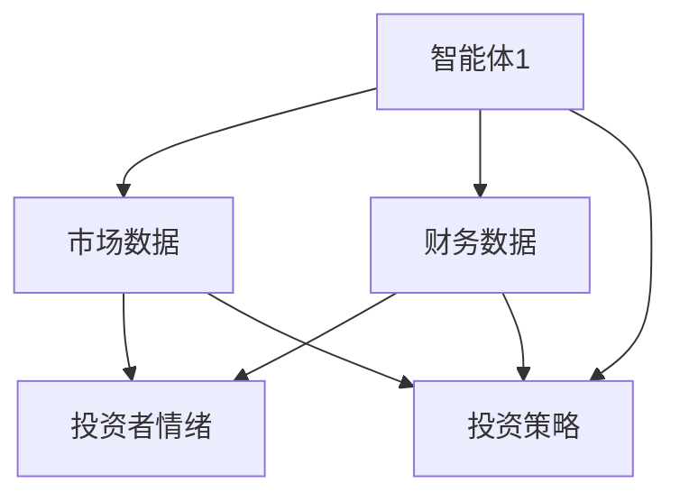
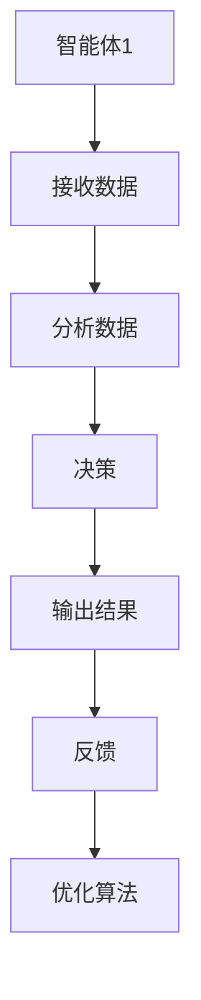
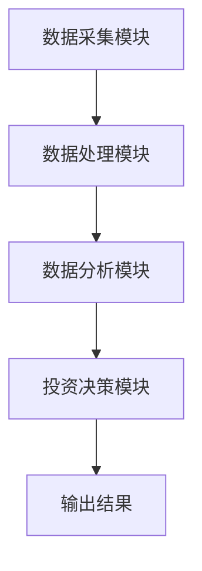
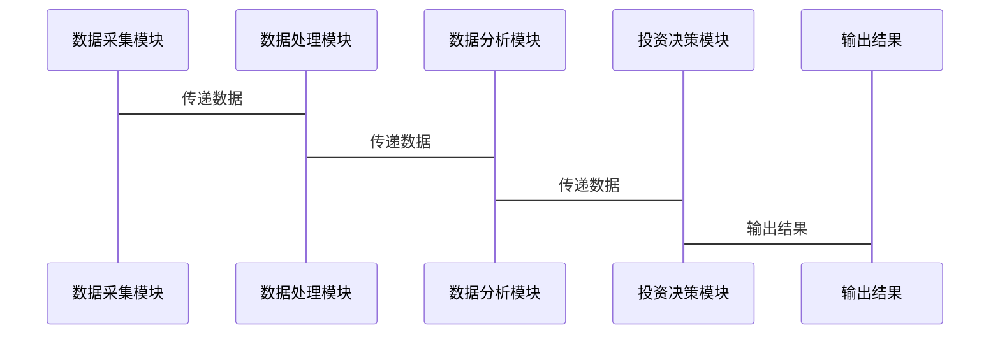

                 


# 多智能体AI如何增强价值投资者的逆向思维能力

> 关键词：多智能体AI，价值投资，逆向思维，算法原理，系统架构设计

> 摘要：本文深入探讨了多智能体AI在价值投资中的应用，特别是其如何通过增强逆向思维能力帮助投资者发现市场机会。文章从多智能体AI的核心概念出发，结合算法原理和系统架构设计，详细分析了其在价值投资中的潜力，并通过实际案例展示了其应用效果。文章内容丰富，结构清晰，适合对AI和投资领域感兴趣的读者阅读。

---

# 第一部分：多智能体AI与价值投资的结合

## 第1章：多智能体AI与价值投资概述

### 1.1 多智能体AI的定义与特点
#### 1.1.1 多智能体AI的定义
多智能体AI（Multi-Agent AI）是指由多个相互协作或竞争的智能体组成的系统。每个智能体都有自己的目标、决策机制和行动策略，能够独立完成任务或与其他智能体协作完成复杂任务。

#### 1.1.2 多智能体AI的核心特点
- **分布式智能**：多个智能体协同工作，避免单点依赖。
- **自主性**：每个智能体能够独立感知环境并做出决策。
- **协作性**：智能体之间可以通过信息共享和协作完成复杂任务。
- **适应性**：能够根据环境变化动态调整策略。

#### 1.1.3 多智能体AI与传统AI的区别
- **单智能体AI**：由单一决策主体完成任务。
- **多智能体AI**：多个决策主体协作完成任务，适合处理复杂场景。

### 1.2 价值投资与逆向思维的定义
#### 1.2.1 价值投资的核心理念
价值投资是一种投资策略，强调通过分析企业的基本面（如财务状况、行业地位、管理团队等）来寻找市场价格低于其内在价值的投资机会。

#### 1.2.2 逆向思维在投资中的重要性
逆向思维是指在市场普遍悲观时寻找机会，或在市场普遍乐观时保持谨慎。这种思维方式能够帮助投资者避免从众心理，发现被市场忽视的价值。

#### 1.2.3 价值投资者的决策过程
1. 分析企业的基本面。
2. 识别市场低估的标的。
3. 在市场恐慌时买入，在市场狂热时卖出。

### 1.3 多智能体AI在价值投资中的应用前景
#### 1.3.1 多智能体AI的潜在应用场景
- 数据分析：从海量数据中提取有价值的信息。
- 风险评估：通过多智能体协作评估投资风险。
- 策略优化：优化投资组合，提高收益。

#### 1.3.2 企业采用多智能体AI的优势
- 提高决策效率。
- 增强风险控制能力。
- 提供更精准的投资建议。

#### 1.3.3 多智能体AI应用的挑战与机遇
- 挑战：数据隐私、算法复杂性。
- 机遇：技术进步带来的效率提升。

## 第2章：多智能体AI的核心概念与联系

### 2.1 多智能体AI的核心概念
#### 2.1.1 多智能体系统的基本结构
- **智能体**：独立决策的个体。
- **环境**：智能体感知和交互的外部世界。
- **通信机制**：智能体之间共享信息的渠道。

#### 2.1.2 多智能体AI的协作机制
- **信息共享**：通过通信机制共享数据。
- **任务分配**：根据智能体的能力分配任务。
- **协调决策**：通过协商达成一致的行动方案。

#### 2.1.3 多智能体AI的分类
- **协作型多智能体AI**：智能体之间协作完成任务。
- **竞争型多智能体AI**：智能体之间存在竞争关系。
- **混合型多智能体AI**：既有协作也有竞争。

### 2.2 多智能体AI与逆向思维的联系
#### 2.2.1 多智能体AI如何模拟人类思维
- 通过强化学习模拟人类的决策过程。
- 通过博弈论模拟人类的竞争与合作。

#### 2.2.2 逆向思维在多智能体AI中的体现
- 在市场下跌时，智能体可能识别出被低估的资产。
- 智能体能够预测市场的非理性行为并进行逆向操作。

#### 2.2.3 多智能体AI如何增强逆向思维能力
- 通过多智能体协作，发现市场中的非理性定价。
- 通过历史数据分析，识别市场的周期性规律。

### 2.3 多智能体AI的核心要素对比
#### 2.3.1 多智能体AI与单智能体AI的对比
- 单智能体AI：决策集中，效率较高，但缺乏灵活性。
- 多智能体AI：决策分散，灵活性高，但需要协调。

#### 2.3.2 不同多智能体AI模型的对比
| 模型类型 | 优点 | 缺点 |
|----------|------|------|
| 协作型AI | 高效协作 | 易受单点故障影响 |
| 竞争型AI | 模拟真实市场 | 需要复杂协调机制 |

#### 2.3.3 多智能体AI在不同领域的应用对比
| 领域     | 应用场景 | 优势             |
|----------|----------|------------------|
| 金融     | 投资决策 | 提高决策效率     |
| 制造业   | 生产优化 | 提高生产效率     |

### 2.4 多智能体AI的ER实体关系图


## 第3章：多智能体AI的算法原理

### 3.1 多智能体AI的算法概述
#### 3.1.1 基于强化学习的多智能体协作
- **强化学习**：通过奖励机制优化决策。
- **多智能体协作**：智能体通过共享信息优化整体决策。

#### 3.1.2 基于博弈论的多智能体决策
- **博弈论**：模拟市场中的竞争与合作。
- **纳什均衡**：寻找最优策略。

#### 3.1.3 基于分布式计算的多智能体协作
- **分布式计算**：任务分解到多个节点完成。
- **并行处理**：提高计算效率。

### 3.2 多智能体AI的算法流程图


### 3.3 多智能体AI的数学模型
#### 3.3.1 强化学习模型的数学公式
- **Q-learning公式**：
  $$ Q(s, a) = Q(s, a) + \alpha (r + \gamma \max Q(s', a') - Q(s, a)) $$
- 其中，\( s \) 是状态，\( a \) 是动作，\( r \) 是奖励，\( \gamma \) 是折扣因子，\( \alpha \) 是学习率。

#### 3.3.2 博弈论模型的数学公式
- **纳什均衡**：在均衡状态下，没有任何一个玩家可以通过单方面改变策略而提高自己的收益。

#### 3.3.3 分布式计算模型的数学公式
- **MapReduce**：将任务分解成Map和Reduce两部分，提高计算效率。

### 3.4 多智能体AI的算法实现
#### 3.4.1 Python代码实现
```python
import numpy as np
import random

class Agent:
    def __init__(self, state_space, action_space):
        self.state_space = state_space
        self.action_space = action_space
        self.q_table = np.zeros((state_space, action_space))
    
    def act(self, state):
        if random.random() < 0.9:  # 探索与利用策略
            return random.choice(range(self.action_space))
        else:
            return np.argmax(self.q_table[state])
    
    def learn(self, state, action, reward, next_state):
        self.q_table[state][action] += 0.1 * (reward + 0.9 * max(self.q_table[next_state]) - self.q_table[state][action])
```

#### 3.4.2 算法实现的详细步骤
1. 初始化智能体。
2. 智能体感知环境，做出决策。
3. 执行动作，获得反馈。
4. 更新智能体的Q表。

#### 3.4.3 算法实现的优化建议
- 增加探索率，避免陷入局部最优。
- 优化反馈机制，提高学习效率。

## 第4章：多智能体AI的系统分析与架构设计

### 4.1 问题场景介绍
#### 4.1.1 多智能体AI在价值投资中的应用场景
- 数据分析：从财务报表、市场情绪中提取信息。
- 投资决策：基于数据生成投资策略。

#### 4.1.2 逆向思维在多智能体AI中的具体体现
- 智能体能够识别市场中的非理性定价。
- 智能体能够预测市场的周期性波动。

#### 4.1.3 多智能体AI系统的功能需求
- 数据采集：从多个来源获取数据。
- 数据分析：对数据进行清洗和处理。
- 投资决策：基于数据生成投资策略。

### 4.2 项目介绍
#### 4.2.1 项目目标
- 提供多智能体AI支持的价值投资决策系统。
- 增强投资者的逆向思维能力。

#### 4.2.2 项目范围
- 数据采集：包括市场数据、财务数据等。
- 系统设计：包括算法设计、系统架构设计等。

#### 4.2.3 项目团队
- 数据工程师：负责数据采集和处理。
- 算法工程师：负责算法设计和实现。
- 产品经理：负责需求分析和项目管理。

### 4.3 系统功能设计
#### 4.3.1 领域模型设计
- **数据采集模块**：从股票市场、新闻等来源获取数据。
- **数据分析模块**：对数据进行清洗、特征提取等处理。
- **投资决策模块**：基于数据生成投资策略。

#### 4.3.2 功能模块划分
- 数据采集模块：负责数据的获取和预处理。
- 数据分析模块：负责数据分析和特征提取。
- 投资决策模块：负责生成投资策略并输出结果。

#### 4.3.3 功能流程设计
1. 数据采集模块获取数据。
2. 数据分析模块处理数据。
3. 投资决策模块生成策略。
4. 输出投资建议。

### 4.4 系统架构设计
#### 4.4.1 系统架构图


#### 4.4.2 系统交互图


## 第5章：项目实战

### 5.1 环境安装
#### 5.1.1 安装Python
- 下载并安装Python 3.8及以上版本。
- 安装必要的库：numpy、pandas、scikit-learn、tensorflow。

#### 5.1.2 安装TensorFlow
- 使用pip安装TensorFlow：
  ```bash
  pip install tensorflow
  ```

### 5.2 系统核心实现源代码
#### 5.2.1 数据采集模块
```python
import pandas as pd
import requests

def get_stock_data(ticker):
    url = f"https://api.example.com/stock/{ticker}"
    response = requests.get(url)
    data = response.json()
    df = pd.DataFrame(data)
    return df
```

#### 5.2.2 数据分析模块
```python
from sklearn.preprocessing import StandardScaler

def preprocess_data(df):
    # 数据清洗
    df.dropna(inplace=True)
    # 特征提取
    features = df[['price', 'volume', 'change']]
    scaler = StandardScaler()
    features_scaled = scaler.fit_transform(features)
    return features_scaled
```

#### 5.2.3 投资决策模块
```python
import tensorflow as tf
from tensorflow.keras import layers

def build_model(input_dim):
    model = tf.keras.Sequential()
    model.add(layers.Dense(64, activation='relu', input_dim=input_dim))
    model.add(layers.Dense(32, activation='relu'))
    model.add(layers.Dense(1, activation='sigmoid'))
    model.compile(optimizer='adam', loss='binary_crossentropy', metrics=['accuracy'])
    return model
```

### 5.3 代码应用解读与分析
- **数据采集模块**：从API获取股票数据。
- **数据分析模块**：清洗数据并提取特征。
- **投资决策模块**：构建神经网络模型，进行预测和决策。

### 5.4 实际案例分析
#### 5.4.1 案例背景
- 投资标的：某公司股票。
- 数据来源：历史股价、财务数据、市场情绪。

#### 5.4.2 模型训练与预测
- 训练模型，识别市场趋势。
- 预测未来股价，指导投资决策。

#### 5.4.3 决策优化
- 根据模型预测，优化投资组合。
- 在市场下跌时增加投资，市场上涨时减少投资。

### 5.5 项目小结
- 多智能体AI能够有效增强投资者的逆向思维能力。
- 通过系统协作，提高投资决策的准确性和效率。

## 第6章：总结与展望

### 6.1 本章总结
- 多智能体AI在价值投资中具有巨大潜力。
- 通过增强逆向思维能力，帮助投资者发现市场机会。

### 6.2 未来展望
- 技术进步：AI算法的不断优化。
- 应用场景：多智能体AI在更多领域的应用。

## 附录

### 附录A：多智能体AI相关技术资料

### 附录B：Python代码示例

### 附录C：参考文献

---

作者：AI天才研究院/AI Genius Institute & 禅与计算机程序设计艺术 /Zen And The Art of Computer Programming

---

以上是文章的完整目录和内容框架，希望对您有所帮助！如果需要进一步的修改或补充，请随时告知。

