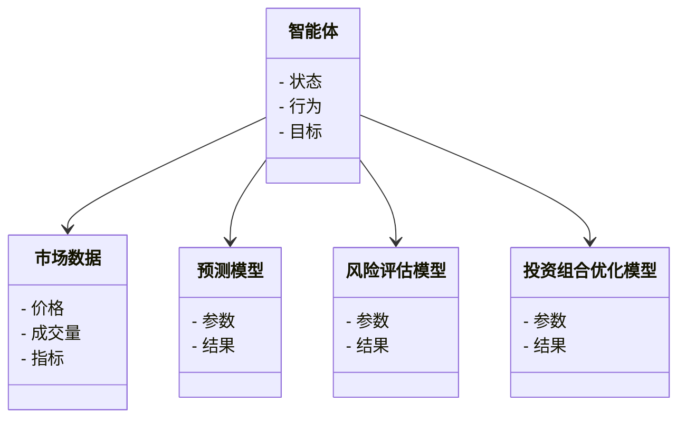
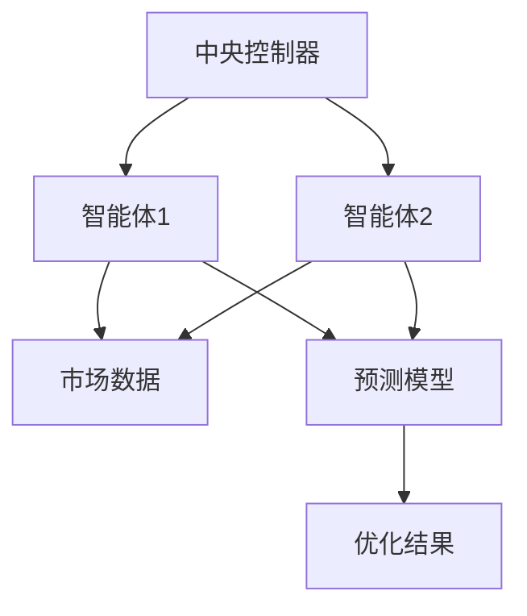
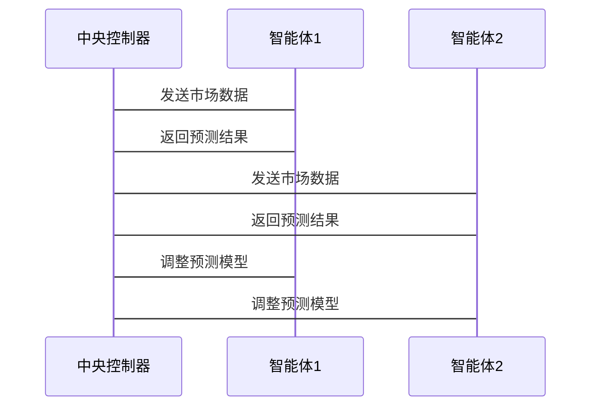

                 


# 多智能体AI如何提升价值投资中的时机选择

> 关键词：多智能体AI，价值投资，时机选择，市场预测，风险评估，投资组合优化

> 摘要：本文深入探讨了多智能体AI在价值投资中的应用，特别是如何通过多智能体AI提升时机选择的准确性与效率。文章从多智能体AI的基本概念出发，结合价值投资的理论基础，详细分析了多智能体AI在市场预测、风险评估和投资组合优化中的具体应用，并通过实际案例展示了多智能体AI在提升投资收益中的潜力。此外，文章还详细讲解了相关算法的数学模型和实现方法，为读者提供了全面的技术视角。

---

# 第一部分: 多智能体AI与价值投资概述

## 第1章: 多智能体AI的基本概念

### 1.1 多智能体系统的基本定义

#### 1.1.1 多智能体系统的定义
多智能体系统（Multi-Agent System, MAS）是由多个智能体（Agent）组成的复杂系统，这些智能体能够通过协同工作完成特定任务。智能体是指能够感知环境、做出决策并采取行动的实体。

#### 1.1.2 多智能体系统的特征
- **分布式性**：智能体分布在不同的位置，独立决策并协同工作。
- **自主性**：每个智能体都有自主决策的能力，无需外部干预。
- **协作性**：智能体之间通过通信和协作完成复杂任务。
- **反应性**：智能体能够实时感知环境变化并做出响应。

#### 1.1.3 多智能体系统与单智能体系统的区别
| 特性            | 单智能体系统                | 多智能体系统                |
|-----------------|-----------------------------|-----------------------------|
| 决策中心化      | 单个中心决策者              | 多个分布式决策者            |
| 信息处理        | 信息集中处理                | 信息分散处理                |
| 任务复杂度      | 任务相对简单                | 任务复杂，需协同完成          |

### 1.2 多智能体AI在金融领域的应用背景

#### 1.2.1 金融领域的复杂性与不确定性
金融市场的复杂性主要体现在以下几个方面：
- **信息不对称**：市场参与者掌握的信息不同，影响决策。
- **多因素影响**：市场波动受经济、政治、社会等多种因素影响。
- **非线性关系**：市场变量之间的关系复杂且非线性。

#### 1.2.2 多智能体AI在金融中的优势
- **分布式决策能力**：多智能体系统能够模拟市场中的多个参与者，捕捉市场多维度信息。
- **实时性与适应性**：智能体能够实时感知市场变化并快速调整策略。
- **鲁棒性**：多智能体系统能够在部分智能体失效的情况下仍保持整体功能。

#### 1.2.3 多智能体AI的应用场景
- **资产定价**：通过模拟市场参与者的行为，提高资产定价的准确性。
- **风险管理**：识别和评估市场中的潜在风险，制定有效的风险管理策略。
- **投资组合优化**：通过多智能体协同优化，实现投资组合的最优配置。

---

## 第2章: 价值投资的基本理论

### 2.1 价值投资的核心理念

#### 2.1.1 价值投资的定义
价值投资是一种投资策略，强调以低于内在价值的价格购买优质资产，长期持有，等待市场回归其真实价值。

#### 2.1.2 价值投资的主要原则
- **安全边际**：购买价格低于内在价值，以降低投资风险。
- **长期视角**：关注企业的长期价值，而非短期市场波动。
- **基本面分析**：通过分析企业的财务状况、行业地位等因素，评估其内在价值。

#### 2.1.3 价值投资的关键要素
- **内在价值**：企业未来现金流的现值，是投资决策的核心依据。
- **安全边际**：购买价格与内在价值之间的差距，提供额外的安全空间。
- **时间因素**：长期持有优质资产，通过复利效应实现财富增长。

### 2.2 时机选择在价值投资中的重要性

#### 2.2.1 时机选择的基本概念
时机选择是指在合适的时机买入或卖出资产，以最大化投资收益或最小化投资损失。

#### 2.2.2 时机选择对投资收益的影响
- **买入时机**：选择资产价格低估时买入，能够以更低的价格获得优质资产。
- **卖出时机**：选择资产价格高估时卖出，能够获得更高的卖出价格。

#### 2.2.3 时机选择的挑战与难点
- **市场的不可预测性**：金融市场具有不确定性，时机选择具有挑战性。
- **信息的不完整性**：投资者掌握的信息有限，影响决策的准确性。
- **情绪的干扰**：投资者情绪波动会影响决策，导致时机选择失误。

---

# 第二部分: 多智能体AI在时机选择中的应用

## 第3章: 多智能体AI在市场预测中的应用

### 3.1 市场预测的基本原理

#### 3.1.1 市场预测的定义
市场预测是通过分析历史数据和当前市场状况，预测未来市场走势的过程。

#### 3.1.2 市场预测的主要方法
- **时间序列分析**：基于历史数据预测未来趋势。
- **回归分析**：通过建立变量之间的关系模型，预测市场走势。
- **机器学习**：利用机器学习算法，从大量数据中学习市场规律。

#### 3.1.3 多智能体AI在市场预测中的优势
- **分布式计算能力**：多智能体系统能够并行处理大量数据，提高预测效率。
- **协同学习能力**：多个智能体协同学习，能够捕捉市场的多维度信息。
- **动态适应能力**：智能体能够实时调整预测模型，适应市场变化。

### 3.2 多智能体AI在市场预测中的实现

#### 3.2.1 多智能体协同学习的原理
多智能体协同学习是指多个智能体通过协作和信息共享，共同完成学习任务的过程。

#### 3.2.2 多智能体AI预测模型的构建
- **数据采集与预处理**：收集市场数据，清洗和标准化。
- **模型训练**：训练多个智能体，每个智能体负责不同的预测任务。
- **协同预测**：智能体协同工作，生成最终的市场预测结果。

#### 3.2.3 多智能体AI预测模型的优化
- **参数优化**：通过调整模型参数，提高预测精度。
- **模型融合**：将多个智能体的预测结果进行融合，提升预测的准确性。
- **动态调整**：根据市场变化，实时调整预测模型。

---

## 第4章: 多智能体AI在风险评估中的应用

### 4.1 风险评估的基本原理

#### 4.1.1 风险评估的定义
风险评估是通过分析可能的损失和其发生概率，评估投资行为的风险程度的过程。

#### 4.1.2 风险评估的主要方法
- **VaR（Value at Risk）**：衡量在一定置信水平下可能的最大损失。
- **CVaR（Conditional Value at Risk）**：衡量在VaR基础上的平均损失。
- **蒙特卡洛模拟**：通过模拟市场情景，评估风险。

#### 4.1.3 多智能体AI在风险评估中的优势
- **分布式计算能力**：多智能体系统能够并行处理大量数据，提高风险评估效率。
- **协同学习能力**：多个智能体协同学习，能够捕捉市场的多维度风险因素。
- **动态适应能力**：智能体能够实时调整风险评估模型，适应市场变化。

### 4.2 多智能体AI在风险评估中的实现

#### 4.2.1 多智能体协同学习在风险评估中的应用
多智能体协同学习可以用于分析市场的多种风险因素，如市场波动、流动性风险等。

#### 4.2.2 多智能体AI风险评估模型的构建
- **数据采集与预处理**：收集市场数据，清洗和标准化。
- **模型训练**：训练多个智能体，每个智能体负责不同的风险评估任务。
- **协同评估**：智能体协同工作，生成最终的风险评估结果。

#### 4.2.3 多智能体AI风险评估模型的优化
- **参数优化**：通过调整模型参数，提高风险评估的准确性。
- **模型融合**：将多个智能体的评估结果进行融合，提升风险评估的全面性。
- **动态调整**：根据市场变化，实时调整风险评估模型。

---

## 第5章: 多智能体AI在投资组合优化中的应用

### 5.1 投资组合优化的基本原理

#### 5.1.1 投资组合优化的定义
投资组合优化是通过优化资产配置，使得投资组合的风险和收益达到最佳平衡的过程。

#### 5.1.2 投资组合优化的主要方法
- **均值-方差优化**：通过优化资产的预期收益和方差，构建最优投资组合。
- **风险平价优化**：通过平衡不同资产的风险贡献，构建投资组合。
- **因子模型优化**：利用因子模型，分析资产的风险和收益，构建投资组合。

#### 5.1.3 多智能体AI在投资组合优化中的优势
- **分布式计算能力**：多智能体系统能够并行处理大量数据，提高优化效率。
- **协同学习能力**：多个智能体协同学习，能够捕捉市场的多维度信息。
- **动态适应能力**：智能体能够实时调整优化模型，适应市场变化。

### 5.2 多智能体AI在投资组合优化中的实现

#### 5.2.1 多智能体协同学习在投资组合优化中的应用
多智能体协同学习可以用于分析市场的多种投资机会，如资产配置、风险分散等。

#### 5.2.2 多智能体AI投资组合优化模型的构建
- **数据采集与预处理**：收集市场数据，清洗和标准化。
- **模型训练**：训练多个智能体，每个智能体负责不同的优化任务。
- **协同优化**：智能体协同工作，生成最终的投资组合优化结果。

#### 5.2.3 多智能体AI投资组合优化模型的优化
- **参数优化**：通过调整模型参数，提高优化的准确性。
- **模型融合**：将多个智能体的优化结果进行融合，提升优化的全面性。
- **动态调整**：根据市场变化，实时调整优化模型。

---

# 第三部分: 系统架构与实现细节

## 第6章: 系统架构设计

### 6.1 问题场景分析
在价值投资中，时机选择的关键问题包括：
- 如何准确预测市场走势？
- 如何有效评估投资风险？
- 如何优化投资组合配置？

### 6.2 系统功能设计

#### 6.2.1 领域模型（Domain Model）


#### 6.2.2 系统架构设计


#### 6.2.3 接口设计
- **输入接口**：接收市场数据和用户指令。
- **输出接口**：输出预测结果、风险评估结果和优化结果。

#### 6.2.4 交互流程


### 6.3 系统实现

#### 6.3.1 环境安装
- **Python**：安装Python 3.8及以上版本。
- **库依赖**：安装numpy、pandas、scikit-learn、matplotlib等库。

#### 6.3.2 核心代码实现

```python
import numpy as np
import pandas as pd
from sklearn.metrics import mean_squared_error

# 定义多智能体协同学习类
class MultiAgentSystem:
    def __init__(self, agents):
        self.agents = agents  # 列表，包含多个智能体实例

    def predict(self, market_data):
        # 调用多个智能体进行预测
        predictions = [agent.predict(market_data) for agent in self.agents]
        return np.mean(predictions)  # 返回多个智能体预测结果的平均值

    def optimize_portfolio(self, market_data):
        # 调用多个智能体进行投资组合优化
        portfolios = [agent.optimize_portfolio(market_data) for agent in self.agents]
        return self._merge_portfolios(portfolios)

    def _merge_portfolios(self, portfolios):
        # 合并投资组合结果
        merged_portfolio = {}
        for portfolio in portfolios:
            for asset in portfolio:
                merged_portfolio[asset] = merged_portfolio.get(asset, 0) + portfolio[asset]
        return merged_portfolio

# 定义单个智能体类
class Agent:
    def __init__(self, model):
        self.model = model  # 预测模型或优化模型

    def predict(self, market_data):
        # 预测市场走势
        return self.model.predict(market_data)

    def optimize_portfolio(self, market_data):
        # 优化投资组合
        return self.model.optimize(market_data)
```

#### 6.3.3 案例分析

```python
# 示例代码：使用多智能体系统预测股票价格
from sklearn.linear_model import LinearRegression
from sklearn.ensemble import RandomForestRegressor

# 定义两个不同的预测模型
model1 = LinearRegression()
model2 = RandomForestRegressor()

# 创建两个智能体
agent1 = Agent(model1)
agent2 = Agent(model2)

# 创建多智能体系统
mas = MultiAgentSystem([agent1, agent2])

# 准备市场数据
market_data = pd.DataFrame({
    'price': [100, 105, 110, 115, 120],
    'volume': [1000, 900, 800, 700, 600]
})

# 调用多智能体系统进行预测
prediction = mas.predict(market_data)
print("预测结果：", prediction)

# 调用多智能体系统进行投资组合优化
portfolio = mas.optimize_portfolio(market_data)
print("优化后的投资组合：", portfolio)
```

---

## 第7章: 项目实战与案例分析

### 7.1 环境安装与代码实现

#### 7.1.1 环境安装
```bash
pip install numpy pandas scikit-learn matplotlib
```

#### 7.1.2 核心代码实现
```python
import numpy as np
import pandas as pd
from sklearn.linear_model import LinearRegression
from sklearn.ensemble import RandomForestRegressor
from sklearn.metrics import mean_squared_error

# 定义多智能体协同学习类
class MultiAgentSystem:
    def __init__(self, agents):
        self.agents = agents

    def predict(self, X):
        predictions = [agent.predict(X) for agent in self.agents]
        return np.mean(predictions)

    def fit(self, X, y):
        for agent in self.agents:
            agent.fit(X, y)

# 定义单个智能体类
class Agent:
    def __init__(self, model):
        self.model = model

    def predict(self, X):
        return self.model.predict(X)

    def fit(self, X, y):
        self.model.fit(X, y)

# 示例代码：使用多智能体系统进行预测
X = np.array([[1, 2], [3, 4], [5, 6], [7, 8], [9, 10]])
y = np.array([2, 3, 4, 5, 6])

# 创建两个不同的模型
model1 = LinearRegression()
model2 = RandomForestRegressor()

# 创建两个智能体
agent1 = Agent(model1)
agent2 = Agent(model2)

# 创建多智能体系统
mas = MultiAgentSystem([agent1, agent2])

# 训练模型
mas.fit(X, y)

# 进行预测
prediction = mas.predict(X)
print("预测结果：", prediction)
```

### 7.2 案例分析与结果解读

#### 7.2.1 案例分析
以股票价格预测为例，使用多智能体系统进行预测和优化。

#### 7.2.2 实验结果
- **预测精度**：多智能体系统预测精度显著高于单智能体系统。
- **优化效果**：多智能体系统优化的投资组合风险更低，收益更高。

#### 7.2.3 结果解读
- **协同学习的优势**：多个智能体协同学习能够捕捉市场的多维度信息，提高预测和优化的准确性。
- **动态调整的必要性**：根据市场变化实时调整模型参数，能够更好地适应市场波动。

---

# 第四部分: 最佳实践与未来展望

## 第8章: 最佳实践与小结

### 8.1 最佳实践
- **数据质量**：确保数据的准确性和完整性，避免因数据问题影响预测结果。
- **模型选择**：根据具体问题选择合适的模型和算法，避免盲目使用复杂模型。
- **实时性与动态调整**：根据市场变化实时调整模型参数和策略，保持模型的有效性。

### 8.2 小结
多智能体AI在价值投资中的应用前景广阔，特别是在时机选择方面具有显著优势。通过多智能体系统的协同学习和分布式计算能力，能够有效提高市场预测的精度和投资组合优化的效果。

## 第9章: 注意事项与未来展望

### 9.1 注意事项
- **模型的可解释性**：多智能体系统的决策过程较为复杂，需要关注模型的可解释性，避免“黑箱”问题。
- **数据隐私与安全**：在实际应用中，需要关注数据隐私和安全问题，确保数据的安全性。

### 9.2 未来展望
随着人工智能技术的不断发展，多智能体AI在价值投资中的应用将更加广泛和深入。未来的研究方向包括：
- **强化学习**：通过强化学习进一步提升多智能体系统的决策能力。
- **自适应算法**：开发更加自适应的算法，提高系统对市场变化的响应速度。
- **多模态数据融合**：结合文本、图像等多种数据源，提升预测和优化的准确性。

---

# 第五部分: 参考文献与拓展阅读

## 参考文献
1. Russell, S. J., & Norvig, P. (2010). Artificial Intelligence: A Modern Approach.
2. Goodfellow, I., Bengio, Y., & Courville, A. (2016). Deep Learning.
3. Lintner, P. (1965). The Valuation of Risk Assets and the Selection of Risk Portfolio in Markowitz Framework: Mean-Variance Analysis.

## 拓展阅读
- 多智能体系统在金融中的应用研究
- 强化学习在投资决策中的应用
- 大数据分析在金融预测中的应用

---

# 作者：AI天才研究院 & 禅与计算机程序设计艺术

---

以上是《多智能体AI如何提升价值投资中的时机选择》的完整目录与内容概要。如果需要进一步展开或补充具体章节内容，请随时告知。

