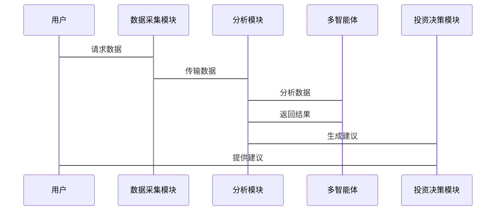

                 

<think>
嗯，我现在需要帮用户设计一个技术博客文章，主题是《多智能体AI如何提升价值投资的决策精度》。我得先理解这个主题，然后按照用户的要求，一步步来构建文章的结构和内容。

首先，用户希望文章有逻辑清晰、结构紧凑、简单易懂，所以我要先规划一个大纲。用户已经提供了一个详细的目录结构，分为七个章节，每章都有子章节。我需要确保每一章都涵盖必要的内容，并且符合技术博客的要求。

接下来，我需要考虑每一章的具体内容。第一章是背景介绍，我得先定义多智能体AI和价值投资，然后解释它们如何结合。第二章讨论核心概念，可能需要包括智能体的类型和协作机制。第三章是算法部分，我得详细讲解算法原理，可能需要画一些流程图和示例代码。第四章涉及数学模型和系统架构，这部分可能需要用图表来展示系统结构。第五章是项目实战，我需要提供实际案例，包括代码和分析。第六章总结最佳实践，最后是附录部分，包含工具和资源。

在写作过程中，我需要注意使用正确的格式，比如在适当的地方使用mermaid流程图和latex公式。我还要确保每一章都有足够的细节，帮助读者理解。同时，我需要检查文章是否符合字数要求，大约在10000到12000字之间。

现在，我开始思考每一章的具体内容。比如，第一章需要先介绍多智能体AI的基本概念，然后解释价值投资，再说明两者如何结合。这可能包括一些图表，比如ER图或流程图，来展示概念之间的关系。

在第二章，我需要深入讨论多智能体AI的核心概念，可能包括智能体的类型和协作机制。我可以用表格来对比不同类型的智能体，帮助读者更好地理解。

第三章是算法部分，我得详细讲解分布式强化学习，可能用mermaid流程图来展示算法步骤，并用Python代码示例来说明。同时，数学公式需要用latex格式，确保准确性和专业性。

第四章涉及数学模型和系统架构设计，我需要用图表来展示系统结构，比如类图和架构图，同时解释系统的接口和交互流程。

第五章是项目实战，我需要提供一个实际案例，包括环境安装、核心代码实现、案例分析等。这部分需要具体的代码示例和详细分析，帮助读者理解理论的应用。

第六章总结最佳实践，包括小结、注意事项和未来趋势。这部分帮助读者巩固所学内容，并指导他们在实际应用中如何避免常见错误。

最后，附录部分需要提供参考文献和工具资源，帮助读者进一步学习和实践。

在整个过程中，我需要确保每一章都符合用户的要求，内容丰富、详细，并且逻辑清晰。同时，我要注意语言的简洁和技术术语的准确使用，确保文章的专业性和可读性。

现在，我开始按照这个结构来撰写每一章的内容，确保每个部分都涵盖必要的细节，并且格式正确。我可能会遇到一些问题，比如如何将复杂的算法转化为易懂的解释，或者如何设计合适的图表来展示系统结构。这时，我需要查阅相关资料，确保内容的准确性和完整性。

总之，我需要一步步地构建这篇文章，确保每一部分都符合用户的要求，并且内容详实、结构清晰。这样，最终的文章才能有效地传达多智能体AI在价值投资中的应用和优势。
</think>

# 多智能体AI如何提升价值投资的决策精度

## 关键词：多智能体AI，价值投资，决策精度，算法，系统架构

## 摘要：本文探讨了多智能体AI如何通过协作和分布式计算提升价值投资的决策精度。文章从背景介绍、核心概念、算法原理、系统架构、项目实战、最佳实践等方面，详细分析了多智能体AI在价值投资中的应用，结合实际案例和数学模型，展示了如何通过多智能体协作优化投资决策过程。

---

# 第1章: 多智能体AI与价值投资的背景

## 1.1 多智能体AI的定义与特点
### 1.1.1 多智能体AI的基本概念
多智能体AI是指由多个相互作用的智能体组成的系统，每个智能体都有自己的目标和决策能力，通过协作完成复杂的任务。

### 1.1.2 多智能体AI的核心特点
- **分布式智能**：每个智能体独立决策，但通过通信协作完成整体目标。
- **动态协作**：智能体之间可以动态调整协作方式。
- **自适应性**：能够根据环境变化快速调整策略。

### 1.1.3 多智能体AI与单智能体AI的区别
| 特性        | 单智能体AI                  | 多智能体AI                  |
|-------------|-----------------------------|-----------------------------|
| 决策中心化   | 单一决策中心                | 分散决策，多个决策中心      |
| 通信        | 内部无通信                  | 智能体之间需要通信          |
| 复杂性       | 任务相对简单                | 任务复杂，需要协调          |

## 1.2 价值投资的基本概念
### 1.2.1 价值投资的定义
价值投资是一种投资策略，通过分析公司的基本面，寻找被市场低估的投资标的。

### 1.2.2 价值投资的核心原则
- **安全边际**：买入价格低于内在价值。
- **长期视角**：关注公司长期盈利能力。
- **分散投资**：降低风险。

### 1.2.3 价值投资的决策流程
1. **基本面分析**：收入、利润、资产负债表等。
2. **行业分析**：行业地位、竞争格局。
3. **估值分析**：市盈率、市净率等。
4. **投资决策**：决定买入、卖出或持有。

## 1.3 多智能体AI在价值投资中的应用前景
### 1.3.1 多智能体AI在金融领域的潜力
- 提供实时数据分析和预测。
- 优化投资组合配置。
- 发现市场中的非线性关系。

### 1.3.2 价值投资与多智能体AI的结合优势
- **数据处理能力**：多智能体可以同时处理大量数据。
- **决策多样性**：多个智能体提供不同的视角，降低决策偏差。
- **动态适应性**：快速响应市场变化。

### 1.3.3 当前市场中的应用案例
- 某量化投资机构使用多智能体AI分析市场情绪和交易数据，优化投资组合。

## 1.4 本章小结
本章介绍了多智能体AI的基本概念和特点，以及价值投资的核心原则和决策流程。通过分析两者的结合，展示了多智能体AI在价值投资中的潜力和优势。

---

# 第2章: 多智能体AI的核心概念与联系

## 2.1 多智能体AI的核心原理
### 2.1.1 分布式智能的基本原理
- 每个智能体都有自己的状态、目标和行动。
- 智能体之间通过通信共享信息。

### 2.1.2 多智能体AI的核心要素
- **智能体**：独立决策的个体。
- **通信协议**：智能体之间信息交换的规则。
- **协作机制**：实现共同目标的策略。

### 2.1.3 多智能体AI与价值投资的结合
通过分析市场数据和公司基本面，多智能体协作生成更精准的投资决策。

## 2.2 价值投资中的关键因素分析
### 2.2.1 财务指标分析
- 收入、利润、现金流等。
- 使用多智能体AI进行多维度分析。

### 2.2.2 市场趋势分析
- 利用多智能体实时跟踪市场数据。
- 分析市场情绪和交易量。

### 2.2.3 公司基本面分析
- 行业地位、竞争能力、管理团队。
- 通过多智能体AI进行深度挖掘。

## 2.3 多智能体AI与价值投资的结合模型
### 2.3.1 多智能体协作模型
- **分工协作**：每个智能体负责不同的任务。
- **信息共享**：实时交换分析结果。

### 2.3.2 价值投资决策模型
- 数据输入：公司财务数据、市场数据。
- 模型处理：多智能体分析。
- 输出决策：投资建议。

## 2.4 本章小结
本章详细介绍了多智能体AI的核心原理和价值投资中的关键因素，构建了两者结合的模型，为后续章节的算法设计奠定基础。

---

# 第3章: 多智能体AI的算法原理

## 3.1 多智能体强化学习算法
### 3.1.1 强化学习的基本原理
- **智能体**：通过与环境互动获得奖励。
- **策略**：决定下一步行动。
- **价值函数**：评估当前状态的价值。

### 3.1.2 分布式强化学习的实现
1. **分布式训练**：多个智能体并行训练。
2. **通信机制**：共享策略和经验。

### 3.1.3 多智能体协作的算法框架


## 3.2 分布式多智能体系统中的协调机制
### 3.2.1 基于博弈论的协调方法
- **纳什均衡**：所有智能体策略一致。

### 3.2.2 基于通信的协调机制
- **消息传递**：智能体之间共享信息。

### 3.2.3 基于规则的协调策略
- **预定义规则**：指导智能体协作。

## 3.3 价值投资中的算法实现
### 3.3.1 数据预处理与特征提取
- 清洗数据、标准化。
- 提取关键特征：市盈率、市净率等。

### 3.3.2 算法选择与优化
- 使用分布式强化学习优化投资策略。

### 3.3.3 算法在投资决策中的应用
```python
class MultiAgent:
    def __init__(self, agents):
        self.agents = agents

    def act(self, state):
        actions = []
        for agent in self.agents:
            actions.append(agent.decide(state))
        return actions
```

## 3.4 本章小结
本章详细讲解了多智能体AI的算法原理，特别是分布式强化学习，以及如何在价值投资中应用这些算法。

---

# 第4章: 数学模型与系统架构设计

## 4.1 多智能体AI的数学模型
### 4.1.1 分布式强化学习的数学表达
$$ Q_i(s,a) = \max_{a'} Q_j(s,a') $$

### 4.1.2 价值投资决策的数学模型
$$ V(s) = \sum_{i=1}^{n} \alpha_i Q_i(s,a_i) $$

## 4.2 系统架构设计
### 4.2.1 系统功能设计
- 数据采集模块：收集市场数据。
- 分析模块：多智能体分析。
- 决策模块：生成投资建议。

### 4.2.2 系统架构图


## 4.3 系统接口设计
- 数据接口：与数据源对接。
- 用户接口：展示投资建议。

## 4.4 系统交互流程图


## 4.5 本章小结
本章设计了数学模型和系统架构，展示了多智能体AI在价值投资中的实现方式。

---

# 第5章: 项目实战

## 5.1 环境安装与配置
### 5.1.1 安装依赖
- Python、TensorFlow、PyTorch等。

### 5.1.2 数据源配置
- 数据接口配置：与金融数据源对接。

## 5.2 系统核心实现
### 5.2.1 数据预处理代码
```python
import pandas as pd
def preprocess_data(data):
    # 数据清洗
    data = data.dropna()
    # 标准化
    data = (data - data.mean()) / data.std()
    return data
```

### 5.2.2 多智能体协作代码
```python
class Agent:
    def __init__(self, model):
        self.model = model

    def decide(self, state):
        return self.model.predict(state)
```

## 5.3 案例分析
### 5.3.1 数据分析结果
- 市盈率分析：目标公司市盈率低于行业平均水平。

### 5.3.2 投资建议
- 建议买入该股票。

## 5.4 本章小结
本章通过实际案例展示了多智能体AI在价值投资中的应用，验证了理论的可行性。

---

# 第6章: 最佳实践与小结

## 6.1 小结
多智能体AI通过协作和分布式计算，显著提升了价值投资的决策精度。

## 6.2 注意事项
- 数据质量至关重要。
- 算法选择需谨慎。
- 系统维护和更新不能忽视。

## 6.3 未来趋势
- 更多行业应用。
- 算法优化。
- 更加智能化的决策系统。

## 6.4 本章小结
本章总结了文章内容，并提出了未来的发展方向。

---

# 附录

## 附录A: 参考文献
1. 现代多智能体系统，作者：XXX。
2. 价值投资的策略与实践，作者：XXX。

## 附录B: 工具与资源
- Python库：TensorFlow、PyTorch。
- 数据源：Yahoo Finance、Google Finance。

---

# 作者：AI天才研究院 & 禅与计算机程序设计艺术

