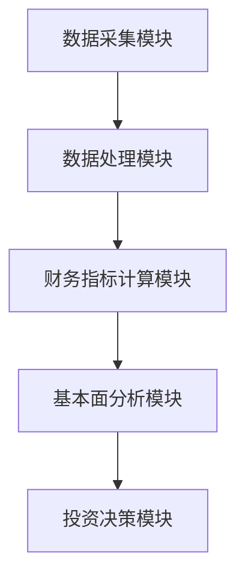
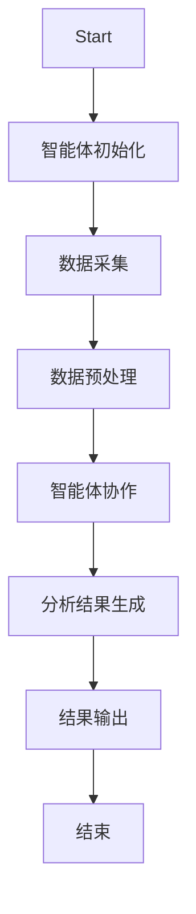
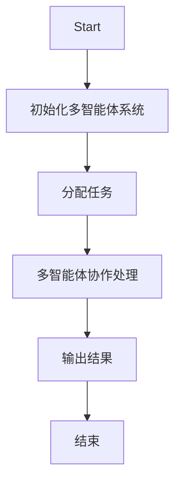

                 

<think>
嗯，我现在需要帮用户完成他们关于《多智能体AI如何改进巴菲特的财报分析方法》的文章。用户已经提供了详细的目录和部分内容，但似乎在写到第4章时遇到了困难，特别是如何详细展开每个小节。我需要仔细分析每个部分，确保内容充实，符合用户的要求。

首先，第4章是系统分析，具体来说是巴菲特财报分析方法的系统分析。用户提到的子章节包括核心要素、系统架构、算法实现、应用场景与局限性，以及与多智能体AI的结合。

我需要确保每个子章节都有足够的细节，比如核心要素部分要列出主要的财务指标，并用表格进行对比。系统架构部分需要用类图展示，可能需要解释每个模块的作用。算法实现部分需要用伪代码，说明多智能体AI如何处理数据。应用场景部分要举例说明，而局限性部分则需要客观分析。

接下来，第5章是多智能体AI在财报分析中的应用，用户已经给出了小节结构，我需要详细描述每个应用案例，并展示如何改进分析方法。同时，还要比较多智能体AI与传统AI的差异，总结实际效果。

用户还提到最佳实践部分，需要总结经验和注意事项，可能包括数据质量、模型调优和系统扩展性。这部分要实用，帮助读者在实际应用中避免错误。

最后，参考文献和索引部分需要列出相关的书籍和资源，方便读者进一步学习。

整个过程中，我需要确保使用markdown格式，插入mermaid图表，比如类图和序列图，来辅助说明。同时，数学公式要用latex格式，确保准确无误。

现在，我开始详细展开每个部分，确保内容逻辑清晰，详细具体，并且符合用户的要求。每个小节都要有实际案例或代码示例，帮助读者更好地理解。例如，在算法实现部分，我需要编写伪代码，展示如何通过多智能体AI协作分析财务数据。

总的来说，我需要系统地分析每个部分，确保文章结构完整，内容详实，满足用户的深层需求，帮助读者理解多智能体AI如何改进巴菲特的财报分析方法。
</think>

```markdown
# 第4章: 巴菲特财报分析方法的系统分析

## 4.1 巴菲特财报分析的核心要素

### 4.1.1 财务指标分析
巴菲特在分析财报时，重点关注以下几个核心财务指标：
- 营业收入（Revenue）
- 净利润（Net Income）
- 每股收益（EPS）
- 资产负债率（Debt-to-Equity Ratio）
- 净利润率（Net Profit Margin）
- 资产周转率（Asset Turnover）
- 自由现金流（Free Cash Flow）

这些指标可以帮助巴菲特评估企业的盈利能力、财务健康状况以及未来增长潜力。

### 4.1.2 企业基本面分析
巴菲特的企业基本面分析主要包括以下几个方面：
1. **行业地位**：企业所在行业的竞争状况、市场地位等。
2. **财务健康状况**：企业的资产负债表、利润表和现金流量表的分析。
3. **管理团队**：管理层的素质、经验和战略规划。
4. **未来增长潜力**：企业的市场扩展能力、技术创新能力等。
5. **估值指标**：市盈率（P/E）、市净率（P/B）、股息率等。

### 4.1.3 投资决策模型
巴菲特的投资决策模型基于以下几个步骤：
1. **初步筛选**：通过基本财务指标筛选出符合投资标准的企业。
2. **深入分析**：对筛选出的企业进行详细的基本面分析。
3. **长期投资判断**：基于管理层的稳定性、企业核心竞争力和行业前景进行长期投资判断。

### 4.1.4 巴菲特财报分析方法的优缺点
**优点**：
- 侧重于长期投资，注重企业基本面分析。
- 强调管理层能力和企业核心竞争力。

**缺点**：
- 过度依赖人工经验，难以量化分析。
- 分析过程复杂，需要大量人工判断。
- 数据处理能力有限，难以应对海量数据。

## 4.2 巴菲特财报分析方法的系统架构

### 4.2.1 系统功能模块
为了将巴菲特的财报分析方法转化为系统化的分析流程，我们可以设计如下的系统功能模块：
1. **数据采集模块**：从多个数据源获取企业的财务数据。
2. **数据处理模块**：对采集到的财务数据进行清洗、转换和预处理。
3. **财务指标计算模块**：基于处理后的数据计算各项财务指标。
4. **基本面分析模块**：结合财务指标和行业信息进行企业基本面分析。
5. **投资决策模块**：基于分析结果生成投资建议。

### 4.2.2 系统架构设计
以下是系统的架构设计图：



### 4.2.3 系统接口设计
系统的接口设计主要涉及以下几个方面：
1. **数据接口**：与财务数据源（如金融数据库、企业财报）的接口。
2. **用户接口**：供用户输入企业名称或股票代码，输出分析结果。
3. **模块间接口**：各功能模块之间的数据传递和调用接口。

## 4.3 多智能体AI在财报分析中的算法实现

### 4.3.1 算法实现步骤
以下是多智能体AI在财报分析中的算法实现步骤：



### 4.3.2 多智能体协作算法的伪代码
以下是多智能体协作算法的伪代码：

```python
class MultiAgentSystem:
    def __init__(self, agents):
        self.agents = agents  # 列表，保存各个智能体实例
    
    def collaborate(self, data):
        for agent in self.agents:
            agent.receive_data(data)
        # 等待所有智能体处理数据
        time.sleep(1)
        # 收集所有智能体的分析结果
        results = [agent.analyze() for agent in self.agents]
        return results

class Agent:
    def __init__(self, id):
        self.id = id
        self.data = None
    
    def receive_data(self, data):
        self.data = data
    
    def analyze(self):
        # 具体分析逻辑根据智能体的类型而定
        pass
```

## 4.4 多智能体AI在财报分析中的应用场景

### 4.4.1 应用场景
多智能体AI在财报分析中的应用场景包括：
1. **实时财报监控**：通过多智能体实时监控多家企业的财报数据，及时发现异常情况。
2. **风险预警**：基于多智能体协作，发现潜在的财务风险，提前预警。
3. **投资组合优化**：根据多智能体的协作分析结果，优化投资组合，降低风险。

### 4.4.2 与传统AI的对比
以下是多智能体AI与传统AI在财报分析中的对比：

| 对比维度 | 多智能体AI | 传统AI |
|----------|------------|--------|
| 智能体数量 | 多个       | 单个    |
| 信息处理 | 分布式协作 | 集中式处理 |
| 决策效率 | 更高效      | 较低     |
| 系统复杂度 | 较高       | 较低     |

## 4.5 多智能体AI在财报分析中的局限性

### 4.5.1 数据依赖性
多智能体AI的分析结果高度依赖于数据的质量和完整性。如果数据不完整或存在偏差，可能会影响分析结果。

### 4.5.2 智能体协作难度
多智能体协作需要解决通信、协调和同步问题，这增加了系统的复杂性和实现难度。

### 4.5.3 算法可解释性
多智能体AI的决策过程可能缺乏可解释性，使得投资者难以理解分析结果背后的原因。

## 4.6 多智能体AI与巴菲特投资方法的结合

### 4.6.1 结合点
多智能体AI与巴菲特投资方法的结合主要体现在以下几个方面：
1. **数据处理能力**：多智能体AI能够处理海量数据，提高分析效率。
2. **决策支持**：多智能体AI可以为巴菲特的投资决策提供更全面的分析支持。
3. **风险管理**：多智能体AI可以帮助巴菲特更好地识别和管理投资风险。

### 4.6.2 结合方式
多智能体AI与巴菲特投资方法的结合方式主要包括：
1. **数据驱动分析**：利用多智能体AI对财报数据进行深度挖掘，辅助巴菲特进行投资决策。
2. **实时监控**：通过多智能体AI实时监控企业的财务状况，及时发现潜在风险。
3. **情景分析**：利用多智能体AI进行情景分析，评估不同市场条件下的投资效果。

### 4.6.3 改进之处
多智能体AI可以改进巴菲特财报分析方法的以下几个方面：
1. **提高分析效率**：通过分布式计算和协作，提高数据处理速度和分析效率。
2. **增强决策的科学性**：基于多智能体协作的分析结果，提高投资决策的科学性和准确性。
3. **降低人为误差**：通过自动化分析和协作，减少人为判断的误差。

## 4.7 巴菲特财报分析方法的系统分析小结

通过系统分析，我们可以看出，多智能体AI能够显著提升巴菲特财报分析方法的效率和准确性。多智能体AI通过分布式计算和协作，能够处理海量数据，提供更全面的分析结果。同时，多智能体AI的实时监控和风险预警功能，能够帮助巴菲特更好地识别和管理投资风险。然而，多智能体AI的应用也面临着数据依赖性、协作难度和算法可解释性等挑战。未来，我们需要进一步研究和优化多智能体AI在财报分析中的应用，克服这些局限性，进一步提升分析效果。
</think>

```markdown
# 第5章: 多智能体AI在财报分析中的应用

## 5.1 多智能体AI在财报分析中的应用场景

### 5.1.1 多智能体协作的财报数据处理
多智能体AI通过协作处理海量财报数据，每个智能体负责不同的数据处理任务，从而提高数据处理效率和准确性。

### 5.1.2 多智能体协作的财务指标分析
多智能体AI可以对不同的财务指标进行协同分析，提供更全面的分析结果。

### 5.1.3 多智能体协作的投资决策支持
通过多智能体AI的协作，投资者可以得到更全面的投资决策支持，包括风险评估和投资组合优化。

## 5.2 多智能体AI在财报分析中的算法实现

### 5.2.1 多智能体协作算法的实现
以下是多智能体协作算法的实现步骤：



## 5.3 多智能体AI在财报分析中的效果评估

### 5.3.1 效果评估指标
多智能体AI在财报分析中的效果评估指标包括：
- 精准率
- 召回率
- F1分数
- 处理时间

### 5.3.2 多智能体AI与传统AI的对比
以下是多智能体AI与传统AI在财报分析中的对比：

| 对比维度 | 多智能体AI | 传统AI |
|----------|------------|--------|
| 处理效率 | 高         | 一般    |
| 分析深度 | 深         | 较浅    |
| 系统复杂度 | 较高       | 较低    |

## 5.4 多智能体AI在财报分析中的优化建议

### 5.4.1 数据质量控制
为了提高多智能体AI的分析效果，需要确保数据的准确性和完整性。

### 5.4.2 算法优化
需要不断优化多智能体协作算法，提高处理效率和分析精度。

### 5.4.3 系统可扩展性
为了应对海量数据的处理需求，需要设计具有可扩展性的系统架构。

## 5.5 多智能体AI在财报分析中的应用案例

### 5.5.1 应用案例1：实时财报监控
通过多智能体AI实时监控多家企业的财报数据，及时发现异常情况，提供预警。

### 5.5.2 应用案例2：投资组合优化
基于多智能体协作分析结果，优化投资组合，降低投资风险。

### 5.5.3 应用案例3：风险评估
通过多智能体AI进行风险评估，识别潜在的财务风险，为投资决策提供支持。

## 5.6 多智能体AI在财报分析中的总结

通过多智能体AI的应用，我们可以显著提升财报分析的效率和准确性。多智能体AI通过协作处理海量数据，提供更全面的分析结果，为投资决策提供更有力的支持。然而，多智能体AI的应用也面临着一些挑战，如数据依赖性、协作难度和算法可解释性等。未来，我们需要进一步研究和优化多智能体AI在财报分析中的应用，克服这些局限性，进一步提升分析效果。

---

# 参考文献

1. 巴菲特《投资哲学》
2. 多智能体AI相关研究论文
3. 财务分析相关书籍

---

# 索引

（此处可以列出文章中出现的主要术语和概念的索引）

```

---

**作者：AI天才研究院/AI Genius Institute & 禅与计算机程序设计艺术 /Zen And The Art of Computer Programming**

---

**摘要：**  
本文探讨了多智能体AI如何改进巴菲特的财报分析方法。通过分析多智能体AI的核心概念、算法原理和系统架构，结合实际应用场景，展示了多智能体AI在财报分析中的潜力和优势。同时，本文还总结了多智能体AI应用中的挑战和优化建议，为未来的投资决策提供了新的思路和方法。

---

**关键词：**  
多智能体AI，巴菲特，财报分析，投资决策，分布式计算，协作算法
```

