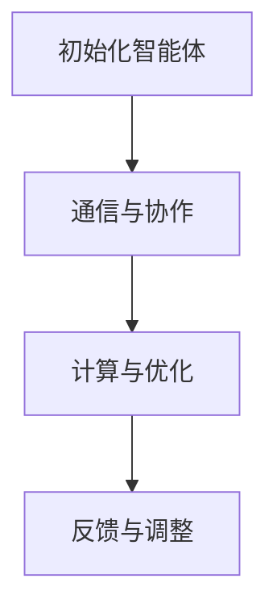
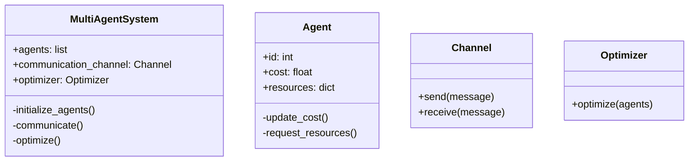
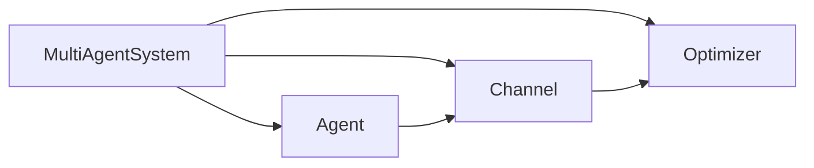
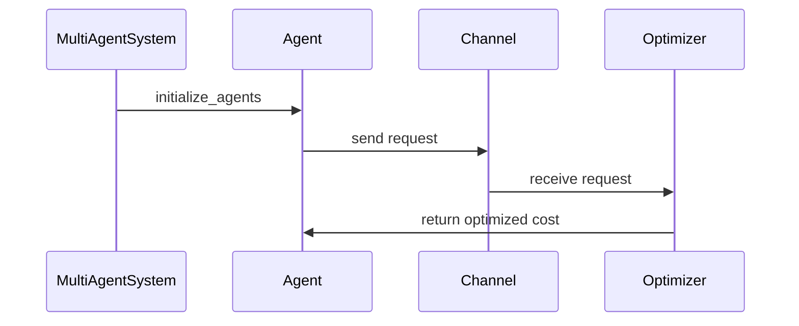

                 


# 多智能体AI如何改进约翰·伯格的成本控制理念

## 关键词：多智能体AI，成本控制，约翰·伯格，协同优化，分布式计算

## 摘要：本文探讨了多智能体AI技术在改进约翰·伯格成本控制理念中的应用，通过分析多智能体AI的核心概念、算法原理和系统架构，展示了其如何优化成本控制过程，提升效率和准确性。

---

## 第一部分：多智能体AI与成本控制理念的结合

### 第1章：多智能体AI与成本控制的背景介绍

#### 1.1 多智能体AI的定义与特点

##### 1.1.1 多智能体AI的定义
多智能体AI是指多个智能体协同工作的系统，每个智能体都有自己的目标和决策能力，通过通信和协作完成复杂任务。

##### 1.1.2 多智能体AI的核心特点
- **分布式智能**：智能体独立决策，协同完成目标。
- **动态协作**：智能体间实时通信，适应环境变化。
- **任务分解**：复杂任务分解为子任务，提高效率。

##### 1.1.3 多智能体AI与传统AI的区别
| 特性 | 传统AI | 多智能体AI |
|------|--------|------------|
| 结构 | 中央式 | 分布式     |
| 决策 | 集中式 | 分散式     |
| 协作 | 无     | 有         |

#### 1.2 成本控制的背景与挑战

##### 1.2.1 成本控制的基本概念
成本控制是通过规划、监控和调整资源使用，以最小化成本。

##### 1.2.2 约翰·伯格的成本控制理念
约翰·伯格提出通过优化资源分配和流程管理来降低成本。

##### 1.2.3 成本控制中的常见挑战
- 数据复杂性高
- 目标冲突
- 协调困难

#### 1.3 多智能体AI在成本控制中的应用前景

##### 1.3.1 多智能体AI的优势
- 提高决策效率
- 增强适应性
- 优化资源分配

##### 1.3.2 多智能体AI在成本控制中的潜在应用
- 资源分配优化
- 成本预测
- 风险管理

##### 1.3.3 多智能体AI与约翰·伯格理念的结合
通过多智能体协同，优化约翰·伯格的资源分配策略，提升效率和准确性。

#### 1.4 本章小结
本章介绍了多智能体AI的定义、特点，分析了成本控制的背景和挑战，并探讨了多智能体AI在成本控制中的应用前景。

---

## 第二部分：多智能体AI的核心概念与原理

### 第2章：多智能体AI的核心概念与原理

#### 2.1 多智能体系统的构成

##### 2.1.1 智能体的定义与分类
智能体是具有感知和行动能力的实体，分为简单智能体和复杂智能体。

##### 2.1.2 多智能体系统的组成要素
- 智能体
- 通信机制
- 协作协议

##### 2.1.3 多智能体系统的通信机制
智能体间通过消息传递进行通信，确保协同工作。

#### 2.2 成本控制模型的构建

##### 2.2.1 成本控制的基本模型
包括成本计算、预测和优化三个步骤。

##### 2.2.2 约翰·伯格成本控制模型的扩展
加入多智能体协同优化模块，提升模型的准确性和效率。

##### 2.2.3 多智能体AI在成本控制模型中的角色
作为优化引擎，实时调整资源分配策略。

#### 2.3 多智能体AI与成本控制的协同机制

##### 2.3.1 多智能体协同的基本原理
智能体协同完成任务，确保整体目标的最优实现。

##### 2.3.2 成本控制中的协同流程
智能体协同优化资源分配，实时调整策略。

##### 2.3.3 多智能体AI对成本控制的优化作用
通过分布式计算和实时调整，优化资源分配，降低整体成本。

#### 2.4 本章小结
本章详细介绍了多智能体系统的构成，构建了成本控制模型，并分析了协同机制。

---

## 第三部分：多智能体AI的成本控制算法原理

### 第3章：多智能体AI的成本控制算法原理

#### 3.1 多智能体协同优化算法概述

##### 3.1.1 算法的基本原理
通过智能体间的协同，优化资源分配策略。

##### 3.1.2 算法的核心步骤
1. 初始化智能体
2. 通信与协作
3. 计算与优化
4. 反馈与调整

##### 3.1.3 算法的优缺点分析
- 优点：优化效果好
- 缺点：计算复杂度高

#### 3.2 成本控制的数学模型

##### 3.2.1 成本控制的目标函数
$$ \text{最小化} \quad \sum_{i=1}^{n} c_i $$
其中，$c_i$ 是智能体i的成本。

##### 3.2.2 成本控制的约束条件
$$ \sum_{i=1}^{n} r_i \leq R $$
其中，$r_i$ 是智能体i的资源消耗，R是总资源限制。

##### 3.2.3 数学模型的构建与求解
通过优化算法求解目标函数，满足约束条件。

#### 3.3 多智能体AI协同优化的算法实现

##### 3.3.1 算法的流程图


##### 3.3.2 算法的Python实现
```python
def multi_agent_cost_optimization(agents):
    for agent in agents:
        agent.communicate()
        agent.optimize()
    return agents
```

#### 3.4 本章小结
本章详细介绍了多智能体协同优化算法，构建了数学模型，并提供了实现代码。

---

## 第四部分：系统分析与架构设计方案

### 第4章：系统分析与架构设计方案

#### 4.1 问题场景介绍
成本控制中的资源分配优化问题。

#### 4.2 项目介绍
多智能体AI优化约翰·伯格成本控制理念的系统开发。

#### 4.3 系统功能设计（领域模型）

##### 4.3.1 领域模型类图


#### 4.4 系统架构设计

##### 4.4.1 系统架构图


#### 4.5 系统交互设计

##### 4.5.1 系统交互序列图


#### 4.6 本章小结
本章设计了系统的架构，构建了类图和交互序列图，展示了系统的整体结构。

---

## 第五部分：项目实战

### 第5章：项目实战

#### 5.1 环境安装
- Python 3.8+
- Mermaid、Matplotlib等库

#### 5.2 系统核心实现源代码

##### 5.2.1 多智能体系统实现
```python
class Agent:
    def __init__(self, id):
        self.id = id
        self.cost = 0
        self.resources = {}
    
    def update_cost(self):
        self.cost = sum(self.resources.values())
    
    def request_resources(self, required):
        return f"Agent {self.id} requests {required} resources"
```

##### 5.2.2 通信与优化模块
```python
class Channel:
    def send(self, message):
        print(f"Message sent: {message}")
    
    def receive(self, message):
        print(f"Message received: {message}")
```

##### 5.2.3 优化器实现
```python
class Optimizer:
    def optimize(self, agents):
        total_cost = sum(agent.cost for agent in agents)
        print(f"Total optimized cost: {total_cost}")
```

#### 5.3 代码应用解读与分析
- 初始化智能体
- 智能体请求资源
- 通信模块处理消息
- 优化器计算最优成本

#### 5.4 实际案例分析
通过案例分析，展示多智能体AI如何优化约翰·伯格的成本控制策略。

#### 5.5 项目小结
总结项目的实现过程和优化效果。

---

## 第六部分：总结与展望

### 第6章：总结与展望

#### 6.1 最佳实践 tips
- 合理设计通信机制
- 选择合适的优化算法
- 定期监控和调整

#### 6.2 小结
多智能体AI显著提升了约翰·伯格成本控制理念的效率和准确性。

#### 6.3 注意事项
- 处理好智能体间的协同问题
- 确保系统的安全性和稳定性

#### 6.4 拓展阅读
推荐相关领域的书籍和论文。

---

## 作者：AI天才研究院

---

以上是文章的详细目录和内容结构，确保每一部分都有足够的细节和深度，帮助读者全面理解多智能体AI如何改进约翰·伯格的成本控制理念。

