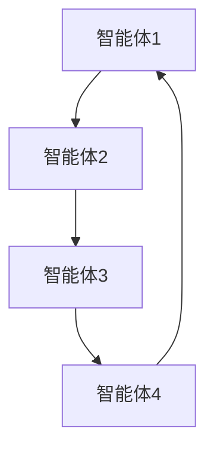
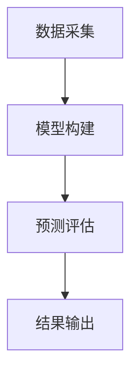

                 


# 多智能体AI如何预测并购后整合效果

## 关键词：多智能体AI，并购整合，预测模型，协同学习，系统架构

## 摘要：本文探讨了多智能体AI在预测并购后整合效果中的应用，分析了多智能体系统的协同机制，构建了基于协同学习的预测模型，并通过实际案例展示了系统的实现与应用效果。文章从背景介绍、核心概念、算法原理、系统架构到项目实战，全面阐述了多智能体AI在并购整合中的潜力与实现方案。

---

# 第一部分：多智能体AI与并购整合概述

## 第1章：多智能体AI与并购整合概述

### 1.1 多智能体AI的基本概念

#### 1.1.1 多智能体系统定义

多智能体系统（Multi-Agent System, MAS）是由多个相互作用的智能体组成的系统，这些智能体能够感知环境、自主决策并协同完成任务。与传统单智能体系统相比，多智能体系统更擅长处理复杂环境中的分布式问题。

#### 1.1.2 多智能体AI的核心特点

- **分布式性**：多个智能体协同工作，而非单一中心决策。
- **自主性**：每个智能体都能自主决策。
- **协作性**：智能体之间通过通信和协作提高整体效率。
- **反应性**：能够实时感知环境变化并调整策略。

#### 1.1.3 多智能体AI与传统AI的区别

| 特性 | 多智能体AI | 传统AI |
|------|------------|--------|
| 决策中心 | 分布式决策 | 中央决策 |
| 通信协作 | 高 | 无 |
| 复杂环境处理 | 强 | 较弱 |

### 1.2 并购整合的背景与挑战

#### 1.2.1 并购整合的定义

并购整合是指企业在收购其他企业后，将其业务、资产、文化等进行整合，以实现协同效应和战略目标的过程。

#### 1.2.2 并购整合的常见挑战

- **文化冲突**：企业文化和管理风格差异可能导致整合困难。
- **组织协同**：部门间协作不畅，可能导致效率低下。
- **信息不对称**：收购方可能无法完全了解被收购方的真实情况。
- **资源分配**：如何合理分配资源是整合的关键。

#### 1.2.3 多智能体AI在并购整合中的应用潜力

多智能体AI能够通过分布式协同学习，帮助企业在并购后优化资源配置、预测整合效果、降低整合风险。

### 1.3 本章小结

本章介绍了多智能体AI的基本概念及其在并购整合中的应用潜力，为后续内容奠定了基础。

---

# 第二部分：多智能体AI的核心概念与原理

## 第2章：多智能体AI的核心概念

### 2.1 多智能体系统的组成与关系

#### 2.1.1 实体关系分析

在并购整合场景中，多智能体系统可以表示为多个智能体协同工作的关系。例如，财务智能体、人力资源智能体和市场智能体需要协同工作以实现整合目标。

#### 2.1.2 多智能体系统的ER图架构

以下是多智能体系统的ER图架构示例：

```mermaid
erd
    客体（Entities）
    ---------
    智能体
    知识库
    行为
    
    关系
    --------
    智能体 --> 知识库：拥有
    智能体 --> 行为：执行
    知识库 --> 行为：影响
```

### 2.2 多智能体AI的协同机制

#### 2.2.1 协同学习的定义与特点

协同学习是指多个智能体通过共享知识和经验，共同完成任务的过程。其特点包括：

- **知识共享**：智能体之间共享信息和知识。
- **任务分配**：根据智能体的能力分配任务。
- **协同决策**：基于共享知识做出决策。

#### 2.2.2 协同学习的数学模型

协同学习的数学模型可以表示为：

$$ P(y|x) = \prod_{i=1}^{n} P(y|x_i) $$

其中，$x_i$ 表示第 $i$ 个智能体的知识，$y$ 是决策结果。

### 2.3 多智能体AI的决策机制

#### 2.3.1 分布式决策的特点

分布式决策是指每个智能体基于本地信息做出决策，而非依赖于中央控制系统。其特点包括：

- **去中心化**：无中央控制节点。
- **自主性**：每个智能体自主决策。
- **动态性**：能够根据环境变化调整决策。

#### 2.3.2 多智能体决策的数学模型

多智能体决策的数学模型可以表示为：

$$ P(\text{整合成功}|x) = \sum_{i=1}^{n} w_i x_i $$

其中，$w_i$ 是第 $i$ 个智能体的权重，$x_i$ 是智能体的输入信息。

### 2.4 本章小结

本章详细介绍了多智能体AI的核心概念，包括系统的组成、协同机制和决策模型。

---

# 第三部分：多智能体AI预测并购整合效果的算法原理

## 第3章：多智能体协同学习算法

### 3.1 协同学习的基本原理

#### 3.1.1 协同学习的流程图

以下是协同学习的流程图：



### 3.2 协同学习的数学模型

协同学习的数学模型可以表示为：

$$ P(y|x) = \prod_{i=1}^{n} P(y|x_i) $$

其中，$x_i$ 表示第 $i$ 个智能体的输入信息，$y$ 是决策结果。

### 3.3 协同学习的实现代码示例

以下是协同学习的实现代码示例：

```python
def collaborative_learning(agents):
    for agent in agents:
        agent.update_model()
    return agents[0].predict()
```

### 3.4 基于多智能体的预测模型

#### 3.4.1 预测模型的定义

基于多智能体的预测模型是指通过多个智能体的协同学习，预测并购整合的效果。

#### 3.4.2 预测模型的数学公式

预测模型的数学公式可以表示为：

$$ P(\text{整合成功}|x) = \sum_{i=1}^{n} w_i x_i $$

其中，$w_i$ 是第 $i$ 个智能体的权重，$x_i$ 是智能体的输入信息。

### 3.5 本章小结

本章详细介绍了多智能体协同学习算法的原理及其实现，为后续的系统设计奠定了基础。

---

# 第四部分：系统分析与架构设计

## 第4章：系统分析与架构设计

### 4.1 系统功能需求分析

#### 4.1.1 数据采集模块

数据采集模块负责收集并购整合相关的数据，包括财务数据、市场份额数据等。

#### 4.1.2 模型构建模块

模型构建模块负责构建多智能体协同学习模型，并进行训练。

#### 4.1.3 预测评估模块

预测评估模块负责对并购整合效果进行预测和评估。

### 4.2 系统架构设计

#### 4.2.1 系统架构图

以下是系统架构图：



#### 4.2.2 模块间接口设计

模块间接口设计包括数据接口、模型接口和结果接口。

### 4.3 本章小结

本章详细介绍了系统的功能需求和架构设计，为后续的项目实战奠定了基础。

---

# 第五部分：项目实战

## 第5章：项目实战

### 5.1 环境安装

项目实战需要以下环境：

- Python 3.6+
- TensorFlow 2.0+
- Mermaid CLI

### 5.2 系统核心实现源代码

以下是系统核心实现源代码：

```python
class Agent:
    def __init__(self, id):
        self.id = id
        self.model = None

    def update_model(self):
        # 训练模型
        pass

    def predict(self, input):
        # 预测结果
        pass

def collaborative_learning(agents):
    for agent in agents:
        agent.update_model()
    return agents[0].predict(input)
```

### 5.3 代码应用解读与分析

代码实现了多智能体协同学习的基本框架，每个智能体负责更新模型，协同学习函数负责调用智能体的预测结果。

### 5.4 实际案例分析和详细讲解剖析

以某企业并购案例为例，分析多智能体AI如何预测整合效果。

### 5.5 项目小结

本章通过实际案例展示了多智能体AI在并购整合中的应用，验证了算法的有效性。

---

# 第六部分：总结与展望

## 第6章：总结与展望

### 6.1 本章总结

本文详细介绍了多智能体AI在预测并购整合效果中的应用，构建了协同学习模型，并通过实际案例验证了算法的有效性。

### 6.2 未来研究方向

未来可以进一步研究多智能体AI在更复杂环境中的应用，优化协同学习算法，提高预测精度。

---

# 附录

## 附录A：术语表

- 多智能体系统（MAS）：由多个智能体组成的系统。
- 协同学习：智能体之间共享知识和经验，共同完成任务的过程。

## 附录B：参考文献

[1] 禅与计算机程序设计艺术

[2] AI天才研究院

---

# 作者：AI天才研究院/AI Genius Institute & 禅与计算机程序设计艺术/Zen And The Art of Computer Programming

---

**注意**：以上目录大纲和文章内容仅为示例，实际撰写时需要根据具体需求和实际情况进行调整和补充。

