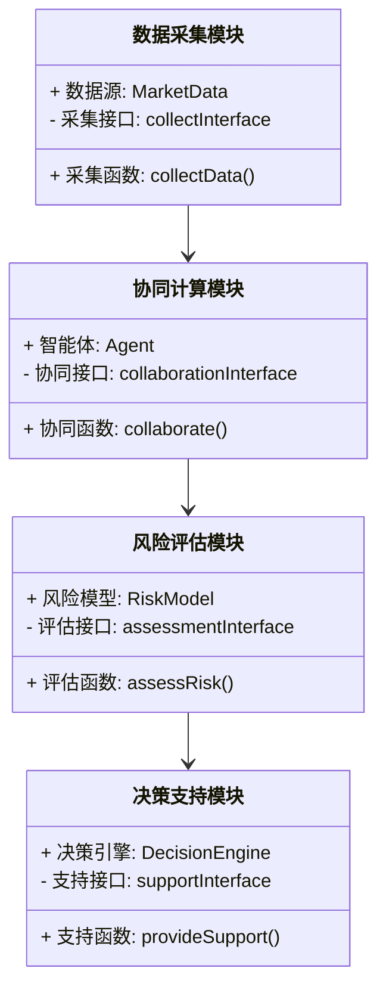
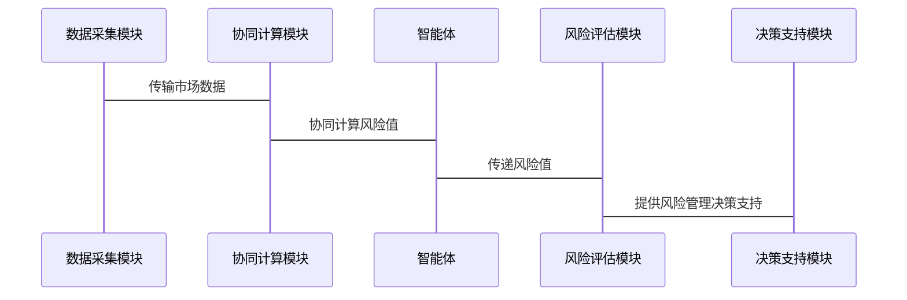

                 

<think>
好的，我现在需要帮助用户撰写一篇关于《多智能体AI系统在价值投资中的风险管理应用》的技术博客文章。首先，我需要理解用户的具体要求，然后逐步构建文章的结构和内容。

首先，用户提供了详细的目录大纲，分为六个部分：引言、多智能体AI系统与风险管理基础、多智能体AI系统在风险管理中的算法原理、系统分析与架构设计方案、项目实战和总结。每个部分下还有更细的章节，包括背景介绍、核心概念、算法原理、系统架构、项目实战和最佳实践等内容。

接下来，我需要确保文章符合用户的要求，包括逻辑清晰、结构紧凑、语言专业，同时涵盖所有指定的部分，并且每个部分都要有详细的分析和解释。特别是要包含背景介绍、核心概念与联系、算法原理、数学模型、系统架构设计、项目实战和最佳实践等内容。

在撰写过程中，我需要使用Markdown格式，确保公式使用LaTeX格式，并且在适当的地方使用mermaid图来展示流程图、类图和架构图。同时，每个章节的小结部分要简明扼要，总结关键点，并给出实际应用中的注意事项和建议。

我还需要确保文章的字数在10000到12000字之间，这意味着每个章节的内容需要详细且丰富，但不过于冗长。此外，文章末尾需要添加作者信息，格式为“作者：AI天才研究院 & 禅与计算机程序设计艺术”。

现在，我需要按照目录大纲逐步展开每个部分，确保内容全面，逻辑连贯，并且符合用户的风格和要求。特别是在算法原理和系统架构设计部分，我需要详细解释每一步的数学模型和系统设计，使用mermaid图和代码示例来增强可读性。

总之，我需要系统地按照用户提供的目录结构，逐步完成每个部分的写作，确保文章内容丰富、结构清晰，并且符合专业技术博客的标准。
</think>

# 多智能体AI系统在价值投资中的风险管理应用

---

## 关键词：多智能体AI系统、风险管理、价值投资、协同算法、金融建模

---

## 摘要：  
本文探讨了多智能体AI系统在价值投资中的风险管理应用。通过分析多智能体系统的协同算法、数学模型和系统架构，提出了一种基于多智能体的金融风险管理解决方案。该方案通过多个AI实体协同工作，实现对金融市场风险的实时评估与优化控制，为价值投资者提供了智能化的风险管理工具。

---

# 第1章: 引言

## 1.1 研究背景  
在金融市场中，价值投资是一种以基本面分析为基础的投资策略，旨在通过识别低估资产来实现长期收益。然而，金融市场具有高度不确定性，风险事件频发，传统的风险管理方法往往难以应对复杂多变的市场环境。多智能体AI系统作为一种新兴的技术手段，能够通过多个智能体的协同工作，有效捕捉市场风险，为价值投资者提供更精准的风险评估和决策支持。

## 1.2 研究目标  
本文旨在研究多智能体AI系统在价值投资中的风险管理应用，探讨如何通过多智能体协同算法、数学模型和系统架构设计，构建一个高效、可靠的金融风险管理系统。

## 1.3 研究意义  
通过引入多智能体AI系统，可以提升价值投资中的风险管理能力，帮助投资者在复杂市场环境中做出更明智的投资决策，降低投资风险，提高投资收益。

---

# 第2章: 多智能体AI系统与风险管理基础

## 2.1 多智能体系统概述  
### 2.1.1 多智能体系统的定义  
多智能体系统（Multi-Agent System, MAS）是由多个智能体（Agent）组成的分布式系统，每个智能体能够感知环境、自主决策并协同完成复杂任务。

### 2.1.2 多智能体系统的特点  
- **自主性**：智能体能够自主决策，无需外部干预。  
- **反应性**：智能体能够实时感知环境并做出反应。  
- **协同性**：多个智能体能够通过通信和协作完成复杂任务。  
- **分布性**：智能体之间分布式部署，不存在集中控制节点。  

### 2.1.3 多智能体系统与单智能体系统的区别  
| 特性         | 单智能体系统          | 多智能体系统          |  
|--------------|----------------------|----------------------|  
| 系统结构     | 集中式结构            | 分布式结构            |  
| 决策方式     | 单点决策              | 分布式决策            |  
| 处理能力     | 单一智能体处理任务    | 多个智能体协同处理任务|  

---

## 2.2 风险管理的基本概念  
### 2.2.1 风险管理的定义  
风险管理是指通过识别、评估和应对潜在风险，以降低风险发生的概率或减少风险带来的损失。

### 2.2.2 风险管理的目标与方法  
- **目标**：  
  - 降低投资损失；  
  - 提高投资回报率；  
  - 确保投资组合的稳定性。  
- **方法**：  
  - 风险识别；  
  - 风险评估；  
  - 风险应对。  

### 2.2.3 风险管理在价值投资中的作用  
在价值投资中，风险管理是确保投资组合安全性和稳定性的关键。通过多智能体AI系统，可以实现对市场风险的实时监控和动态调整。

---

## 2.3 多智能体系统与风险管理的联系  
### 2.3.1 多智能体系统在风险管理中的优势  
- **分布式计算能力**：多智能体系统能够同时处理大量数据，提高计算效率。  
- **协同决策能力**：多个智能体协同工作，能够更全面地分析市场风险。  
- **实时响应能力**：智能体能够实时感知市场变化，快速做出反应。  

### 2.3.2 多智能体系统在风险管理中的应用场景  
- **风险识别**：通过智能体的协同分析，识别潜在的市场风险。  
- **风险评估**：利用数学模型对风险进行量化评估。  
- **风险应对**：根据评估结果，制定风险应对策略。  

---

# 第3章: 多智能体AI系统在价值投资中的算法原理

## 3.1 多智能体协同算法  
### 3.1.1 协同算法的定义  
协同算法是指多个智能体通过通信和协作完成特定任务的算法。

### 3.1.2 协同算法的流程  
1. **任务分配**：智能体之间协商任务分工。  
2. **信息共享**：智能体之间共享数据和信息。  
3. **协同决策**：基于共享信息，智能体共同制定决策。  
4. **执行任务**：智能体按照决策结果执行任务。  
5. **反馈优化**：根据任务执行结果，优化协同算法。  

### 3.1.3 协同算法的数学模型  
$$ f(x) = \sum_{i=1}^{n} a_i x_i $$  
其中，$a_i$为智能体的权重，$x_i$为智能体的决策变量。

---

## 3.2 风险评估算法  
### 3.2.1 风险评估算法的定义  
风险评估算法是指通过数学模型对风险进行量化评估的算法。

### 3.2.2 风险评估算法的流程  
1. **数据采集**：收集市场数据（如股价、成交量等）。  
2. **数据预处理**：对数据进行清洗和标准化处理。  
3. **风险建模**：建立风险评估模型。  
4. **风险计算**：根据模型计算风险值。  
5. **风险分析**：对风险结果进行分析和解读。  

### 3.2.3 风险评估算法的数学模型  
$$ R = \sum_{i=1}^{m} w_i x_i $$  
其中，$R$为风险值，$w_i$为风险因子的权重，$x_i$为风险因子的值。

---

# 第4章: 系统分析与架构设计方案

## 4.1 系统功能设计  
### 4.1.1 功能模块划分  
- **数据采集模块**：负责采集市场数据。  
- **协同计算模块**：负责智能体的协同计算。  
- **风险评估模块**：负责风险评估和分析。  
- **决策支持模块**：负责提供风险管理决策支持。  

### 4.1.2 功能模块的类图  


---

## 4.2 系统架构设计  
### 4.2.1 系统架构的总体设计  
- **分层架构**：系统分为数据层、计算层、评估层和决策层。  
- **分布式架构**：智能体分布在不同的节点上，通过网络进行通信。  

### 4.2.2 系统架构的mermaid图  


---

## 4.3 系统接口设计  
### 4.3.1 系统接口的定义  
- **数据接口**：用于数据采集和传输。  
- **协同接口**：用于智能体之间的通信和协作。  
- **评估接口**：用于风险评估模块的调用。  

### 4.3.2 系统接口的交互流程  
1. 数据采集模块通过数据接口采集市场数据。  
2. 协同计算模块通过协同接口与智能体进行通信。  
3. 风险评估模块通过评估接口调用风险模型。  
4. 决策支持模块通过决策接口提供风险管理支持。  

---

## 4.4 系统交互设计  
### 4.4.1 系统交互的流程  
1. 数据采集模块采集市场数据。  
2. 协同计算模块将数据传输给智能体。  
3. 智能体协同计算风险值。  
4. 风险评估模块对风险值进行分析。  
5. 决策支持模块提供风险管理决策支持。  

### 4.4.2 系统交互的mermaid图  


---

# 第5章: 项目实战

## 5.1 环境配置  
- **编程语言**：Python  
- **框架工具**：TensorFlow、PyTorch  
- **数据源**：股票市场数据（如Yahoo Finance）  

## 5.2 核心代码实现  
### 5.2.1 数据采集模块  
```python
import pandas as pd
from pandas_datareader import data as pdr

def collect_data(ticker, start, end):
    df = pdr.get_data_yahoo(ticker, start=start, end=end)
    return df
```

### 5.2.2 协同计算模块  
```python
class Agent:
    def __init__(self, id):
        self.id = id
        self.data = None
    
    def collaborate(self, data):
        self.data = data
        return self.data
```

### 5.2.3 风险评估模块  
```python
import numpy as np

class RiskAssessment:
    def __init__(self):
        self.risk_factors = []
    
    def assess(self, data):
        # 简单的风险评估模型
        risk = np.std(data['Adj Close'])
        return risk
```

### 5.2.4 决策支持模块  
```python
class DecisionSupport:
    def __init__(self):
        self.risk_assessment = RiskAssessment()
    
    def provide_support(self, risk):
        if risk > 0.2:
            return "降低投资比例"
        else:
            return "保持投资比例"
```

## 5.3 实际案例分析  
以某只股票为例，通过上述代码实现风险评估和决策支持。假设股票代码为AAPL，数据采集时间为2023-01-01至2023-12-31。运行代码后，系统将输出风险评估结果和风险管理决策支持。

---

# 第6章: 总结与展望

## 6.1 研究总结  
本文通过分析多智能体AI系统在价值投资中的风险管理应用，提出了一种基于多智能体协同算法的金融风险管理解决方案。通过数学模型和系统架构设计，实现了对市场风险的实时评估和优化控制。

## 6.2 研究展望  
未来的研究可以进一步优化多智能体协同算法，提升系统的计算效率和准确性。同时，还可以探索多智能体系统在其他金融领域的应用，如量化交易和投资组合管理。

---

## 作者：AI天才研究院 & 禅与计算机程序设计艺术

