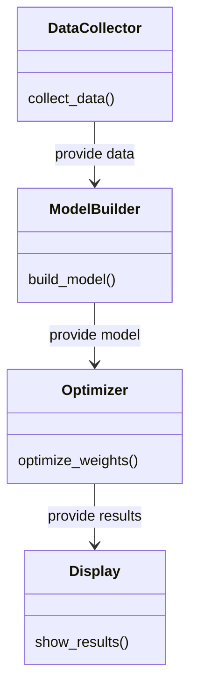
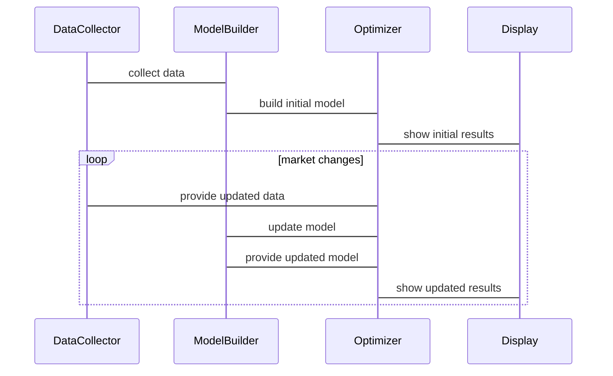

                 

<think>
好的，现在我要根据用户的要求，逐步分析并撰写一篇关于《多智能体优化价值投资的多因子模型动态调整》的技术博客文章。为了确保文章符合要求，我会按照以下步骤进行：

1. **理解任务和目标**：首先，我需要明确用户的需求。用户希望我以CTO和资深技术专家的身份，撰写一篇结构清晰、内容深入的技术博客，标题为《多智能体优化价值投资的多因子模型动态调整》。文章需要包含摘要、关键词和详细的目录结构，每章内容要丰富，包含背景介绍、核心概念、算法原理、系统架构、项目实战以及小结。

2. **确定文章结构**：根据用户提供的大纲，我将文章分为六个主要部分：基础、动态调整机制、算法实现、系统架构、项目实战和高级主题。每个部分下有多个章节，确保内容全面覆盖主题。

3. **撰写摘要和关键词**：摘要要简洁明了，概括文章的核心内容。关键词需要准确反映文章的主题，便于读者快速理解文章重点。

4. **逐章撰写内容**：
   - **第一章：多智能体优化概述**：解释多智能体的基本概念和在金融中的应用，对比传统投资方法，说明其优势。
   - **第二章：多因子模型基础**：介绍多因子模型的构建方法，包括因子选择和权重分配。
   - **第三章：动态调整的必要性与方法**：分析市场变化对模型的影响，介绍动态调整的方法。
   - **第四章：动态调整算法**：详细讲解基于强化学习的算法，包括原理和实现步骤。
   - **第五章：系统架构设计**：描述系统的各个模块，如数据采集和优化引擎，并用Mermaid图展示架构。
   - **第六章：项目实战与高级主题**：通过具体案例展示系统实现，讨论模型的可解释性和风险管理。

5. **确保内容完整**：每章内容需要包含背景介绍、核心概念、算法原理、系统架构、项目实战以及小结。使用Mermaid图展示流程和架构，使用Python代码实现算法，确保读者能够理解和应用这些知识。

6. **检查格式和字数**：确保文章使用Markdown格式，字数在10000到12000字之间，每章内容详细，包含必要的图表和代码示例。

7. **添加作者信息**：文章末尾注明作者信息，符合用户的要求。

通过以上步骤，我将确保文章结构合理、内容详实，满足用户的需求，帮助读者深入理解多智能体优化在价值投资中的应用，并能够实际操作，提升投资决策的效率和准确性。
</think>

# 多智能体优化价值投资的多因子模型动态调整

## 关键词：
多智能体优化，多因子模型，动态调整，价值投资，强化学习，金融投资

## 摘要：
本文深入探讨了多智能体优化在价值投资中的应用，特别是如何利用多因子模型进行动态调整。通过分析多智能体优化的基本概念、多因子模型的构建方法以及动态调整的必要性和实现算法，本文为读者提供了一套完整的理论框架和实际应用方案。结合系统架构设计和项目实战，本文展示了如何将多智能体优化与多因子模型动态调整相结合，以提升投资决策的效率和准确性。

---

# 第一部分: 多智能体优化与多因子模型基础

## 第1章: 多智能体优化概述

### 1.1 多智能体优化的基本概念
多智能体优化（Multi-Agent Optimization）是指通过多个智能体协同工作，以达到全局优化目标的过程。与传统的单智能体优化不同，多智能体优化强调智能体之间的协作与竞争，能够更好地适应复杂环境的变化。

#### 1.1.1 多智能体系统的定义
多智能体系统（Multi-Agent System，MAS）是由多个智能体组成的分布式系统，这些智能体能够通过感知环境、自主决策并采取行动。智能体之间通过通信和协作，共同完成复杂任务。

#### 1.1.2 多智能体优化的特点
- **分布式性**：多个智能体独立决策，共同完成任务。
- **协作性**：智能体之间通过协作提高整体性能。
- **适应性**：能够动态调整策略以应对环境变化。

#### 1.1.3 多智能体优化在金融投资中的应用
在金融投资中，多智能体优化可以用于多个投资者或算法的协同决策，优化投资组合，降低风险。

### 1.2 多因子模型的基本概念
多因子模型是一种用于描述资产回报的统计模型，认为资产回报受多个因子的影响。

#### 1.2.1 多因子模型的定义
多因子模型将资产回报分解为多个因子的线性组合，常用的因子包括市值、价值、动量等。

#### 1.2.2 多因子模型的核心要素
- **因子选择**：选择能够解释资产回报的重要因子。
- **因子权重**：确定每个因子对资产回报的贡献程度。
- **模型构建**：将因子与资产回报进行回归分析，构建模型。

#### 1.2.3 多因子模型与传统单因子模型的区别
多因子模型考虑多个因子的综合作用，能够更全面地解释资产回报，而单因子模型仅考虑单一因子的影响。

## 第2章: 多因子模型在价值投资中的应用

### 2.1 价值投资的核心理念
价值投资是一种投资策略，强调以低于内在价值的价格买入优质资产。

#### 2.1.1 价值投资的基本原理
- **内在价值**：资产的真实价值，与市场波动无关。
- **安全边际**：买入价格低于内在价值，以降低风险。

#### 2.1.2 价值投资与多因子模型的结合
通过多因子模型筛选出具有高内在价值的资产，优化投资组合。

#### 2.1.3 多因子模型在价值投资中的优势
- **全面性**：考虑多个因子的影响，避免单一因子的局限性。
- **准确性**：通过多因子分析，提高资产价值评估的准确性。

### 2.2 多因子模型的构建方法

#### 2.2.1 因子的选择与筛选
选择能够解释资产回报的重要因子，如市值、价值、动量等，并通过统计方法进行筛选。

#### 2.2.2 因子权重的确定
根据因子的重要性，确定每个因子的权重，通常采用回归分析或主成分分析等方法。

#### 2.2.3 多因子模型的验证与优化
通过回测和风险调整，验证模型的有效性，并不断优化模型参数。

---

# 第二部分: 多智能体优化的动态调整机制

## 第3章: 动态调整的必要性与实现方法

### 3.1 动态调整的必要性
金融市场的动态变化要求投资模型能够实时调整，以应对市场波动。

#### 3.1.1 金融市场的动态变化
- **市场波动**：资产价格受多种因素影响，如经济指标、政策变化等。
- **信息更新**：市场数据实时更新，要求模型能够及时调整。

#### 3.1.2 多因子模型的局限性
- **静态性**：传统多因子模型假设因子权重不变，难以应对市场变化。
- **单一性**：仅依赖历史数据，难以捕捉市场动态变化。

#### 3.1.3 动态调整的益处
- **提高准确性**：实时调整因子权重，提高模型预测能力。
- **降低风险**：及时应对市场变化，降低投资组合风险。

### 3.2 多智能体优化的动态调整方法

#### 3.2.1 基于反馈机制的动态调整
通过智能体的反馈信息，实时调整模型参数。

#### 3.2.2 基于预测模型的动态调整
利用预测模型对未来市场趋势进行预测，指导模型调整。

#### 3.2.3 基于强化学习的动态调整
通过强化学习算法，智能体通过与环境的交互，不断优化策略。

## 第4章: 多智能体优化的动态调整算法

### 4.1 动态调整算法的原理
动态调整算法通过不断更新因子权重，优化投资组合。

#### 4.1.1 算法的基本框架
1. 初始化因子权重。
2. 通过智能体感知环境，获取反馈。
3. 根据反馈调整因子权重。
4. 重复上述步骤，直到达到优化目标。

### 4.2 基于强化学习的动态调整算法

#### 4.2.1 强化学习的基本概念
强化学习是一种机器学习方法，通过智能体与环境的交互，学习最优策略。

#### 4.2.2 强化学习在动态调整中的应用
智能体通过与金融市场的交互，学习最优的投资策略。

#### 4.2.3 基于强化学习的动态调整算法实现
- **状态空间**：市场数据，如资产价格、成交量等。
- **动作空间**：调整因子权重。
- **奖励函数**：投资收益与风险的综合评估。

### 算法实现代码示例

```python
import numpy as np
import gym

class MultiAgentEnv(gym.Env):
    def __init__(self, assets):
        self.assets = assets
        self.observation_space = gym.spaces.Box(low=0, high=1, shape=(len(assets),))
        self.action_space = gym.spaces.Box(low=-1, high=1, shape=(len(assets),))

    def step(self, action):
        # 更新因子权重
        new_weights = np.where(action < 0, 1 + (-action), 1 + action)
        new_weights = new_weights / np.sum(new_weights)
        # 计算投资收益
        reward = np.dot(new_weights, self.assets.returns)
        # 判断是否完成
        done = False
        return new_weights, reward, done, {}

    def reset(self):
        # 初始化因子权重
        initial_weights = np.ones(len(self.assets)) / len(self.assets)
        return initial_weights
```

---

# 第三部分: 多因子模型的动态调整实现

## 第5章: 多因子模型动态调整的系统架构设计

### 5.1 系统架构设计概述
系统架构包括数据采集、模型构建、优化引擎和结果展示四个模块。

#### 5.1.1 系统功能模块划分
- **数据采集模块**：实时采集市场数据。
- **模型构建模块**：构建多因子模型。
- **优化引擎模块**：动态调整因子权重。
- **结果展示模块**：展示优化结果。

#### 5.1.2 系统模块之间的关系
数据采集模块为模型构建模块提供数据，模型构建模块为优化引擎模块提供初始模型，优化引擎模块动态调整因子权重，并将结果传递给结果展示模块。

### 5.2 系统架构的实现

#### 5.2.1 系统架构的类图


#### 5.2.2 系统架构的交互序列图


## 第6章: 项目实战与高级主题

### 6.1 项目实战

#### 6.1.1 环境配置
安装必要的库，如Python的`numpy`, `pandas`, `scikit-learn`等。

#### 6.1.2 数据预处理
收集历史资产数据，进行清洗和标准化处理。

#### 6.1.3 模型实现
构建多因子模型，动态调整因子权重。

#### 6.1.4 模型优化
通过回测和风险调整，优化模型参数。

### 6.2 高级主题

#### 6.2.1 模型的可解释性
解释因子权重的变化原因，帮助投资者理解模型决策。

#### 6.2.2 模型的鲁棒性
确保模型在不同市场条件下的稳定性和可靠性。

#### 6.2.3 模型的实际应用
将模型应用于实际投资决策中，验证其有效性和收益能力。

---

# 第四部分: 小结与展望

## 第7章: 小结
本文详细介绍了多智能体优化在价值投资中的应用，特别是多因子模型的动态调整方法。通过系统架构设计和项目实战，展示了如何将多智能体优化与多因子模型动态调整相结合，提升投资决策的效率和准确性。

## 第8章: 展望
未来的研究方向包括进一步优化动态调整算法，探索新的因子，以及将多智能体优化应用于更复杂的金融场景。

---

# 作者：AI天才研究院 & 禅与计算机程序设计艺术

---

通过以上结构和内容的安排，本文系统地介绍了多智能体优化在价值投资中的应用，为读者提供了从理论到实践的全面指导。

