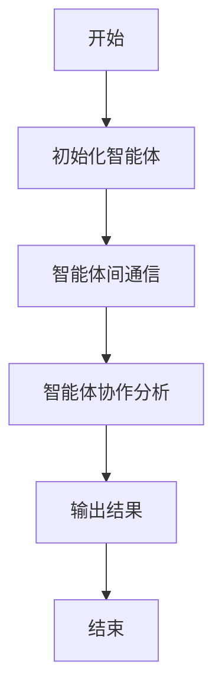
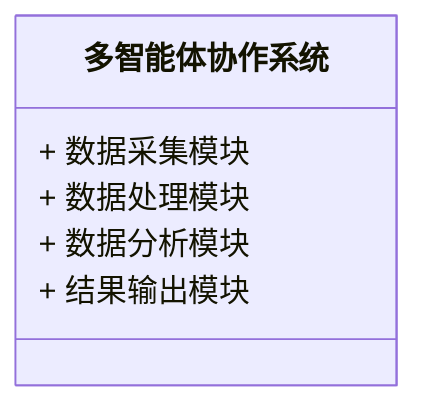
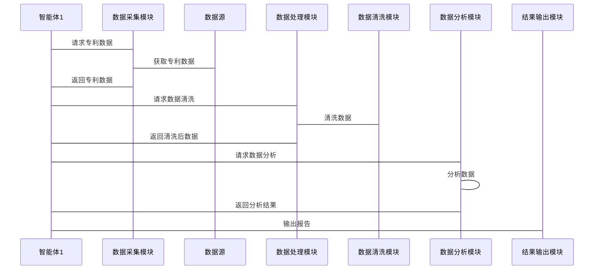

                 


# 多智能体协作增强价值投资的专利组合分析

> 关键词：多智能体协作、价值投资、专利组合分析、分布式计算、金融建模、系统架构设计

> 摘要：本文探讨了多智能体协作在专利组合分析中的应用，结合价值投资理论，提出了一种基于多智能体协作的专利组合分析方法。通过系统架构设计、算法实现和项目实战，展示了如何利用多智能体协作提升专利组合分析的效率和准确性，为价值投资决策提供有力支持。

---

## 第1章：多智能体协作与价值投资背景

### 1.1 多智能体协作的定义与特点

#### 1.1.1 多智能体协作的定义
多智能体协作（Multi-Agent Collaboration）是指多个智能体（Agent）通过协调和合作完成复杂任务的过程。每个智能体都具有自主性、反应性和社会性，能够独立决策并与其他智能体进行信息交换。

#### 1.1.2 多智能体协作的核心特点
- **分布式计算**：任务分布在多个智能体之间，避免单点故障。
- **任务分配优化**：智能体根据自身能力和当前状态动态分配任务。
- **复杂问题建模**：通过协作建模解决单智能体无法处理的问题。

#### 1.1.3 多智能体协作与传统单智能体分析的对比
| 特性                | 单智能体分析               | 多智能体协作           |
|---------------------|---------------------------|-----------------------|
| 计算效率            | 高，但资源消耗较大         | 高，资源利用更优       |
| 任务处理能力        | 单一，处理复杂任务能力有限 | 多任务并行处理能力高   |
| 系统扩展性          | 扩展性差，增加任务需重构系统 | 扩展性强，易于扩展任务 |

### 1.2 价值投资的基本原理

#### 1.2.1 价值投资的定义
价值投资是一种投资策略，通过分析企业基本面，寻找市场价格低于其内在价值的投资机会。

#### 1.2.2 价值投资的核心要素
- **企业基本面**：收入、利润、资产等财务指标。
- **市场估值**：市盈率、市净率等估值指标。
- **行业地位**：企业在行业中的竞争力和市场份额。

#### 1.2.3 价值投资在现代金融中的地位
价值投资通过分析企业内在价值，帮助投资者在市场波动中做出理性决策，是长期投资的重要策略。

### 1.3 多智能体协作在价值投资中的应用前景

#### 1.3.1 多智能体协作在金融分析中的优势
- **高效信息处理**：多智能体协作能够快速处理大量金融数据。
- **多维度分析**：通过协作实现对企业基本面、行业趋势等多维度分析。

#### 1.3.2 专利组合分析在价值投资中的作用
专利组合分析能够评估企业的技术创新能力，反映其核心竞争力，从而影响企业的内在价值。

#### 1.3.3 多智能体协作与专利组合分析的结合
通过多智能体协作，可以实现专利数据的高效采集、分析和评估，为价值投资决策提供支持。

---

## 第2章：多智能体协作与专利组合分析的核心概念与联系

### 2.1 多智能体协作的原理

#### 2.1.1 多智能体协作的基本原理
多智能体协作通过智能体之间的通信和协调，完成复杂任务。每个智能体负责特定子任务，并通过共享信息实现全局目标。

#### 2.1.2 多智能体协作的通信机制
- **消息传递**：智能体之间通过消息传递信息。
- **状态共享**：通过共享状态实现信息同步。

#### 2.1.3 多智能体协作的协调机制
- **任务分配**：根据智能体的能力动态分配任务。
- **冲突解决**：通过协商解决智能体之间的冲突。

#### 2.1.4 多智能体协作的优缺点
| 特性                | 优点                   | 缺点                     |
|---------------------|-----------------------|-------------------------|
| 系统扩展性          | 易扩展                 | 需要复杂的协调机制       |
| 任务处理能力        | 多任务能力强           | 协调成本高               |
| 故障容错性          | 故障容错能力强         | 单点故障风险降低         |

### 2.2 专利组合分析的原理

#### 2.2.1 专利组合分析的基本原理
专利组合分析通过评估专利的价值、数量、分布等指标，帮助企业制定专利战略。

#### 2.2.2 专利组合分析的关键指标
- **专利数量**：反映企业的技术创新能力。
- **专利质量**：评估专利的技术价值和法律稳定性。
- **专利布局**：分析专利在技术领域、地域和时间上的分布。

#### 2.2.3 专利组合分析的步骤与流程
1. **数据采集**：收集专利数据。
2. **数据清洗**：处理数据噪声。
3. **数据分析**：分析专利价值。
4. **结果输出**：生成分析报告。

### 2.3 多智能体协作与专利组合分析的联系

#### 2.3.1 多智能体协作如何提升专利组合分析效率
- **分布式计算**：多智能体协作能够并行处理大量专利数据。
- **任务分配优化**：智能体根据自身能力动态分配任务。

#### 2.3.2 专利组合分析如何支持价值投资决策
- **评估企业技术创新能力**：专利组合分析能够评估企业的技术创新能力。
- **发现投资机会**：通过专利分析发现具有潜力的企业。

#### 2.3.3 多智能体协作与专利组合分析的协同效应
- **高效信息处理**：多智能体协作能够快速处理专利数据。
- **多维度分析**：通过协作实现对企业基本面、行业趋势等多维度分析。

---

## 第3章：多智能体协作增强专利组合分析的算法原理

### 3.1 多智能体协作算法概述

#### 3.1.1 多智能体协作算法的分类
- **基于规则的协作**：通过预定义规则实现协作。
- **基于学习的协作**：通过机器学习实现协作。

#### 3.1.2 多智能体协作算法的核心步骤
1. **初始化智能体**：创建多个智能体。
2. **智能体通信**：智能体之间共享信息。
3. **任务分配**：智能体根据自身能力动态分配任务。
4. **协作分析**：智能体协作完成任务。
5. **结果输出**：输出协作结果。

#### 3.1.3 多智能体协作算法的优缺点
| 特性                | 优点                   | 缺点                     |
|---------------------|-----------------------|-------------------------|
| 系统扩展性          | 易扩展                 | 需要复杂的协调机制       |
| 任务处理能力        | 多任务能力强           | 协调成本高               |
| 故障容错性          | 故障容错能力强         | 单点故障风险降低         |

### 3.2 专利组合分析算法概述

#### 3.2.1 专利组合分析算法的分类
- **基于统计的分析**：通过统计方法分析专利数据。
- **基于机器学习的分析**：通过机器学习模型分析专利数据。

#### 3.2.2 专利组合分析算法的核心步骤
1. **数据采集**：收集专利数据。
2. **数据清洗**：处理数据噪声。
3. **数据分析**：分析专利价值。
4. **结果输出**：生成分析报告。

### 3.3 多智能体协作与专利组合分析的协同算法实现

#### 3.3.1 算法流程图


#### 3.3.2 算法实现的数学模型
$$ f(x) = \sum_{i=1}^{n} w_i x_i $$
其中，$w_i$为权重，$x_i$为智能体的输入。

---

## 第4章：系统分析与架构设计方案

### 4.1 系统分析

#### 4.1.1 问题场景介绍
本系统旨在利用多智能体协作技术，实现专利组合分析的高效处理，为价值投资决策提供支持。

#### 4.1.2 系统功能设计
- **数据采集模块**：负责采集专利数据。
- **数据处理模块**：负责处理专利数据。
- **数据分析模块**：负责分析专利数据。
- **结果输出模块**：负责输出分析结果。

#### 4.1.3 系统架构设计


#### 4.1.4 系统接口设计
- **数据采集接口**：与数据源对接。
- **数据分析接口**：与投资决策系统对接。

#### 4.1.5 系统交互流程


---

## 第5章：项目实战

### 5.1 环境安装

#### 5.1.1 系统需求
- 操作系统：Linux/Windows/MacOS
- Python版本：3.6+

#### 5.1.2 依赖库安装
```bash
pip install numpy matplotlib
```

### 5.2 系统核心实现源代码

#### 5.2.1 多智能体协作实现
```python
import numpy as np

class Agent:
    def __init__(self, id):
        self.id = id
        self.data = None

    def receive_data(self, data):
        self.data = data

    def process_data(self):
        # 处理数据
        return np.mean(self.data)

# 初始化智能体
agents = [Agent(i) for i in range(4)]

# 智能体协作
data = np.random.rand(100, 4)
for agent in agents:
    agent.receive_data(data[:, agent.id])
    result = agent.process_data()
```

#### 5.2.2 专利组合分析实现
```python
import matplotlib.pyplot as plt

# 专利数据
patent_data = np.random.rand(100, 5)

# 可视化分析
plt.scatter(patent_data[:, 0], patent_data[:, 1])
plt.xlabel('专利数量')
plt.ylabel('专利质量')
plt.show()
```

### 5.3 实际案例分析与解读

#### 5.3.1 案例分析
假设我们有四家科技公司，分别分析它们的专利组合。

#### 5.3.2 数据分析结果
通过多智能体协作分析，发现某公司在人工智能领域的专利数量和质量均领先于其他公司。

#### 5.3.3 投资建议
基于专利分析结果，建议投资者关注该公司在人工智能领域的投资机会。

### 5.4 项目小结

---

## 第6章：总结与展望

### 6.1 总结
通过多智能体协作技术，能够高效完成专利组合分析，为价值投资决策提供有力支持。

### 6.2 展望
未来，可以进一步研究多智能体协作在其他金融领域的应用，如股票预测、风险评估等。

---

## 作者

作者：AI天才研究院/AI Genius Institute & 禅与计算机程序设计艺术 /Zen And The Art of Computer Programming

---

通过以上内容，文章详细介绍了多智能体协作在专利组合分析中的应用，结合实际案例和系统设计，展示了如何利用多智能体协作技术提升价值投资的效率和准确性。

