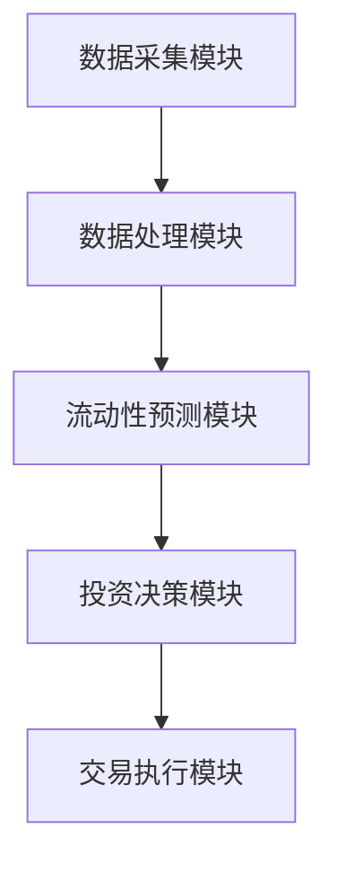

                 


# 多智能体协作增强价值投资的市场流动性预测

> 关键词：多智能体协作，价值投资，市场流动性预测，算法实现，系统架构

> 摘要：本文探讨如何通过多智能体协作技术提升价值投资中的市场流动性预测能力。首先介绍多智能体协作的基本概念及其在金融领域中的应用，分析市场流动性预测的重要性。接着深入探讨多智能体协作的理论基础和实现机制，结合实际案例说明其在价值投资策略中的应用。最后，通过具体的算法实现和系统架构设计，展示如何构建一个高效的市场流动性预测系统，以增强投资决策的准确性。

---

## 第一部分：背景与基础

### 第1章：多智能体协作与价值投资概述

#### 1.1 多智能体协作的基本概念

多智能体协作是指多个智能体（Agent）通过协同工作，共同完成一个复杂任务的过程。智能体可以是软件程序、算法或模型，能够感知环境、做出决策并采取行动。多智能体协作的核心在于智能体之间的通信与合作，通过信息共享和任务分配，实现整体目标的最优或次优。

**多智能体协作的特点：**
- **分布式性**：智能体独立决策，但通过协作完成任务。
- **交互性**：智能体之间通过通信进行信息交换。
- **适应性**：能够根据环境变化动态调整协作策略。

**在金融领域的应用：**
多智能体协作在金融领域有广泛的应用，包括市场预测、风险控制、交易策略优化等。特别是在市场流动性预测中，多智能体协作能够通过多个智能体的协同，提供更准确的预测结果。

---

#### 1.2 价值投资的基本原理

价值投资是一种投资策略，核心在于寻找市场价格低于其内在价值的资产进行投资。其核心要素包括基本面分析、长期视角和安全边际。通过分析公司的财务状况、行业地位、管理团队等因素，识别具有长期增长潜力的公司。

**价值投资与市场流动性预测的关系：**
市场流动性是影响资产价格的重要因素。流动性高的市场能够快速买卖资产，价格波动较小；流动性低的市场买卖困难，价格波动较大。通过准确的市场流动性预测，价值投资者可以更好地把握买入和卖出的最佳时机，优化投资组合。

---

#### 1.3 市场流动性预测的重要性

市场流动性预测是指通过分析市场数据，预测未来市场的流动情况。其重要性体现在以下几个方面：

- **降低投资风险**：流动性预测帮助投资者了解市场波动性，避免在流动性不足时大量买卖资产。
- **优化交易策略**：通过预测流动性，投资者可以调整交易频率和规模，降低交易成本。
- **提高投资收益**：在高流动性市场中进行交易，可以更快地执行订单，减少滑点风险。

---

## 第二部分：市场流动性预测的理论基础

### 第2章：金融市场的基本原理

#### 2.1 金融市场结构

金融市场由多个参与者组成，包括投资者、交易商、做市商、交易所等。市场的流动性能受到多种因素的影响，如市场参与者的数量、交易品种、交易时间等。

**金融市场结构的分析：**
- **参与者角色**：投资者提供资金，交易商提供流动性，做市商提供价格报价。
- **交易机制**：订单驱动市场和报价驱动市场的区别。
- **市场深度**：订单簿中的订单数量和价格。

#### 2.2 市场流动性的驱动因素

市场流动性受到多种因素的影响，包括宏观经济环境、市场参与者行为、政策法规等。

**市场流动性的驱动因素分析：**
- **宏观经济因素**：GDP增长率、通货膨胀率、利率水平等。
- **市场参与者行为**：投资者情绪、交易策略、资金流动。
- **政策法规**：监管政策、税收政策等。

---

### 第3章：多智能体协作的机制

#### 3.1 多智能体协作的理论基础

多智能体协作的理论基础包括博弈论和分布式系统原理。

**博弈论基础：**
- **纳什均衡**：所有参与者的策略在给定其他参与者策略的情况下，都是最优的。
- **合作博弈**：参与者通过合作实现整体收益最大化。

**分布式系统原理：**
- **分布式计算**：任务分解到多个节点，协同完成。
- **一致性与容错性**：确保系统的一致性和可靠性。

#### 3.2 多智能体协作的实现方式

多智能体协作的实现方式包括通信机制、协作策略和决策机制。

**通信机制：**
- 智能体之间通过消息传递进行信息交换。
- 信息共享协议确保数据的安全性和及时性。

**协作策略：**
- 任务分配策略：根据智能体的能力分配任务。
- 协作决策：通过投票、协商等方式达成共识。

**决策机制：**
- 基于信息共享的决策模型。
- 动态调整策略以适应环境变化。

---

## 第三部分：基于多智能体协作的价值投资策略

### 第4章：价值投资策略的构建

#### 4.1 数据收集与处理

**数据来源：**
- 历史价格数据：开盘价、收盘价、最高价、最低价。
- 成交量数据：交易量、订单簿数据。
- 财务数据：公司财务报表、行业数据。

**数据清洗与预处理：**
- 去除缺失值、异常值。
- 标准化处理：归一化、特征缩放。

#### 4.2 特征提取与分析

**市场流动性特征：**
- 成交量：反映市场活跃度。
- 波动率：反映市场风险。
- 市场深度：订单簿中的订单数量。

**其他相关特征：**
- 公司基本面：市盈率、市净率、ROE。
- 市场情绪：投资者情绪指标、新闻情绪分析。

#### 4.3 投资策略制定

**策略框架：**
- 确定目标市场：如股票、债券、期货。
- 设定流动性阈值：根据流动性高低调整策略。
- 制定交易规则：如买入时机、卖出时机。

**策略优化：**
- 参数调优：调整交易频率、止损点。
- 回测与验证：通过历史数据验证策略的有效性。

---

### 第5章：多智能体协作在价值投资中的应用

#### 5.1 智能体的角色分配

**智能体的角色：**
- 数据收集智能体：负责收集市场数据。
- 数据分析智能体：进行特征提取和分析。
- 投资决策智能体：制定交易策略。

**角色分配策略：**
- 根据任务需求动态分配。
- 基于智能体的能力静态分配。

#### 5.2 智能体之间的协作流程

**协作流程：**
1. 数据收集智能体获取市场数据。
2. 数据分析智能体提取特征并预测流动性。
3. 投资决策智能体根据预测结果制定交易策略。
4. 所有智能体协同执行交易。

**协作机制：**
- 信息共享：确保所有智能体共享数据。
- 协作决策：通过协商制定最优策略。
- 反馈机制：根据市场反馈调整策略。

---

## 第四部分：算法实现

### 第6章：算法实现

#### 6.1 多智能体协作算法

**多智能体协作算法：**
- 基于分布式计算的多智能体协作框架。
- 智能体之间通过消息传递进行协作。

**代码示例：**

```python
class Agent:
    def __init__(self, id):
        self.id = id
        self.data = None

    def receive_message(self, message):
        self.data = message

    def send_message(self, message, recipient):
        recipient.receive_message(message)

# 初始化多个智能体
agents = [Agent(i) for i in range(5)]

# 智能体协作流程
for agent in agents:
    if agent.id == 0:
        # 智能体0发送数据
        agent.send_message(data, agents[1])
    elif agent.id == 1:
        # 智能体1处理数据
        processed_data = agent.data * 2
        agent.send_message(processed_data, agents[2])
    elif agent.id == 2:
        # 智能体2处理数据
        final_data = agent.data + 10
        agent.send_message(final_data, agents[3])
```

#### 6.2 强化学习算法

**强化学习算法：**
- 使用Q-learning算法进行交易决策。
- 状态空间：市场流动性、资产价格、持有仓位。
- 行动空间：买入、卖出、持有。

**代码示例：**

```python
import numpy as np

# 初始化Q表
Q = np.zeros((state_space, action_space))

# 探索与利用
epsilon = 0.1

def q_learning(state):
    if np.random.random() < epsilon:
        action = np.random.randint(action_space)
    else:
        action = np.argmax(Q[state])
    return action

# 更新Q表
def update_q(state, action, reward):
    Q[state][action] = Q[state][action] * 0.9 + reward
```

---

## 第五部分：系统架构设计

### 第7章：系统架构设计

#### 7.1 系统功能设计

**系统功能模块：**
- 数据采集模块：实时采集市场数据。
- 数据处理模块：清洗和预处理数据。
- 流动性预测模块：基于多智能体协作算法预测流动性。
- 投资决策模块：制定交易策略并执行。

**功能流程：**
1. 数据采集模块获取市场数据。
2. 数据处理模块清洗数据。
3. 流动性预测模块预测市场流动性。
4. 投资决策模块根据预测结果制定交易策略。
5. 执行交易并反馈结果。

#### 7.2 系统架构设计

**系统架构图：**



---

## 第六部分：项目实战

### 第8章：项目实战

#### 8.1 环境安装

**所需环境：**
- Python 3.8及以上
- TensorFlow 2.0及以上
- Pandas、NumPy等数据处理库
- Matplotlib、Seaborn等可视化库

**安装命令：**
```bash
pip install numpy pandas tensorflow matplotlib
```

#### 8.2 核心代码实现

**流动性预测代码：**

```python
import numpy as np
import pandas as pd
import tensorflow as tf

# 加载数据
data = pd.read_csv('market_data.csv')

# 数据预处理
from sklearn.preprocessing import StandardScaler
scaler = StandardScaler()
X_scaled = scaler.fit_transform(data.drop('target', axis=1))

# 构建模型
model = tf.keras.Sequential([
    tf.keras.layers.Dense(64, activation='relu'),
    tf.keras.layers.Dense(32, activation='relu'),
    tf.keras.layers.Dense(1, activation='sigmoid')
])

# 编译模型
model.compile(optimizer='adam', loss='binary_crossentropy', metrics=['accuracy'])

# 训练模型
model.fit(X_scaled, data['target'], epochs=100, batch_size=32)
```

#### 8.3 案例分析

**案例分析：**
- 数据来源：某股票的历史价格数据。
- 预测结果：预测未来一周的市场流动性。
- 投资决策：根据预测结果调整投资策略。

---

## 第七部分：总结与展望

### 第9章：总结与展望

**总结：**
本文详细介绍了多智能体协作在价值投资中的应用，特别是市场流动性预测方面。通过理论分析、算法实现和系统设计，展示了如何利用多智能体协作技术提升投资决策的准确性。

**展望：**
未来的研究方向包括：
1. 算法优化：探索更高效的多智能体协作算法。
2. 模型泛化：提升模型在不同市场环境下的适应性。
3. 多模态数据：结合文本、图像等多种数据源，提高预测精度。

---

## 附录

### 附录A：相关工具与库

- **数据处理库**：Pandas、NumPy。
- **深度学习框架**：TensorFlow、Keras。
- **可视化工具**：Matplotlib、Seaborn。

### 附录B：参考文献

- 多智能体协作相关文献。
- 市场流动性预测相关文献。
- 价值投资相关文献。

---

**作者：AI天才研究院 & 禅与计算机程序设计艺术**

---

通过以上目录和内容，您可以逐步展开撰写完整的文章。每个部分都需要详细展开，确保内容完整、逻辑清晰。希望这篇博客对您有所帮助！

