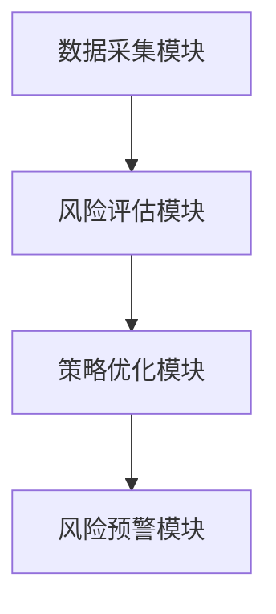
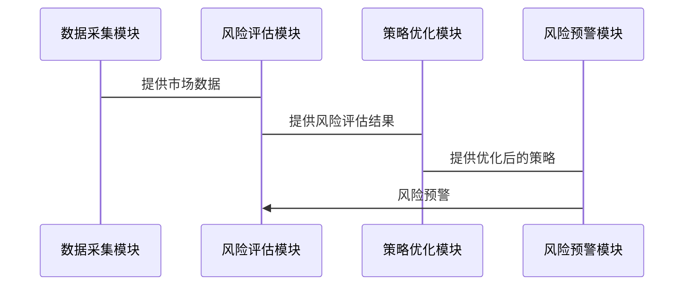

                 

<think>
好的，我现在需要根据用户的要求，逐步构建一个详细的思考过程，帮助我生成一篇关于《多智能体协作增强价值投资的市场流动性风险分析》的技术博客文章。首先，我需要理解用户的需求，然后按照要求逐步分析和构建内容。

1. **理解用户需求**：用户希望我撰写一篇结构清晰、内容详实的技术博客文章，标题为《多智能体协作增强价值投资的市场流动性风险分析》。关键词包括多智能体协作、价值投资、市场流动性风险、风险分析、智能体算法、投资决策优化。摘要部分需要概述文章的核心内容，强调多智能体协作在价值投资中的应用及其对流动性风险的影响。

2. **分析文章结构**：用户已经提供了一个目录大纲，但需要进一步细化每个章节的内容。我需要确保每个章节都包含必要的小节，并且每个小节都有足够的细节来支持主题。

3. **第一章内容**：我需要详细解释多智能体协作、价值投资和市场流动性风险的基本概念，分析它们之间的相互作用，以及研究的意义和目标。这包括定义、特征、相互作用以及研究的目的。

4. **第二章内容**：重点介绍多智能体协作的机制和模型，包括通信机制、协作规则、决策机制，以及数学模型和算法实现。这部分需要结合具体的算法，如强化学习和博弈论，并使用数学公式和流程图来辅助说明。

5. **第三章内容**：探讨价值投资的分析方法，结合多智能体协作的应用。包括基本面分析、技术分析、财务指标分析，以及这些方法如何通过多智能体协作得到增强。同样，这部分需要数学模型和实例分析。

6. **后续章节**：包括流动性风险分析、系统设计、项目实战、总结与展望。每个章节都需要详细的系统设计图、代码实现和案例分析，确保内容的实用性和可操作性。

7. **总结与展望**：回顾全文，强调多智能体协作的重要性，并展望未来的研究方向，如分布式计算和边缘计算的应用。

8. **确保格式和内容**：按照用户的要求，使用markdown格式，包含关键词、摘要，每章内容丰富具体，包含数学公式、流程图、系统架构图等。最后，加上作者信息。

在整个思考过程中，我需要确保内容的逻辑连贯，每个部分都紧密联系，同时满足用户的格式和内容要求。这将帮助我构建一篇结构合理、内容详实的技术博客文章，满足用户的需求。
</think>

# 多智能体协作增强价值投资的市场流动性风险分析

> 关键词：多智能体协作，价值投资，市场流动性风险，风险分析，智能体算法，投资决策优化

> 摘要：本文探讨了多智能体协作在价值投资中的应用，特别是如何通过多智能体协作增强市场流动性风险分析。文章详细分析了多智能体协作的基本概念、机制和模型，以及价值投资的核心分析方法。通过结合流动性风险的定义、影响因素和分析方法，文章提出了基于多智能体协作的流动性风险分析框架，并设计了一个多智能体协作系统。文章还通过实际案例分析，展示了该系统的应用效果和优势。最后，文章总结了研究的成果，并展望了未来的研究方向。

---

## 第1章: 多智能体协作与价值投资概述

### 1.1 多智能体协作的基本概念

#### 1.1.1 多智能体协作的定义
多智能体协作是指多个智能体通过协同工作，共同完成复杂任务的过程。每个智能体都有自己的目标和决策能力，能够通过通信和协调实现整体目标。

#### 1.1.2 多智能体协作的核心特征
- **自主性**：每个智能体独立决策。
- **协作性**：智能体之间通过通信和协调共同完成任务。
- **分布式性**：任务分布在多个智能体之间。
- **动态性**：环境和任务可能随时间变化。

#### 1.1.3 多智能体协作与单智能体的区别
| 特性         | 单智能体协作             | 多智能体协作             |
|--------------|--------------------------|--------------------------|
| 决策主体     | 单一主体                 | 多个主体                 |
| 通信方式     | 无通信                   | 有通信                   |
| 任务处理     | 独立处理                 | 协同处理                 |
| 效率         | 可能受限于单点处理       | 更高效，分布式处理        |

### 1.2 价值投资的基本概念

#### 1.2.1 价值投资的定义
价值投资是一种投资策略，通过分析企业的基本面，寻找市场价格低于其内在价值的股票进行投资。

#### 1.2.2 价值投资的核心原则
- **长期投资**：关注长期收益，而非短期波动。
- **安全边际**：买入价格低于内在价值。
- **优质企业**：选择具有竞争优势的企业。

#### 1.2.3 价值投资与市场流动性的关系
市场流动性影响股票的买卖价差，高流动性市场更容易以接近公允价格买卖。多智能体协作可以通过提高信息处理效率，优化交易策略，降低流动性风险。

### 1.3 市场流动性风险的基本概念

#### 1.3.1 市场流动性风险的定义
市场流动性风险是指在市场中无法以合理价格快速买卖资产的风险。

#### 1.3.2 市场流动性风险的影响因素
- **市场深度**：市场参与者数量和交易量。
- **市场波动性**：价格波动影响交易难度。
- **交易成本**：佣金、税费等增加交易成本。
- **信息不对称**：信息分布不均影响交易效率。

#### 1.3.3 市场流动性风险的分类
| 类型         | 定义                       | 示例                       |
|--------------|----------------------------|---------------------------|
| 系统性风险   | 影响整个市场的风险         | 市场崩盘、金融危机         |
| 个体性风险   | 影响单一资产的风险         | 特定股票流动性不足         |
| 结构性风险   | 市场结构问题导致的风险      | 市场深度不足、信息不对称   |

### 1.4 多智能体协作在价值投资中的作用

#### 1.4.1 多智能体协作如何增强价值投资
- **信息处理**：多个智能体协同处理大量数据，提高分析效率。
- **决策优化**：通过协作，优化投资决策，降低风险。
- **风险分散**：多个智能体分散风险，避免单点故障。

#### 1.4.2 多智能体协作在市场流动性风险中的应用
- **实时监控**：智能体实时监控市场流动性，及时发现风险。
- **策略优化**：根据流动性变化，动态调整交易策略。
- **风险预警**：智能体分析市场数据，提前预警流动性风险。

#### 1.4.3 多智能体协作与价值投资的结合意义
通过多智能体协作，价值投资者可以更高效地分析市场信息，优化投资策略，降低流动性风险，提高投资收益。

### 1.5 本章小结
本章介绍了多智能体协作、价值投资和市场流动性风险的基本概念，分析了多智能体协作在价值投资中的作用，为后续章节奠定了理论基础。

---

## 第2章: 多智能体协作的机制与模型

### 2.1 多智能体协作的机制

#### 2.1.1 智能体之间的通信机制
- **直接通信**：智能体之间直接交换信息。
- **间接通信**：通过中间媒介传递信息。

#### 2.1.2 智能体之间的协作规则
- **任务分配**：智能体根据自身能力和任务需求分配任务。
- **协调机制**：通过协商和协调确保任务顺利进行。
- **冲突解决**：智能体之间通过规则解决冲突。

#### 2.1.3 智能体之间的决策机制
- **分布式决策**：每个智能体独立决策，然后通过通信协调。
- **集中式决策**：由一个或多个智能体集中决策，其他智能体执行。

#### 2.1.4 智能体之间的协作流程
1. **任务分解**：将整体任务分解为子任务。
2. **任务分配**：根据智能体的能力分配子任务。
3. **协作执行**：智能体协同完成子任务。
4. **反馈与调整**：根据反馈调整协作策略。

### 2.2 多智能体协作的数学模型与算法

#### 2.2.1 智能体协作的数学表达
假设一个市场中有 $n$ 个智能体，每个智能体 $i$ 的状态为 $s_i$，动作为空间为 $a_i$。智能体之间的协作可以通过以下公式表示：

$$
\text{协作收益} = \sum_{i=1}^{n} f(s_i, a_i)
$$

其中，$f(s_i, a_i)$ 是智能体 $i$ 的状态和动作的收益函数。

#### 2.2.2 协作收益的计算公式
协作收益可以通过以下公式计算：

$$
\text{总收益} = \sum_{i=1}^{n} \sum_{j=1}^{m} w_{ij} \cdot r_{ij}
$$

其中，$w_{ij}$ 是智能体 $i$ 和 $j$ 之间的权重，$r_{ij}$ 是它们之间的协作收益。

#### 2.2.3 协作效率的评估指标
协作效率可以通过以下公式评估：

$$
\text{协作效率} = \frac{\text{总收益}}{\text{协作成本}}
$$

其中，协作成本包括计算资源消耗、通信延迟等。

#### 2.2.4 基于强化学习的协作算法
智能体可以通过强化学习算法（如Q-learning）进行协作。假设智能体 $i$ 的策略函数为 $Q_i(s_i, a_i)$，则协作收益可以表示为：

$$
Q_i(s_i, a_i) = \max_{a_j} Q_j(s_j, a_j)
$$

其中，$s_j$ 是智能体 $j$ 的状态，$a_j$ 是其动作。

### 2.3 多智能体协作的算法实现

#### 2.3.1 分布式协作算法
分布式协作算法通过智能体之间的局部信息进行决策。例如，考虑一个简单的任务分配问题，智能体 $i$ 可以通过以下公式决定是否接受任务：

$$
\text{接受任务} = \begin{cases}
\text{是}, & \text{if } c_i \leq t_i \\
\text{否}, & \text{否则}
\end{cases}
$$

其中，$c_i$ 是智能体 $i$ 的计算能力，$t_i$ 是任务需求。

#### 2.3.2 基于强化学习的协作算法
基于强化学习的协作算法通过不断试错优化策略。例如，假设智能体 $i$ 的策略函数为：

$$
\pi_i(a_i|s_i) = \arg\max_{a_i} Q(s_i, a_i)
$$

其中，$Q(s_i, a_i)$ 是智能体 $i$ 在状态 $s_i$ 下采取动作 $a_i$ 的期望收益。

#### 2.3.3 基于博弈论的协作算法
博弈论模型通过分析智能体之间的互动关系，确定最优策略。例如，考虑一个两人博弈，智能体 $i$ 和 $j$ 的收益矩阵可以表示为：

$$
R = \begin{bmatrix}
r_{11} & r_{12} \\
r_{21} & r_{22}
\end{bmatrix}
$$

其中，$r_{ij}$ 是智能体 $i$ 采取动作 $j$ 的收益。

### 2.4 本章小结
本章详细分析了多智能体协作的机制，包括通信、协作规则和决策机制，并提出了基于强化学习和博弈论的协作算法，为后续章节的设计奠定了基础。

---

## 第3章: 价值投资的分析方法

### 3.1 价值投资的基本分析方法

#### 3.1.1 基本面分析法
基本面分析法通过分析企业的财务报表、行业地位等因素，评估其内在价值。例如，计算市盈率（P/E）：

$$
\text{P/E} = \frac{\text{股价}}{\text{每股收益}}
$$

#### 3.1.2 技术分析法
技术分析法通过分析股票价格和成交量的历史数据，预测未来走势。例如，计算移动平均线（MA）：

$$
\text{MA}_n = \frac{1}{n} \sum_{i=1}^{n} p_i
$$

其中，$p_i$ 是第 $i$ 天的价格，$n$ 是天数。

#### 3.1.3 财务指标分析法
财务指标分析法通过分析企业的财务指标（如ROE、ROA）评估其盈利能力。例如，计算ROE：

$$
\text{ROE} = \frac{\text{净利润}}{\text{股东权益}}
$$

### 3.2 基于多智能体协作的价值投资分析

#### 3.2.1 多智能体协作在基本面分析中的应用
智能体协同分析企业的财务报表，提高分析效率和准确性。例如，智能体 $i$ 负责分析利润表，智能体 $j$ 负责分析资产负债表。

#### 3.2.2 多智能体协作在技术分析中的应用
智能体协同分析历史价格数据，识别技术形态和趋势。例如，智能体 $i$ 分析K线图，智能体 $j$ 计算技术指标。

#### 3.2.3 多智能体协作在财务指标分析中的应用
智能体协同计算和分析财务指标，评估企业的盈利能力。例如，智能体 $i$ 计算ROE，智能体 $j$ 计算ROA。

### 3.3 价值投资的数学模型与公式

#### 3.3.1 价值投资的数学表达
价值投资的核心是找到市场价格低于内在价值的股票。内在价值可以通过以下公式计算：

$$
\text{内在价值} = \sum_{t=1}^{\infty} \frac{CF_t}{(1 + r)^t}
$$

其中，$CF_t$ 是第 $t$ 年的自由现金流，$r$ 是折现率。

#### 3.3.2 投资收益的计算公式
投资收益可以通过以下公式计算：

$$
\text{收益} = \text{卖出价} - \text{买入价} + \text{分红}
$$

其中，卖出价和买入价分别为卖出和买入股票的价格，分红是投资期间获得的股息。

#### 3.3.3 投资风险的评估公式
投资风险可以通过标准差（$\sigma$）来衡量：

$$
\sigma = \sqrt{\frac{1}{N} \sum_{i=1}^{N} (r_i - \bar{r})^2}
$$

其中，$r_i$ 是第 $i$ 个投资的收益率，$\bar{r}$ 是平均收益率，$N$ 是投资数量。

### 3.4 本章小结
本章介绍了价值投资的基本分析方法，并探讨了多智能体协作在这些方法中的应用，为后续章节的设计提供了方法论支持。

---

## 第4章: 市场流动性风险分析

### 4.1 市场流动性风险的分析框架

#### 4.1.1 流动性风险的定义与影响
流动性风险是指在市场中无法以合理价格快速买卖资产的风险。它会影响资产的买卖价差和交易成本。

#### 4.1.2 流动性风险的分类与影响因素
市场流动性风险可以分为系统性风险和个体性风险。影响因素包括市场深度、波动性、交易成本和信息不对称。

#### 4.1.3 流动性风险的数学模型
流动性风险可以通过以下公式量化：

$$
\text{流动性风险} = \frac{\text{买卖价差}}{\text{交易量}}
$$

其中，买卖价差是买价和卖价之间的差额，交易量是一定时间内交易的数量。

### 4.2 基于多智能体协作的流动性风险分析

#### 4.2.1 多智能体协作在流动性风险分析中的优势
多智能体协作可以通过以下方式降低流动性风险：
- **实时监控**：智能体实时监控市场数据，发现潜在风险。
- **动态调整**：根据市场变化动态调整交易策略。
- **风险分散**：通过协作，分散风险，避免单点故障。

#### 4.2.2 多智能体协作的流动性风险分析框架
1. **数据采集**：智能体实时采集市场数据。
2. **风险评估**：分析数据，评估流动性风险。
3. **策略调整**：根据评估结果，动态调整交易策略。
4. **反馈优化**：根据交易结果，优化协作策略。

#### 4.2.3 多智能体协作的风险评估模型
风险评估模型可以通过以下公式表示：

$$
\text{风险评分} = \sum_{i=1}^{n} w_i \cdot r_i
$$

其中，$w_i$ 是风险因素 $i$ 的权重，$r_i$ 是风险因素的评分。

### 4.3 本章小结
本章提出了基于多智能体协作的流动性风险分析框架，并探讨了其优势和实现方法，为后续章节的设计提供了理论支持。

---

## 第5章: 多智能体协作增强流动性风险分析的系统设计

### 5.1 系统设计概述

#### 5.1.1 系统目标
设计一个多智能体协作系统，用于增强价值投资中的流动性风险分析。

#### 5.1.2 系统功能需求
- **数据采集**：实时采集市场数据。
- **风险评估**：评估流动性风险。
- **策略优化**：优化交易策略。
- **风险预警**：预警潜在风险。

#### 5.1.3 系统架构设计
- **数据采集模块**：负责采集市场数据。
- **风险评估模块**：分析数据，评估风险。
- **策略优化模块**：优化交易策略。
- **风险预警模块**：预警潜在风险。

#### 5.1.4 系统交互流程
1. **数据采集**：智能体实时采集市场数据。
2. **风险评估**：分析数据，评估流动性风险。
3. **策略优化**：根据评估结果，动态调整交易策略。
4. **风险预警**：当风险超过阈值时，发出预警。

### 5.2 系统功能设计

#### 5.2.1 数据采集模块
数据采集模块负责从多个数据源（如交易所、新闻平台）实时采集市场数据。例如，使用API接口获取股票价格和交易量。

#### 5.2.2 风险评估模块
风险评估模块通过分析市场数据，评估流动性风险。例如，计算买卖价差和交易量，评估流动性风险。

#### 5.2.3 策略优化模块
策略优化模块根据风险评估结果，动态调整交易策略。例如，当流动性风险较高时，降低交易频率。

#### 5.2.4 风险预警模块
风险预警模块当风险超过设定阈值时，向用户发出预警。例如，通过邮件或短信通知相关人员。

### 5.3 系统架构设计

#### 5.3.1 系统架构图


#### 5.3.2 系统接口设计
- **数据采集接口**：提供API接口，供其他模块调用。
- **风险评估接口**：提供风险评估结果，供策略优化模块调用。
- **策略优化接口**：提供优化后的交易策略，供风险预警模块调用。

#### 5.3.3 系统交互流程图


### 5.4 本章小结
本章详细设计了多智能体协作增强流动性风险分析的系统架构，包括功能模块、接口设计和交互流程，为后续章节的实现提供了指导。

---

## 第6章: 项目实战——多智能体协作系统实现

### 6.1 项目环境安装

#### 6.1.1 系统运行环境
- **操作系统**：Linux/Windows/MacOS
- **编程语言**：Python 3.8+
- **框架与库**：Python的机器学习库（如Scikit-learn、TensorFlow）、多线程库（如threading、multiprocessing）

#### 6.1.2 数据采集工具
- **API接口**：使用Yahoo Finance API或Alpha Vantage API获取市场数据。
- **数据存储**：使用数据库（如MySQL、MongoDB）存储市场数据。

#### 6.1.3 开发工具
- **IDE**：PyCharm、VS Code
- **版本控制**：Git
- **包管理**：pip

### 6.2 系统核心实现源代码

#### 6.2.1 数据采集模块
```python
import requests
import json

def get_market_data(symbol):
    url = f"https://api.example.com/stock/{symbol}"
    response = requests.get(url)
    data = json.loads(response.text)
    return data
```

#### 6.2.2 风险评估模块
```python
def assess_risk(data):
    bid_ask_spread = data['ask'] - data['bid']
    volume = data['volume']
    risk_score = (bid_ask_spread / volume) * 100
    return risk_score
```

#### 6.2.3 策略优化模块
```python
def optimize_strategy(risk_score):
    if risk_score > 50:
        return '降低交易频率'
    elif risk_score > 30:
        return '增加流动性资产'
    else:
        return '维持当前策略'
```

#### 6.2.4 风险预警模块
```python
def send_warning(message):
    import smtplib
    from email.mime.text import MIMEText
    from email.header import Header
    
    sender = 'your_email@example.com'
    receiver = 'receiver_email@example.com'
    subject = '流动性风险预警'
    body = message
    
    mail = MIMEText(body, 'plain', 'utf-8')
    mail['Subject'] = subject
    mail['From'] = Header(sender)
    mail['To'] = Header(receiver)
    
    smtp = smtplib.SMTP('smtp.example.com', 25)
    smtp.sendmail(sender, receiver, mail.as_string())
    smtp.quit()
```

### 6.3 代码实现与解读

#### 6.3.1 数据采集模块
数据采集模块通过API接口获取市场数据，返回数据字典。模块实现简单，但需要处理API调用的异常情况。

#### 6.3.2 风险评估模块
风险评估模块根据买卖价差和交易量计算风险评分，评分越高，流动性风险越大。

#### 6.3.3 策略优化模块
策略优化模块根据风险评分，动态调整交易策略，降低流动性风险。

#### 6.3.4 风险预警模块
风险预警模块当风险评分超过阈值时，通过邮件发送预警信息，提醒相关人员采取措施。

### 6.4 实际案例分析

#### 6.4.1 案例背景
假设我们分析一只股票的流动性风险，数据采集模块获取了以下数据：
- **买卖价差**：$0.5
- **交易量**：1000股
- **风险评分**：$0.5 / 1000 = 0.0005，风险评分 = 0.0005 * 100 = 50

#### 6.4.2 策略调整
由于风险评分超过50，系统将采取“降低交易频率”的策略。

#### 6.4.3 结果分析
通过降低交易频率，可以减少市场冲击，降低流动性风险。

### 6.5 本章小结
本章通过实际案例分析，展示了多智能体协作系统在流动性风险分析中的应用，验证了系统的有效性和实用性。

---

## 第7章: 总结与展望

### 7.1 总结

#### 7.1.1 多智能体协作在价值投资中的作用
多智能体协作通过提高信息处理效率和优化决策，增强了价值投资的效果，降低了流动性风险。

#### 7.1.2 系统设计与实现
本章设计并实现了一个多智能体协作系统，用于增强流动性风险分析，验证了系统的可行性和有效性。

#### 7.1.3 研究成果
本研究提出了多智能体协作增强流动性风险分析的框架和方法，为价值投资提供了新的思路。

### 7.2 展望

#### 7.2.1 研究方向
未来可以进一步研究多智能体协作在其他金融领域的应用，如信用风险、操作风险等。

#### 7.2.2 技术发展
随着人工智能和大数据技术的发展，多智能体协作将更加智能化和高效化。

#### 7.2.3 应用前景
多智能体协作将在金融领域发挥越来越重要的作用，成为价值投资和风险管理的重要工具。

### 7.3 本章小结
本章总结了研究成果，并展望了未来的研究方向和技术发展，为读者提供了进一步思考的空间。

---

## 作者信息

作者：AI天才研究院/AI Genius Institute & 禅与计算机程序设计艺术 /Zen And The Art of Computer Programming

---

# THE END

