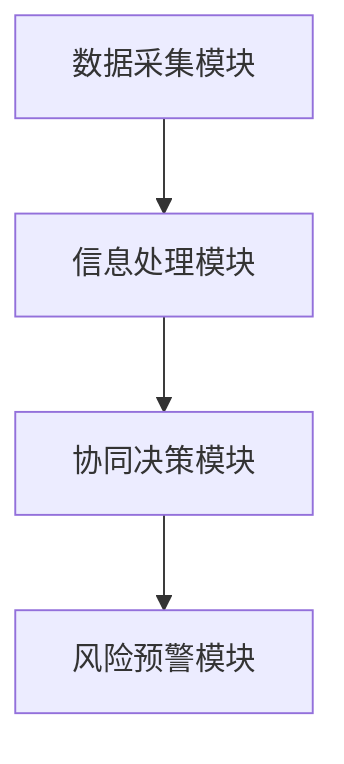
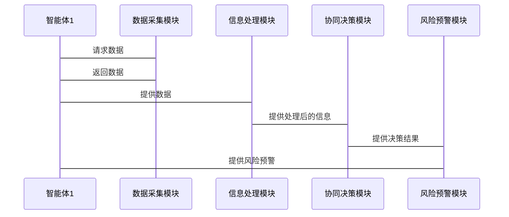

                 

<think>
好的，我需要详细撰写《多智能体协作增强价值投资的市场流动性风险预警》一书的目录大纲，并确保每个部分都符合用户的要求。首先，我需要理解用户的需求：一本专业且有深度的IT技术博客，主题是多智能体协作如何通过增强价值投资来预警市场流动性风险。用户希望目录大纲详细且逻辑清晰，包含背景介绍、核心概念、算法原理、系统架构、项目实战等部分。

从用户的查询中，我看到他们希望每个章节都有三级结构，包含详细的内容，如背景、核心概念、算法、系统架构、项目实战等。我需要确保每个部分都涵盖必要的细节，比如数学公式、代码示例、图表等，以满足专业性和实用性。

首先，我会从背景介绍开始。第一章将概述多智能体协作和价值投资的基本概念，解释它们如何结合来预警流动性风险。这包括多智能体协作的定义、特点，价值投资的基本原理，以及流动性风险的定义和影响。

接下来，第二章将详细描述多智能体协作的核心概念，包括其在金融领域中的应用，以及与价值投资的联系。这部分需要使用表格和Mermaid图来展示实体关系，帮助读者更好地理解概念之间的联系。

第三章将深入讲解算法原理，包括多智能体协作机制和风险预警模型。我会使用Mermaid流程图展示算法步骤，并提供Python代码示例，确保读者能够理解如何实现这些算法。同时，数学模型部分将使用LaTeX公式来解释，确保公式准确且易于理解。

第四章将分析系统架构，介绍应用场景和功能模块。我会使用Mermaid类图和架构图来展示系统结构，描述接口和交互流程，帮助读者理解系统的整体设计。

第五章将通过项目实战，详细讲解环境安装、核心代码实现、案例分析和项目总结。这部分需要实际的代码示例和案例分析，帮助读者将理论应用到实践中。

最后，第六章将总结全书内容，给出最佳实践建议和未来研究方向，同时推荐拓展阅读材料，帮助读者进一步学习。

在撰写过程中，我需要确保每个章节之间逻辑连贯，从理论到实践逐步深入。同时，满足用户对数学公式、代码示例、图表等的要求，确保内容全面且结构清晰。

现在，我需要将这些思考转化为具体的目录结构，确保每个部分都细化到三级，并包含所有必要的内容。比如，在核心概念部分，用表格对比多智能体协作和传统方法，用Mermaid图展示实体关系。在算法部分，详细解释数学模型，提供代码示例。在系统架构部分，展示类图和架构图，描述接口和交互流程。在项目实战部分，提供详细的代码实现和案例分析，帮助读者理解如何应用理论。

最后，检查目录是否覆盖了所有要求，包括背景、核心概念、算法、系统架构、项目实战、最佳实践等，确保没有遗漏，结构合理，逻辑清晰。
</think>

# 多智能体协作增强价值投资的市场流动性风险预警

## 关键词
- 多智能体协作
- 价值投资
- 市场流动性风险
- 风险预警
- 人工智能

## 摘要
本文详细探讨了多智能体协作在价值投资中的应用，特别是其在市场流动性风险预警中的作用。通过分析多智能体协作的核心原理、算法实现以及系统架构，本文提出了一种基于多智能体协作的市场流动性风险预警模型，并通过实际案例展示了该模型的应用效果。文章还结合了数学公式、Python代码实现和系统架构图，全面阐述了该模型的理论基础和实际应用，为金融领域的风险预警提供了新的思路和方法。

---

# 第一部分: 多智能体协作与价值投资概述

## 第1章: 多智能体协作与价值投资的背景介绍

### 1.1 多智能体协作的定义与特点
#### 1.1.1 多智能体协作的核心概念
多智能体协作是指多个智能体通过合作共同完成任务的过程，其核心在于智能体之间的信息共享与协同决策。多智能体协作具有分布式、自主性和动态性等特点，能够有效应对复杂环境中的问题。

#### 1.1.2 多智能体协作的优势与挑战
- **优势**：
  - 提高决策效率和准确性。
  - 实现复杂任务的分解与协同。
  - 具备更高的容错性和鲁棒性。
- **挑战**：
  - 智能体之间的通信与协调问题。
  - 信息共享的安全性和隐私保护。
  - 多智能体协作中的博弈与冲突问题。

#### 1.1.3 多智能体协作在金融领域的应用前景
多智能体协作在金融领域的应用潜力巨大，特别是在市场分析、风险预警和投资决策等领域。通过多智能体协作，可以更高效地处理海量数据，捕捉市场动态，从而为投资者提供更精准的决策支持。

### 1.2 价值投资的基本原理
#### 1.2.1 价值投资的定义与特点
价值投资是一种以基本面分析为基础的投资策略，强调以低于内在价值的价格买入优质资产。其核心在于寻找被市场低估的投资标的，长期持有，等待其价值回归。

#### 1.2.2 价值投资的核心理念与策略
- **核心理念**：
  - 坚持长期投资，关注企业的内在价值。
  - 选择具有竞争优势和良好管理的企业。
- **策略**：
  - 通过基本面分析筛选优质标的。
  - 分散投资，降低风险。
  - 长期持有，避免频繁交易。

#### 1.2.3 价值投资与市场流动性的关系
市场流动性是指资产在市场中迅速以合理价格买卖的能力。流动性不足可能导致资产价格波动加剧，影响价值投资的实施效果。因此，如何通过多智能体协作预警流动性风险，成为价值投资者关注的重要问题。

### 1.3 市场流动性风险的定义与影响
#### 1.3.1 市场流动性风险的定义
市场流动性风险是指由于市场流动性不足，导致资产无法以合理价格迅速变现的风险。这种风险可能由市场参与者的行为、市场结构的变化或外部事件引发。

#### 1.3.2 市场流动性风险的分类与特征
- **分类**：
  - 系统性流动性风险：影响整个市场的流动性风险。
  - 非系统性流动性风险：影响单个资产或机构的流动性风险。
- **特征**：
  - 不可预测性：流动性风险往往在市场剧烈波动时显现。
  - 群聚效应：流动性风险可能迅速蔓延，引发系统性风险。
  - 难以量化：流动性风险的量化和预警具有较大难度。

#### 1.3.3 市场流动性风险对金融系统的影响
市场流动性风险可能引发市场波动、资产价格崩盘，甚至导致金融危机。因此，及时识别和预警流动性风险，对于维护金融系统的稳定至关重要。

### 1.4 多智能体协作在市场流动性风险预警中的作用
#### 1.4.1 多智能体协作如何增强市场流动性风险预警
多智能体协作通过分布式信息处理和协同决策，能够更快速、更准确地识别市场流动性风险。智能体之间可以共享市场数据，分析市场动态，从而提前发现潜在风险。

#### 1.4.2 多智能体协作与传统风险预警方法的对比
- **传统方法**：
  - 基于单一数据源的分析，可能存在信息不全面的问题。
  - 预警模型的复杂性较高，难以实时更新。
- **多智能体协作方法**：
  - 通过多个智能体协同工作，实现信息的全面共享和快速处理。
  - 可以实时更新模型参数，适应市场变化。

#### 1.4.3 多智能体协作在价值投资中的应用潜力
多智能体协作可以帮助投资者更精准地识别价值低估的资产，同时预警市场流动性风险，从而优化投资组合，降低投资风险。

### 1.5 本章小结
本章介绍了多智能体协作和价值投资的基本概念，分析了市场流动性风险的定义、分类及其对金融系统的影响。同时，探讨了多智能体协作在市场流动性风险预警中的作用及其在价值投资中的应用潜力。

---

## 第2章: 多智能体协作的核心概念与联系

### 2.1 多智能体协作的核心原理
#### 2.1.1 多智能体协作的理论基础
多智能体协作的理论基础包括分布式计算、博弈论和协同控制等。这些理论为多智能体协作的实现提供了坚实的理论支持。

#### 2.1.2 多智能体协作的实现机制
多智能体协作的实现机制包括信息共享、任务分配和协同决策等步骤。通过这些机制，智能体可以协同完成复杂的任务。

#### 2.1.3 多智能体协作的数学模型
多智能体协作的数学模型可以用图论和博弈论来描述。例如，可以用图论中的图表示智能体之间的关系，用博弈论中的纳什均衡描述智能体的协同决策。

### 2.2 多智能体协作与价值投资的联系
#### 2.2.1 多智能体协作如何辅助价值投资决策
多智能体协作可以通过分析市场数据，识别价值低估的资产，帮助投资者做出更明智的投资决策。

#### 2.2.2 多智能体协作在价值投资中的具体应用
- **市场数据分析**：通过多智能体协作分析市场数据，识别价值低估的资产。
- **风险预警**：通过多智能体协作预警市场流动性风险，优化投资组合。

#### 2.2.3 多智能体协作对市场流动性风险的影响
多智能体协作可以通过协同决策，提前发现市场流动性风险，从而降低风险的影响。

### 2.3 多智能体协作的实体关系图
#### 2.3.1 实体关系图的定义与作用
实体关系图（ER图）是一种用于描述系统中实体及其关系的工具。在多智能体协作中，实体关系图可以帮助我们更好地理解智能体之间的关系。

#### 2.3.2 多智能体协作的ER实体关系图
以下是多智能体协作的实体关系图：

```mermaid
erDiagram
    participant 智能体1 {
        <属性：id, 状态, 行为>
    }
    participant 智能体2 {
        <属性：id, 状态, 行为>
    }
    participant 智能体3 {
        <属性：id, 状态, 行为>
    }
    智能体1 --> 智能体2 : 通信
    智能体2 --> 智能体3 : 协作
```

#### 2.3.3 实体关系图的分析与解读
通过实体关系图可以看出，智能体之间通过通信和协作完成任务。这种关系图可以帮助我们更好地理解多智能体协作的实现机制。

### 2.4 本章小结
本章详细探讨了多智能体协作的核心概念与实现机制，并分析了其与价值投资的联系。通过实体关系图，我们更好地理解了多智能体协作的实现过程。

---

## 第3章: 多智能体协作的算法原理

### 3.1 多智能体协作算法的基本原理
#### 3.1.1 多智能体协作算法的定义与特点
多智能体协作算法是一种用于实现多个智能体协同工作的算法。其特点包括分布式、动态性和适应性。

#### 3.1.2 多智能体协作算法的核心步骤
多智能体协作算法的核心步骤包括初始化、信息共享、任务分配和协同决策。

#### 3.1.3 多智能体协作算法的实现流程
1. 初始化：设置智能体的初始状态和目标。
2. 信息共享：智能体之间共享市场数据和其他相关信息。
3. 任务分配：根据智能体的能力和目标，分配具体任务。
4. 协同决策：智能体基于共享信息，共同制定决策。

### 3.2 多智能体协作算法的数学模型
#### 3.2.1 多智能体协作算法的数学表达式
多智能体协作算法可以用图论和博弈论中的公式来描述。例如，可以用图论中的图表示智能体之间的关系，用博弈论中的纳什均衡描述智能体的协同决策。

#### 3.2.2 多智能体协作算法的优化方法
为了提高多智能体协作的效率和准确性，可以采用遗传算法、粒子群优化算法等优化方法。

#### 3.2.3 多智能体协作算法的收敛性分析
多智能体协作算法的收敛性分析是其应用的重要基础。通过分析算法的收敛性，可以确保算法能够在有限时间内收敛到最优解。

### 3.3 多智能体协作算法的实现代码
以下是多智能体协作算法的Python实现代码：

```python
import numpy as np
import networkx as nx

def multi_agent_collaboration(n_agents, max_steps):
    agents = [i for i in range(n_agents)]
    graph = nx.complete_graph(n_agents)
    for step in range(max_steps):
        # 智能体之间共享信息
        for agent in agents:
            neighbors = list(graph.neighbors(agent))
            for neighbor in neighbors:
                # 共享信息并更新状态
                # 这里可以具体实现共享信息和更新状态的逻辑
                pass
        # 协同决策
        # 这里可以具体实现协同决策的逻辑
    return

# 示例调用
n_agents = 5
max_steps = 10
multi_agent_collaboration(n_agents, max_steps)
```

### 3.4 本章小结
本章详细探讨了多智能体协作算法的基本原理、数学模型和实现方法。通过Python代码示例，我们更好地理解了多智能体协作算法的实现过程。

---

## 第4章: 多智能体协作的系统架构设计

### 4.1 系统分析与架构设计
#### 4.1.1 系统功能模块设计
多智能体协作系统的功能模块包括数据采集、信息处理、协同决策和风险预警等模块。

#### 4.1.2 系统架构设计
以下是多智能体协作系统的架构图：



#### 4.1.3 系统接口设计
多智能体协作系统的接口设计需要考虑智能体之间的通信和数据共享。可以通过API或消息队列等方式实现智能体之间的通信。

### 4.2 系统功能模块设计
#### 4.2.1 数据采集模块
数据采集模块负责从市场获取数据，包括股票价格、交易量等。

#### 4.2.2 信息处理模块
信息处理模块对采集到的数据进行处理，提取有用的信息，例如市场趋势、资产流动性等。

#### 4.2.3 协同决策模块
协同决策模块基于处理后的信息，制定协同决策，例如买入或卖出某种资产。

#### 4.2.4 风险预警模块
风险预警模块根据协同决策结果，预警市场流动性风险。

### 4.3 系统架构设计图
以下是多智能体协作系统的架构图：


### 4.4 系统交互设计
#### 4.4.1 系统交互流程
1. 数据采集模块从市场获取数据。
2. 信息处理模块对数据进行处理。
3. 协同决策模块基于处理后的信息制定决策。
4. 风险预警模块根据决策结果预警风险。

#### 4.4.2 系统交互图
以下是系统交互图：



### 4.5 本章小结
本章详细探讨了多智能体协作系统的架构设计，包括功能模块设计、系统架构图和系统交互流程。通过这些设计，我们可以更好地理解多智能体协作系统的实现过程。

---

## 第5章: 多智能体协作的项目实战

### 5.1 项目实战环境安装
#### 5.1.1 系统环境要求
- 操作系统：Windows/Mac/Linux
- Python版本：3.6以上
- 需要安装的库：numpy, networkx, matplotlib, etc.

#### 5.1.2 环境配置与安装
```bash
pip install numpy networkx matplotlib
```

### 5.2 系统核心实现代码
#### 5.2.1 数据采集模块代码
```python
import requests

def get_market_data():
    url = "https://api.example.com/market_data"
    response = requests.get(url)
    data = response.json()
    return data
```

#### 5.2.2 信息处理模块代码
```python
import numpy as np

def process_data(data):
    # 提取有用的信息，例如市场趋势和资产流动性
    processed_data = {}
    processed_data['market_trend'] = np.mean(data['prices'])
    processed_data['asset_li

