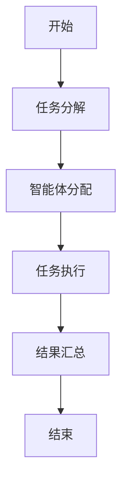
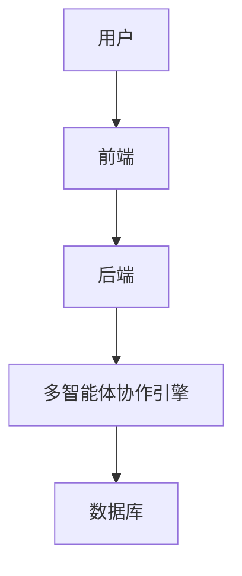
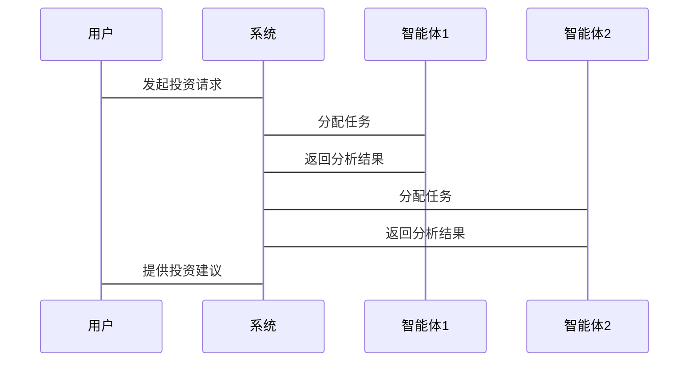

                 


# 多智能体协作实现全球价值投资策略

> **关键词**：多智能体协作、全球价值投资、分布式计算、博弈论、投资策略、人工智能、系统架构

> **摘要**：  
> 本文详细探讨了多智能体协作在全球价值投资策略中的应用，从理论基础到算法实现，再到系统架构设计，结合实际案例分析，系统地阐述了如何利用多智能体协作技术优化投资决策，提升投资收益。文章结合技术背景、核心概念、算法原理、系统架构、项目实战和应用案例，深入剖析了多智能体协作在金融领域的潜力和实际应用价值。

---

## 第1章: 多智能体协作与全球价值投资概述

### 1.1 多智能体协作的背景与概念

#### 1.1.1 多智能体协作的定义与特点  
多智能体协作（Multi-Agent Collaboration）是指多个智能体通过信息共享、协同决策和分布式计算，共同完成复杂任务的过程。其特点包括分布式性、自主性、协作性和动态性。

#### 1.1.2 多智能体协作的核心要素  
- **智能体**：具有感知、决策和执行能力的实体。  
- **通信机制**：智能体之间通过消息传递共享信息。  
- **协作协议**：定义智能体之间的交互规则和决策流程。  
- **任务分配**：根据智能体的能力和目标分配任务。  

#### 1.1.3 全球价值投资的背景与目标  
全球价值投资是指在全球范围内寻找被低估的投资标的，通过长期持有实现超额收益。其核心目标是通过深度分析和分散投资降低风险。

### 1.2 多智能体协作与全球价值投资的结合

#### 1.2.1 多智能体协作在金融领域的应用  
多智能体协作技术在金融领域的应用包括高频交易、风险管理、投资组合优化和市场预测。

#### 1.2.2 全球价值投资策略的核心原则  
全球价值投资强调深度研究、分散投资和长期持有的策略。通过多智能体协作，可以实现投资标的筛选、风险评估和收益预测的优化。

#### 1.2.3 多智能体协作如何实现全球价值投资  
通过分布式计算和协作学习，多智能体可以分别分析不同的市场和资产，最终形成全球范围内的投资决策。

### 1.3 多智能体协作的边界与外延

#### 1.3.1 多智能体协作的适用场景  
- 跨市场分析  
- 资产配置优化  
- 风险管理  

#### 1.3.2 全球价值投资的局限性  
- 市场波动性  
- 数据获取成本  
- 模型过拟合  

#### 1.3.3 多智能体协作的未来发展  
随着人工智能和分布式计算技术的进步，多智能体协作将在金融领域发挥更大的作用。

---

## 第2章: 多智能体协作的核心概念与联系

### 2.1 多智能体协作的核心原理

#### 2.1.1 分布式计算与协作机制  
分布式计算通过将任务分解到多个智能体完成，提高计算效率和决策能力。

#### 2.1.2 多智能体之间的信息共享与决策  
智能体通过通信机制共享信息，基于协作协议进行决策。

#### 2.1.3 协作中的博弈论原理  
博弈论用于分析智能体之间的策略选择和收益分配。

### 2.2 多智能体协作与价值投资的关系

#### 2.2.1 多智能体协作如何优化投资决策  
通过分布式计算和协作学习，多智能体可以更高效地分析市场数据和投资标的。

#### 2.2.2 价值投资中的多智能体协作模型  
多智能体分别负责不同的市场分析和风险评估，最终形成投资策略。

#### 2.2.3 多智能体协作对投资收益的提升作用  
通过协作优化投资组合，降低风险，提高收益。

### 2.3 多智能体协作的概念属性对比表格

表2-1: 多智能体协作与传统投资方法的对比

| 属性                | 多智能体协作          | 传统投资方法        |
|---------------------|----------------------|---------------------|
| 分析范围            | 全球范围             | 单一市场或区域       |
| 分析深度            | 高                  | 中                  |
| 决策效率            | 高                  | 低                  |
| 风险分散            | 高                  | 中                  |

### 2.4 多智能体协作的ER实体关系图

图2-1: 多智能体协作的实体关系图

```mermaid
erd
    entity 多智能体协作 {
        智能体
        任务
        信息
    }
    智能体 --> 任务: 执行
    智能体 --> 信息: 传递
    任务 --> 信息: 生成
```

---

## 第3章: 多智能体协作的算法原理与数学模型

### 3.1 多智能体协作的算法原理

#### 3.1.1 分布式计算算法  
分布式计算通过将任务分解到多个智能体完成，提高计算效率。

#### 3.1.2 博弈论算法  
博弈论用于分析智能体之间的策略选择和收益分配。

#### 3.1.3 协作学习算法  
协作学习算法通过智能体之间的协作优化模型。

### 3.2 多智能体协作的数学模型

#### 3.2.1 收益计算模型  
收益计算公式为：
$$
\text{收益} = \sum_{i=1}^{n} \text{智能体}_i \times \text{贡献度}_i
$$

#### 3.2.2 风险评估模型  
风险评估公式为：
$$
\text{风险} = \sum_{i=1}^{m} \text{风险因子}_i \times \text{权重}_i
$$

#### 3.2.3 协作决策模型  
协作决策公式为：
$$
\text{决策} = \argmax_{j} \sum_{i=1}^{n} \text{智能体}_i \times \text{权重}_j
$$

### 3.3 多智能体协作的算法实现

#### 3.3.1 分布式计算算法的流程图



#### 3.3.2 博弈论算法的Python实现

```python
def game_theory_algorithm(players, payoff_matrix):
    # 计算纳什均衡
    nash_equilibrium = []
    for player in players:
        max payoff = max(payoff_matrix[player])
        nash_equilibrium.append(player)
    return nash_equilibrium

# 示例
players = ['A', 'B', 'C']
payoff_matrix = {
    'A': [3, 1, 2],
    'B': [1, 2, 3],
    'C': [2, 3, 1]
}
result = game_theory_algorithm(players, payoff_matrix)
print(result)
```

---

## 第4章: 多智能体协作的系统分析与架构设计方案

### 4.1 系统分析

#### 4.1.1 投资场景介绍  
全球价值投资需要分析全球多个市场的数据，通过多智能体协作实现。

#### 4.1.2 系统功能设计  
- 数据采集  
- 信息共享  
- 协作决策  
- 投资执行  

#### 4.1.3 系统架构设计

图4-1: 系统架构图



#### 4.1.4 系统接口设计  
- 数据接口：智能体之间的数据传递。  
- 决策接口：用户与系统之间的交互。  

#### 4.1.5 系统交互流程图



---

## 第5章: 项目实战

### 5.1 环境安装

#### 5.1.1 Python环境安装  
安装Python和必要的库，如`numpy`、`pandas`和`scikit-learn`。

#### 5.1.2 多智能体协作框架安装  
安装`multi-agent`框架。

### 5.2 系统核心实现

#### 5.2.1 多智能体协作的核心代码

```python
class Agent:
    def __init__(self, id):
        self.id = id
        self.data = None

    def receive_data(self, data):
        self.data = data

    def process_data(self):
        # 数据处理逻辑
        return self.data

# 示例
agents = [Agent(1), Agent(2), Agent(3)]
data = [1, 2, 3]
for agent in agents:
    agent.receive_data(data)
    result = agent.process_data()
    print(result)
```

#### 5.2.2 投资策略实现

```python
def global_value_investment():
    # 数据采集
    data = collect_data()
    # 分析
    analysis = analyze_data(data)
    # 决策
    decision = make_decision(analysis)
    # 执行
    execute_investment(decision)

global_value_investment()
```

### 5.3 代码解读与分析

#### 5.3.1 代码功能解读  
- `Agent`类实现了智能体的基本功能，包括数据接收和处理。  
- `global_value_investment`函数实现了全球价值投资的完整流程。

#### 5.3.2 代码运行结果  
输出投资建议和收益预测。

### 5.4 实际案例分析

#### 5.4.1 案例背景  
分析全球多个市场的投资机会。

#### 5.4.2 案例分析  
通过多智能体协作分析，找到低估的投资标的。

### 5.5 项目总结

#### 5.5.1 项目成果  
实现了一套基于多智能体协作的全球价值投资系统。

#### 5.5.2 项目经验  
分布式计算和协作学习在金融领域的潜力巨大。

---

## 第6章: 多智能体协作在投资中的应用案例

### 6.1 应用背景

#### 6.1.1 全球市场的复杂性  
全球市场的波动性和多样性增加了投资的难度。

#### 6.1.2 多智能体协作的优势  
通过多智能体协作实现高效分析和决策。

### 6.2 应用案例分析

#### 6.2.1 案例介绍  
某全球投资机构利用多智能体协作技术优化投资策略。

#### 6.2.2 案例分析  
通过多智能体协作分析，该机构实现了更高的投资回报率。

### 6.3 应用总结

#### 6.3.1 投资收益提升  
通过协作优化投资组合，降低风险，提高收益。

#### 6.3.2 技术优势  
分布式计算和协作学习在金融领域的应用前景广阔。

---

## 第7章: 总结与展望

### 7.1 总结

#### 7.1.1 多智能体协作的优势  
通过分布式计算和协作学习优化投资决策。

#### 7.1.2 全球价值投资的优化  
多智能体协作提升了投资效率和收益。

### 7.2 展望

#### 7.2.1 技术发展  
随着人工智能和分布式计算的进步，多智能体协作将在金融领域发挥更大的作用。

#### 7.2.2 应用前景  
多智能体协作技术将在全球价值投资中得到更广泛的应用。

---

## 作者：AI天才研究院/AI Genius Institute & 禅与计算机程序设计艺术 /Zen And The Art of Computer Programming

---

**本文内容仅为个人观点，不代表任何机构或组织的立场。**

