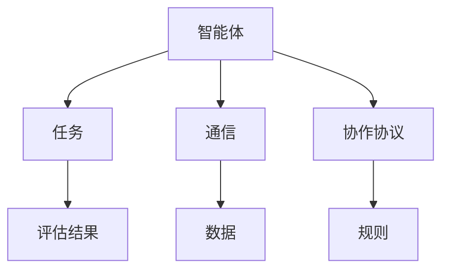
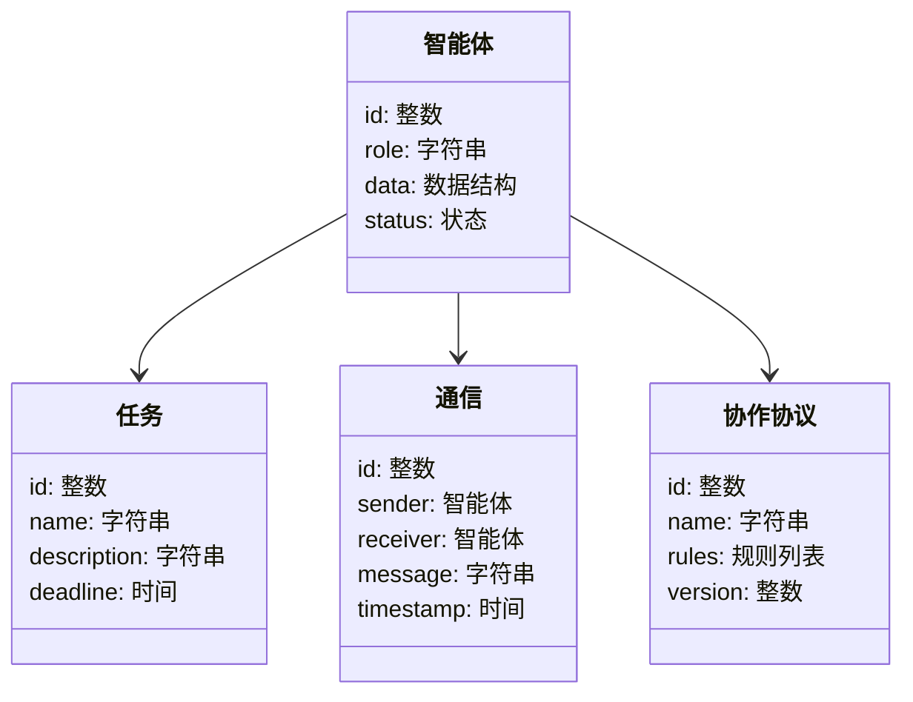
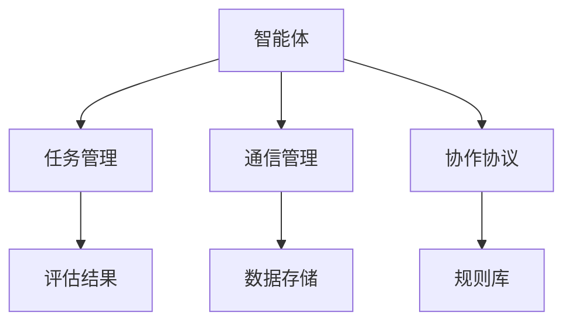
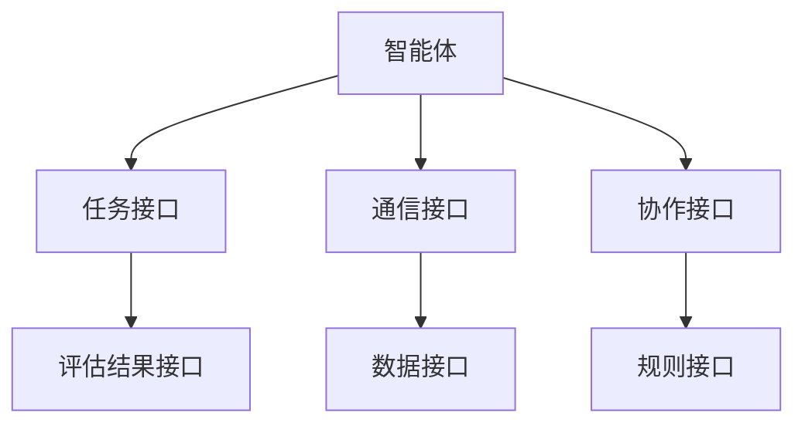
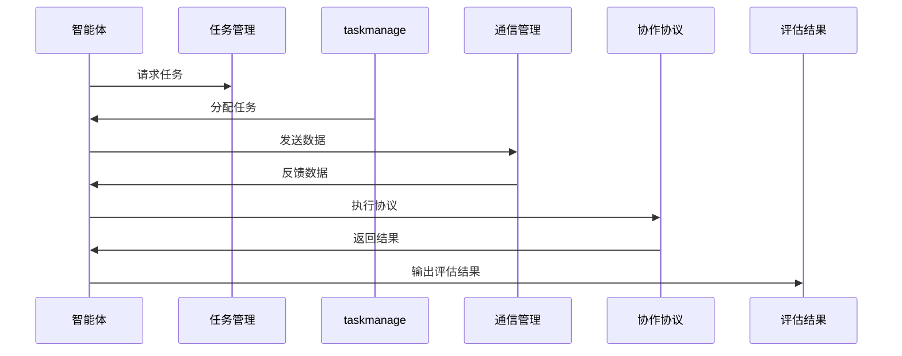

                 


# 多智能体协作实现全面的公司价值评估

## 关键词：多智能体协作，公司价值评估，人工智能算法，系统架构设计，分布式计算，机器学习模型

## 摘要：本文深入探讨了多智能体协作在公司价值评估中的应用，分析了多智能体协作的核心概念与算法原理，并结合实际案例展示了如何通过系统架构设计和数学模型实现高效的公司价值评估。文章从背景介绍、核心概念、算法实现、系统架构、项目实战等多个维度展开，为读者提供全面的技术解读。

---

## 第1章: 多智能体协作与公司价值评估背景

### 1.1 多智能体协作的定义与特点

#### 1.1.1 多智能体协作的定义
多智能体协作是指多个智能体（Agent）通过交互和协作，共同完成复杂任务的过程。智能体可以是软件程序、算法模型或分布式系统中的组件，它们通过信息共享和协同决策实现目标。

#### 1.1.2 多智能体协作的核心特点
- **分布式性**：智能体分布在不同的节点或系统中，独立运行并协同工作。
- **自主性**：每个智能体具备自主决策能力，能够根据环境和任务需求动态调整行为。
- **协作性**：智能体之间通过通信和协调，共同完成复杂任务。
- **适应性**：系统能够根据实时数据和反馈动态调整协作策略。

#### 1.1.3 多智能体协作与传统评估方法的区别
传统的公司价值评估方法通常依赖单一模型或专家经验，而多智能体协作通过多个智能体的协同工作，能够更全面地捕捉公司价值的多维信息，提升评估的准确性和效率。

### 1.2 公司价值评估的背景与挑战

#### 1.2.1 公司价值评估的基本概念
公司价值评估是对公司整体价值的量化，通常包括财务表现、市场地位、发展潜力等多个维度的分析。

#### 1.2.2 传统公司价值评估方法的局限性
- **信息孤岛**：传统方法通常依赖单一数据源，难以全面捕捉公司价值的多维信息。
- **计算复杂性**：复杂的财务模型和人工计算容易出错，且效率低下。
- **实时性不足**：传统方法难以实时更新，难以应对快速变化的市场环境。

#### 1.2.3 多智能体协作在公司价值评估中的优势
- **数据融合**：通过多智能体协作，能够整合财务、市场、技术等多维数据，提升评估的全面性。
- **实时计算**：智能体之间能够实时通信和协作，实现动态评估。
- **分布式计算**：通过分布式计算，能够高效处理大规模数据，提升计算效率。

### 1.3 多智能体协作在公司价值评估中的应用前景

#### 1.3.1 多智能体协作的潜在应用领域
- **财务数据分析**：通过智能体协作，实时分析公司财务数据，评估财务健康状况。
- **市场趋势预测**：利用多个智能体协作，预测市场趋势，评估公司市场潜力。
- **风险评估**：通过多智能体协作，识别和评估公司面临的各种风险。

#### 1.3.2 企业采用多智能体协作的优势
- **提升评估效率**：通过分布式计算和协作，显著提升公司价值评估的效率。
- **增强评估精度**：多智能体协作能够整合多维数据，提升评估的准确性和全面性。
- **实时反馈与优化**：智能体之间的实时协作，能够快速响应市场变化，优化评估结果。

#### 1.3.3 多智能体协作应用的挑战与机遇
- **技术挑战**：多智能体协作需要复杂的技术实现，包括通信协议、协作算法等。
- **数据安全**：多智能体协作涉及多个数据源，需要确保数据的安全性和隐私性。
- **应用机遇**：随着人工智能和分布式计算技术的发展，多智能体协作的应用前景广阔。

### 1.4 本章小结
本章介绍了多智能体协作的基本概念、特点以及在公司价值评估中的应用背景。通过对比传统评估方法的局限性，分析了多智能体协作在公司价值评估中的优势和应用前景。

---

## 第2章: 多智能体协作的核心概念与联系

### 2.1 多智能体协作的核心概念

#### 2.1.1 多智能体协作的定义与属性
多智能体协作是指多个智能体通过通信、协调和协作，共同完成复杂任务的过程。其核心属性包括：
- **自主性**：智能体具备自主决策能力。
- **社会性**：智能体之间能够通过通信和协作实现目标。
- **反应性**：智能体能够根据环境反馈动态调整行为。

#### 2.1.2 多智能体协作的核心要素
- **智能体**：具备自主决策和协作能力的实体。
- **通信机制**：智能体之间进行信息交换的通道。
- **协作协议**：智能体之间协作的规则和流程。
- **任务分配**：根据智能体的能力和任务需求，动态分配任务。

#### 2.1.3 多智能体协作的系统架构
多智能体协作的系统架构通常包括以下部分：
- **智能体**：负责具体任务的执行和数据处理。
- **通信层**：实现智能体之间的信息交换。
- **协作层**：负责任务分配、协调和冲突解决。
- **控制层**：对整个协作过程进行监控和管理。

### 2.2 多智能体协作与公司价值评估的联系

#### 2.2.1 多智能体协作在公司价值评估中的作用
- **数据整合**：通过多智能体协作，整合公司财务、市场、技术等多维数据。
- **动态评估**：智能体之间实时协作，动态更新评估结果。
- **风险预警**：通过多智能体协作，及时发现和预警潜在风险。

#### 2.2.2 多智能体协作与公司价值评估的系统关系
- **数据流**：智能体之间通过通信机制交换数据和信息。
- **任务协作**：智能体根据任务需求，协同完成评估任务。
- **结果反馈**：评估结果通过反馈机制优化智能体的协作策略。

#### 2.2.3 多智能体协作在公司价值评估中的具体应用
- **财务数据分析**：通过智能体协作，实时分析公司财务数据，评估财务健康状况。
- **市场趋势预测**：利用多个智能体协作，预测市场趋势，评估公司市场潜力。
- **风险评估**：通过多智能体协作，识别和评估公司面临的各种风险。

### 2.3 多智能体协作的ER实体关系图



### 2.4 本章小结
本章详细介绍了多智能体协作的核心概念和系统架构，并通过ER实体关系图展示了多智能体协作在公司价值评估中的具体应用。

---

## 第3章: 多智能体协作的算法原理

### 3.1 多智能体协作算法概述

#### 3.1.1 多智能体协作算法的基本原理
多智能体协作算法的核心在于智能体之间的通信、协调和协作。算法通常包括任务分配、信息交换、协作决策等步骤。

#### 3.1.2 多智能体协作算法的主要类型
- **基于规则的协作算法**：通过预定义规则实现智能体之间的协作。
- **基于学习的协作算法**：通过机器学习模型实现智能体之间的协作。
- **基于市场的协作算法**：通过市场机制实现智能体之间的协作。

#### 3.1.3 多智能体协作算法的优缺点
- **优点**：能够实现智能体之间的高效协作，提升任务完成效率。
- **缺点**：算法复杂，实现难度较大，且容易受到通信延迟和网络分割的影响。

### 3.2 基于多智能体协作的公司价值评估算法

#### 3.2.1 算法的基本流程
1. **数据采集**：通过多个智能体采集公司相关的多维数据。
2. **数据预处理**：对采集的数据进行清洗和标准化处理。
3. **任务分配**：根据智能体的能力和任务需求，动态分配任务。
4. **协作计算**：智能体之间通过通信和协作，共同完成公司价值评估的计算。
5. **结果反馈**：将评估结果反馈给相关方，并优化协作策略。

#### 3.2.2 算法的实现步骤
1. **数据采集**：通过智能体采集公司财务、市场、技术等数据。
2. **数据预处理**：对数据进行清洗、去重和标准化处理。
3. **任务分配**：根据智能体的能力和任务需求，动态分配任务。
4. **协作计算**：智能体之间通过通信和协作，共同完成公司价值评估的计算。
5. **结果反馈**：将评估结果反馈给相关方，并优化协作策略。

#### 3.2.3 算法的数学模型与公式
公司价值评估的数学模型可以表示为：
$$
\text{公司价值} = \alpha \times \text{财务指标} + \beta \times \text{市场指标} + \gamma \times \text{技术指标}
$$
其中，$\alpha$、$\beta$、$\gamma$是各指标的权重，可以通过机器学习模型进行优化。

### 3.3 算法的实现与优化

#### 3.3.1 算法的实现细节
- **通信机制**：通过消息队列或RPC（远程过程调用）实现智能体之间的通信。
- **协作协议**：通过预定义的规则或机器学习模型实现智能体之间的协作。
- **任务分配**：根据智能体的能力和任务需求，动态分配任务。

#### 3.3.2 算法的优化策略
- **负载均衡**：通过动态分配任务，确保智能体之间的负载均衡。
- **通信优化**：通过减少不必要的通信，降低通信延迟。
- **算法优化**：通过改进算法的数学模型和优化参数，提升评估的准确性和效率。

#### 3.3.3 算法的性能评估
- **计算效率**：评估算法在大规模数据下的计算效率。
- **评估精度**：评估算法在不同场景下的评估精度。
- **通信开销**：评估算法在通信过程中的开销。

### 3.4 本章小结
本章详细介绍了多智能体协作算法的基本原理和实现步骤，并通过数学模型和公式展示了如何实现高效的公司价值评估。

---

## 第4章: 多智能体协作算法的数学模型与公式

### 4.1 多智能体协作的基本数学模型

#### 4.1.1 单智能体的数学模型
单智能体的数学模型可以表示为：
$$
f(x) = w_1 x_1 + w_2 x_2 + \dots + w_n x_n
$$
其中，$w_i$是各个特征的权重，$x_i$是各个特征的值。

#### 4.1.2 多智能体协作的数学模型
多智能体协作的数学模型可以表示为：
$$
F(x) = \sum_{i=1}^{m} f_i(x)
$$
其中，$f_i(x)$是各个智能体的数学模型，$m$是智能体的数量。

#### 4.1.3 多智能体协作的优化模型
多智能体协作的优化模型可以表示为：
$$
\min_{w} \sum_{i=1}^{m} \sum_{j=1}^{n} (y_{ij} - f_i(x_j))^2
$$
其中，$y_{ij}$是智能体$i$对输入$x_j$的预测值，$f_i(x_j)$是智能体$i$的数学模型。

### 4.2 公司价值评估的数学公式

#### 4.2.1 公司价值评估的基本公式
公司价值评估的基本公式可以表示为：
$$
\text{公司价值} = \alpha \times \text{财务指标} + \beta \times \text{市场指标} + \gamma \times \text{技术指标}
$$
其中，$\alpha$、$\beta$、$\gamma$是各指标的权重，可以通过机器学习模型进行优化。

#### 4.2.2 多智能体协作在公司价值评估中的公式
多智能体协作在公司价值评估中的公式可以表示为：
$$
\text{公司价值} = \sum_{i=1}^{m} w_i \times f_i(x)
$$
其中，$w_i$是智能体$i$的权重，$f_i(x)$是智能体$i$的数学模型。

#### 4.2.3 公司价值评估的综合公式
公司价值评估的综合公式可以表示为：
$$
\text{公司价值} = \sum_{i=1}^{m} \sum_{j=1}^{n} w_{ij} \times x_{ij}
$$
其中，$w_{ij}$是智能体$i$对特征$j$的权重，$x_{ij}$是特征$j$的值。

### 4.3 数学模型的实现与应用

#### 4.3.1 数学模型的实现细节
- **数据预处理**：对数据进行清洗、标准化和特征选择。
- **模型训练**：通过机器学习算法训练智能体的数学模型。
- **模型评估**：通过交叉验证等方法评估模型的准确性和效率。

#### 4.3.2 数学模型的应用场景
- **财务数据分析**：通过数学模型分析公司财务数据，评估财务健康状况。
- **市场趋势预测**：利用数学模型预测市场趋势，评估公司市场潜力。
- **风险评估**：通过数学模型识别和评估公司面临的各种风险。

#### 4.3.3 数学模型的优化与

---

## 第5章: 系统分析与架构设计方案

### 5.1 问题场景介绍

#### 5.1.1 问题背景
公司价值评估需要考虑财务、市场、技术等多个维度的数据，传统的评估方法难以高效地整合这些数据。

#### 5.1.2 问题描述
公司价值评估需要实时动态的评估结果，传统方法难以满足这一需求。

#### 5.1.3 问题解决
通过多智能体协作，能够高效地整合多维数据，实现实时动态的公司价值评估。

### 5.2 项目介绍

#### 5.2.1 项目目标
实现一个多智能体协作系统，能够高效地整合多维数据，实现实时动态的公司价值评估。

#### 5.2.2 项目范围
项目范围包括数据采集、数据预处理、任务分配、协作计算和结果反馈。

### 5.3 系统功能设计

#### 5.3.1 领域模型
以下是领域模型的类图：



#### 5.3.2 系统架构设计
以下是系统架构设计的架构图：



#### 5.3.3 系统接口设计
以下是系统接口设计的接口图：



#### 5.3.4 系统交互
以下是系统交互的序列图：



### 5.4 本章小结
本章详细介绍了系统分析与架构设计方案，包括领域模型、系统架构设计、系统接口设计和系统交互设计。

---

## 第6章: 项目实战

### 6.1 环境安装

#### 6.1.1 系统要求
- 操作系统：Linux/Windows/MacOS
- Python版本：3.6+
- 依赖库：numpy, pandas, scikit-learn, matplotlib

#### 6.1.2 安装步骤
1. 安装Python环境：使用Anaconda或虚拟环境管理工具。
2. 安装依赖库：运行`pip install numpy pandas scikit-learn matplotlib`。
3. 下载项目代码：从GitHub或其他代码托管平台下载项目代码。

### 6.2 系统核心实现源代码

#### 6.2.1 数据预处理代码
```python
import pandas as pd
from sklearn.preprocessing import StandardScaler

# 读取数据
data = pd.read_csv('company_data.csv')

# 数据清洗
data.dropna(inplace=True)

# 标准化处理
scaler = StandardScaler()
scaled_data = scaler.fit_transform(data)
```

#### 6.2.2 任务分配代码
```python
import numpy as np

# 初始化智能体
agents = [Agent(i) for i in range(5)]

# 任务分配
tasks = np.random.rand(10, 5)
for i in range(len(agents)):
    agent = agents[i]
    task = tasks[i]
    agent.assign_task(task)
```

#### 6.2.3 协作计算代码
```python
from sklearn.linear_model import LinearRegression

# 初始化模型
model = LinearRegression()

# 训练模型
model.fit(scaled_data, target)

# 预测评估结果
predicted_value = model.predict(scaled_data)
```

#### 6.2.4 结果反馈代码
```python
# 反馈评估结果
feedback = {
    'predicted_value': predicted_value,
    'actual_value': actual_value
}

# 优化协作策略
agent.update_strategy(feedback)
```

### 6.3 代码应用解读与分析

#### 6.3.1 数据预处理
数据预处理是公司价值评估的关键步骤，包括数据清洗和标准化处理，确保数据的准确性和一致性。

#### 6.3.2 任务分配
任务分配是多智能体协作的核心步骤，通过动态分配任务，确保智能体之间的负载均衡和协作效率。

#### 6.3.3 模型训练
模型训练是公司价值评估的核心步骤，通过机器学习算法训练数学模型，实现高效准确的评估。

#### 6.3.4 结果反馈
结果反馈是优化协作策略的重要步骤，通过评估结果反馈，优化智能体的协作策略，提升评估的准确性和效率。

### 6.4 案例分析与详细讲解剖析

#### 6.4.1 案例背景
某公司希望通过多智能体协作实现公司价值的实时动态评估。

#### 6.4.2 数据来源
数据来源包括公司财务报表、市场数据、技术数据等多维数据。

#### 6.4.3 实施步骤
1. 数据采集：通过智能体采集公司相关的多维数据。
2. 数据预处理：对数据进行清洗、标准化处理。
3. 任务分配：根据智能体的能力和任务需求，动态分配任务。
4. 协作计算：智能体之间通过通信和协作，共同完成公司价值评估的计算。
5. 结果反馈：将评估结果反馈给相关方，并优化协作策略。

### 6.5 本章小结
本章通过具体案例展示了多智能体协作在公司价值评估中的实际应用，详细讲解了项目实战的环境安装、系统核心实现、代码应用解读与分析。

---

## 第7章: 最佳实践、小结、注意事项与拓展阅读

### 7.1 最佳实践

#### 7.1.1 系统设计
- **模块化设计**：将系统设计为模块化结构，便于维护和扩展。
- **分布式计算**：通过分布式计算，提升系统的计算效率和扩展性。
- **容错设计**：设计容错机制，确保系统的稳定性和可靠性。

#### 7.1.2 代码实现
- **代码规范**：遵循代码规范，确保代码的可读性和可维护性。
- **单元测试**：编写单元测试用例，确保代码的功能正确性。
- **性能优化**：通过性能优化，提升系统的运行效率。

#### 7.1.3 系统部署
- **容器化部署**：通过容器化技术，简化系统的部署和管理。
- **自动化运维**：通过自动化运维工具，提升系统的运维效率。
- **监控与日志**：设计监控和日志系统，便于系统的监控和维护。

### 7.2 小结
本文详细介绍了多智能体协作在公司价值评估中的应用，从背景介绍、核心概念、算法原理、系统架构、项目实战等多个维度展开，为读者提供了全面的技术解读。

### 7.3 注意事项

#### 7.3.1 数据安全
在实现多智能体协作时，需要注意数据的安全性和隐私性，确保数据不被泄露或篡改。

#### 7.3.2 系统稳定性
系统设计时需要考虑系统的稳定性和可靠性，确保系统在各种情况下都能正常运行。

#### 7.3.3 算法优化
在算法实现时，需要注意算法的优化和调优，确保系统的计算效率和评估精度。

### 7.4 拓展阅读

#### 7.4.1 多智能体协作
- **推荐书籍**：《Multi-Agent Systems: Algorithmic, Complexity, and Inferential Perspectives》
- **推荐论文**：《A Survey on Multi-Agent Systems and Their Applications》

#### 7.4.2 公司价值评估
- **推荐书籍**：《Corporate Finance》
- **推荐论文**：《A Review of Corporate Valuation Methods》

#### 7.4.3 人工智能与机器学习
- **推荐书籍**：《Hands-On Machine Learning with Scikit-Learn, Keras, and TensorFlow》
- **推荐论文**：《Deep Learning for Corporate Valuation》

---

## 作者：AI天才研究院/AI Genius Institute & 禅与计算机程序设计艺术 /Zen And The Art of Computer Programming

