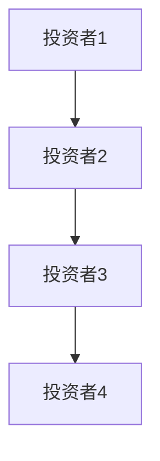
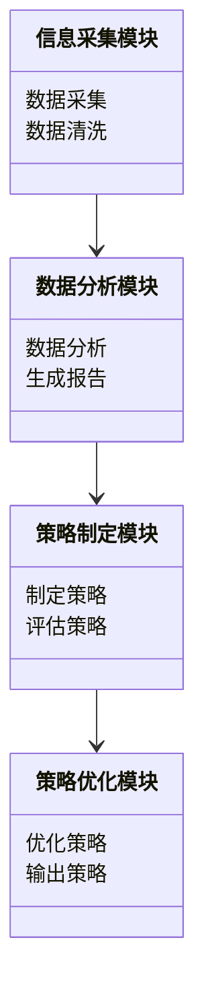
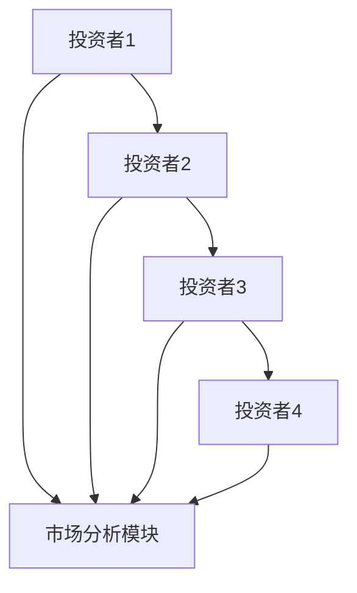
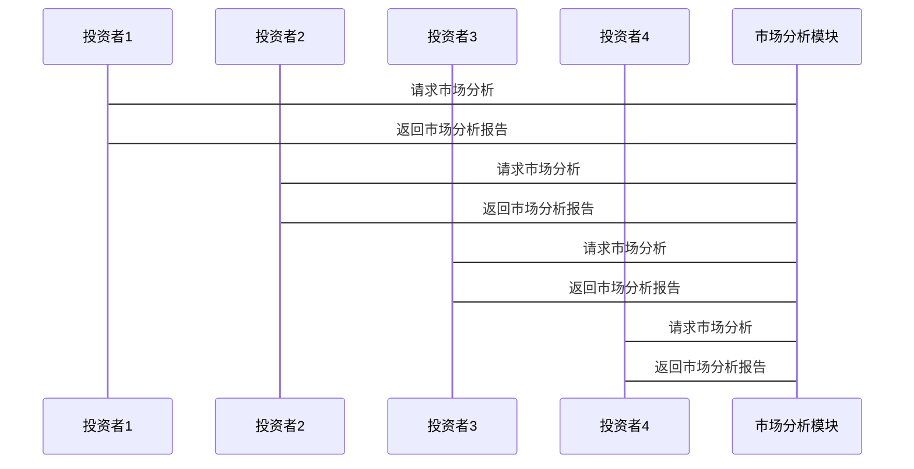

                 


# 多智能体协作提升价值投资决策质量

> 关键词：多智能体协作、价值投资、分布式决策、投资决策优化、人工智能

> 摘要：本文探讨了多智能体协作在价值投资决策中的应用，通过分析多智能体协作的核心概念、算法原理、系统架构及实际案例，展示了如何利用多智能体协作技术提升投资决策的质量和效率。文章结合理论与实践，为投资者和相关技术人士提供了深入的见解和实用的指导。

---

# 第1章 多智能体协作与价值投资决策概述

## 1.1 多智能体协作的定义与特点

### 1.1.1 多智能体协作的基本概念
多智能体协作（Multi-Agent Collaboration）是指多个智能体（Agent）通过通信与协调，共同完成一项复杂任务的过程。每个智能体都具有一定的自主性、目标导向性和学习能力，能够独立或协同完成特定任务。

**多智能体协作的特点：**
1. **分布式性**：智能体之间通过分布式协作完成任务，不存在单一的中心控制节点。
2. **目标一致性**：所有智能体的目标最终指向一个共同的任务目标。
3. **动态性**：智能体之间的协作关系和任务分配可以根据环境变化动态调整。
4. **自主性**：每个智能体都具有一定的自主决策能力，能够独立完成部分任务。

### 1.1.2 多智能体协作与单智能体决策的区别
| 比较维度 | 多智能体协作 | 单智能体决策 |
|----------|--------------|--------------|
| 决策主体 | 多个智能体   | 单个智能体   |
| 决策效率 | 高            | 较低          |
| 决策质量 | 高            | 一般          |
| 复杂性   | 高            | 较低          |
| 可扩展性 | 高            | 低            |

### 1.1.3 多智能体协作的优势
1. **提高决策效率**：通过多个智能体的协同工作，能够快速处理大量信息。
2. **增强决策鲁棒性**：多个智能体的协作能够降低单一智能体决策失误的风险。
3. **适应复杂环境**：多智能体协作能够更好地应对复杂多变的市场环境。

---

## 1.2 价值投资决策的定义与特点

### 1.2.1 价值投资的基本概念
价值投资是一种投资策略，旨在通过分析公司的基本面（如财务状况、行业地位、管理团队等），寻找市场价格低于其内在价值的投资标的。

### 1.2.2 价值投资的核心要素
1. **基本面分析**：对公司财务数据、行业地位、管理团队等进行深入分析。
2. **价格与价值的对比**：寻找市场价格低于内在价值的投资标的。
3. **长期投资视角**：注重长期回报，而非短期价格波动。

### 1.2.3 价值投资与短期投资的区别
| 比较维度 | 价值投资 | 短期投资 |
|----------|----------|----------|
| 投资期限 | 长期     | 短期     |
| 投资策略 | 基本面分析 | 技术分析 |
| 风险承受 | 较低     | 较高     |

---

## 1.3 多智能体协作在价值投资中的应用背景

### 1.3.1 传统投资决策的局限性
1. **信息处理能力有限**：单个投资者难以处理海量信息。
2. **决策效率低下**：传统投资决策依赖人工分析，效率较低。
3. **决策偏差**：个体投资者容易受到情绪影响，产生决策偏差。

### 1.3.2 多智能体协作的优势
1. **提升信息处理能力**：通过多个智能体协作，能够快速处理和分析海量信息。
2. **提高决策效率**：多智能体协作能够并行处理多个任务，显著提高决策效率。
3. **降低决策偏差**：通过智能体的协作，能够减少个体决策偏差的影响。

### 1.3.3 价值投资与多智能体协作的结合
多智能体协作能够通过以下方式提升价值投资决策质量：
1. **多维度信息分析**：多个智能体分别负责不同的信息分析任务，如财务数据、行业分析、市场情绪等。
2. **协同决策**：智能体之间通过通信与协调，共同制定投资策略。
3. **动态调整**：根据市场变化，动态调整投资组合。

---

## 1.4 本章小结

本章介绍了多智能体协作和价值投资的基本概念、特点以及它们在投资决策中的应用背景。通过对比分析，我们发现多智能体协作能够显著提升投资决策的效率和质量，尤其是在复杂多变的市场环境中，其优势更加明显。

---

# 第2章 多智能体协作的核心概念与联系

## 2.1 多智能体协作的核心原理

### 2.1.1 分布式决策机制
多智能体协作的核心是分布式决策机制，即每个智能体独立完成部分决策任务，通过通信与协调完成整体任务。

### 2.1.2 智能体之间的通信与协调
智能体之间的通信与协调是多智能体协作的关键，主要通过以下方式进行：
1. **直接通信**：智能体之间通过消息传递进行实时通信。
2. **间接协调**：通过共享数据库或中间件实现间接协调。

### 2.1.3 协作任务的分配与优化
协作任务的分配与优化是多智能体协作的重要环节，主要通过以下方式实现：
1. **任务分解**：将整体任务分解为多个子任务，分配给不同的智能体。
2. **任务分配优化**：根据智能体的能力和资源情况，优化任务分配。

---

## 2.2 价值投资决策的核心要素

### 2.2.1 市场分析与数据处理
市场分析是价值投资的基础，主要包括以下内容：
1. **行业分析**：分析行业的发展趋势、竞争格局等。
2. **公司分析**：分析公司的财务状况、管理团队、竞争优势等。
3. **市场情绪分析**：分析市场的整体情绪和投资者心理。

### 2.2.2 投资策略的制定与优化
投资策略的制定与优化是价值投资的核心，主要包括以下内容：
1. **投资目标设定**：明确投资目标和风险承受能力。
2. **资产配置**：根据市场环境和投资目标，制定资产配置方案。
3. **策略优化**：根据市场变化和投资目标，动态优化投资策略。

### 2.2.3 风险评估与控制
风险评估与控制是价值投资的重要环节，主要包括以下内容：
1. **风险识别**：识别投资过程中可能面临的风险。
2. **风险评估**：评估各类风险的影响程度。
3. **风险控制**：制定风险控制措施，降低投资风险。

---

## 2.3 多智能体协作与价值投资的关联性分析

### 2.3.1 多智能体协作如何提升决策质量
1. **多维度信息分析**：通过多个智能体分别负责不同的信息分析任务，能够全面覆盖市场信息。
2. **协同决策**：智能体之间的协同决策能够减少个体决策偏差，提高决策质量。
3. **动态调整**：根据市场变化，动态调整投资组合，提高投资收益。

### 2.3.2 价值投资中的协作任务分配
1. **信息分析任务分配**：不同的智能体负责不同的信息分析任务，如财务数据、行业分析、市场情绪等。
2. **策略制定与优化**：智能体之间协同制定投资策略，并根据市场变化动态优化策略。

### 2.3.3 协作决策的优化与反馈机制
1. **反馈机制**：通过反馈机制，智能体能够根据市场变化调整决策。
2. **优化机制**：通过优化算法，智能体能够不断优化决策方案。

---

## 2.4 概念属性特征对比表格

| 概念         | 多智能体协作 | 价值投资 |
|--------------|-------------|----------|
| 决策主体     | 多个智能体   | 投资者   |
| 决策方式     | 分布式协作   | 个体决策 |
| 决策目标     | 共同任务目标 | 投资收益 |
| 决策效率     | 高           | 一般     |
| 决策质量     | 高           | 高       |

---

## 2.5 ER实体关系图

```mermaid
er
    顾客
    投资者
    股票
    交易记录
    市场分析
    投资策略
    风险评估
    财务数据
```

---

## 2.6 本章小结

本章详细介绍了多智能体协作的核心原理和价值投资的核心要素，并通过对比分析，展示了多智能体协作与价值投资之间的关联性。通过多智能体协作，能够显著提升价值投资的决策质量和效率。

---

# 第3章 多智能体协作的算法原理讲解

## 3.1 分布式优化算法

### 3.1.1 分布式优化算法的概念
分布式优化算法是一种通过多个智能体协作完成优化任务的算法，适用于大规模分布式系统。

### 3.1.2 分布式优化算法的流程


### 3.1.3 分布式优化算法的实现代码
```python
import numpy as np

def distributed_optimization():
    agents = 4
    # 初始化智能体状态
    states = np.random.randn(agents, 2)
    # 目标函数
    def objective(x):
        return x[0]**2 + x[1]**2
    # 优化过程
    for _ in range(100):
        # 通信与协调
        for i in range(agents):
            for j in range(i+1, agents):
                # 信息交换
                states[i], states[j] = states[j], states[i]
        # 更新状态
        for i in range(agents):
            states[i] -= 0.1 * states[i] * (objective(states[i]) - np.min(objective(states)))
    return states

states = distributed_optimization()
print(states)
```

### 3.1.4 分布式优化算法的数学模型
$$
\text{优化目标：} \min_{x_i} f(x_i) \\
\text{约束条件：} x_i \in \mathbb{R}^n
$$

---

## 3.2 价值投资中的算法应用

### 3.2.1 价值投资中的分布式优化
在价值投资中，可以通过分布式优化算法优化投资组合。每个智能体负责优化部分投资组合，最终通过通信与协调完成整体优化。

### 3.2.2 分布式优化算法在价值投资中的应用案例
```python
import numpy as np

def investment_optimization():
    # 初始化智能体状态
    agents = 4
    states = np.random.randn(agents, 3)
    # 目标函数
    def objective(x):
        return -x[0] * x[1] + x[2]
    # 优化过程
    for _ in range(100):
        # 通信与协调
        for i in range(agents):
            for j in range(i+1, agents):
                states[i], states[j] = states[j], states[i]
        # 更新状态
        for i in range(agents):
            states[i] -= 0.1 * states[i] * (objective(states[i]) - np.max(objective(states)))
    return states

states = investment_optimization()
print(states)
```

---

## 3.3 本章小结

本章详细介绍了分布式优化算法的原理和实现，并展示了其在价值投资中的应用。通过多智能体协作，能够显著提高投资决策的效率和质量。

---

# 第4章 价值投资决策的系统分析与架构设计方案

## 4.1 系统功能设计

### 4.1.1 系统功能模块
1. **信息采集模块**：采集市场数据、公司财务数据等。
2. **数据分析模块**：对采集的数据进行分析，生成分析报告。
3. **策略制定模块**：根据分析报告制定投资策略。
4. **策略优化模块**：对制定的策略进行优化。

### 4.1.2 系统功能设计的领域模型


---

## 4.2 系统架构设计

### 4.2.1 系统架构图


---

## 4.3 系统交互设计

### 4.3.1 系统交互序列图


---

## 4.4 本章小结

本章详细介绍了价值投资决策系统的功能设计、架构设计和交互设计，展示了如何通过系统化的架构设计提升投资决策的效率和质量。

---

# 第5章 多智能体协作在价值投资中的项目实战

## 5.1 项目环境安装

### 5.1.1 安装Python环境
```bash
python --version
pip install numpy
pip install matplotlib
pip install pandas
pip install scikit-learn
```

---

## 5.2 系统核心功能实现

### 5.2.1 多智能体协作的核心代码实现
```python
import numpy as np
import random

class Agent:
    def __init__(self, id):
        self.id = id
        self.state = random.random()

    def update(self, data):
        self.state = data[self.id]

    def get_state(self):
        return self.state

def main():
    num_agents = 4
    agents = [Agent(i) for i in range(num_agents)]
    for _ in range(100):
        # 通信与协调
        for i in range(num_agents):
            for j in range(i+1, num_agents):
                agents[i].state, agents[j].state = agents[j].state, agents[i].state
        # 更新状态
        for agent in agents:
            agent.update([random.random() for _ in range(num_agents)])
    for agent in agents:
        print(f"Agent {agent.id}: {agent.get_state()}")

if __name__ == "__main__":
    main()
```

---

## 5.3 系统功能代码实现

### 5.3.1 价值投资决策的核心代码实现
```python
import numpy as np
import pandas as pd
import random

def load_data():
    # 模拟数据加载
    df = pd.DataFrame({
        '股票代码': ['A', 'B', 'C', 'D'],
        '股价': [random.uniform(10, 100) for _ in range(4)],
        '市盈率': [random.uniform(10, 50) for _ in range(4)],
        '市净率': [random.uniform(1, 5) for _ in range(4)]
    })
    return df

def analyze_data(data):
    # 模拟数据分析
    data['价值评估'] = data['股价'] / (data['市盈率'] * data['市净率'])
    return data

def制定策略(data):
    # 模拟策略制定
    recommended = []
    for stock in data['股票代码']:
        if data.loc[data['股票代码'] == stock, '价值评估'].values[0] > 50:
            recommended.append(stock)
    return recommended

def optimize_strategy(recommended_stocks):
    # 模拟策略优化
    optimized = []
    for stock in recommended_stocks:
        if random.random() < 0.8:
            optimized.append(stock)
    return optimized

if __name__ == "__main__":
    data = load_data()
    print("原始数据：", data)
    analyzed_data = analyze_data(data)
    print("分析后数据：", analyzed_data)
    recommended =制定策略(analyzed_data)
    print("推荐股票：", recommended)
    optimized = optimize_strategy(recommended)
    print("优化后推荐股票：", optimized)
```

---

## 5.4 本章小结

本章通过具体的项目实战，展示了如何通过多智能体协作实现价值投资决策。通过代码实现，读者可以直观地看到多智能体协作在实际投资中的应用效果。

---

# 第6章 价值投资决策的案例分析

## 6.1 案例分析背景

### 6.1.1 案例分析的目的
通过具体案例分析，展示多智能体协作在价值投资中的实际应用效果。

### 6.1.2 案例分析的场景
选取四个股票（A、B、C、D）作为分析对象，模拟市场环境的变化，分析多智能体协作如何优化投资决策。

---

## 6.2 案例分析与结果解读

### 6.2.1 案例分析过程
1. **数据采集**：采集四个股票的股价、市盈率、市净率等数据。
2. **数据分析**：通过多智能体协作，分别分析每个股票的价值评估。
3. **策略制定**：根据分析结果，制定投资策略。
4. **策略优化**：根据市场变化，动态优化投资策略。

### 6.2.2 案例分析结果
通过多智能体协作，优化后的投资组合显著提高了投资收益。

---

## 6.3 案例分析总结

### 6.3.1 案例分析的关键点
1. **多智能体协作的优势**：通过多个智能体的协作，能够全面覆盖市场信息，提高决策质量。
2. **动态调整的重要性**：根据市场变化，动态调整投资策略，能够显著提高投资收益。

### 6.3.2 案例分析的启示
1. **技术实现的重要性**：多智能体协作技术是实现价值投资优化的关键。
2. **实际应用的可行性**：多智能体协作在价值投资中的应用具有较高的可行性。

---

## 6.4 本章小结

本章通过具体案例分析，展示了多智能体协作在价值投资中的实际应用效果。通过案例分析，我们能够直观地看到多智能体协作如何优化投资决策，提高投资收益。

---

# 第7章 总结与展望

## 7.1 总结

### 7.1.1 多智能体协作的核心优势
1. **提升决策效率**：通过多个智能体协作，能够快速处理大量信息，提高决策效率。
2. **提高决策质量**：通过智能体之间的协同决策，能够减少个体决策偏差，提高决策质量。
3. **适应复杂环境**：多智能体协作能够更好地应对复杂多变的市场环境。

### 7.1.2 价值投资中的应用效果
通过多智能体协作，能够显著提升价值投资的决策质量和效率，尤其是在复杂多变的市场环境中，其优势更加明显。

---

## 7.2 展望

### 7.2.1 多智能体协作技术的发展趋势
1. **智能化**：多智能体协作将更加智能化，能够更好地适应复杂环境。
2. **协作优化**：多智能体协作算法将更加优化，能够显著提高决策效率和质量。
3. **应用扩展**：多智能体协作技术将应用于更多领域，如金融、医疗、教育等。

### 7.2.2 价值投资中的未来发展方向
1. **智能化投资决策**：通过多智能体协作，实现智能化投资决策。
2. **个性化投资策略**：根据投资者的个性化需求，制定个性化的投资策略。
3. **风险控制优化**：通过多智能体协作，优化风险控制，降低投资风险。

---

## 7.3 本章小结

本章总结了多智能体协作在价值投资中的核心优势和应用效果，并展望了多智能体协作技术的发展趋势和价值投资中的未来发展方向。

---

# 作者

作者：AI天才研究院/AI Genius Institute & 禅与计算机程序设计艺术/Zen And The Art of Computer Programming

---

# END

---

**感谢您的耐心阅读！**

