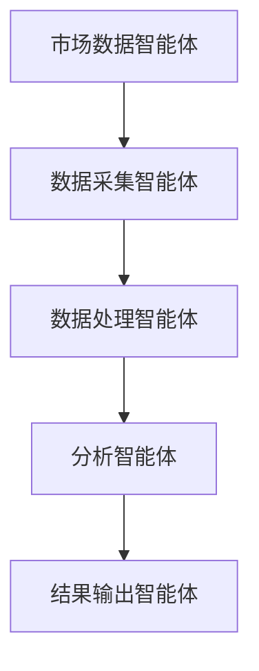
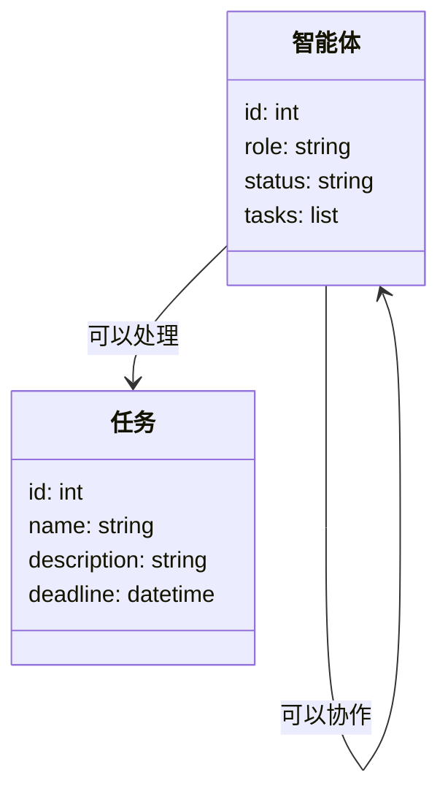
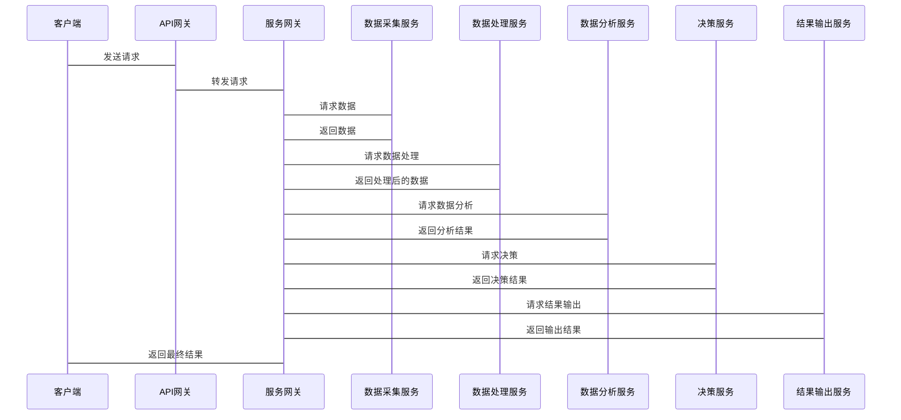

                 


# 多智能体协作提升市场分析效率

> 关键词：多智能体协作、市场分析、效率提升、分布式计算、协同算法、系统架构

> 摘要：本文深入探讨了多智能体协作在市场分析中的应用，通过分析多智能体协作的核心概念、算法原理、系统架构设计以及实际项目案例，展示了如何利用多智能体协作技术显著提升市场分析的效率和准确性。文章结合理论与实践，为读者提供了从基础概念到实际应用的全面解读。

---

# 第一部分: 多智能体协作提升市场分析效率的背景与概念

## 第1章: 多智能体协作的定义与背景

### 1.1 多智能体协作的定义

多智能体协作（Multi-Agent Collaboration）是指多个智能体（Agent）通过相互协作，共同完成一项复杂任务的过程。每个智能体都是一个具有独立性、主动性、反应性和社会性的实体，能够感知环境、自主决策并与其他智能体进行通信与协作。

#### 1.1.1 多智能体协作的基本概念

- **智能体（Agent）**：智能体是指能够感知环境、自主决策、执行任务并与其他智能体或环境进行交互的实体。
- **协作**：协作是指多个智能体通过共享信息、分配任务、协商决策，共同完成一项复杂任务的过程。

#### 1.1.2 多智能体协作的核心特点

1. **分布式性**：智能体分布在网络的不同节点上，能够独立工作并自主决策。
2. **协作性**：智能体之间通过通信和协商，共同完成任务。
3. **动态性**：任务目标、环境条件和智能体角色可能会动态变化。

#### 1.1.3 多智能体协作与传统单体分析的区别

传统的市场分析通常依赖于单个智能体或人工分析师，而多智能体协作通过多个智能体的协同工作，能够更高效地处理复杂任务，提升分析的准确性和效率。

### 1.2 市场分析效率提升的必要性

#### 1.2.1 当前市场分析的主要挑战

1. **数据量大**：市场数据种类繁多，包括文本、图像、语音等多种形式，数据量巨大。
2. **任务复杂**：市场分析需要综合考虑多种因素，如市场趋势、用户行为、竞争对手分析等。
3. **实时性要求高**：市场环境变化迅速，需要实时分析和决策。

#### 1.2.2 多智能体协作在市场分析中的优势

1. **提高效率**：通过分布式计算和任务分解，多个智能体可以同时处理不同部分的数据，显著提高分析效率。
2. **增强准确性**：多个智能体可以从不同角度分析数据，减少单一智能体的决策偏差，提高结果的准确性。
3. **适应动态变化**：智能体可以根据环境变化动态调整任务分配和协作策略。

#### 1.2.3 多智能体协作的应用场景

1. **实时市场监测**：通过多个智能体实时采集和分析市场数据，及时发现市场动态。
2. **竞争对手分析**：利用多个智能体分别分析竞争对手的市场行为，提供全面的分析报告。
3. **预测市场趋势**：通过多个智能体协作，综合分析市场数据，预测未来市场趋势。

## 第2章: 多智能体协作的核心概念与联系

### 2.1 多智能体协作的原理

#### 2.1.1 多智能体协作的基本原理

多智能体协作的核心是智能体之间的通信与协作。智能体通过共享信息、协商任务分工、协调行动，共同完成一项复杂任务。

#### 2.1.2 智能体之间的通信机制

智能体之间的通信机制是多智能体协作的基础。通信机制包括以下几种：

1. **直接通信**：智能体之间通过直接交换信息进行协作。
2. **间接通信**：智能体通过共享数据库或消息中间件进行间接通信。
3. **事件驱动通信**：智能体通过发布事件通知其他智能体进行协作。

#### 2.1.3 协作任务的分配与管理

协作任务的分配与管理是多智能体协作的重要环节。任务分配需要考虑以下因素：

1. **任务分解**：将整体任务分解为多个子任务，分配给不同的智能体。
2. **智能体能力匹配**：根据智能体的能力和当前状态，合理分配任务。
3. **动态调整**：根据环境变化和智能体状态，动态调整任务分配。

### 2.2 多智能体协作的核心要素

#### 2.2.1 智能体的角色与职责

在多智能体协作中，每个智能体都有明确的角色和职责。常见的智能体角色包括：

1. **数据采集智能体**：负责采集市场数据。
2. **数据处理智能体**：负责对采集的数据进行清洗、转换和预处理。
3. **分析智能体**：负责对数据进行分析，提取有用的信息。
4. **决策智能体**：根据分析结果制定决策策略。
5. **结果输出智能体**：负责将分析结果输出给用户。

#### 2.2.2 任务分解与协同关系

任务分解是多智能体协作的关键步骤。通过将整体任务分解为多个子任务，并将这些子任务分配给不同的智能体，可以提高协作效率。

#### 2.2.3 协作目标的达成机制

协作目标的达成机制是多智能体协作的核心。通过智能体之间的协作，最终实现整体任务的目标。

### 2.3 多智能体协作的实体关系图

以下是多智能体协作的实体关系图：



---

# 第二部分: 多智能体协作的算法原理与数学模型

## 第3章: 多智能体协作的算法原理

### 3.1 分布式计算与协作算法

#### 3.1.1 分布式计算的基本概念

分布式计算是指将计算任务分散到多个计算节点上，通过协作完成整体任务。分布式计算的优势在于能够充分利用网络资源，提高计算效率。

#### 3.1.2 协作任务的分布式处理流程

协作任务的分布式处理流程包括以下步骤：

1. **任务分解**：将整体任务分解为多个子任务。
2. **任务分配**：将子任务分配给不同的智能体。
3. **子任务执行**：各个智能体独立执行分配的子任务。
4. **结果汇总**：将各个智能体的执行结果汇总，形成最终结果。

#### 3.1.3 分布式算法的优缺点分析

- **优点**：
  - 提高计算效率。
  - 充分利用网络资源。
- **缺点**：
  - 网络延迟可能影响效率。
  - 需要复杂的任务分配和协调机制。

### 3.2 协商与决策算法

#### 3.2.1 协商机制的基本原理

协商机制是多智能体协作中的关键环节。通过协商，智能体可以分配任务、协调行动。

#### 3.2.2 基于协商的决策算法

基于协商的决策算法包括以下步骤：

1. **任务请求**：智能体向其他智能体发送任务请求。
2. **任务分配**：智能体根据自身能力和当前状态，决定是否接受任务。
3. **任务执行**：接受任务的智能体执行任务，并将结果反馈给请求智能体。
4. **结果汇总**：请求智能体汇总各个智能体的执行结果，形成最终决策。

#### 3.2.3 协商算法的实现步骤

协商算法的实现步骤如下：

1. **初始化**：设置协商参数，如时间限制、优先级等。
2. **协商请求**：智能体向其他智能体发送协商请求。
3. **协商响应**：其他智能体根据自身状态和能力，决定是否接受协商请求。
4. **协商结果**：协商完成后，智能体根据协商结果分配任务。

---

### 3.3 多智能体协作的数学模型

#### 3.3.1 分布式计算的数学模型

以下是分布式计算的数学模型：

$$
\text{总计算时间} = \sum_{i=1}^{n} \text{计算时间}_i
$$

其中，$n$ 是智能体的数量，$\text{计算时间}_i$ 是第 $i$ 个智能体的计算时间。

#### 3.3.2 协商算法的数学模型

以下是协商算法的数学模型：

$$
\text{协商成功概率} = \prod_{i=1}^{n} \text{接受概率}_i
$$

其中，$n$ 是智能体的数量，$\text{接受概率}_i$ 是第 $i$ 个智能体接受协商请求的概率。

---

# 第四部分: 系统分析与架构设计方案

## 第4章: 系统分析与架构设计

### 4.1 问题场景介绍

市场分析系统需要实时处理大量市场数据，包括文本、图像、语音等多种形式。传统的单体分析系统效率低下，难以满足实时性和准确性要求。通过多智能体协作，可以显著提高市场分析的效率和准确性。

### 4.2 系统功能设计

#### 4.2.1 领域模型

以下是领域模型：



#### 4.2.2 系统架构设计

以下是系统架构设计：


#### 4.2.3 系统接口设计

系统接口设计如下：

1. **数据采集接口**：用于采集市场数据。
2. **数据处理接口**：用于对采集的数据进行清洗和转换。
3. **数据分析接口**：用于对数据进行分析，提取有用的信息。
4. **决策接口**：用于根据分析结果制定决策策略。
5. **结果输出接口**：用于将分析结果输出给用户。

#### 4.2.4 系统交互设计

以下是系统交互设计：



---

# 第五部分: 项目实战

## 第5章: 项目实战

### 5.1 环境安装

#### 5.1.1 安装Python

```bash
# 安装Python
sudo apt-get install python3 python3-pip
```

#### 5.1.2 安装必要的库

```bash
# 安装必要的库
pip install requests
pip install mermaid
pip install matplotlib
```

### 5.2 系统核心实现源代码

#### 5.2.1 数据采集智能体

```python
import requests

def collect_data():
    # 采集数据
    response = requests.get('http://market-data.com/api')
    return response.json()

# 示例用法
data = collect_data()
print(data)
```

#### 5.2.2 数据处理智能体

```python
import pandas as pd

def process_data(data):
    # 数据清洗和转换
    df = pd.DataFrame(data)
    df.dropna(inplace=True)
    return df

# 示例用法
processed_data = process_data(data)
print(processed_data)
```

#### 5.2.3 数据分析智能体

```python
import numpy as np

def analyze_data(data):
    # 数据分析
    df = data
    mean = df['value'].mean()
    return mean

# 示例用法
result = analyze_data(processed_data)
print(result)
```

#### 5.2.4 决策智能体

```python
def make_decision(result):
    # 制定决策
    if result > 100:
        return '买入'
    elif result < 50:
        return '卖出'
    else:
        return '观望'

# 示例用法
decision = make_decision(result)
print(decision)
```

#### 5.2.5 结果输出智能体

```python
def output_result(decision):
    # 输出结果
    print(f'最终决策：{decision}')

# 示例用法
output_result(decision)
```

### 5.3 案例分析与详细解读

#### 5.3.1 实际案例分析

假设我们有一个市场分析系统，需要分析股票市场的趋势。我们可以通过以下步骤进行分析：

1. **数据采集**：采集股票市场的实时数据。
2. **数据处理**：清洗和转换数据，去除缺失值。
3. **数据分析**：计算股票的平均值。
4. **决策制定**：根据分析结果制定买入、卖出或观望的决策。
5. **结果输出**：输出最终决策结果。

#### 5.3.2 代码实现与分析

以下是完整的代码实现：

```python
import requests
import pandas as pd
import numpy as np

# 数据采集智能体
def collect_data():
    response = requests.get('http://market-data.com/api')
    return response.json()

# 数据处理智能体
def process_data(data):
    df = pd.DataFrame(data)
    df.dropna(inplace=True)
    return df

# 数据分析智能体
def analyze_data(data):
    df = data
    mean = df['value'].mean()
    return mean

# 决策智能体
def make_decision(result):
    if result > 100:
        return '买入'
    elif result < 50:
        return '卖出'
    else:
        return '观望'

# 结果输出智能体
def output_result(decision):
    print(f'最终决策：{decision}')

# 主程序
if __name__ == '__main__':
    data = collect_data()
    processed_data = process_data(data)
    result = analyze_data(processed_data)
    decision = make_decision(result)
    output_result(decision)
```

### 5.4 项目小结

通过以上步骤，我们可以看到多智能体协作在市场分析中的应用。每个智能体负责不同的任务，通过协作完成整体任务。这种协作方式能够显著提高市场分析的效率和准确性。

---

# 第六部分: 最佳实践与总结

## 第6章: 最佳实践

### 6.1 关键点总结

- **模块化设计**：将任务分解为多个子任务，每个子任务由不同的智能体负责。
- **动态调整**：根据环境变化和智能体状态，动态调整任务分配和协作策略。
- **数据安全**：确保智能体之间的通信安全，防止数据泄露。

### 6.2 注意事项

- **性能优化**：通过优化算法和减少通信开销，提高协作效率。
- **数据一致性**：确保各个智能体之间的数据一致性，避免数据冲突。
- **容错设计**：设计容错机制，确保系统在部分智能体故障时仍能正常运行。

### 6.3 未来展望

随着人工智能技术的发展，多智能体协作在市场分析中的应用将更加广泛。未来的研究方向包括：

1. **边缘计算**：利用边缘计算技术，进一步提高协作效率。
2. **强化学习**：通过强化学习算法，优化智能体的协作策略。
3. **自适应算法**：研究自适应算法，提高智能体的动态调整能力。

---

# 结语

通过本文的详细讲解，我们可以看到多智能体协作在市场分析中的巨大潜力。通过合理的任务分配和协作策略，多智能体协作能够显著提高市场分析的效率和准确性。未来，随着人工智能技术的发展，多智能体协作将在市场分析中发挥越来越重要的作用。

---

作者：AI天才研究院/AI Genius Institute & 禅与计算机程序设计艺术/Zen And The Art of Computer Programming

