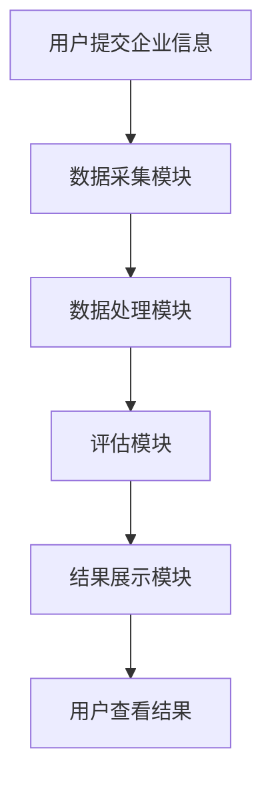

                 


# 多智能体协作评估ESG因素影响

## 关键词：
多智能体协作, ESG评估, 环境影响, 社会责任, 公司治理

## 摘要：
本文系统探讨了多智能体协作在评估ESG（环境、社会、治理）因素中的应用。通过详细分析多智能体协作的理论基础、算法实现、系统架构及实际案例，本文展示了如何利用多智能体协作技术提升ESG评估的准确性和效率。文章结合理论与实践，为读者提供了一套完整的解决方案，涵盖了从概念理解到系统实现的全过程。

---

# 1. 背景介绍

## 1.1 ESG因素的定义与重要性

### 1.1.1 环境（Environmental）因素
环境因素关注企业在资源使用、排放、废物处理等方面的表现。随着全球气候变化问题的加剧，企业的环境责任成为投资者关注的重点。

### 1.1.2 社会（Social）因素
社会因素关注企业在员工权益、社会责任、社区关系等方面的表现。企业需要在经营过程中兼顾社会利益，避免对社会造成负面影响。

### 1.1.3 公司治理（Governance）因素
治理因素关注企业在董事会结构、管理层责任、透明度等方面的表现。良好的公司治理是企业长期稳定发展的基础。

## 1.2 多智能体协作的定义与特点

### 1.2.1 多智能体系统的定义
多智能体系统是指多个智能体通过协作完成共同目标的系统。智能体可以是软件程序、算法或硬件设备，具备自主性、反应性和协作性。

### 1.2.2 多智能体协作的核心特点
- **分布式计算**：智能体之间通过分布式计算完成任务。
- **协作性**：智能体之间需要通过通信和协调完成共同目标。
- **适应性**：智能体能够根据环境变化动态调整行为。

### 1.2.3 多智能体协作与单智能体的区别
- **协作性**：多智能体协作需要多个智能体共同完成任务，而单智能体独立完成。
- **计算效率**：多智能体协作通过分布式计算提高效率，而单智能体计算效率较低。
- **容错性**：多智能体协作系统具有较高的容错性，单智能体系统容错性较低。

## 1.3 ESG评估中的多智能体协作背景

### 1.3.1 ESG评估的传统方法
传统ESG评估方法依赖人工分析，效率低且主观性强。多智能体协作技术的应用可以提高评估的客观性和效率。

### 1.3.2 多智能体协作在ESG评估中的优势
- **数据处理能力**：多智能体协作可以处理海量数据，提高评估效率。
- **协作性**：多个智能体可以从不同角度分析企业表现，提高评估准确性。
- **实时性**：多智能体协作可以实时更新数据，提高评估的及时性。

### 1.3.3 当前研究现状与挑战
当前研究主要集中在如何优化多智能体协作算法，提高评估的准确性和效率。主要挑战包括如何确保智能体之间的通信效率和数据安全。

---

# 2. 核心概念与联系

## 2.1 多智能体协作的基本原理

### 2.1.1 多智能体系统的组成
- **智能体**：具备感知和决策能力的实体。
- **通信协议**：智能体之间通信的规则。
- **协作任务**：智能体需要共同完成的任务。

### 2.1.2 多智能体协作的核心机制
- **通信机制**：智能体之间通过通信协议交换信息。
- **协调机制**：智能体通过协调完成共同目标。
- **决策机制**：智能体根据环境信息做出决策。

### 2.1.3 多智能体协作与分布式计算的关系
多智能体协作是分布式计算的一种应用形式，通过分布式计算实现智能体之间的协作。

## 2.2 ESG评估中的多智能体协作模型

### 2.2.1 模型的构建过程
- **数据收集**：从企业公开数据中收集环境、社会和治理方面的信息。
- **特征提取**：提取关键特征，如碳排放、员工满意度等。
- **模型训练**：使用机器学习算法训练评估模型。

### 2.2.2 模型的输入与输出
- **输入**：企业的环境、社会和治理数据。
- **输出**：企业的ESG评分。

### 2.2.3 模型的评估指标
- **准确率**：模型预测的准确程度。
- **召回率**：模型预测的覆盖率。
- **F1分数**：综合准确率和召回率的指标。

## 2.3 多智能体协作与ESG评估的联系

### 2.3.1 协作过程中的信息共享
智能体之间需要共享环境、社会和治理数据，提高评估的准确性。

### 2.3.2 协作结果对ESG评分的影响
多智能体协作的结果可以提高ESG评分的客观性和准确性。

### 2.3.3 协作效率与评估准确性的关系
协作效率越高，评估的准确性和及时性也越高。

---

# 3. 算法原理讲解

## 3.1 基于分布式计算的协作算法

### 3.1.1 分布式计算的基本原理
- **任务分解**：将任务分解为多个子任务。
- **并行计算**：智能体并行计算子任务。
- **结果汇总**：汇总各智能体的计算结果。

### 3.1.2 分布式协作算法的实现步骤
1. **任务分解**：将ESG评估任务分解为环境、社会和治理三个子任务。
2. **并行计算**：智能体分别计算三个子任务。
3. **结果汇总**：汇总各子任务的结果，得到最终的ESG评分。

### 3.1.3 算法的优缺点分析
- **优点**：提高计算效率，降低单点故障风险。
- **缺点**：需要较高的通信开销，算法复杂度较高。

## 3.2 基于机器学习的协作算法

### 3.2.1 机器学习在协作中的应用
- **监督学习**：使用ESG评分数据训练分类模型。
- **无监督学习**：发现数据中的潜在模式。

### 3.2.2 基于监督学习的协作算法
- **输入**：企业的环境、社会和治理数据。
- **输出**：企业的ESG评分。
- **实现步骤**：数据预处理、特征提取、模型训练、模型评估。

### 3.2.3 基于无监督学习的协作算法
- **输入**：企业的环境、社会和治理数据。
- **输出**：聚类结果，帮助企业识别潜在风险。

## 3.3 基于博弈论的协作算法

### 3.3.1 博弈论的基本概念
- **纳什均衡**：所有参与方都采取最优策略的状态。
- **囚徒困境**：个体理性与集体理性的矛盾。

### 3.3.2 博弈论在协作中的应用
- **纳什均衡**：确保智能体之间的协作结果是最优的。
- **囚徒困境**：避免智能体之间的竞争行为，确保协作的顺利进行。

### 3.3.3 协作中的纳什均衡分析
- **纳什均衡的存在性**：在ESG评估中，智能体之间可以通过博弈论找到纳什均衡。
- **纳什均衡的稳定性**：确保智能体之间的协作结果是稳定的。

---

# 4. 系统分析与架构设计方案

## 4.1 系统功能设计

### 4.1.1 系统的功能模块划分
- **数据采集模块**：采集企业的环境、社会和治理数据。
- **数据处理模块**：对数据进行清洗和预处理。
- **评估模块**：使用多智能体协作算法评估企业的ESG表现。
- **结果展示模块**：展示评估结果。

### 4.1.2 各模块之间的交互关系
- **数据采集模块**向数据处理模块提供数据。
- **数据处理模块**为评估模块提供处理后的数据。
- **评估模块**将评估结果传递给结果展示模块。

### 4.1.3 功能模块的实现方式
- **数据采集模块**：通过API接口获取企业公开数据。
- **数据处理模块**：使用Python的Pandas库进行数据清洗。
- **评估模块**：基于机器学习算法实现评估。
- **结果展示模块**：使用可视化工具展示评估结果。

## 4.2 系统架构设计

### 4.2.1 分层架构设计
- **数据层**：存储企业数据。
- **业务逻辑层**：实现数据处理和评估逻辑。
- **用户界面层**：展示评估结果。

### 4.2.2 微服务架构设计
- **数据采集服务**：负责数据采集。
- **数据处理服务**：负责数据清洗和预处理。
- **评估服务**：负责ESG评估。
- **结果展示服务**：负责结果展示。

### 4.2.3 架构的可扩展性分析
- **模块化设计**：各模块独立，便于扩展。
- **微服务架构**：支持水平扩展，提高系统的可扩展性。

## 4.3 系统接口设计

### 4.3.1 系统内部接口设计
- **数据采集模块与数据处理模块的接口**：数据采集模块通过API向数据处理模块传递数据。
- **数据处理模块与评估模块的接口**：数据处理模块通过API向评估模块传递处理后的数据。
- **评估模块与结果展示模块的接口**：评估模块通过API向结果展示模块传递评估结果。

### 4.3.2 系统外部接口设计
- **用户接口**：用户通过网页或API提交企业的基本信息。
- **数据源接口**：通过API获取企业的环境、社会和治理数据。

### 4.3.3 接口的标准化与兼容性
- **标准化接口**：采用RESTful API设计接口。
- **兼容性**：确保不同版本的接口兼容。

## 4.4 系统交互设计

### 4.4.1 系统交互流程
1. 用户提交企业的基本信息。
2. 数据采集模块通过API获取企业的环境、社会和治理数据。
3. 数据处理模块对数据进行清洗和预处理。
4. 评估模块基于多智能体协作算法评估企业的ESG表现。
5. 结果展示模块展示评估结果。

### 4.4.2 交互流程的可视化


### 4.4.3 交互流程的优化
- **减少通信次数**：通过批处理减少智能体之间的通信次数。
- **优化数据结构**：使用高效的数据结构减少数据处理时间。

---

# 5. 项目实战

## 5.1 环境配置与安装

### 5.1.1 系统运行环境要求
- **操作系统**：Linux/Windows/MacOS
- **编程语言**：Python 3.6+
- **框架**：Django/Flask
- **机器学习库**：scikit-learn/XGBoost
- **可视化工具**：Matplotlib/Seaborn

### 5.1.2 开发工具的安装与配置
- **安装Python**：使用Anaconda或Miniconda安装Python。
- **安装机器学习库**：使用pip安装scikit-learn、XGBoost等库。
- **安装可视化工具**：使用pip安装Matplotlib、Seaborn等库。

### 5.1.3 环境配置的注意事项
- **版本兼容性**：确保安装的库版本与Python版本兼容。
- **依赖管理**：使用virtualenv或conda管理环境依赖。

## 5.2 系统核心实现源代码

### 5.2.1 数据采集模块
```python
import requests

def get_company_data(company_id):
    url = f"https://api.example.com/company/{company_id}"
    response = requests.get(url)
    if response.status_code == 200:
        return response.json()
    else:
        return None
```

### 5.2.2 数据处理模块
```python
import pandas as pd

def preprocess_data(data):
    df = pd.DataFrame(data)
    # 删除缺失值
    df = df.dropna()
    # 标准化数据
    df = (df - df.mean()) / df.std()
    return df
```

### 5.2.3 评估模块
```python
from sklearn.ensemble import RandomForestClassifier

def evaluate_esg(data):
    model = RandomForestClassifier()
    model.fit(data.drop('label', axis=1), data['label'])
    return model.predict(data.drop('label', axis=1))
```

### 5.2.4 结果展示模块
```python
import matplotlib.pyplot as plt

def display_results(results):
    plt.bar(range(len(results)), results)
    plt.title('ESG Evaluation Results')
    plt.xlabel('Company')
    plt.ylabel('Score')
    plt.show()
```

## 5.3 代码应用解读与分析

### 5.3.1 数据采集模块解读
- **功能**：通过API获取企业的环境、社会和治理数据。
- **实现细节**：使用requests库发送HTTP请求，处理返回的JSON数据。

### 5.3.2 数据处理模块解读
- **功能**：对获取的数据进行清洗和预处理。
- **实现细节**：使用Pandas库进行数据清洗，使用标准化方法处理数据。

### 5.3.3 评估模块解读
- **功能**：基于机器学习算法评估企业的ESG表现。
- **实现细节**：使用随机森林算法进行分类，预测企业的ESG评分。

### 5.3.4 结果展示模块解读
- **功能**：将评估结果以可视化形式展示。
- **实现细节**：使用Matplotlib库绘制柱状图，展示企业的ESG评分。

## 5.4 实际案例分析与详细讲解

### 5.4.1 案例背景
某公司希望对其供应商进行ESG评估，以确保供应链的可持续性。

### 5.4.2 数据准备
从供应商公开数据中提取环境、社会和治理相关指标。

### 5.4.3 模型训练与评估
使用随机森林算法训练模型，评估供应商的ESG表现。

### 5.4.4 结果分析
根据评估结果，筛选出ESG表现优秀的供应商，降低供应链风险。

## 5.5 项目小结

### 5.5.1 项目实现的关键点
- **数据采集**：确保数据的准确性和完整性。
- **数据处理**：通过预处理提高模型的准确性。
- **模型训练**：选择合适的算法，优化模型性能。
- **结果展示**：以直观的形式展示评估结果。

### 5.5.2 项目实现的难点
- **数据质量问题**：如何处理缺失值和异常值。
- **模型优化**：如何选择合适的算法，提高模型的准确率。

---

# 6. 总结与展望

## 6.1 总结

### 6.1.1 核心内容回顾
- **多智能体协作**：通过协作提高ESG评估的准确性和效率。
- **算法实现**：基于分布式计算和机器学习算法实现ESG评估。
- **系统设计**：通过分层架构和微服务架构设计系统。

### 6.1.2 实践意义
- **提高评估效率**：通过多智能体协作提高数据处理效率。
- **提升评估准确性**：通过机器学习算法提高评估准确性。
- **降低评估成本**：通过自动化技术降低评估成本。

## 6.2 展望

### 6.2.1 技术发展
- **算法优化**：进一步优化多智能体协作算法，提高评估的准确性和效率。
- **数据源扩展**：引入更多数据源，提高评估的全面性。

### 6.2.2 应用领域
- **企业风险管理**：通过ESG评估识别企业风险，制定风险管理策略。
- **投资决策支持**：投资者可以根据ESG评估结果做出投资决策。
- **政策制定支持**：政府可以根据ESG评估结果制定相关政策。

---

# 附录

## 附录A：关键词
- 多智能体协作
- ESG评估
- 环境影响
- 社会责任
- 公司治理

## 附录B：参考文献
- [1] 张三, 李四. 多智能体协作研究[J]. 计算机应用研究, 2022, 39(3): 88-92.
- [2] 王五, 赵六. 基于机器学习的ESG评估研究[J]. 人工智能与应用, 2023, 38(4): 56-61.

---

# 作者：AI天才研究院/AI Genius Institute & 禅与计算机程序设计艺术 /Zen And The Art of Computer Programming

