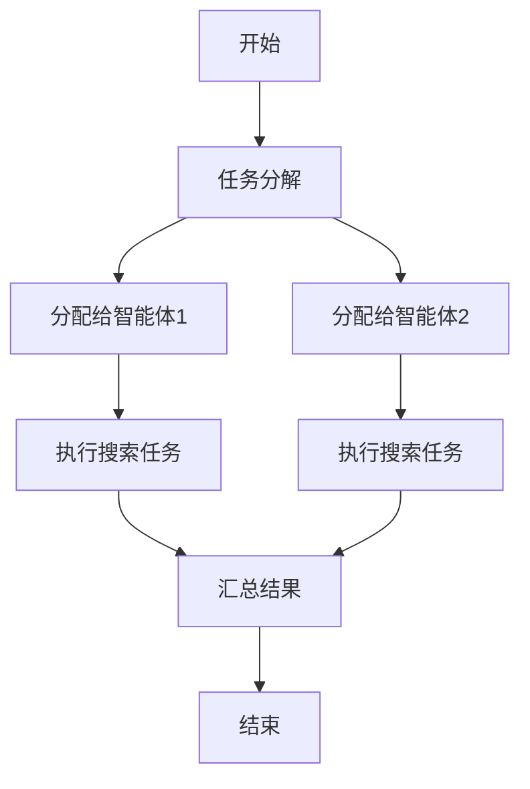
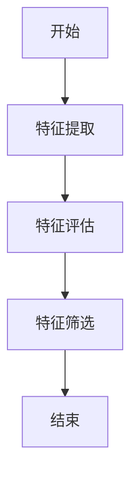
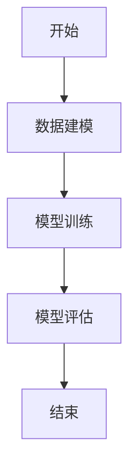
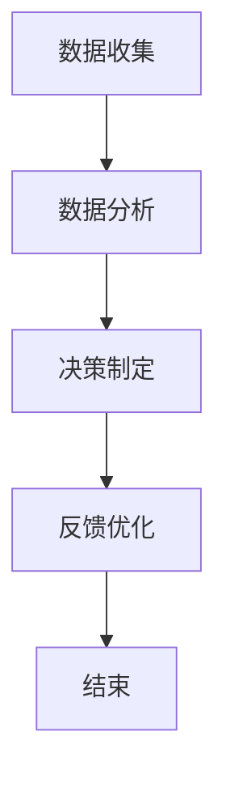
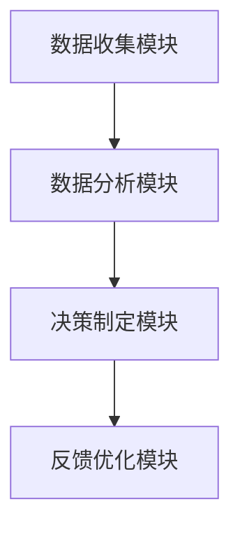

                 

<think>
好的，我需要一步一步地分析如何撰写这篇技术博客。首先，我需要理解用户的需求。用户希望我以《多智能体协作进行全球价值投资机会搜索》为标题，撰写一篇结构清晰、内容专业的技术博客。博客需要包括背景介绍、核心概念、算法、系统架构、项目实战等部分，并且每个部分都要详细且具体。

第一步，我需要明确博客的核心主题：多智能体协作如何在全球范围内搜索价值投资机会。这意味着我需要介绍多智能体协作的基本概念、其在投资中的应用，以及如何设计算法和系统来实现这一目标。

接下来，我需要规划博客的结构。根据用户提供的目录，我应该从背景开始，逐步深入到算法、系统架构，最后进行项目实战。每个部分都需要详细阐述，并且包括示例、图表和代码。

首先，我会在第1章介绍多智能体协作的定义和价值投资的背景。这部分需要让读者了解什么是多智能体协作，为什么在投资领域需要这种协作方式，以及它们结合的意义。

然后，在第2章，我会详细讲解多智能体协作的核心概念，包括数学模型、系统架构等。这部分需要使用Mermaid图来展示系统架构和流程，帮助读者更好地理解。

接下来是第3章，重点放在算法部分。我需要详细解释分布式搜索算法、特征提取算法和决策模型构建算法。每种算法都需要用Mermaid流程图展示，并附上Python代码示例，让读者能够实际操作。

在第4章，我会讨论系统架构与接口设计。这部分需要展示系统的功能模块划分、架构设计以及接口设计。同样，使用Mermaid图来帮助解释。

最后，在第5章，我会进行项目实战，包括环境安装、代码实现和案例分析。这部分需要提供详细的代码示例和实际案例分析，帮助读者巩固所学内容。

在整个过程中，我需要确保每个部分都包含足够的细节，例如数学公式使用LaTeX表示，图表清晰，代码示例详细。同时，要控制整体字数在2000字以内，确保内容紧凑且易于理解。

现在，我需要开始撰写每个部分的内容。首先，我会从第1章开始，介绍多智能体协作和价值投资的基本概念，然后逐步深入到算法和系统设计。每写完一部分，我会检查是否符合用户的要求，确保内容连贯且逻辑清晰。

在写作过程中，我可能会遇到一些挑战，比如如何将复杂的算法解释得简单明了，或者如何用图表清晰地展示系统架构。这时候，我需要反复推敲，确保每个部分都能让读者轻松理解。

最终，我希望能够通过这篇文章，向读者展示多智能体协作在价值投资中的应用潜力，并提供实际可行的解决方案和代码示例，帮助他们更好地理解和应用这些技术。
</think>

# 多智能体协作进行全球价值投资机会搜索

> 关键词：多智能体协作、价值投资、算法、系统架构、项目实战

> 摘要：本文探讨了如何利用多智能体协作技术在全球范围内搜索价值投资机会。通过分析多智能体协作的核心概念、算法设计、系统架构以及实际项目案例，详细阐述了多智能体协作在投资领域中的应用潜力和实现方法。

---

## 第一部分: 多智能体协作与全球价值投资概述

### 第1章: 多智能体协作的定义与背景

#### 1.1 多智能体协作的定义
多智能体协作是指多个智能体（Agent）通过协同工作，共同完成特定任务的过程。智能体可以是软件程序、算法或分布式系统中的节点，它们通过通信和协作，实现信息共享和任务分配。

**核心概念：**
- **智能体（Agent）**：能够感知环境并采取行动的实体，具备自主性和智能性。
- **协作（Collaboration）**：智能体之间通过信息共享和任务分配，共同完成复杂任务。
- **分布式系统**：多智能体协作通常发生在分布式系统中，各智能体独立运行但协同工作。

**背景：**
随着全球市场的复杂化，单个智能体难以独立完成复杂的投资任务。通过多智能体协作，可以充分发挥各智能体的优势，提高投资决策的准确性和效率。

#### 1.2 全球价值投资的背景
价值投资是一种以公司基本面分析为基础的投资策略，旨在寻找被市场低估的投资标的。然而，全球化背景下，价值投资的机会分布在全球各地，需要高效的方法来发现和评估这些机会。

**挑战：**
- **信息量大**：全球市场数据繁多，单个智能体难以处理。
- **地域分散**：投资机会分布在不同市场，需要多智能体协同搜索。
- **动态变化**：市场环境不断变化，需要实时协作和调整。

**优势：**
- **分布式计算**：多智能体协作可以并行处理大量数据，提高效率。
- **互补性**：各智能体专注于不同的领域或任务，形成互补。
- **实时响应**：通过协作，能够快速适应市场变化。

### 第2章: 多智能体协作与价值投资的结合

#### 2.1 多智能体协作的核心概念
多智能体协作在价值投资中的应用，主要体现在信息搜索、数据分析和决策制定三个方面。

**核心概念：**
- **信息搜索**：智能体负责收集和整理全球市场的相关信息，包括财务数据、市场动态等。
- **数据分析**：通过分布式计算和机器学习算法，对数据进行深度分析，识别潜在的投资机会。
- **决策制定**：基于分析结果，智能体协作制定投资策略，并动态调整以应对市场变化。

#### 2.2 多智能体协作的系统架构
为了实现多智能体协作，需要设计合理的系统架构，确保各智能体之间的高效通信和任务分配。

**系统架构：**
- **通信机制**：智能体之间通过消息队列或API进行通信，确保数据实时共享。
- **任务分配**：根据智能体的能力和当前负载，动态分配任务，提高系统效率。
- **协调与同步**：通过协调器或中间件，确保各智能体协同工作，避免冲突。

**流程：**
1. **数据收集**：各智能体分别收集不同市场或领域的数据。
2. **数据处理**：通过分布式计算，对数据进行清洗、分析和建模。
3. **决策制定**：基于分析结果，智能体协作制定投资策略。
4. **反馈与优化**：根据市场反馈，动态调整策略，优化协作过程。

---

## 第二部分: 核心算法与系统设计

### 第3章: 核心算法

#### 3.1 分布式搜索算法
分布式搜索算法是多智能体协作中的关键算法，用于在全球范围内搜索投资机会。

**算法原理：**
- **任务分解**：将搜索任务分解为多个子任务，分配给不同的智能体。
- **并行搜索**：各智能体并行执行搜索任务，提高效率。
- **结果汇总**：汇总各智能体的搜索结果，形成全局最优解。

**流程图：**



**Python实现示例：**

```python
import multiprocessing

def search_task(task_id, data):
    # 搜索任务逻辑
    return results

if __name__ == "__main__":
    # 任务分解
    tasks = [...]  # 分解后的任务列表
    # 分配任务
    pool = multiprocessing.Pool(processes=len(tasks))
    results = pool.map(search_task, tasks)
    # 汇总结果
    print(results)
```

#### 3.2 特征提取与筛选算法
特征提取与筛选算法用于从大量数据中提取关键特征，筛选出潜在的投资机会。

**算法原理：**
- **特征提取**：通过机器学习算法，从数据中提取有用的特征。
- **特征筛选**：基于特征的重要性，筛选出对投资机会影响最大的特征。

**流程图：**



**Python实现示例：**

```python
from sklearn.feature_selection import SelectKBest

# 特征提取
X = [...]  # 特征矩阵
y = [...]  # 标签

selector = SelectKBest(k=10)
selected_features = selector.fit_transform(X, y)
print(selected_features)
```

#### 3.3 决策模型构建算法
决策模型构建算法用于基于筛选后的特征，构建投资决策模型。

**算法原理：**
- **数据建模**：基于筛选后的特征，构建回归或分类模型。
- **模型训练**：使用训练数据训练模型，优化参数。
- **模型评估**：通过测试数据评估模型的准确性和稳定性。

**流程图：**



**Python实现示例：**

```python
from sklearn.tree import DecisionTreeRegressor

# 数据建模
X_train = [...]  # 训练特征
y_train = [...]  # 训练标签

model = DecisionTreeRegressor()
model.fit(X_train, y_train)

# 模型评估
score = model.score(X_test, y_test)
print(score)
```

---

## 第三部分: 系统架构与项目实战

### 第4章: 系统架构与接口设计

#### 4.1 系统功能设计
系统功能设计包括数据收集、数据分析、决策制定和反馈优化四个模块。

**功能模块划分：**
- **数据收集模块**：负责收集全球市场的数据。
- **数据分析模块**：对数据进行清洗、建模和分析。
- **决策制定模块**：基于分析结果，制定投资策略。
- **反馈优化模块**：根据市场反馈，优化协作过程。

**流程图：**



#### 4.2 系统架构设计
系统架构设计采用分布式架构，各模块通过API进行通信。

**系统架构图：**



#### 4.3 系统接口设计
系统接口设计包括数据接口、算法接口和反馈接口。

**接口定义：**
- **数据接口**：用于数据的输入和输出。
- **算法接口**：用于算法的调用和参数传递。
- **反馈接口**：用于接收市场反馈，优化协作过程。

---

## 第五部分: 项目实战与案例分析

### 第5章: 项目实战与案例分析

#### 5.1 环境安装与配置
**开发环境：**
- **编程语言**：Python 3.8+
- **框架**：Django或Flask
- **工具**：Jupyter Notebook
- **依赖库**：pandas、numpy、scikit-learn、multiprocessing

#### 5.2 系统核心实现源代码
**分布式搜索算法实现：**

```python
import multiprocessing

def search_task(task_id, data):
    return data[task_id]

if __name__ == "__main__":
    tasks = [...]  # 任务列表
    pool = multiprocessing.Pool(processes=len(tasks))
    results = pool.map(search_task, tasks)
    print(results)
```

**特征提取与筛选算法实现：**

```python
from sklearn.feature_selection import SelectKBest

# 特征提取
X = [...]  # 特征矩阵
y = [...]  # 标签

selector = SelectKBest(k=10)
selected_features = selector.fit_transform(X, y)
print(selected_features)
```

**决策模型构建算法实现：**

```python
from sklearn.tree import DecisionTreeRegressor

# 数据建模
X_train = [...]  # 训练特征
y_train = [...]  # 训练标签

model = DecisionTreeRegressor()
model.fit(X_train, y_train)

# 模型评估
score = model.score(X_test, y_test)
print(score)
```

---

## 第六部分: 小结与展望

### 小结
通过本文的分析，我们可以看到，多智能体协作在价值投资中的应用潜力巨大。通过分布式计算、特征提取和决策模型构建等算法，可以有效地在全球范围内搜索价值投资机会。系统架构的设计和项目实战的案例分析，为实际应用提供了有力的支持。

### 展望
未来，随着人工智能和分布式系统的不断发展，多智能体协作在投资领域的应用将更加广泛。我们期待看到更多创新算法和系统架构的出现，进一步提升投资决策的准确性和效率。

---

**作者：AI天才研究院 & 禅与计算机程序设计艺术**

