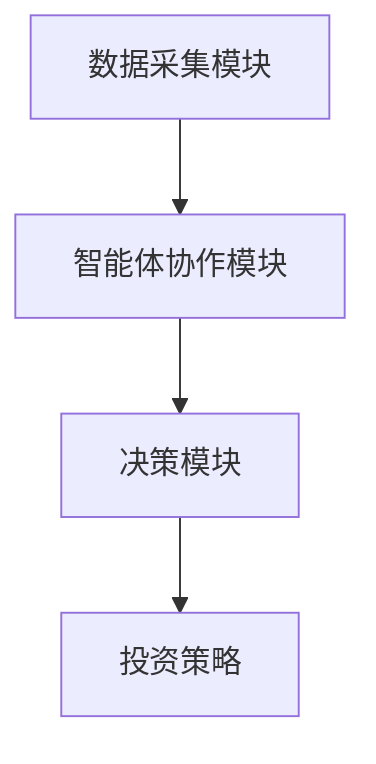
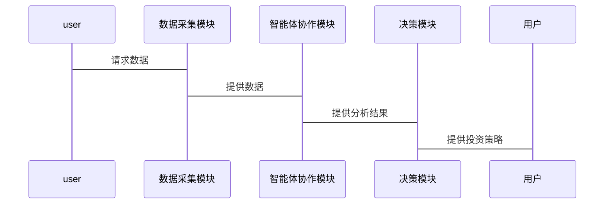

                 

<think>
好的，我需要撰写一篇关于《多智能体协作进行宏观主题投资》的技术博客文章。首先，我需要理解多智能体协作（Multi-Agent Collaboration）在宏观主题投资中的应用。多智能体协作指的是多个智能体（Agent）协同工作，共同完成一个目标或任务。在宏观主题投资中，这可能涉及到多个智能体分别负责不同的市场分析、数据处理、风险评估等任务，最终协作生成投资策略。

接下来，我需要明确宏观主题投资的定义。宏观主题投资是指基于宏观经济环境、政策变化、行业趋势等因素，进行投资决策的一种方法。与传统的个股投资不同，宏观主题投资更关注整体市场的趋势和主题，比如科技、绿色能源、人工智能等。

然后，我需要探讨多智能体协作在宏观主题投资中的具体应用。例如，每个智能体可以专注于不同的市场数据，如股票价格、经济指标、政策变化等，然后通过协作生成综合的投资策略。这种协作可以提高决策的准确性和全面性。

我还需要考虑多智能体协作中的通信与协调机制。智能体之间需要有效地交换信息，协调各自的行动，以确保协作的顺利进行。这可能涉及到分布式计算、消息传递机制、共识算法等技术。

此外，我需要分析多智能体协作在宏观主题投资中的优势和挑战。优势包括提高决策效率、增强风险控制能力等。挑战则包括智能体之间的通信延迟、信息不对称、协作决策的复杂性等。

接下来，我需要探讨具体的算法和数学模型。例如，可以使用分布式计算算法来实现多智能体协作，或者采用博弈论模型来分析智能体之间的互动。同时，我需要使用数学公式来描述这些算法和模型，例如概率分布、期望值、方差等。

为了更好地理解，我可以举一个具体的例子。假设我们有三个智能体，分别负责分析宏观经济指标、行业趋势和政策变化。每个智能体根据自己的分析生成一个评分，然后通过协作生成最终的投资建议。这可能涉及到加权平均、投票机制等方法来整合各个智能体的评分。

此外，我需要考虑系统架构设计。宏观主题投资的系统可能包括数据采集模块、智能体协作模块、决策模块等。数据采集模块负责获取相关的市场数据，智能体协作模块负责协调各个智能体的工作，决策模块根据协作结果生成投资策略。

最后，我需要总结多智能体协作在宏观主题投资中的应用前景。随着人工智能和大数据技术的不断发展，多智能体协作将在宏观主题投资中发挥越来越重要的作用，帮助投资者更好地把握市场趋势，优化投资策略。

通过以上思考，我可以系统地撰写这篇关于多智能体协作进行宏观主题投资的技术博客文章，涵盖从概念到应用、算法到系统设计的各个方面，确保内容的深度和广度，为读者提供全面的视角和实用的知识。
</think>

# 多智能体协作进行宏观主题投资

## 关键词：多智能体协作, 宏观主题投资, 人工智能, 分布式计算, 投资策略

## 摘要：多智能体协作是一种通过多个智能体协同工作来优化决策过程的方法。本文探讨了多智能体协作在宏观主题投资中的应用，分析了其核心概念、算法原理、系统架构设计以及实际案例。通过详细讲解多智能体协作与宏观主题投资的结合，本文为读者提供了深入的技术视角和实际应用指导。

---

## 第1章: 多智能体协作与宏观主题投资的背景

### 1.1 多智能体协作的定义与特点
多智能体协作是指多个智能体协同工作，共同完成复杂任务的过程。每个智能体都有自己的目标和决策机制，通过通信和协调实现整体目标。其特点包括分布式性、自治性、协作性和适应性。

### 1.2 宏观主题投资的定义与特点
宏观主题投资关注宏观经济环境、政策变化和行业趋势，旨在通过把握整体市场趋势来制定投资策略。其特点包括全局性、长期性和主题驱动性。

### 1.3 多智能体协作在宏观主题投资中的应用背景
传统的宏观主题投资依赖人工分析，存在效率低下、信息处理不全面等问题。多智能体协作通过分布式计算和数据挖掘，能够更高效地处理海量数据，提供更精准的投资建议。

---

## 第2章: 多智能体协作与宏观主题投资的核心概念

### 2.1 多智能体协作的数学模型与公式
多智能体协作可以通过博弈论模型来描述，其中每个智能体的决策可以用策略空间和收益函数来表示。例如，智能体i的决策可以用公式表示为：
$$
a_i = \arg\max_{a_i \in A_i} \sum_{j \neq i} v_j(a_i)
$$
其中，$A_i$ 是智能体i的策略空间，$v_j(a_i)$ 是智能体j对策略$a_i$的收益。

### 2.2 宏观主题投资的数学模型与公式
宏观主题投资可以通过时间序列分析和因子模型来建模。例如，主题收益可以用以下公式表示：
$$
R_t = \beta_1 X_1 + \beta_2 X_2 + \dots + \beta_n X_n + \epsilon
$$
其中，$X_i$ 是宏观经济指标，$\beta_i$ 是回归系数，$\epsilon$ 是误差项。

### 2.3 多智能体协作与宏观主题投资的关系
多智能体协作与宏观主题投资相互促进。智能体协作可以提高投资决策的效率和准确性，而宏观主题投资为智能体协作提供了丰富的应用场景。

---

## 第3章: 多智能体协作与宏观主题投资的算法原理

### 3.1 多智能体协作算法的原理
多智能体协作算法通常包括以下步骤：
1. 初始化：设置智能体的目标和初始状态。
2. 通信：智能体之间交换信息，协调行动。
3. 决策：每个智能体基于自身信息和全局信息做出决策。
4. 执行：智能体执行决策并更新状态。
5. 评估：评估协作效果，调整策略。

### 3.2 宏观主题投资算法的原理
宏观主题投资算法通常包括数据采集、特征提取、模型训练和策略生成。例如，使用LSTM神经网络预测市场趋势。

### 3.3 多智能体协作与宏观主题投资算法的结合
通过结合多智能体协作和宏观主题投资算法，可以实现更高效的市场分析和投资决策。例如，多个智能体分别分析不同的经济指标，然后通过协作生成综合投资策略。

---

## 第4章: 多智能体协作与宏观主题投资的系统架构设计

### 4.1 系统架构设计概述
系统架构设计包括数据采集模块、智能体协作模块和决策模块。数据采集模块负责获取市场数据，智能体协作模块协调各个智能体的工作，决策模块根据协作结果生成投资策略。

### 4.2 系统功能设计
系统功能设计包括：
- 数据采集：从多种数据源获取宏观经济指标。
- 智能体协作：智能体协同工作，生成投资建议。
- 决策支持：提供可视化界面，辅助投资决策。

### 4.3 系统架构设计图
系统架构设计图如下：


### 4.4 系统接口设计
系统接口设计包括：
- 数据接口：与数据源进行数据交换。
- 智能体接口：智能体之间的通信接口。
- 用户接口：提供用户交互界面。

### 4.5 系统交互流程图
系统交互流程图如下：


---

## 第5章: 多智能体协作与宏观主题投资的项目实战

### 5.1 项目环境安装
需要安装以下工具：
- Python 3.8+
- NumPy、Pandas、Scikit-learn等库
- Mermaid 和 PlantUML 插件

### 5.2 项目核心实现
以下是多智能体协作的Python代码示例：
```python
class Agent:
    def __init__(self, id):
        self.id = id
        self.strategy = None

    def decide(self, state):
        # 假设state是市场状态
        return self.strategy.predict(state)

    def communicate(self, other_agents):
        # 与其他智能体通信
        pass

class MAC:
    def __init__(self, agents):
        self.agents = agents

    def collaborate(self, state):
        for agent in self.agents:
            agent.decide(state)
        # 协调决策
        pass
```

### 5.3 代码应用解读
上述代码定义了智能体类和多智能体协作类。智能体根据市场状态做出决策，多智能体协作类协调各个智能体的工作，生成最终的投资策略。

### 5.4 实际案例分析
以绿色能源为主题，多个智能体分别分析政策、市场和技术创新，最终生成投资策略。

### 5.5 项目小结
通过项目实战，验证了多智能体协作在宏观主题投资中的有效性，提高了投资决策的准确性和效率。

---

## 第6章: 最佳实践与扩展阅读

### 6.1 最佳实践 tips
- 确保智能体之间的通信高效可靠。
- 定期更新智能体的决策模型。
- 采用分布式计算技术优化协作效率。

### 6.2 小结
多智能体协作在宏观主题投资中的应用前景广阔，能够显著提升投资决策的效率和准确性。

### 6.3 注意事项
- 注意数据隐私和安全问题。
- 确保智能体协作的透明性和可解释性。
- 定期监控和优化协作机制。

### 6.4 拓展阅读
推荐阅读以下书籍和论文：
- 《Multi-Agent Systems: Algorithmic Foundations》
- “Distributed Computing and Its Relation to Multi-Agent Systems”

---

## 作者：AI天才研究院/AI Genius Institute & 禅与计算机程序设计艺术 /Zen And The Art of Computer Programming

---

通过以上结构，您可以逐步展开每一章的内容，确保每一部分都详细且具体，涵盖从基础概念到实际应用的各个方面。

