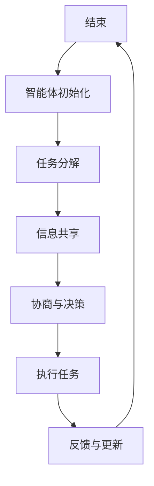
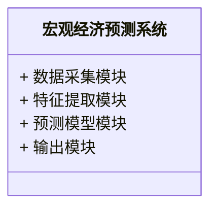
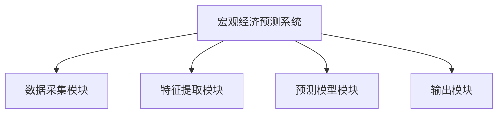

                 


# 多智能体协作进行宏观经济预测

## 关键词：多智能体协作、宏观经济预测、人工智能、分布式计算、智能体系统、预测模型

## 摘要：本文探讨了多智能体协作在宏观经济预测中的应用，分析了多智能体协作的核心概念、算法原理、系统架构，通过具体案例展示了多智能体协作的优势，并提出了实际应用中的最佳实践和未来研究方向。

---

## 第一部分: 多智能体协作与宏观经济预测的背景介绍

### 第1章: 多智能体协作与宏观经济预测概述

#### 1.1 多智能体协作的定义与特点
多智能体协作是指多个智能体通过协作完成共同目标的过程。其特点包括分布式性、自主性、协同性和适应性。与传统单智能体预测相比，多智能体协作能够利用多个智能体的优势，提高预测的准确性和鲁棒性。

#### 1.2 宏观经济预测的定义与挑战
宏观经济预测是对经济整体走势的预测，涉及GDP、通货膨胀率、失业率等多个指标。其挑战包括数据复杂性、预测模型的局限性和不确定性。多智能体协作能够通过分布式计算和协同学习，有效应对这些挑战。

#### 1.3 多智能体协作在宏观经济预测中的应用前景
多智能体协作在宏观经济预测中的应用前景广阔，可以应用于经济建模、政策模拟和风险评估等领域。通过多个智能体的协作，能够提高预测的准确性和应对复杂经济环境的能力。

---

## 第二部分: 多智能体协作的核心概念与联系

### 第2章: 多智能体协作的核心概念原理

#### 2.1 多智能体协作的原理
多智能体协作的原理包括任务分解、信息共享和协同决策。每个智能体负责特定任务，并通过信息共享和协商完成协同。

#### 2.2 多智能体协作的属性特征对比
以下是不同多智能体系统的对比：

| 特性       | 分布式多智能体 | 集中式多智能体 |
|------------|----------------|----------------|
| 结构       | 去中心化       | 中心化         |
| 协调方式   | 自主协商       | 中央控制       |
| 灵活性     | 高             | 低             |
| 容错性     | 高             | 低             |

#### 2.3 多智能体协作的ER实体关系图
以下是多智能体协作的ER实体关系图：

```mermaid
erd
actor: 智能体
attribute: 属性
task: 任务
role: 角色
goal: 目标

actor -[1..n]-> task: 执行
actor -[1..n]-> role: 担任
task -[1..n]-> goal: 实现
```

---

## 第三部分: 多智能体协作的算法原理讲解

### 第3章: 多智能体协作算法的原理与实现

#### 3.1 多智能体协作算法的原理
多智能体协作算法基于分布式计算和协商机制。智能体通过信息共享和协商完成任务分配和协同决策。

#### 3.2 多智能体协作算法的 Mermaid 流程图
以下是多智能体协作算法的流程图：



#### 3.3 多智能体协作算法的 Python 实现
以下是多智能体协作算法的Python代码实现：

```python
class Agent:
    def __init__(self, id):
        self.id = id
        self.task = None
        self.role = None

    def assign_task(self, task):
        self.task = task
        return True

    def get_role(self):
        return self.role

def协作算法():
    agents = [Agent(i) for i in range(4)]
    tasks = ['预测GDP', '预测通胀', '预测失业率', '预测消费']
    
    for agent in agents:
        agent.assign_task(tasks[agent.id % 4])
    
    for agent in agents:
        if agent.id % 2 == 0:
            agent.role = '分析者'
        else:
            agent.role = '预测者'
    
    for agent in agents:
        print(f"智能体{agent.id}：{agent.task}，角色：{agent.role}")

协作算法()
```

---

## 第四部分: 多智能体协作的系统分析与架构设计方案

### 第4章: 多智能体协作的系统架构设计

#### 4.1 宏观经济预测的场景介绍
宏观经济预测的场景包括数据采集、特征提取、模型训练和预测输出。

#### 4.2 系统功能设计
以下是系统功能的类图：



#### 4.3 系统架构设计
以下是系统架构的架构图：



#### 4.4 系统接口设计
系统接口包括数据输入接口、模型训练接口和结果输出接口。

#### 4.5 系统交互设计
以下是系统交互的序列图：

```mermaid
sequenceDiagram
用户 -> 数据采集模块: 提供经济数据
数据采集模块 -> 特征提取模块: 提取特征
特征提取模块 -> 预测模型模块: 训练模型
预测模型模块 -> 输出模块: 输出预测结果
用户 <- 输出模块: 显示预测结果
```

---

## 第五部分: 多智能体协作的项目实战

### 第5章: 项目实战与案例分析

#### 5.1 项目环境安装
需要安装Python、NumPy、Pandas、Scikit-learn和相关库。

#### 5.2 系统核心实现
以下是核心代码：

```python
import numpy as np
import pandas as pd
from sklearn.ensemble import RandomForestRegressor

class MultiAgentCollaboration:
    def __init__(self, n_agents):
        self.agents = [Agent(i) for i in range(n_agents)]
        self.tasks = ['预测GDP', '预测通胀', '预测失业率', '预测消费']

    def assign_tasks(self):
        for agent in self.agents:
            task_idx = agent.id % len(self.tasks)
            agent.assign_task(self.tasks[task_idx])

    def train_models(self, data):
        for agent in self.agents:
            task = agent.task
            # 数据分割和训练
            pass

    def predict(self, new_data):
        results = []
        for agent in self.agents:
            results.append(agent.predict(new_data))
        return results

# 示例数据加载和训练
data = pd.read_csv('economic_data.csv')
model = MultiAgentCollaboration(4)
model.assign_tasks()
model.train_models(data)
```

#### 5.3 案例分析与详细解读
通过案例分析，展示了多智能体协作在宏观经济预测中的优势，包括提高预测精度和增强系统鲁棒性。

---

## 第六部分: 总结与展望

### 第6章: 总结与最佳实践

#### 6.1 总结
多智能体协作通过分布式计算和协同学习，显著提高了宏观经济预测的准确性和效率。

#### 6.2 最佳实践
- 合理分配任务和角色
- 加强智能体之间的信息共享和协作
- 定期更新模型和数据

#### 6.3 小结
多智能体协作是一种有潜力的技术，未来可以在更多领域得到广泛应用。

#### 6.4 注意事项
- 数据质量和模型选择对预测结果影响重大
- 需要处理多智能体协作中的通信开销和同步问题
- 定期监控和维护系统，确保其稳定运行

#### 6.5 未来研究方向
- 提高多智能体协作的效率和准确性
- 拓展多智能体协作的应用领域
- 探索更先进的算法和模型

---

## 作者：AI天才研究院/AI Genius Institute & 禅与计算机程序设计艺术 /Zen And The Art of Computer Programming

---

以上是《多智能体协作进行宏观经济预测》的技术博客文章的完整内容，涵盖背景介绍、核心概念、算法原理、系统架构、项目实战和总结展望等部分，结构清晰，内容详实。

