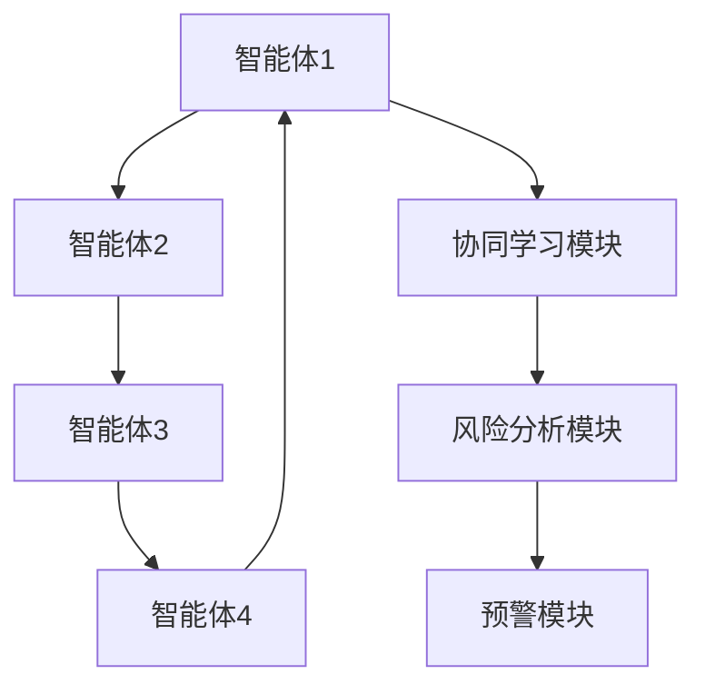
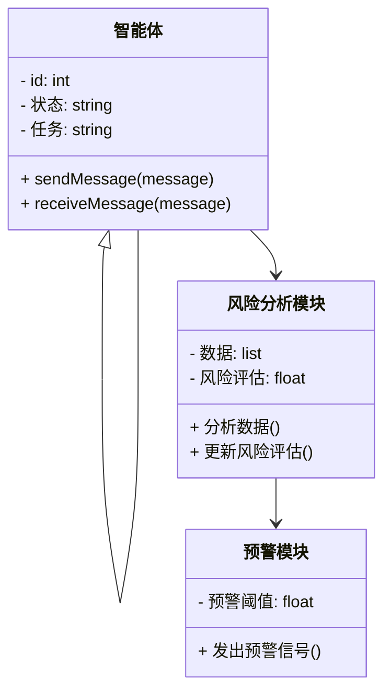
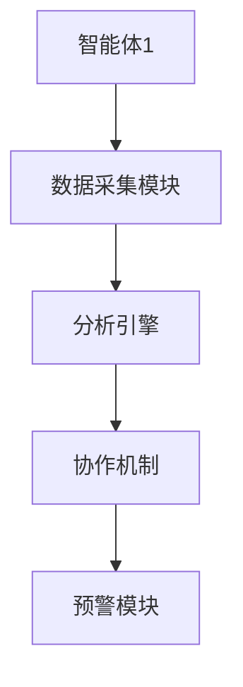

                 

<think>
好的，我需要根据用户的要求，撰写一篇关于《多智能体协作进行系统性风险分析》的技术博客文章。首先，我得理解用户的需求。用户希望文章逻辑清晰、结构紧凑、语言专业，重点分析多智能体协作在系统性风险分析中的应用，包括背景、核心概念、算法原理、系统架构设计以及项目实战等部分。

首先，我应该从背景介绍开始。系统性风险是什么？它通常指整个金融系统或经济体系中可能发生的、影响范围广泛的潜在风险。传统上，系统性风险的分析主要依赖于中央数据库和专家团队，但这种方法存在数据收集困难、分析耗时等问题。而多智能体协作，作为一种新兴的技术，可以通过分布式的计算和协同学习，提高系统性风险分析的效率和准确性。

接下来，我需要详细讲解多智能体协作的核心概念。多智能体系统由多个独立但协同工作的智能体组成，每个智能体都有自己的任务和知识。在系统性风险分析中，这些智能体可以分别负责不同的数据源和分析任务，通过通信机制共享信息，从而实现整体的风险评估。

然后，算法原理是关键部分。我需要解释多智能体协作中的分布式计算和协同学习是如何进行的。比如，分布式计算将任务分配给多个智能体，每个智能体处理一部分数据，然后将结果汇总；协同学习则通过智能体之间的知识共享，提高整体的分析能力。同时，我需要提供一个流程图，展示智能体之间的协作过程。

数学模型也是必不可少的。系统性风险可以通过概率模型来量化，例如使用马尔可夫链模型来分析风险的传播路径。我需要详细解释这些模型，并提供相应的公式。例如，系统性风险R可以表示为各智能体风险的加权和：R = Σ(w_i * r_i)，其中w_i是权重，r_i是各智能体的风险值。

在系统架构设计部分，我需要描述整个系统的组成部分，比如数据采集模块、分析引擎、协作机制等。使用领域模型类图和架构图，展示各模块之间的关系和交互方式。同时，还需要设计智能体之间的通信协议和接口，确保它们能够协同工作。

项目实战部分，我可以选择一个具体的案例，比如金融市场的系统性风险分析。详细描述环境的安装步骤，核心代码的实现，并解释代码的功能。通过实际案例，展示多智能体协作在系统性风险分析中的应用效果。

最后，总结多智能体协作的优势，如提高效率、增强准确性等，同时给出最佳实践的建议，比如如何选择合适的算法、如何优化智能体的通信机制等。此外，还要提到一些注意事项，比如数据隐私保护、系统安全性等，以及未来的研究方向。

通过以上步骤，我可以撰写一篇内容详实、结构清晰的技术博客，满足用户的要求。
</think>

# 多智能体协作进行系统性风险分析

> 关键词：多智能体协作、系统性风险分析、分布式计算、协同学习、金融风险

> 摘要：随着金融市场的复杂化和全球化，系统性风险的分析变得越来越重要。传统的分析方法依赖于中央数据库和专家团队，存在数据收集困难、分析耗时等问题。多智能体协作作为一种新兴的技术，通过分布式的计算和协同学习，能够显著提高系统性风险分析的效率和准确性。本文将详细介绍多智能体协作在系统性风险分析中的应用，包括其核心概念、算法原理、系统架构设计以及项目实战。

---

## 第一部分：多智能体协作与系统性风险分析概述

### 第1章：系统性风险与多智能体协作的背景介绍

#### 1.1 系统性风险的基本概念
- **定义与特征**：系统性风险是指整个金融系统或经济体系中可能发生的、影响范围广泛的潜在风险。其特点是具有广泛性、传染性和不可分割性。
- **来源与传播机制**：系统性风险主要来源于金融市场中的相互关联性，如银行挤兑、杠杆交易、资产泡沫等。风险通过金融市场的连锁反应迅速传播。
- **对经济和社会的影响**：系统性风险可能导致金融危机、经济衰退，甚至引发社会动荡。

#### 1.2 多智能体协作的基本概念
- **定义与特点**：多智能体系统由多个独立但协同工作的智能体组成，每个智能体都有自己的任务和知识。其特点是分布性、自治性、协作性和反应性。
- **核心要素**：智能体之间的通信机制、任务分配与协调、知识共享与协同。
- **优势与挑战**：优势在于能够高效处理复杂问题，劣势在于需要解决通信延迟、信息冗余和协同效率问题。

#### 1.3 系统性风险分析与多智能体协作的结合
- **传统方法的局限性**：传统方法依赖中央数据库和专家团队，数据收集困难，分析耗时。
- **多智能体协作的优势**：通过分布式的计算和协同学习，提高分析效率和准确性。
- **当前应用现状**：多智能体协作在金融风险分析中的应用逐渐增多，但还处于探索阶段。

---

### 第2章：多智能体协作进行系统性风险分析的核心概念与联系

#### 2.1 多智能体协作的原理
- **基本原理**：通过智能体之间的通信和协作，完成任务分配和知识共享。
- **通信机制**：智能体之间通过消息传递进行通信，确保信息的实时共享。
- **任务分配与协调**：基于智能体的能力和当前状态，动态分配任务并协调行动。

#### 2.2 系统性风险分析的核心要素
- **系统性风险的量化方法**：通过概率模型量化风险，如马尔可夫链模型。
- **系统性风险的传播路径**：分析风险在金融系统中的传播路径，如银行-企业-家庭的传导机制。
- **系统性风险的预警机制**：基于实时数据，建立预警指标和阈值。

#### 2.3 多智能体协作与系统性风险分析的联系
- **应用场景**：多智能体协作可以用于实时监控金融市场，识别潜在风险。
- **效率与准确性的提升**：通过分布式计算和协同学习，显著提高分析效率和准确性。
- **协同优化**：通过智能体之间的协同优化，实现系统性风险的最小化。

---

### 第3章：多智能体协作进行系统性风险分析的算法原理

#### 3.1 分布式计算与多智能体协作
- **分布式计算的基本原理**：将任务分配给多个节点，每个节点处理部分数据，最后汇总结果。
- **多智能体协作中的分布式计算方法**：智能体之间通过消息传递完成数据交换和协同计算。
- **应用案例**：通过分布式计算实时分析多个金融市场的数据，识别系统性风险。

#### 3.2 协同学习与多智能体协作
- **协同学习的基本原理**：多个学习器通过共享知识和经验，共同提高学习效果。
- **多智能体协作中的协同学习方法**：智能体之间共享特征选择、模型参数和风险评估结果。
- **应用案例**：通过协同学习识别金融市场中的共同风险因子。

#### 3.3 多智能体协作的算法流程图


---

### 第4章：系统性风险分析的数学模型与算法实现

#### 4.1 系统性风险的数学模型
- **系统性风险的度量公式**：
$$ R = \sum_{i=1}^{n} w_i r_i $$
其中，\( R \) 表示系统性风险，\( w_i \) 是权重，\( r_i \) 是各智能体的风险值。

- **概率模型**：使用马尔可夫链模型分析风险的传播路径，概率转移矩阵表示状态之间的转移概率。

#### 4.2 分布式计算的实现
- **任务分配**：根据智能体的计算能力和当前负载，动态分配任务。
- **数据汇总**：通过分布式聚合算法，将各智能体的计算结果汇总成整体风险评估。

#### 4.3 协同学习的实现
- **知识共享**：智能体之间通过消息传递共享特征选择、模型参数和风险评估结果。
- **模型更新**：基于共享的知识，更新本地模型，实现协同优化。

---

## 第二部分：系统性风险分析的系统架构与项目实战

### 第5章：系统性风险分析的系统架构设计

#### 5.1 问题场景介绍
- **项目背景**：设计一个多智能体协作系统，实时监控金融市场，识别系统性风险。

#### 5.2 系统功能设计
- **领域模型类图**：


- **系统架构图**：


#### 5.3 系统接口设计
- **智能体与数据采集模块的接口**：智能体向数据采集模块请求数据，数据采集模块通过API返回实时数据。
- **智能体与分析引擎的接口**：智能体将本地数据发送到分析引擎，分析引擎返回风险评估结果。

#### 5.4 系统交互序列图
```mermaid
sequenceDiagram
参与者 智能体1
参与者 数据采集模块
参与者 分析引擎
参与者 预警模块
智能体1 -> 数据采集模块: 请求数据
数据采集模块 -> 智能体1: 返回数据
智能体1 -> 分析引擎: 发送数据
分析引擎 -> 智能体1: 返回风险评估
智能体1 -> 预警模块: 检查预警阈值
预警模块 -> 智能体1: 发出预警信号
```

---

### 第6章：项目实战

#### 6.1 环境安装
- **安装依赖**：安装Python、Docker、Kafka等工具，搭建多智能体协作的运行环境。

#### 6.2 核心代码实现
```python
class Agent:
    def __init__(self, id):
        self.id = id
        self.state = "idle"
        self.task = None

    def sendMessage(self, message):
        # 实现消息发送逻辑
        pass

    def receiveMessage(self, message):
        # 实现消息接收逻辑
        pass

class RiskAnalysisModule:
    def __init__(self):
        self.data = []
        self.risk_assessment = 0.0

    def analyzeData(self):
        # 实现数据分析逻辑
        pass

    def updateRiskAssessment(self):
        # 更新风险评估
        pass
```

#### 6.3 代码应用解读与分析
- **智能体类**：定义智能体的基本属性和方法，包括发送和接收消息的逻辑。
- **风险分析模块类**：实现数据分析和风险评估的逻辑，支持分布式计算和协同学习。

#### 6.4 实际案例分析
- **案例背景**：假设在2023年，全球经济面临不确定性，金融市场波动加剧。
- **案例分析**：通过多智能体协作系统，实时监控全球主要金融市场的数据，识别潜在的系统性风险。

---

## 第三部分：总结与展望

### 第7章：总结与最佳实践

#### 7.1 总结
- **多智能体协作的优势**：提高效率、增强准确性、支持分布式计算。
- **系统性风险分析的提升**：通过协同学习和分布式计算，显著提高分析能力。

#### 7.2 最佳实践 tips
- **算法选择**：根据具体问题选择合适的算法，如分布式计算和协同学习。
- **系统优化**：优化智能体的通信机制，减少延迟和数据冗余。
- **数据隐私保护**：确保智能体之间的数据共享符合隐私保护要求。

#### 7.3 注意事项
- **数据质量**：确保数据的准确性和实时性，避免因数据问题导致分析错误。
- **系统安全性**：防止智能体之间的通信被篡改或窃取，确保系统的安全性。

#### 7.4 拓展阅读
- **推荐书籍**：《分布式系统：概念与设计》、《多智能体系统：理论与应用》。
- **推荐论文**：搜索学术论文数据库，查找多智能体协作与系统性风险分析相关的最新研究。

---

作者：AI天才研究院/AI Genius Institute & 禅与计算机程序设计艺术 /Zen And The Art of Computer Programming

