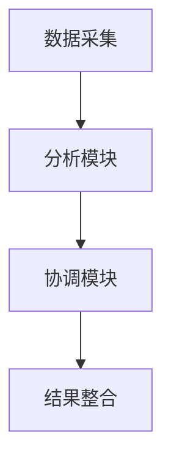
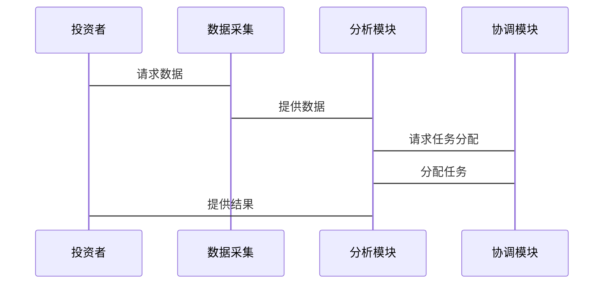

                 


# 多智能体协作进行跨境投资分析

## 关键词：
多智能体协作、跨境投资分析、分布式系统、投资组合优化、机器学习、金融数据分析

## 摘要：
本文探讨多智能体协作在跨境投资分析中的应用，通过介绍多智能体协作的基本概念、算法原理和系统架构，结合实际案例，详细分析其在提高分析效率和决策准确性方面的优势。

---

### 第一部分: 多智能体协作与跨境投资分析背景

### 第1章: 多智能体协作与跨境投资分析概述

#### 1.1 多智能体协作的定义与特点
##### 1.1.1 多智能体协作的定义
多智能体协作是指多个智能体通过协同工作，共同完成复杂任务的过程。每个智能体都有特定的目标和功能，通过通信和协调实现整体目标。

##### 1.1.2 多智能体协作的核心特点
- **分布式性**：智能体分布在网络中，独立运行。
- **协作性**：通过通信和协商完成任务。
- **适应性**：能动态调整以应对变化。

##### 1.1.3 多智能体协作与传统单智能体分析的区别
| 特性 | 单智能体 | 多智能体协作 |
|------|----------|--------------|
| 资源使用 | 高 | 低 |
| 响应速度 | 中 | 高 |
| 系统复杂性 | 低 | 高 |

#### 1.2 跨境投资分析的复杂性
##### 1.2.1 跨境投资的基本概念
涉及跨国市场的投资行为，受多种因素影响。

##### 1.2.2 跨境投资分析的挑战
- **多因素影响**：经济、政治等。
- **数据多样性**：来源广泛，处理复杂。

##### 1.2.3 跨境投资分析的多维度需求
包括市场分析、风险评估、投资组合优化等。

#### 1.3 多智能体协作在跨境投资中的优势
##### 1.3.1 提高分析效率
通过并行处理，缩短分析时间。

##### 1.3.2 增强决策准确性
多个智能体提供多角度分析，提升决策质量。

##### 1.3.3 优化资源配置
智能体协作实现资源有效分配。

#### 1.4 本章小结
多智能体协作通过分布式计算和协作任务分配，显著提升跨境投资分析的效率和准确性。

---

### 第二部分: 多智能体协作的核心概念与联系

### 第2章: 多智能体协作的核心原理

#### 2.1 多智能体协作的原理
##### 2.1.1 多智能体系统的组成
- 智能体：负责特定任务。
- 通信机制：确保信息共享。

##### 2.1.2 智能体之间的通信机制
- 信息传递：通过API或消息队列。
- 协调协议：如一致性协议。

##### 2.1.3 协作任务的分配与协调
- 任务分配：基于智能体的能力。
- 协调：通过协商解决冲突。

#### 2.2 多智能体协作与跨境投资分析的结合
##### 2.2.1 投资分析的多维度需求
包括市场趋势分析、风险评估等。

##### 2.2.2 多智能体协作在投资分析中的具体应用
- 数据采集：智能体收集不同来源的数据。
- 风险评估：多个智能体评估不同风险因素。

##### 2.2.3 多智能体协作的优势与挑战
- **优势**：高效、准确。
- **挑战**：通信延迟、协调复杂性。

#### 2.4 本章小结
多智能体协作在跨境投资中的应用提高了分析效率和决策准确性。

---

### 第三部分: 多智能体协作的算法原理

### 第3章: 多智能体协作算法概述

#### 3.1 基础算法介绍
##### 3.1.1 分布式优化算法
- 目标：最大化投资收益。
- 方法：分布式计算资源分配。

##### 3.1.2 协作任务分配算法
- 基于智能体的能力和负载。

#### 3.2 多智能体协作算法的数学模型
##### 3.2.1 分布式优化模型
$$ \text{最大化} \sum_{i=1}^{n} f_i(x_i) $$

##### 3.2.2 任务分配模型
$$ x_j \text{分配给智能体} j $$

#### 3.3 算法实现与优化
##### 3.3.1 算法实现步骤
1. 初始化智能体。
2. 任务分配。
3. 协作执行。
4. 结果整合。

##### 3.3.2 算法优化
- 并行化处理。
- 动态调整任务分配。

---

### 第四部分: 系统分析与架构设计

### 第4章: 系统分析与架构设计

#### 4.1 系统整体架构
##### 4.1.1 模块划分
- 数据采集模块：收集市场数据。
- 分析模块：智能体进行分析。
- 协调模块：管理智能体协作。

##### 4.1.2 智能体之间的交互流程
- 数据采集 → 分析 → 协调 → 结果整合。

#### 4.2 系统架构设计
##### 4.2.1 系统架构图


#### 4.3 系统接口设计
##### 4.3.1 核心接口
- 数据获取接口。
- 分析结果接口。

##### 4.3.2 交互流程图


---

### 第五部分: 项目实战

### 第5章: 项目实战

#### 5.1 环境安装
- 安装Python和相关库。
- 配置分布式环境。

#### 5.2 系统核心实现
##### 5.2.1 核心代码实现
```python
class InvestmentAgent:
    def __init__(self, id):
        self.id = id
        self.data = None
    def analyze(self):
        # 分析数据并返回结果
        return self.data
```

##### 5.2.2 代码解读
- InvestmentAgent类：每个智能体的实例。
- analyze方法：执行分析任务。

#### 5.3 实际案例分析
##### 5.3.1 案例分析
- 案例背景：跨国投资分析。
- 智能体协作：数据采集、分析、风险评估。

##### 5.3.2 详细解读
- 数据源：来自不同市场的数据。
- 分析结果：综合多个智能体的分析结果。

#### 5.4 项目小结
多智能体协作显著提升了分析效率和准确性。

---

### 第六部分: 总结与展望

### 第6章: 总结与展望

#### 6.1 最佳实践 tips
- 合理分配任务。
- 优化通信机制。

#### 6.2 小结
多智能体协作在跨境投资分析中的应用前景广阔。

#### 6.3 注意事项
- 通信延迟问题。
- 协调复杂性。

#### 6.4 拓展阅读
推荐相关书籍和论文，深入理解多智能体协作。

---

作者：AI天才研究院/AI Genius Institute & 禅与计算机程序设计艺术 /Zen And The Art of Computer Programming

