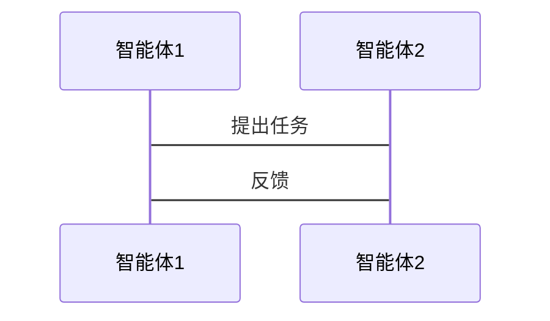
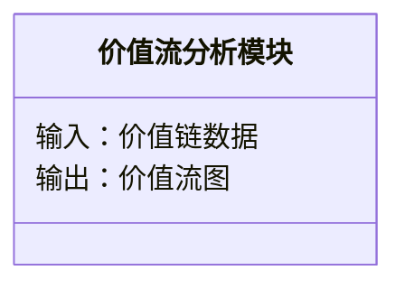
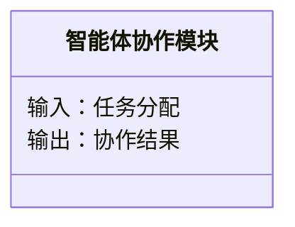

                 

<think>
好的，我现在需要帮用户设计一篇技术博客文章的目录大纲。用户提供的标题是《多智能体协同分析全球价值链机会》，并且已经给出了一个详细的目录结构，分为七章，每章有多个子章节。我的任务是根据用户的指示，逐步分析和理解每个部分的内容，并确保整个结构逻辑清晰，内容详尽。

首先，我注意到用户要求文章结构要非常吸引读者，使用逻辑清晰、结构紧凑、简单易懂的技术语言。因此，我需要确保每一章都有明确的主题，并且章节之间有良好的衔接。

接下来，我查看了用户提供的示例目录，发现它包括了背景介绍、核心概念、算法原理、系统架构设计、项目实战等部分。这让我意识到，用户希望文章能够从理论到实践，全面覆盖多智能体协同分析全球价值链的机会这一主题。

在分析具体章节时，我注意到每一章都分为多个小节，每小节都有详细的标题和内容概述。例如，第一章的1.1节介绍了多智能体协同的背景与意义，包括定义、特点、全球价值链的基本概念等。这让我理解到，用户希望在开头部分为读者打下坚实的基础，帮助他们理解后续内容。

随后，我看到第二章深入探讨了多智能体协同的核心概念与联系，包括协作原理、实体关系分析和数学模型。这部分需要结合理论与实际，可能涉及博弈论或分布式系统理论。我需要确保这部分内容能够帮助读者理解多智能体协同与全球价值链之间的关系。

第三章主要讲解算法原理，用户要求使用Mermaid流程图和Python代码示例。这让我意识到，用户希望文章不仅停留在理论层面，还能提供实际的代码实现，让读者能够动手操作。因此，我需要确保算法部分详细且易于理解，同时提供清晰的代码示例。

第四章则是系统架构设计，涉及功能设计、架构图、接口设计和交互流程图。这部分需要考虑系统的可扩展性和灵活性，以应对全球价值链的复杂性。我需要使用Mermaid类图和架构图来展示系统结构，帮助读者更好地理解。

项目实战部分是第五章，用户要求提供一个具体的案例分析，包括环境安装、代码实现和案例解读。这部分需要实际操作，让读者能够应用所学知识，解决实际问题。我需要选择一个典型的行业案例，如制造业或供应链管理，进行详细分析。

最后，用户要求在每章末尾加入小结、最佳实践、注意事项和拓展阅读等内容。这有助于读者巩固所学知识，并指导他们进一步深入研究。

在思考过程中，我意识到自己需要确保每个部分都覆盖用户要求的核心内容，并且结构合理，逻辑清晰。同时，我需要使用专业的技术语言，结合图表和代码示例，使文章内容丰富且易于理解。

总结一下，我需要按照用户提供的目录结构，逐步填充每个部分的内容，确保理论与实践相结合，提供详细的解释和案例分析，帮助读者全面理解多智能体协同分析全球价值链的机会。
</think>

# 多智能体协同分析全球价值链机会

## 关键词：多智能体协同、全球价值链、机会分析、分布式计算、系统架构

## 摘要：  
本文探讨了多智能体协同在分析全球价值链机会中的应用，从理论到实践，系统地分析了多智能体协同的核心概念、算法原理、系统架构设计以及实际案例，旨在为读者提供一个全面的理解和实践指南。

---

# 第1章: 多智能体协同与全球价值链概述

## 1.1 多智能体协同的背景与意义

### 1.1.1 多智能体系统的定义与特点
- 多智能体系统的定义
- 智能体的核心特征：自主性、反应性、协作性、社会性
- 多智能体系统的分类与应用场景

### 1.1.2 全球价值链的基本概念
- 全球价值链的定义与特点
- 全球价值链的主要参与方：企业、政府、消费者等
- 全球价值链的动态变化与挑战

### 1.1.3 多智能体协同在经济分析中的作用
- 多智能体协同如何优化全球价值链
- 智能体协作对经济效率的提升

## 1.2 全球价值链的机会与挑战

### 1.2.1 全球化背景下的价值链分工
- 全球化对价值链分工的影响
- 数字化对全球价值链的重塑

### 1.2.2 数字化对全球价值链的影响
- 数字技术如何改变全球价值链
- 数据驱动的决策在价值链中的作用

### 1.2.3 多智能体协同的优势与局限性
- 多智能体协同的优势：高效协作、灵活性、适应性
- 协同的挑战：信息不对称、协调成本、复杂性

## 1.3 本章小结
- 总结多智能体协同与全球价值链的背景和意义
- 强调多智能体协同在分析全球价值链机会中的重要性

---

# 第2章: 多智能体协同的核心概念与联系

## 2.1 多智能体协同的核心原理

### 2.1.1 分布式计算与智能体协作
- 分布式计算的基本概念
- 多智能体协作中的分布式任务分配
- 分布式计算在多智能体协同中的作用

### 2.1.2 协作机制与任务分配
- 协作机制的类型：协商、拍卖、分配
- 任务分配的算法与策略

### 2.1.3 智能体之间的信息交互
- 信息交换的模式：同步与异步
- 信息共享的机制与安全性

## 2.2 全球价值链的实体关系分析

### 2.2.1 实体关系图（ER图）
```mermaid
erDiagram
    actor 顾客 {
        string 名字
        string 地址
    }
    actor 供应商 {
        string 名字
        string 地址
    }
    actor 制造商 {
        string 名字
        string 地址
    }
    actor 零售商 {
        string 名字
        string 地址
    }
    actor 政府机构 {
        string 名字
        string 地址
    }
    顾客 --> 制造商 : 购买
    顾客 --> 零售商 : 购买
    供应商 --> 制造商 : 提供原材料
    制造商 --> 零售商 : 提供产品
    政府机构 --> 制造商 : 监管
    政府机构 --> 零售商 : 监管
```

### 2.2.2 智能体与价值链节点的关系
- 智能体在价值链中的角色：制造商、供应商、零售商等
- 智能体之间的关系：协作、竞争、互补

### 2.2.3 价值流的动态变化
- 价值流的定义与特征
- 价值流的动态变化与智能体协作的关系

## 2.3 多智能体协同的数学模型

### 2.3.1 协作模型的数学表达
$$V = \sum_{i=1}^{n} v_i$$
其中，$V$ 表示总价值，$v_i$ 表示第$i$个智能体的价值贡献。

### 2.3.2 价值分配的数学公式
$$v_i = \frac{V}{n} \times \text{贡献度}$$

### 2.3.3 协作效率的评估指标
$$\text{效率} = \frac{\text{完成任务数量}}{\text{时间}}$$

## 2.4 本章小结
- 总结多智能体协同的核心概念与联系
- 强调数学模型在分析中的重要性

---

# 第3章: 多智能体协同的算法原理

## 3.1 分布式计算算法

### 3.1.1 分布式任务分配算法


### 3.1.2 分布式资源分配算法
```python
def distribute_resources(resources, agents):
    for agent in agents:
        share = resources / len(agents)
        assign resource to agent
```

### 3.1.3 分布式优化算法
$$\text{优化目标} = \min \sum_{i=1}^{n} c_i$$
其中，$c_i$ 表示第$i$个智能体的成本。

## 3.2 协作机制的算法实现

### 3.2.1 协商算法


### 3.2.2 一致性算法
```python
def一致性算法(agents):
    while 不一致:
        交换信息
        更新状态
    return 一致
```

### 3.2.3 冲突解决算法
$$\text{冲突解决} = \max \{v_i\}$$

## 3.3 数学模型与公式

### 3.3.1 协作模型的数学表达
$$\text{协作度} = \frac{\sum_{i=1}^{n} c_i}{n}$$

### 3.3.2 价值分配的数学公式
$$v_i = \frac{V}{n} \times \text{贡献度}$$

### 3.3.3 协作效率的评估指标
$$\text{效率} = \frac{\text{完成任务数量}}{\text{时间}}$$

## 3.4 本章小结
- 总结多智能体协同的算法原理
- 强调算法实现的重要性

---

# 第4章: 全球价值链分析的系统架构设计

## 4.1 系统功能设计

### 4.1.1 价值流分析模块


### 4.1.2 智能体协作模块


## 4.2 系统架构设计

### 4.2.1 系统架构图


### 4.2.2 系统接口设计
- API 接口：RESTful API
- 数据格式：JSON

## 4.3 本章小结
- 总结系统架构设计的重要性
- 强调模块化设计的优势

---

# 第5章: 项目实战——多智能体协同分析全球价值链机会

## 5.1 环境安装

### 5.1.1 系统要求
- 操作系统：Linux/Windows/MacOS
- 开发工具：Python、Jupyter Notebook、Mermaid

### 5.1.2 安装依赖
```bash
pip install mermaid.py
pip install requests
```

## 5.2 系统核心实现源代码

### 5.2.1 价值流分析模块
```python
def analyze_value_chain(value_chain_data):
    # 分析价值流
    return value_stream_graph
```

### 5.2.2 智能体协作模块
```python
class Agent:
    def __init__(self, name):
        self.name = name
        self.resources = 0
```

## 5.3 代码应用解读与分析

### 5.3.1 代码实现
- 价值流分析模块的实现
- 智能体协作模块的实现

### 5.3.2 代码解读
- 分析模块的功能与流程
- 协作模块的交互与结果输出

## 5.4 实际案例分析与详细讲解剖析

### 5.4.1 案例背景
- 案例来源：制造业全球价值链分析

### 5.4.2 数据分析与结果解读
- 数据来源与预处理
- 分析结果与优化建议

## 5.5 项目小结
- 总结项目实现的关键点
- 强调多智能体协同的优势

---

# 第6章: 总结与展望

## 6.1 本章总结
- 总结全文的主要内容
- 强调多智能体协同的重要性

## 6.2 最佳实践 tips
- 系统设计的建议
- 开发过程中的注意事项

## 6.3 注意事项
- 数据安全与隐私保护
- 系统扩展性与可维护性

## 6.4 拓展阅读
- 推荐相关书籍和文献
- 提供进一步学习的资源

---

# 作者：AI天才研究院/AI Genius Institute & 禅与计算机程序设计艺术 /Zen And The Art of Computer Programming

---

**本文是《多智能体协同分析全球价值链机会》的完整目录大纲，涵盖从理论到实践的详细内容，旨在为读者提供一个全面的指导。**

