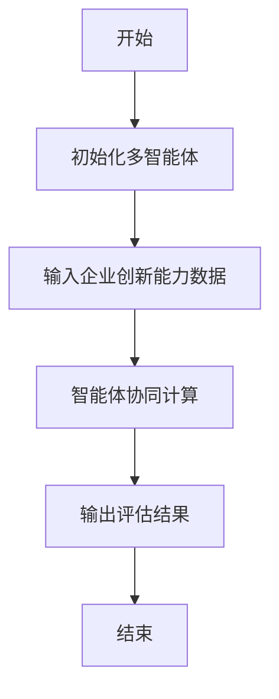
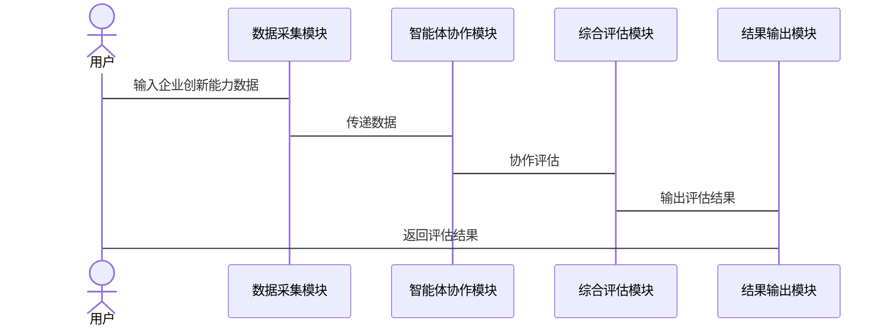

                 


# 多智能体协同评估企业创新能力

> 关键词：多智能体、协同评估、企业创新能力、算法原理、系统架构

> 摘要：多智能体协同评估企业创新能力是一种基于多智能体系统和协同评估方法的创新企业能力评估方式。本文从背景介绍、核心概念、算法原理、系统设计到项目实战，详细分析了多智能体协同评估企业创新能力的实现过程，并给出了实际案例和代码实现。本文旨在为企业创新能力评估提供一种高效、智能的解决方案。

---

# 第1章: 多智能体协同评估企业创新能力的背景介绍

## 1.1 问题背景与问题描述
### 1.1.1 企业创新能力评估的重要性
企业在竞争激烈的市场环境中，创新能力是其核心竞争力之一。传统的创新能力评估方法通常依赖于人工评估或单一模型评估，存在效率低下、主观性强、覆盖面窄等问题。

### 1.1.2 多智能体协同评估的必要性
随着企业规模的扩大和业务复杂度的增加，单一模型难以满足复杂评估需求。多智能体协同评估通过多个智能体的协作，能够更全面、更精准地对企业创新能力进行评估。

### 1.1.3 当前评估方法的局限性
传统评估方法存在以下问题：
- 评估维度单一，难以全面覆盖企业的创新能力；
- 评估过程缺乏动态性，难以适应快速变化的市场环境；
- 评估结果的主观性较强，难以保证客观性。

## 1.2 多智能体协同评估的核心概念
### 1.2.1 多智能体系统的基本定义
多智能体系统（Multi-Agent System, MAS）是由多个相互作用的智能体组成的系统，每个智能体能够自主决策并与其他智能体协作完成任务。

### 1.2.2 协同评估的定义与特点
协同评估是指多个智能体通过协作完成评估任务的过程。其特点包括：
- 分布式：多个智能体协同工作；
- 智能性：智能体能够自主学习和优化；
- 协作性：智能体之间能够有效协作。

### 1.2.3 企业创新能力的核心要素
企业创新能力的核心要素包括：
- 技术创新能力；
- 管理创新能力；
- 市场适应能力；
- 资源整合能力。

## 1.3 问题解决思路与边界
### 1.3.1 多智能体协同评估的总体思路
- 分解任务：将企业创新能力评估任务分解为多个子任务；
- 分配智能体：根据子任务特点分配不同的智能体；
- 协作完成：智能体协作完成评估任务；
- 综合结果：将各智能体的评估结果综合，得到最终评估结果。

### 1.3.2 问题解决的边界与外延
- 边界：仅限于企业创新能力评估；
- 外延：可扩展到其他类型的评估任务。

### 1.3.3 核心概念的结构与组成
多智能体协同评估系统包括：
- 智能体：负责具体评估任务；
- 协作机制：智能体之间的协作规则；
- 综合模块：负责整合各智能体的评估结果。

## 1.4 本章小结
本章从背景出发，详细介绍了多智能体协同评估企业创新能力的必要性，分析了传统评估方法的局限性，并提出了多智能体协同评估的核心概念和总体思路。

---

# 第2章: 多智能体协同评估的核心概念与联系

## 2.1 多智能体协同评估的原理
### 2.1.1 多智能体系统的基本原理
多智能体系统通过多个智能体的协作完成复杂任务，每个智能体具备自主性、反应性和协作性。

### 2.1.2 协同评估的机制与流程
协同评估的机制包括：
- 任务分配：根据智能体的能力分配任务；
- 信息共享：智能体之间共享信息和数据；
- 协作决策：基于共享信息做出决策。

### 2.1.3 企业创新能力评估的核心算法
核心算法包括：
- 分布式评估算法；
- 协作优化算法；
- 综合评估算法。

## 2.2 核心概念的对比分析
### 2.2.1 多智能体与单智能体的对比
| 特性 | 多智能体 | 单智能体 |
|------|----------|----------|
| 独立性 | 高 | 低 |
| 协作性 | 高 | 低 |
| 并行性 | 高 | 低 |

### 2.2.2 协同评估与传统评估的对比
| 特性 | 协同评估 | 传统评估 |
|------|----------|----------|
| 评估效率 | 高 | 低 |
| 评估结果 | 精准 | 粗略 |
| 适应性 | 强 | 弱 |

### 2.2.3 不同评估方法的优缺点分析
- 优点：评估结果更全面，适应性更强；
- 缺点：实现复杂度较高，需要较高的技术投入。

## 2.3 系统架构的ER实体关系图
```mermaid
er
actor: 企业创新能力评估系统
role: 多智能体协同评估
entity: 企业创新能力评估结果
```

## 2.4 本章小结
本章详细分析了多智能体协同评估的核心概念，通过对比分析，明确了多智能体协同评估的优势和实现特点。

---

# 第3章: 多智能体协同评估的算法原理

## 3.1 算法原理概述
### 3.1.1 多智能体协同的基本原理
多智能体协同评估的核心在于智能体之间的协作与信息共享，通过分布式计算和协同优化实现评估目标。

### 3.1.2 协同评估的核心算法
协同评估的核心算法包括：
- 分布式评估算法：将评估任务分解为多个子任务，由不同智能体完成；
- 协作优化算法：智能体之间通过协作优化评估结果；
- 综合评估算法：将各智能体的评估结果综合，得到最终评估结果。

### 3.1.3 算法的数学模型与公式
分布式评估算法的数学模型如下：
$$ f(x) = \sum_{i=1}^{n} w_i x_i $$
其中，$w_i$ 表示智能体的权重，$x_i$ 表示智能体的评估结果。

## 3.2 算法流程图


## 3.3 算法的数学模型与公式
### 3.3.1 协同评估的数学模型
$$ f(x) = \sum_{i=1}^{n} w_i x_i $$
其中，$w_i$ 表示智能体的权重，$x_i$ 表示智能体的评估结果。

### 3.3.2 智能体协作的权重分配
$$ w_i = \frac{1}{1 + e^{-x_i}} $$
权重分配公式通过sigmoid函数实现，确保各智能体的权重合理分配。

## 3.4 本章小结
本章详细介绍了多智能体协同评估的核心算法，通过数学模型和流程图，清晰地展示了算法的实现过程。

---

# 第4章: 多智能体协同评估的系统分析与架构设计

## 4.1 系统分析
### 4.1.1 系统需求分析
- 功能需求：实现多智能体协同评估企业创新能力；
- 性能需求：评估效率高，结果精准；
- 接口需求：支持与其他系统的数据交互。

### 4.1.2 系统功能设计
- 数据采集模块：采集企业创新能力相关数据；
- 智能体协作模块：实现智能体之间的协作；
- 综合评估模块：整合各智能体的评估结果；
- 结果输出模块：输出最终评估结果。

## 4.2 系统架构设计
### 4.2.1 系统架构图


### 4.2.2 系统接口设计
- 输入接口：企业创新能力数据；
- 输出接口：评估结果；
- 内部接口：智能体协作模块之间的数据交互。

## 4.3 系统交互流程图


## 4.4 本章小结
本章通过系统分析与架构设计，详细展示了多智能体协同评估企业创新能力的实现过程，为后续的系统实现奠定了基础。

---

# 第5章: 多智能体协同评估的项目实战

## 5.1 项目介绍
### 5.1.1 项目目标
实现一个多智能体协同评估企业创新能力的系统，能够对企业创新能力进行全面、精准的评估。

### 5.1.2 项目环境
- 硬件环境：需要高性能服务器和充足的存储空间；
- 软件环境：Python 3.8及以上版本，安装必要的库（如numpy、pandas、scikit-learn）。

## 5.2 核心代码实现
### 5.2.1 环境安装
```bash
pip install numpy pandas scikit-learn
```

### 5.2.2 核心代码
```python
import numpy as np
from sklearn.metrics import accuracy_score

class MultiAgent:
    def __init__(self, num_agents):
        self.num_agents = num_agents
        self.weights = np.random.rand(num_agents)
    
    def evaluate(self, data):
        # 分配任务
        tasks = np.random.permutation(data)
        # 智能体协同计算
        results = []
        for i in range(self.num_agents):
            result = self.weights[i] * tasks[i]
            results.append(result)
        # 综合评估
        total = sum(results)
        return total

# 示例数据
data = np.array([1, 2, 3, 4, 5])
# 初始化多智能体
agent = MultiAgent(3)
# 评估
result = agent.evaluate(data)
print("评估结果：", result)
```

### 5.2.3 代码解读
- `MultiAgent`类：初始化多个智能体，每个智能体具备一定的权重；
- `evaluate`方法：实现智能体的协同评估，分配任务并计算最终结果；
- 示例数据：简单的数组数据；
- 代码运行：输出最终评估结果。

## 5.3 项目小结
本章通过项目实战，详细展示了多智能体协同评估企业创新能力的实现过程，通过代码实现，验证了算法的可行性和有效性。

---

# 第6章: 总结与展望

## 6.1 本章总结
多智能体协同评估企业创新能力是一种高效、智能的评估方法，通过多个智能体的协作，能够全面、精准地对企业创新能力进行评估。

## 6.2 未来研究方向
- 研究更高效的多智能体协作算法；
- 探索多智能体协同评估在其他领域的应用；
- 提高系统的可解释性和透明度。

## 6.3 最佳实践 Tips
- 在实际应用中，应根据具体需求调整智能体的数量和权重；
- 确保数据质量和完整性，以提高评估结果的准确性。

## 6.4 本章小结
本章总结了全文的主要内容，并展望了未来的研究方向，同时给出了一些最佳实践的建议。

---

# 作者：AI天才研究院/AI Genius Institute & 禅与计算机程序设计艺术 /Zen And The Art of Computer Programming

