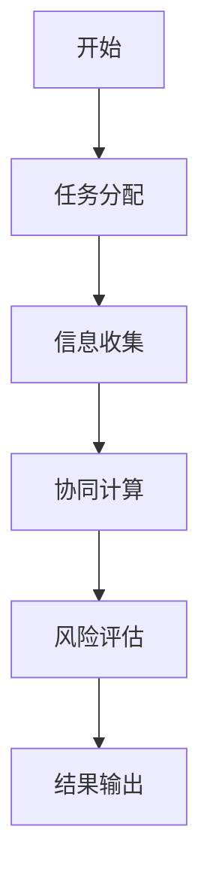
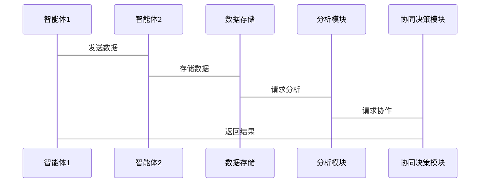

                 


# 多智能体协同评估地缘政治风险

> 关键词：多智能体协同、地缘政治风险、协同决策、数学模型、算法原理、系统架构、项目实战

> 摘要：本文探讨了多智能体协同在地缘政治风险评估中的应用，从理论基础到算法实现，再到系统设计和实际案例，全面解析了多智能体协同评估地缘政治风险的原理和实践。文章详细讲解了多智能体协同的基本概念、算法原理、系统架构设计，并通过具体案例展示了如何在实际场景中应用这些方法。通过本文的学习，读者将能够理解多智能体协同的核心思想，并掌握如何将其应用于地缘政治风险评估的实际问题中。

---

# 第1章 多智能体协同与地缘政治风险评估概述

## 1.1 多智能体协同的基本概念

### 1.1.1 多智能体系统的定义
多智能体系统（Multi-Agent System, MAS）是由多个智能体（Agent）组成的分布式系统，这些智能体能够自主决策、协作完成任务，并通过通信解决问题。

### 1.1.2 多智能体系统的核心特征
- **自主性**：每个智能体都能独立决策。
- **反应性**：能够感知环境并实时响应。
- **协作性**：通过通信和协作完成共同目标。
- **分布式性**：智能体分布在不同的位置，任务分解到各个智能体。

### 1.1.3 地缘政治风险评估的定义与范围
地缘政治风险评估是指对某一地区或国家的政治、经济、社会等多方面因素进行综合分析，预测可能的风险和挑战。其范围包括国际关系、地区冲突、经济制裁、政策变化等。

---

## 1.2 多智能体协同在地缘政治风险评估中的作用

### 1.2.1 多智能体协同的优势
- **分布式计算能力**：能够处理复杂、大规模的问题。
- **协作能力**：多个智能体协同完成复杂任务。
- **灵活性**：能够适应环境的变化和不确定性。

### 1.2.2 地缘政治风险评估的复杂性
- **多维度**：涉及政治、经济、军事等多个方面。
- **动态性**：风险因素不断变化，需要实时评估。
- **不确定性**：部分信息不完整或模糊。

### 1.2.3 多智能体协同的应用场景
- **国际关系分析**：预测国家间的互动和冲突。
- **地区风险预警**：评估特定地区的潜在风险。
- **政策制定支持**：为政策制定者提供决策支持。

---

## 1.3 本章小结
本章介绍了多智能体协同的基本概念和其在地缘政治风险评估中的作用，强调了多智能体协同的优势和应用场景，为后续内容奠定了基础。

---

# 第2章 地缘政治风险评估的核心概念与联系

## 2.1 多智能体协同的基本原理

### 2.1.1 分布式计算与任务分配
分布式计算是多智能体协同的核心，通过任务分配将整体问题分解为多个子任务，分配给不同的智能体完成。

### 2.1.2 多智能体之间的通信与协作
智能体之间通过通信模块交换信息，协作完成任务。通信内容包括数据、指令和状态更新。

### 2.1.3 协同决策的数学模型
协同决策可以通过数学模型表示，例如概率论、博弈论等方法。

---

## 2.2 多智能体协同与地缘政治风险评估的关系

### 2.2.1 地缘政治风险评估的复杂性
地缘政治风险评估涉及多个变量和不确定性，需要综合分析多个因素。

### 2.2.2 多智能体协同的优势
- **分布式计算能力**：能够处理复杂问题。
- **协作能力**：通过智能体协同提高评估的准确性。
- **实时性**：能够快速响应环境变化。

### 2.2.3 多智能体协同在地缘政治风险评估中的具体应用
- **信息收集与整合**：智能体收集不同来源的信息，进行整合和分析。
- **风险预测**：通过数学模型预测潜在风险。
- **协同决策**：智能体协作制定风险缓解策略。

---

## 2.3 实体关系图（ER图）与流程图

### 2.3.1 多智能体协同的ER实体关系图


### 2.3.2 多智能体协同的流程图


---

## 2.4 本章小结
本章通过分析多智能体协同的基本原理，探讨了其在地缘政治风险评估中的具体应用，利用ER图和流程图展示了系统的结构和工作流程。

---

# 第3章 多智能体协同评估地缘政治风险的算法原理

## 3.1 算法原理概述

### 3.1.1 分布式计算的基本原理
分布式计算通过将任务分解到多个节点，利用并行计算提高效率。

### 3.1.2 多智能体协同算法的分类
- **任务分配算法**：如Distributed Computing、Task Assignment。
- **通信协议**：如Gossip Protocol、Two-phase Commit。
- **协作算法**：如Consensus算法（如Raft、Paxos）。

### 3.1.3 地缘政治风险评估的算法选择
根据具体问题选择合适的算法，例如使用概率论模型评估风险。

---

## 3.2 多智能体协同算法的详细讲解

### 3.2.1 分布式计算算法
#### Distributed Computing Algorithm
```python
def distributed_compute(tasks):
    import concurrent.futures
    futures = []
    for task in tasks:
        futures.append(executor.submit(task.compute))
    results = [f.result() for f in futures]
    return results
```

### 3.2.2 任务分配算法
#### Task Assignment Algorithm
```python
def task_assignment_agents(agents, tasks):
    import random
    assigned_tasks = {}
    for agent in agents:
        assigned_tasks[agent] = random.choice(tasks)
    return assigned_tasks
```

### 3.2.3 协作算法
#### Collaborative Algorithm
```python
def collaborative_decision(agents, goal):
    import json
    messages = []
    for agent in agents:
        msg = json.dumps(agent.request_data())
        messages.append(msg)
    return messages
```

---

## 3.3 数学模型与公式

### 3.3.1 协同决策的数学模型
使用概率论模型评估风险：
$$ P(risk) = \sum_{i=1}^{n} P(risk_i) \times P(correlation_i) $$

### 3.3.2 优化算法
使用强化学习优化协作策略：
$$ Q(s, a) = r + \gamma \max_{a'} Q(s', a') $$

---

## 3.4 本章小结
本章详细讲解了多智能体协同评估地缘政治风险的算法原理，包括分布式计算、任务分配和协作算法，并通过数学模型和公式进一步阐述了算法的核心思想。

---

# 第4章 系统分析与架构设计方案

## 4.1 问题场景介绍

### 4.1.1 地缘政治风险评估的典型场景
- **国际关系分析**：预测国家间的互动和冲突。
- **地区风险预警**：评估特定地区的潜在风险。
- **政策制定支持**：为政策制定者提供决策支持。

### 4.1.2 系统需求分析
- **数据采集**：收集政治、经济、社会等多方面的数据。
- **信息处理**：对数据进行清洗、转换和分析。
- **协同计算**：智能体之间协作完成风险评估。

---

## 4.2 系统功能设计

### 4.2.1 功能模块划分
- **数据采集模块**：负责数据的收集和预处理。
- **分析模块**：对数据进行建模和分析。
- **协同决策模块**：智能体协作完成风险评估。

### 4.2.2 领域模型设计


---

## 4.3 系统架构设计

### 4.3.1 微服务架构设计


### 4.3.2 系统交互设计


---

## 4.4 本章小结
本章通过系统分析与架构设计，详细介绍了多智能体协同评估地缘政治风险的系统结构和工作流程，为后续的实现提供了理论基础。

---

# 第5章 项目实战

## 5.1 环境安装与配置

### 5.1.1 安装Python
```bash
python --version
pip install --upgrade pip
```

### 5.1.2 安装依赖库
```bash
pip install numpy pandas scikit-learn
```

---

## 5.2 系统核心实现

### 5.2.1 多智能体协同代码实现
```python
class Agent:
    def __init__(self, id):
        self.id = id
        self.data = {}

    def request_data(self):
        return self.data

    def send_message(self, message):
        # 模拟通信模块
        return message
```

### 5.2.2 风险评估代码实现
```python
def risk_assessment(agents):
    import numpy as np
    data = [agent.request_data() for agent in agents]
    # 数据预处理和分析
    results = np.mean(data)
    return results
```

---

## 5.3 实际案例分析

### 5.3.1 案例背景
分析某地区的地缘政治风险，涉及经济制裁和政策变化。

### 5.3.2 数据采集与处理
- 采集经济指标、政策变化、地区冲突等数据。
- 使用数据清洗和转换技术处理数据。

### 5.3.3 风险评估与结果分析
- 使用数学模型计算风险等级。
- 输出风险评估结果并制定应对措施。

---

## 5.4 本章小结
本章通过实际案例分析，详细展示了如何在具体场景中应用多智能体协同评估地缘政治风险，帮助读者理解理论与实践的结合。

---

# 第6章 最佳实践与注意事项

## 6.1 实践中的注意事项

### 6.1.1 数据质量的重要性
确保数据的准确性和完整性，避免因数据问题导致评估结果偏差。

### 6.1.2 算法选择的依据
根据具体问题选择合适的算法，避免使用复杂度过高的算法。

### 6.1.3 结果验证的重要性
通过交叉验证和对比分析，确保评估结果的准确性和可靠性。

---

## 6.2 小结与展望

### 6.2.1 本章总结
总结全文的核心内容和主要观点，强调多智能体协同在地缘政治风险评估中的重要性。

### 6.2.2 未来展望
展望多智能体协同技术的发展趋势，及其在地缘政治风险评估中的潜在应用。

---

# 作者

作者：AI天才研究院/AI Genius Institute & 禅与计算机程序设计艺术 /Zen And The Art of Computer Programming

