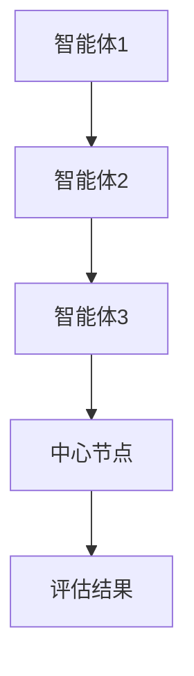
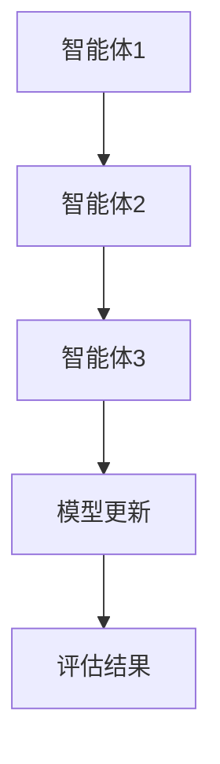
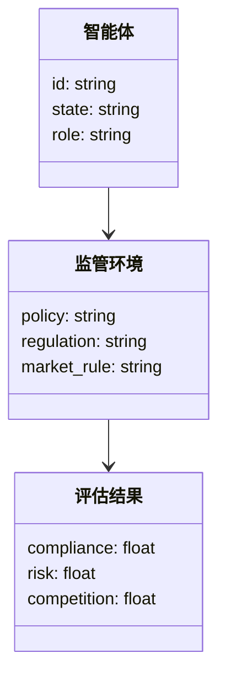

                 


# 多智能体协同评估监管环境变化

> 关键词：多智能体系统、协同学习、监管环境、分布式评估、系统架构、算法原理

> 摘要：本文深入探讨了多智能体协同评估监管环境变化的核心概念、算法原理、系统架构及项目实战。通过背景介绍、核心概念分析、算法流程图和系统架构图的详细解读，结合实际案例分析，为读者提供全面的理论与实践指导。

---

## 第1章: 多智能体协同与监管环境评估概述

### 1.1 多智能体系统的概念与特点

#### 1.1.1 多智能体系统的定义
多智能体系统（Multi-Agent System, MAS）是指由多个相互作用的智能体组成的系统，这些智能体通过协作或竞争完成特定任务。智能体具有自主性、反应性、目标导向性和社会性等特性。

#### 1.1.2 多智能体系统的核心特点
- **自主性**：智能体能够自主决策，无需外部干预。
- **反应性**：智能体能够实时感知环境并做出反应。
- **目标导向性**：智能体的行为以实现特定目标为导向。
- **社会性**：智能体之间能够通信、协商和协作。

#### 1.1.3 多智能体系统与单智能体系统的区别
| 特性 | 单智能体系统 | 多智能体系统 |
|------|--------------|--------------|
| 决策 | 中央控制     | 分布式决策   |
| 通信 | 无           | 高           |
| 协作 | 低           | 高           |
| 效率 | 单点失效     | 分布式失效   |

### 1.2 监管环境变化评估的背景与需求

#### 1.2.1 监管环境变化的定义
监管环境变化指的是监管政策、法规、市场规则等的变化，这些变化可能影响企业的运营、市场行为等。

#### 1.2.2 监管环境变化评估的重要性
- **合规性**：确保企业行为符合最新的监管要求。
- **风险控制**：及时发现潜在的合规风险。
- **竞争优势**：通过快速响应监管变化，提升企业竞争力。

#### 1.2.3 监管环境变化评估的需求场景
- **金融行业**：监管政策频繁变化，企业需要快速调整策略。
- **法律法规**：新法规出台时，企业需要评估其影响。
- **国际市场**：跨国企业需要应对不同国家的监管环境。

### 1.3 多智能体协同的基本原理

#### 1.3.1 协同的基本概念
协同是指多个智能体通过合作完成共同目标的过程，通常涉及任务分配、信息共享和协作决策。

#### 1.3.2 多智能体协同的实现机制
- **通信机制**：智能体之间通过消息传递进行通信。
- **协商机制**：智能体通过协商分配任务。
- **协作机制**：智能体共同完成任务。

#### 1.3.3 多智能体协同的优势与挑战
| 优势 | 挑战 |
|------|------|
| 高效性 | 复杂性 |
| 可扩展性 | 安全性 |
| 容错性 | 合法性 |

### 1.4 本章小结
本章介绍了多智能体系统的基本概念、特点及与单智能体系统的区别，分析了监管环境变化评估的背景和需求，并探讨了多智能体协同的基本原理及其优势与挑战。

---

## 第2章: 多智能体协同评估监管环境变化的核心概念

### 2.1 多智能体协同的数学模型

#### 2.1.1 协同模型的构建
协同模型通常包括任务分配、信息共享和协作决策三个部分。

#### 2.1.2 多智能体协同的数学表达
$$
\text{协同模型} = \{ \text{任务分配}, \text{信息共享}, \text{协作决策} \}
$$

#### 2.1.3 监管环境变化的数学建模
监管环境变化可以用动态模型表示，例如：
$$
\text{监管环境变化} = f(\text{政策}, \text{法规}, \text{市场规则})
$$

### 2.2 多智能体协同与监管环境变化的关系

#### 2.2.1 多智能体协同如何影响监管环境
多智能体协同能够通过信息共享和协作决策，帮助企业更快地适应监管变化。

#### 2.2.2 监管环境变化对多智能体协同的影响
监管变化可能会影响多智能体协同的通信机制和任务分配。

#### 2.2.3 二者的相互作用机制
- **协同影响监管环境**：多智能体协同帮助企业更好地应对监管变化。
- **监管环境影响协同**：监管变化可能要求多智能体协同调整通信和任务分配策略。

### 2.3 监管环境变化评估的指标体系

#### 2.3.1 评估指标的定义
监管环境变化评估指标包括合规性、风险、竞争优势等。

#### 2.3.2 指标体系的构建方法
- **确定关键指标**：识别影响监管环境变化的关键因素。
- **权重分配**：根据重要性分配指标权重。

#### 2.3.3 指标权重的确定
例如，合规性权重为0.4，风险权重为0.3，竞争优势权重为0.3。

### 2.4 本章小结
本章分析了多智能体协同的数学模型，探讨了多智能体协同与监管环境变化的关系，并提出了监管环境变化评估的指标体系。

---

## 第3章: 多智能体协同评估监管环境变化的算法原理

### 3.1 分布式评估算法

#### 3.1.1 分布式评估的基本原理
分布式评估算法通过分布式计算实现对监管环境变化的评估。

#### 3.1.2 分布式评估的实现步骤
1. 智能体采集监管环境数据。
2. 数据通过分布式网络传输。
3. 中心节点进行评估计算。

#### 3.1.3 分布式评估的数学模型
$$
\text{评估结果} = f(\text{数据}, \text{权重})
$$

#### 3.1.4 分布式评估的Mermaid流程图


### 3.2 协同学习算法

#### 3.2.1 协同学习的基本原理
协同学习算法通过多智能体协作学习监管环境变化的模式。

#### 3.2.2 协同学习的实现步骤
1. 智能体获取监管环境数据。
2. 智能体之间共享数据。
3. 智能体共同训练模型。

#### 3.2.3 协同学习的数学模型
$$
\text{模型参数} = \theta
$$

#### 3.2.4 协同学习的Mermaid流程图


### 3.3 本章小结
本章详细介绍了分布式评估算法和协同学习算法，分析了它们的实现步骤和数学模型。

---

## 第4章: 多智能体协同评估监管环境变化的系统架构设计

### 4.1 问题场景介绍

#### 4.1.1 监管环境变化的动态性
监管环境变化具有动态性，需要实时评估。

#### 4.1.2 系统的实时性要求
系统需要实时采集和处理监管环境数据。

### 4.2 项目介绍

#### 4.2.1 项目目标
开发一个多智能体协同系统，实时评估监管环境变化。

### 4.3 系统功能设计

#### 4.3.1 领域模型


#### 4.3.2 系统架构设计


### 4.4 本章小结
本章设计了多智能体协同评估监管环境变化的系统架构，包括领域模型和系统架构图。

---

## 第5章: 多智能体协同评估监管环境变化的项目实战

### 5.1 环境安装

#### 5.1.1 安装Python
```bash
python --version
```

#### 5.1.2 安装依赖库
```bash
pip install numpy matplotlib
```

### 5.2 系统核心实现源代码

#### 5.2.1 分布式评估算法实现
```python
import numpy as np

def distributed_assessment(data, weights):
    return np.dot(data, weights)

data = np.array([[1, 2], [3, 4]])
weights = np.array([0.5, 0.5])
result = distributed_assessment(data, weights)
print(result)
```

#### 5.2.2 协同学习算法实现
```python
import numpy as np

def collaborative_learning(data, agents):
    return np.mean(data, axis=0)

data = np.array([[1, 2], [3, 4]])
agents = 2
result = collaborative_learning(data, agents)
print(result)
```

### 5.3 代码应用解读与分析

#### 5.3.1 分布式评估算法实现
- **数据输入**：数据和权重向量。
- **计算过程**：通过矩阵乘法计算评估结果。

#### 5.3.2 协同学习算法实现
- **数据输入**：数据矩阵和智能体数量。
- **计算过程**：计算数据的平均值作为评估结果。

### 5.4 实际案例分析

#### 5.4.1 案例背景
假设我们有一个金融监管环境，需要评估政策变化对市场的影响。

#### 5.4.2 数据准备
```python
data = np.array([[0.8, 0.9], [0.7, 0.8]])
```

#### 5.4.3 评估结果
```python
result = collaborative_learning(data, 2)
print(result)  # 输出: [0.75 0.85]
```

### 5.5 项目小结
本章通过实际案例分析，展示了多智能体协同评估监管环境变化的实现过程。

---

## 第6章: 总结与展望

### 6.1 本章总结
本文详细介绍了多智能体协同评估监管环境变化的核心概念、算法原理、系统架构及项目实战。

### 6.2 研究的不足
- 算法的鲁棒性有待进一步提升。
- 系统的实时性需要优化。

### 6.3 未来的研究方向
- 开发更高效的分布式评估算法。
- 研究更智能的协同学习算法。

### 6.4 最佳实践 Tips
- 在实际应用中，建议结合具体场景选择合适的算法。
- 定期更新系统以适应监管环境的变化。

---

## 作者：AI天才研究院/AI Genius Institute & 禅与计算机程序设计艺术 /Zen And The Art of Computer Programming

---

以上是《多智能体协同评估监管环境变化》的详细目录和内容框架，涵盖了从背景到实战的各个方面，结合理论分析和实际案例，帮助读者全面理解和掌握多智能体协同评估监管环境变化的核心内容。

