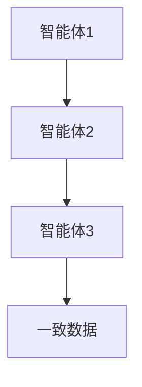
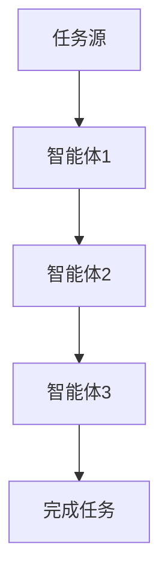
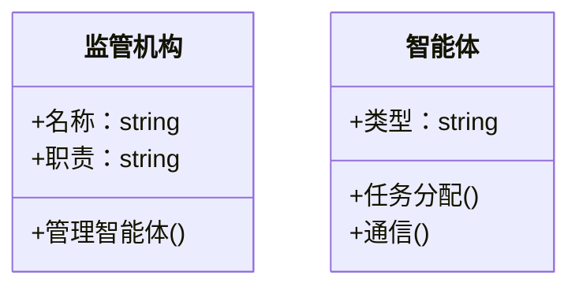

                 


# 多智能体协同评估监管环境影响

> 关键词：多智能体协同、环境影响评估、分布式计算、一致性算法、任务分配算法

> 摘要：本文深入探讨了多智能体协同在监管环境影响评估中的应用。通过分析多智能体系统的概念、核心算法、系统架构和实际案例，本文详细阐述了如何利用多智能体协同技术解决复杂环境监管问题。文章从背景介绍到系统设计，再到项目实战，全面解析了多智能体协同评估监管环境影响的理论与实践。

---

## 第一部分：多智能体协同评估的背景与核心概念

### 第1章：多智能体协同评估的背景与问题描述

#### 1.1 多智能体系统的定义与特点
多智能体系统（Multi-Agent System, MAS）由多个智能体（Agent）组成，每个智能体都能感知环境、做出决策并采取行动。与单个智能体相比，多智能体系统具有以下特点：
- **分布性**：智能体独立运行，通过通信协作完成任务。
- **交互性**：智能体之间通过消息传递进行通信。
- **社会性**：智能体之间存在协同与竞争关系。
- **适应性**：系统能够动态调整以应对环境变化。

#### 1.2 问题背景与问题描述
在环境监管中，单一智能体难以应对复杂的多因素影响。例如，在评估工业园区的环境影响时，需要考虑空气、水、土壤等多个方面的数据。单一智能体难以同时处理如此多的数据源和评估维度。

**问题解决思路**：
- 将环境影响评估任务分解为多个子任务。
- 通过多智能体协同完成子任务，并将结果整合为最终的评估报告。

**边界与外延**：
- 本研究主要关注空气和水环境的评估。
- 未来可以扩展到土壤和其他环境因素的评估。

### 第2章：多智能体协同的核心概念与联系

#### 2.1 多智能体系统的概念模型
智能体的属性与行为：
- **感知**：通过传感器或数据接口获取环境信息。
- **决策**：基于感知信息做出决策。
- **行动**：执行决策并影响环境。

多智能体系统的组成与交互关系：
- 智能体之间通过通信模块进行信息交换。
- 系统通过协调机制确保智能体协同工作。

#### 2.2 多智能体协同的核心要素
- **协同目标**：明确每个智能体的任务目标。
- **任务分解**：将整体任务分解为子任务。
- **通信机制**：定义智能体之间的通信协议。

**ER实体关系图**：
```mermaid
erDiagram
    监管机构 o-1 智能体 : 管理
    智能体 --|{ role }| 环境数据 : 监测
```

---

## 第二部分：多智能体协同评估的算法原理

### 第3章：多智能体协同的算法原理

#### 3.1 分布式一致性算法
一致性算法用于确保多个智能体的数据同步。常用算法包括：
- **Paxos算法**：用于分布式系统中达成一致。
- **Raft算法**：用于分布式系统中的领导选举。

**一致性算法流程图**：


#### 3.2 任务分配算法
任务分配算法用于将任务分配给最合适的智能体。常用算法包括：
- **贪心算法**：根据当前信息做出最优决策。
- **分布式算法**：通过通信协商分配任务。

**任务分配算法流程图**：


### 第4章：数学模型与公式推导

#### 4.1 环境影响评估模型
环境影响评估模型可以表示为：
$$
I = f(e_1, e_2, ..., e_n)
$$
其中，\( I \) 表示环境影响，\( e_i \) 表示环境因子。

#### 4.2 一致性算法的数学表示
一致性算法的目标是找到一个一致的值 \( v \)，满足：
$$
v = \arg\min_{v \in V} \sum_{i=1}^{n} (v_i - v)^2
$$
其中，\( V \) 是智能体的值集合。

---

## 第三部分：多智能体协同评估的系统设计与实现

### 第5章：系统分析与架构设计

#### 5.1 系统功能设计
系统功能模块包括：
- 数据采集模块：采集环境数据。
- 协同计算模块：执行一致性算法和任务分配。
- 结果分析模块：生成评估报告。

**领域模型类图**：


#### 5.2 系统架构设计
采用微服务架构：
- 数据采集服务：负责环境数据的采集。
- 协同计算服务：执行一致性算法和任务分配。
- 结果展示服务：生成并展示评估报告。

**系统架构图**：
```mermaid
container 环境影响评估系统 {
    service 数据采集服务 {
        - 采集环境数据
    }
    service 协同计算服务 {
        - 执行一致性算法
    }
    service 结果展示服务 {
        - 生成评估报告
    }
}
```

### 第6章：项目实战与实现

#### 6.1 项目环境安装
安装步骤：
```bash
pip install python
pip install multi-agent-system
pip install dependencies
```

#### 6.2 核心代码实现
一致性算法实现：
```python
def paxos_algorithm(peers):
    leader =选举领导(peers)
    value = 提议者(leader). 提议值()
    确认者(peers). 确认值(value)
    返回 value
```

任务分配实现：
```python
def task_allocation(tasks, agents):
    for task in tasks:
        分配给最合适的智能体(task, agents)
```

#### 6.3 实际案例分析
以工业园区为例，评估空气和水环境的影响：
1. 数据采集模块采集空气和水的数据。
2. 协同计算模块执行一致性算法和任务分配。
3. 结果分析模块生成评估报告。

---

## 第四部分：总结与展望

### 第7章：总结与展望

#### 7.1 总结
多智能体协同在环境影响评估中具有显著优势，能够提高评估的准确性和效率。

#### 7.2 展望
未来的研究方向包括：
- 更复杂的环境因子评估。
- 更高效的算法设计。
- 更智能的协同机制。

---

## 作者信息

作者：AI天才研究院（AI Genius Institute） & 禅与计算机程序设计艺术（Zen And The Art of Computer Programming）

---

通过以上结构，文章详细介绍了多智能体协同评估监管环境影响的背景、核心概念、算法原理、系统设计和实际应用，为读者提供了一个全面的技术视角。

