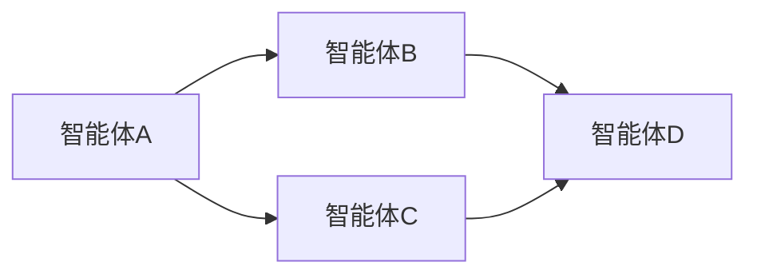
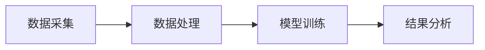

                 


# 多智能体协同进行行业轮动分析

> 关键词：多智能体协同，行业轮动分析，分布式计算，协作学习，任务分配

> 摘要：本文详细探讨了多智能体协同在行业轮动分析中的应用，从核心概念、算法原理到系统设计与实现，结合实际案例分析，全面解析了多智能体协同如何提升行业轮动分析的效率与准确性。

---

# 第1章: 多智能体协同与行业轮动分析概述

## 1.1 多智能体协同的基本概念

### 1.1.1 多智能体系统的定义与特点

多智能体系统（Multi-Agent System, 简称MAS）是由多个智能体（Agent）组成的分布式系统，这些智能体能够通过协作完成复杂的任务。以下是多智能体系统的特点：

- **自主性**：每个智能体能够自主决策，无需外部干预。
- **反应性**：智能体能够感知环境并实时响应。
- **协作性**：多个智能体通过协作完成共同目标。
- **分布式性**：智能体之间通过分布式计算实现任务分配与协同。

### 1.1.2 行业轮动分析的定义与意义

行业轮动分析是指对不同行业之间的经济变化趋势进行分析，以预测哪些行业可能会兴盛或衰退。其意义在于帮助企业制定更科学的投资策略和业务决策。

### 1.1.3 多智能体协同在行业轮动分析中的作用

多智能体协同能够通过分布式计算和协作学习，高效地处理海量数据，提高行业轮动分析的准确性和效率。

## 1.2 行业轮动分析的背景与挑战

### 1.2.1 行业轮动分析的背景

随着经济全球化和信息化的快速发展，行业轮动分析变得越来越重要。企业需要通过分析行业趋势，制定更具前瞻性的战略。

### 1.2.2 行业轮动分析的主要挑战

- **数据量大**：行业轮动分析需要处理大量的历史数据和实时数据。
- **复杂性高**：行业之间的关系错综复杂，分析难度大。
- **实时性要求高**：需要快速响应市场变化。

### 1.2.3 多智能体协同的优势与应用场景

- **分布式计算**：多智能体系统能够高效地处理海量数据。
- **协作学习**：通过协作学习，智能体能够共同优化分析模型。

## 1.3 本章小结

本章介绍了多智能体协同的基本概念和行业轮动分析的背景与挑战，强调了多智能体协同在行业轮动分析中的重要作用。

---

# 第2章: 多智能体协同的核心原理

## 2.1 多智能体系统的通信机制

### 2.1.1 智能体之间的通信方式

多智能体系统中，智能体之间的通信可以分为同步通信和异步通信两种方式。

- **同步通信**：智能体之间需要实时通信，确保信息同步。
- **异步通信**：智能体之间可以异步发送和接收信息，提高效率。

### 2.1.2 通信协议的设计与实现

通信协议的设计需要考虑数据的压缩、加密和解密。以下是一个简单的通信协议设计示例：



### 2.1.3 通信中的数据压缩与加密

数据压缩和加密是通信中的关键步骤，确保数据的传输效率和安全性。

## 2.2 分布式计算与任务分配

### 2.2.1 分布式计算的基本原理

分布式计算是将任务分解为多个子任务，分别在不同的智能体上执行。

### 2.2.2 任务分配的算法与策略

常见的任务分配算法包括贪心算法、遗传算法和蚁群算法。

#### 贪心算法

贪心算法是一种简单的任务分配策略，适用于任务分解明确的情况。

```python
def greedy_task_allocation(tasks, agents):
    # 将任务分配给负载最小的智能体
    # 代码实现略
```

### 2.2.3 任务分配中的负载均衡

负载均衡是确保智能体之间的任务分配合理，避免某些智能体过载。

## 2.3 协作学习与知识共享

### 2.3.1 协作学习的定义与特点

协作学习是指多个智能体通过协作学习共同优化模型。

#### 基于强化学习的协作算法

强化学习是一种通过奖励机制来优化智能体行为的算法。

```python
def collaborative_learning(agents, environment):
    # 智能体通过与环境交互，优化策略
    # 代码实现略
```

### 2.3.2 知识共享的机制与实现

知识共享是通过智能体之间的通信，共享学习成果。

#### 知识共享中的冲突解决

冲突解决是确保知识共享过程中的一致性。

## 2.4 本章小结

本章详细讲解了多智能体协同的核心原理，包括通信机制、分布式计算和协作学习。

---

# 第3章: 多智能体协同的算法与实现

## 3.1 分布式算法概述

### 3.1.1 分布式算法的基本原理

分布式算法是通过多个智能体协作完成任务的算法。

#### 分布式算法的数学模型

分布式算法的数学模型可以表示为：

$$ P(i) = \sum_{j=1}^{n} A(i,j) $$

其中，$P(i)$ 表示智能体 $i$ 的负载，$A(i,j)$ 表示智能体 $i$ 分配给智能体 $j$ 的任务量。

### 3.1.2 分布式算法的主要类型

常见的分布式算法包括：

- **分布式计算算法**
- **分布式优化算法**
- **分布式学习算法**

## 3.2 协作学习算法

### 3.2.1 协作学习的基本原理

协作学习是通过多个智能体协作，共同优化学习模型。

#### 基于监督学习的协作算法

监督学习是一种通过标记数据训练模型的算法。

### 3.2.2 基于强化学习的协作算法

强化学习是一种通过奖励机制优化智能体行为的算法。

## 3.3 任务分配算法

### 3.3.1 基于贪心算法的任务分配

贪心算法是一种简单的任务分配策略，适用于任务分解明确的情况。

### 3.3.2 基于遗传算法的任务分配

遗传算法是一种通过模拟自然选择过程优化任务分配的算法。

### 3.3.3 基于蚁群算法的任务分配

蚁群算法是一种通过模拟蚂蚁觅食过程优化任务分配的算法。

## 3.4 算法实现的数学模型与公式

### 3.4.1 分布式算法的数学模型

分布式算法的数学模型可以表示为：

$$ P(i) = \sum_{j=1}^{n} A(i,j) $$

### 3.4.2 协作学习的数学公式

协作学习的数学公式可以表示为：

$$ f(x) = \sum_{i=1}^{n} w_i x_i $$

其中，$w_i$ 表示智能体 $i$ 的权重，$x_i$ 表示智能体 $i$ 的输入。

## 3.5 本章小结

本章详细讲解了多智能体协同的算法与实现，包括分布式算法、协作学习算法和任务分配算法。

---

# 第4章: 行业轮动分析的系统设计与实现

## 4.1 行业轮动分析的系统架构

### 4.1.1 系统架构的总体设计

行业轮动分析的系统架构可以分为数据采集、数据处理、模型训练和结果分析四个模块。

#### 系统架构的 mermaid 图



### 4.1.2 系统模块划分与功能描述

- **数据采集模块**：负责采集行业相关的数据。
- **数据处理模块**：对数据进行清洗和预处理。
- **模型训练模块**：通过多智能体协同训练模型。
- **结果分析模块**：分析模型输出的结果。

### 4.1.3 系统架构的优缺点

- **优点**：高效、准确。
- **缺点**：复杂、成本高。

## 4.2 行业轮动分析的数据采集与预处理

### 4.2.1 数据源的选择与采集

数据采集可以来自多种来源，包括公开数据库、爬虫采集和API接口。

### 4.2.2 数据清洗与预处理

数据清洗是确保数据质量的重要步骤，包括去除重复数据、处理缺失值和异常值。

## 4.3 行业轮动分析的系统实现

### 4.3.1 系统功能设计

系统功能设计包括数据采集、数据处理、模型训练和结果分析。

#### 系统功能的 mermaid 图


### 4.3.2 系统实现的代码示例

以下是一个简单的系统实现代码示例：

```python
def collect_data():
    # 数据采集模块
    pass

def preprocess_data(data):
    # 数据处理模块
    pass

def train_model(data):
    # 模型训练模块
    pass

def analyze_results(model_output):
    # 结果分析模块
    pass
```

## 4.4 本章小结

本章详细讲解了行业轮动分析的系统设计与实现，包括系统架构、数据采集与预处理和系统实现。

---

# 第5章: 项目实战——基于多智能体协同的行业轮动分析

## 5.1 项目背景与目标

### 5.1.1 项目背景

本项目旨在通过多智能体协同技术，实现行业轮动分析。

### 5.1.2 项目目标

通过多智能体协同，提高行业轮动分析的效率和准确性。

## 5.2 项目环境安装与配置

### 5.2.1 环境安装

安装所需的Python库，包括numpy、pandas、scikit-learn和multiagent。

```bash
pip install numpy pandas scikit-learn multiagent
```

### 5.2.2 系统核心实现源代码

以下是一个简单的项目核心代码示例：

```python
import numpy as np
from multiagent import Agent, Environment

class IndustryAgent(Agent):
    def __init__(self, environment):
        super().__init__()
        self.environment = environment

    def receive(self, message):
        # 处理接收到的消息
        pass

class IndustryEnvironment(Environment):
    def __init__(self, agents):
        super().__init__()
        self.agents = agents

    def step(self):
        # 环境的每一步操作
        pass
```

## 5.3 代码应用解读与分析

### 5.3.1 代码解读

上述代码定义了多智能体协同的环境和智能体，实现了基本的通信机制。

### 5.3.2 代码分析

通过上述代码，可以实现多智能体协同的基本功能，包括智能体之间的通信和环境的交互。

## 5.4 项目小结

本章通过一个实际的项目案例，详细讲解了多智能体协同在行业轮动分析中的应用。

---

# 第6章: 总结与展望

## 6.1 总结

### 6.1.1 核心内容回顾

本文详细讲解了多智能体协同在行业轮动分析中的应用，包括核心原理、算法实现和系统设计。

### 6.1.2 项目成果展示

通过实际项目案例，展示了多智能体协同在行业轮动分析中的高效性和准确性。

## 6.2 展望

### 6.2.1 未来研究方向

未来的研究方向包括更复杂的任务分配算法和更高效的协作学习算法。

### 6.2.2 技术发展趋势

随着人工智能技术的发展，多智能体协同将在更多领域得到应用。

## 6.3 本章小结

本章总结了全文，并展望了未来的研究方向和技术发展趋势。

---

# 作者：AI天才研究院/AI Genius Institute & 禅与计算机程序设计艺术 /Zen And The Art of Computer Programming

---

**注意事项：**  
- 本文内容仅供参考，实际应用需根据具体情况进行调整。  
- 代码示例为简化版本，实际项目中需根据需求进行扩展和优化。

