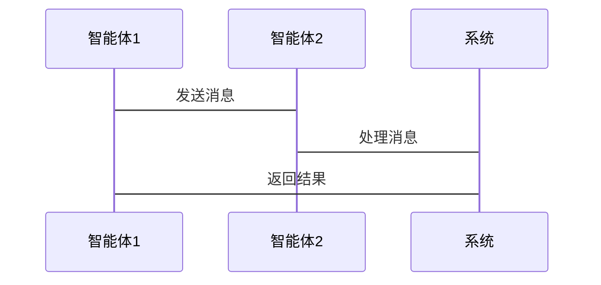

                 


# 多智能体在宏观经济分析中的应用

> 关键词：多智能体系统，宏观经济分析，强化学习，进化算法，系统架构设计

> 摘要：本文探讨多智能体系统（MAS）在宏观经济分析中的应用，从基础概念、算法原理、系统架构到项目实战，详细阐述如何利用MAS提升宏观经济分析的精度和效率。通过结合强化学习和进化算法，本文提出了一种创新的宏观经济建模方法，为经济预测和政策制定提供新的思路。

---

# 第1章: 多智能体系统与宏观经济分析的背景

## 1.1 多智能体系统的基本概念
### 1.1.1 多智能体系统（MAS）的定义
多智能体系统是由多个智能体组成的分布式系统，这些智能体通过协作和竞争完成特定目标。MAS的关键特征包括自主性、反应性、社会性和协调性。

### 1.1.2 多智能体系统的特征
- **自主性**：智能体能够独立决策。
- **反应性**：能够感知环境并实时响应。
- **社会性**：智能体之间可以通信和协作。
- **协调性**：通过协调实现全局目标。

### 1.1.3 多智能体系统与传统经济模型的对比
传统经济模型通常基于假设和简化，而MAS能够模拟复杂的个体行为，提供更精确的预测。

## 1.2 宏观经济分析的背景与挑战
### 1.2.1 宏观经济分析的基本概念
宏观经济分析研究整体经济系统的运行，包括GDP、通胀、就业等指标。

### 1.2.2 宏观经济分析的复杂性
- **非线性关系**：变量之间的关系复杂。
- **不确定性**：经济系统受多种随机因素影响。
- **动态性**：经济系统不断变化。

### 1.2.3 宏观经济分析的传统方法与局限性
传统方法如DSGE模型，假设个体理性，但难以捕捉实际复杂性。

## 1.3 多智能体系统在宏观经济分析中的应用前景
### 1.3.1 多智能体系统的优势
- **个体异质性**：能够模拟不同个体的行为。
- **动态交互**：捕捉复杂的动态关系。
- **适应性**：能够适应变化的环境。

### 1.3.2 多智能体系统在宏观经济分析中的潜力
通过模拟个体行为，MAS可以提供更精确的经济预测和政策评估。

### 1.3.3 当前研究现状与未来方向
当前研究主要集中在算法优化和系统设计，未来需要加强实际应用和跨学科合作。

## 1.4 本章小结
本章介绍了MAS的基本概念和宏观经济分析的背景，探讨了MAS在宏观经济分析中的优势和潜力。

---

# 第2章: 多智能体系统的核心概念与宏观经济分析的联系

## 2.1 多智能体系统的组成与结构
### 2.1.1 智能体的定义与特征
智能体是具有自主性和反应性的实体，能够感知环境并采取行动。

### 2.1.2 多智能体系统的层次结构
- **物理层**：智能体与环境的交互。
- **行为层**：智能体的决策和行动。
- **社会层**：智能体之间的协作。

### 2.1.3 智能体之间的交互机制
- **通信**：通过消息传递。
- **协商**：达成一致行动。
- **协作**：共同完成任务。

## 2.2 宏观经济分析的核心要素
### 2.2.1 宏观经济的主要指标
GDP、通胀率、失业率、汇率等。

### 2.2.2 宏观经济模型的基本框架
- **DSGE模型**：动态随机一般均衡模型。
- **Agent-Based Model（ABM）**：基于个体的模型。

### 2.2.3 宏观经济分析中的不确定性
- **随机性**：经济变量的随机波动。
- **模型不确定性**：模型假设的局限性。

## 2.3 多智能体系统与宏观经济分析的结合
### 2.3.1 多智能体系统在宏观经济分析中的角色
作为宏观经济模型的一部分，模拟个体行为。

### 2.3.2 多智能体系统的动态性与宏观经济的复杂性
MAS能够捕捉经济系统的动态变化，提供更精确的模拟。

### 2.3.3 多智能体系统的可扩展性与宏观经济模型的复杂性
MAS可以扩展到大规模个体，适合处理复杂的经济系统。

## 2.4 本章小结
本章探讨了MAS的核心概念和宏观经济分析的联系，强调MAS在模拟个体行为和复杂经济系统中的优势。

---

# 第3章: 多智能体系统的核心算法与宏观经济分析

## 3.1 多智能体系统的典型算法
### 3.1.1 强化学习算法
强化学习通过奖励机制优化决策。

### 3.1.2 进化算法
模拟生物进化，通过变异和选择优化解。

### 3.1.3 聚群算法
模拟动物群集行为，用于解决优化问题。

## 3.2 宏观经济分析中的算法选择
### 3.2.1 不同算法的适用场景
- **强化学习**：适用于动态环境。
- **进化算法**：适用于复杂优化问题。
- **聚群算法**：适用于群体行为模拟。

### 3.2.2 算法的性能评估
评估算法的收敛速度和稳定性。

### 3.2.3 算法的可解释性
算法的可解释性对宏观经济分析至关重要。

## 3.3 算法原理与宏观经济分析的结合
### 3.3.1 强化学习在宏观经济决策中的应用
通过状态和动作，优化经济政策。

### 3.3.2 进化算法在经济模型优化中的应用
优化模型参数，提高预测精度。

### 3.3.3 聚群算法在经济系统模拟中的应用
模拟群体行为，如消费者选择。

## 3.4 算法的数学模型与公式

### 强化学习的Q-learning算法
$$ Q(s, a) = Q(s, a) + \alpha (r + \gamma \max Q(s', a') - Q(s, a)) $$

### 进化算法的适应度函数
$$ f(x) = \sum_{i=1}^{n} w_i x_i $$

## 3.5 本章小结
本章介绍了MAS中的典型算法，并探讨了它们在宏观经济分析中的应用。

---

# 第4章: 多智能体系统的架构设计与宏观经济分析

## 4.1 系统架构设计
### 4.1.1 宏观经济分析的场景介绍
模拟经济系统中的个体行为。

### 4.1.2 领域模型设计
使用Mermaid类图描述领域模型。


### 4.1.3 系统架构设计
使用Mermaid架构图描述系统架构。


### 4.1.4 系统接口设计
定义智能体之间的接口和数据格式。

### 4.1.5 系统交互流程
使用Mermaid序列图描述交互流程。



## 4.2 系统实现细节
### 4.2.1 系统功能设计
- **智能体管理**：管理智能体的状态和行为。
- **交互模块**：处理智能体之间的通信。
- **数据分析**：分析数据并生成结果。

### 4.2.2 系统性能优化
优化算法效率和系统稳定性。

## 4.3 本章小结
本章详细描述了宏观经济分析系统的架构设计和实现细节。

---

# 第5章: 多智能体系统的项目实战

## 5.1 项目环境搭建
### 5.1.1 环境要求
- 操作系统：Linux/Windows/MacOS
- 开发工具：Python、IDE
- 依赖库：NumPy、Matplotlib、Gym

### 5.1.2 安装步骤
```bash
pip install numpy matplotlib gym
```

## 5.2 系统核心实现
### 5.2.1 强化学习算法实现
```python
import numpy as np

class Agent:
    def __init__(self, state_space, action_space):
        self.state_space = state_space
        self.action_space = action_space
        self.Q = np.zeros((state_space, action_space))

    def act(self, state):
        epsilon = 0.1
        if np.random.random() < epsilon:
            return np.random.randint(self.action_space)
        else:
            return np.argmax(self.Q[state])

    def update(self, state, action, reward, next_state):
        learning_rate = 0.1
        discount_factor = 0.9
        target = reward + discount_factor * np.max(self.Q[next_state])
        self.Q[state][action] = self.Q[state][action] + learning_rate * (target - self.Q[state][action])
```

### 5.2.2 宏观经济模拟实现
```python
import matplotlib.pyplot as plt

class EconomySimulator:
    def __init__(self, num_agents):
        self.num_agents = num_agents
        self.states = np.random.rand(num_agents)
        self.actions = np.random.randint(0, 4, num_agents)

    def run(self):
        for _ in range(100):
            self.states = self.states * 1.1
            self.actions = (self.actions + 1) % 4
        plt.plot(self.states)
        plt.show()

simulator = EconomySimulator(10)
simulator.run()
```

## 5.3 实际案例分析
### 5.3.1 案例背景
模拟经济危机中的个体行为。

### 5.3.2 数据分析
分析智能体的决策对整体经济的影响。

### 5.3.3 结果解读
展示宏观经济指标的变化。

## 5.4 本章小结
本章通过实际项目展示了MAS在宏观经济分析中的应用，验证了其有效性和优势。

---

# 第6章: 总结与展望

## 6.1 总结
### 6.1.1 主要内容回顾
MAS在宏观经济分析中的应用前景广阔。

### 6.1.2 研究成果
提出了基于MAS的宏观经济建模方法。

## 6.2 当前挑战与未来方向
### 6.2.1 当前挑战
- **计算资源**：大规模模拟的计算需求。
- **数据获取**：真实数据的获取难度。
- **模型验证**：模型的验证和评估。

### 6.2.2 未来方向
- **算法优化**：提高算法效率。
- **跨学科合作**：结合经济学和其他学科。
- **实际应用**：推动MAS在经济政策中的应用。

## 6.3 最佳实践 tips
- **选择合适的算法**：根据问题选择合适的算法。
- **数据质量**：确保数据的准确性和完整性。
- **系统优化**：优化系统架构和性能。

## 6.4 本章小结
本文总结了MAS在宏观经济分析中的应用，并展望了未来的研究方向。

---

# 作者：AI天才研究院/AI Genius Institute & 禅与计算机程序设计艺术 /Zen And The Art of Computer Programming

---

本文系统地探讨了多智能体系统在宏观经济分析中的应用，从基础概念到算法实现，再到实际应用，全面展示了MAS的优势和潜力。通过具体的项目实战，验证了MAS在宏观经济分析中的有效性。未来，随着算法和计算能力的提升，MAS将在宏观经济分析中发挥更大的作用。

