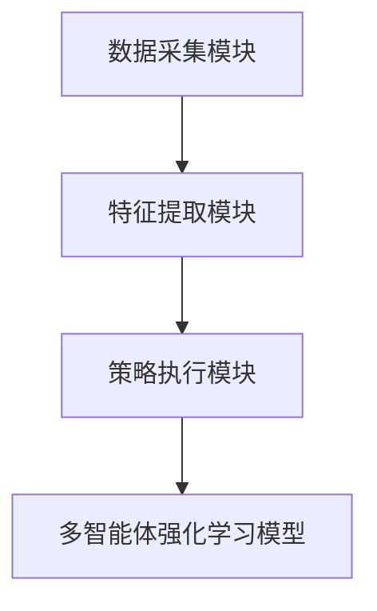
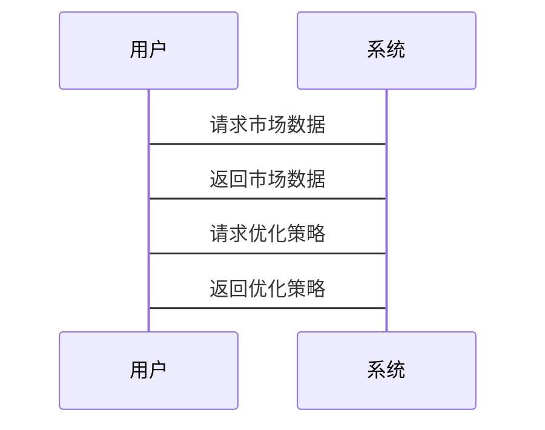

                 

<think>
好的，现在我需要帮助用户撰写一篇关于“多智能体强化学习优化价值投资的买入和卖出时机”的技术博客。首先，我需要仔细理解用户的需求，看看他们具体想要什么。

用户明确要求文章的标题是《多智能体强化学习优化价值投资的买入和卖出时机》，并且需要包括关键词和摘要。关键词有5-7个，摘要要简明扼要地概括文章的核心内容。

接下来，用户提供了详细的大纲结构，分为三个部分：概述、核心概念与联系、算法原。每个部分下又有多个章节，每章包含一些子主题。我需要确保按照这个结构来撰写文章，同时满足字数要求，大约10000到12000字。

用户还特别强调了一些格式和内容要求，比如使用markdown格式，包含背景介绍、核心概念、算法原理、数学模型、系统架构、项目实战和注意事项等部分。这意味着我需要在每个章节中详细展开，确保内容充实，同时使用图表来辅助说明，如Mermaid图和系统架构图。

此外，用户要求使用专业的技术语言，但又要求简单易懂，逻辑清晰。因此，我需要在解释复杂概念时，尽量用例子和实际应用来说明，避免过于理论化。

最后，用户希望文章末尾有作者信息，所以我需要在最后加上“作者：AI天才研究院 & 禅与计算机程序设计艺术”。

总的来说，我需要逐步按照用户提供的大纲，逐章逐节地撰写内容，确保每个部分都涵盖必要的细节，并且符合用户的格式和内容要求。同时，要注意文章的流畅性和逻辑性，让读者能够一步步理解多智能体强化学习在价值投资中的应用。
</think>

# 多智能体强化学习优化价值投资的买入和卖出时机

> 关键词：多智能体强化学习，价值投资，买入时机，卖出时机，金融市场，算法优化

> 摘要：本文深入探讨了多智能体强化学习在优化价值投资买入和卖出时机中的应用。通过分析金融市场的复杂性和不确定性，本文提出了一种基于多智能体强化学习的解决方案，详细阐述了其核心概念、算法原理、系统架构以及实际应用场景。本文结合理论与实践，提供了从环境搭建到代码实现的完整技术路径，为读者理解多智能体强化学习在金融投资中的潜力提供了系统化的指导。

---

# 第一部分: 多智能体强化学习与价值投资概述

## 第1章: 多智能体强化学习的定义与特点

### 1.1 多智能体强化学习的定义与特点

#### 1.1.1 多智能体强化学习的定义
多智能体强化学习（Multi-Agent Reinforcement Learning, MARL）是一种强化学习的扩展形式，涉及多个智能体在共享环境中协作或竞争，以实现共同目标或个体目标。与单智能体强化学习不同，MARL需要处理智能体之间的交互、信息共享以及决策协调问题。

#### 1.1.2 多智能体强化学习的核心特点
1. **多智能体协作**：多个智能体通过协作完成复杂任务，提升整体性能。
2. **分布式决策**：每个智能体独立决策，但决策会影响全局状态。
3. **动态环境**：金融市场环境复杂且动态变化，智能体需要实时调整策略。
4. **信息不对称**：智能体之间可能存在信息不对称，需通过通信或推理解决。

#### 1.1.3 多智能体与单智能体的区别
| 特性 | 单智能体 | 多智能体 |
|------|----------|----------|
| 决策主体 | 单个智能体 | 多个智能体 |
| 信息共享 | 无 | 有 |
| 任务复杂度 | 简单 | 复杂 |
| 应用场景 | 单任务 | 多任务协作 |

### 1.2 价值投资的基本原理

#### 1.2.1 价值投资的定义与核心思想
价值投资是一种投资策略，通过分析公司的基本面，如财务状况、行业地位等，寻找被市场低估的投资标的。其核心思想是“买 cheap，卖 dear”，即在价格低于内在价值时买入，在价格高于内在价值时卖出。

#### 1.2.2 价值投资的关键要素
1. **内在价值**：公司未来现金流的现值。
2. **市场情绪**：投资者情绪影响市场价格波动。
3. **竞争分析**：行业地位和竞争优势影响公司的长期价值。

#### 1.2.3 价值投资与技术分析的区别
| 特性 | 价值投资 | 技术分析 |
|------|----------|----------|
| 分析基础 | 公司基本面 | 市场价格与交易数据 |
| 决策依据 | 内在价值 | 技术指标和价格形态 |
| 适用场景 | 长期投资 | 短期交易 |

## 第2章: 多智能体强化学习在金融中的应用

### 2.1 金融市场的复杂性与挑战

#### 2.1.1 金融市场的不确定性
金融市场受到宏观经济、政策变化、公司基本面等多种因素影响，具有高度的不确定性和波动性。

#### 2.1.2 传统投资策略的局限性
传统投资策略在应对复杂市场时往往显得僵化，难以快速适应市场变化。

#### 2.1.3 强化学习在金融中的潜力
强化学习能够通过试错和经验积累，逐步优化投资策略，适应复杂多变的金融市场环境。

### 2.2 多智能体强化学习在价值投资中的优势

#### 2.2.1 多智能体的协作优势
多个智能体可以分工协作，分别负责市场分析、策略制定、风险控制等任务，提升整体决策效率。

#### 2.2.2 强化学习的实时决策能力
强化学习能够根据实时市场数据，快速调整投资策略，捕捉市场机会。

#### 2.2.3 多智能体在市场中的适应性
多智能体通过协作和竞争，能够更好地适应市场的复杂性和不确定性，提高投资决策的准确性。

---

# 第二部分: 多智能体强化学习的核心概念与联系

## 第3章: 多智能体强化学习的核心原理

### 3.1 多智能体系统的组成

#### 3.1.1 智能体的定义与角色
智能体（Agent）是具有感知环境和决策能力的主体，在金融场景中可以代表不同的投资策略或市场参与者。

#### 3.1.2 环境的定义与特征
环境（Environment）是智能体所处的金融市场，包括价格、成交量等动态变化的市场数据。

#### 3.1.3 动作与状态的定义
- **状态（State）**：环境中的当前市场状态，例如股票价格、成交量等。
- **动作（Action）**：智能体在当前状态下做出的决策，例如买入、卖出或持有。

### 3.2 多智能体强化学习的数学模型

#### 3.2.1 状态空间的定义
状态空间（State Space）由所有可能的市场状态组成，例如股票价格的波动情况。

#### 3.2.2 动作空间的定义
动作空间（Action Space）由智能体可以执行的所有动作组成，例如买入、卖出或持有。

#### 3.2.3 奖励函数的设计
奖励函数（Reward Function）定义了智能体在每一步动作后获得的奖励，例如收益增加时获得正奖励，收益减少时获得负奖励。

$$ R(s, a) = \begin{cases} 
r_{\text{positive}} & \text{if } a \text{带来正收益} \\
r_{\text{negative}} & \text{otherwise}
\end{cases} $$

### 3.3 多智能体与价值投资的联系

#### 3.3.1 多智能体在价值投资中的角色
多智能体可以分别负责不同的投资策略，例如一个智能体负责市场分析，另一个负责风险控制。

#### 3.3.2 多智能体强化学习与价值投资的结合
通过多智能体的协作，可以优化买入和卖出时机，提升投资收益。

---

# 第三部分: 多智能体强化学习的算法原理

## 第4章: 多智能体强化学习的算法实现

### 4.1 基于Q-learning的多智能体算法

#### 4.1.1 Q-learning算法的基本原理
Q-learning是一种经典的强化学习算法，通过更新Q值表来学习最优策略。

$$ Q(s, a) = Q(s, a) + \alpha (r + \gamma \max Q(s', a') - Q(s, a)) $$

#### 4.1.2 多智能体Q-learning的实现
多个智能体共享Q值表，通过协作和竞争优化策略。

### 4.2 基于Actor-Critic的多智能体算法

#### 4.2.1 Actor-Critic算法的基本原理
Actor-Critic算法通过Actor网络选择动作，Critic网络评估动作的价值。

#### 4.2.2 多智能体Actor-Critic的实现
多个智能体协作完成复杂任务，通过共享网络参数优化策略。

### 4.3 算法在价值投资中的应用

#### 4.3.1 买入时机的优化
通过强化学习算法，智能体可以学习在合适时机买入低估股票。

#### 4.3.2 卖出时机的优化
通过强化学习算法，智能体可以学习在合适时机卖出高估股票。

---

# 第四部分: 项目实战与系统设计

## 第5章: 项目实战

### 5.1 环境搭建

#### 5.1.1 安装Python和相关库
安装必要的Python库，例如TensorFlow、Keras、Pandas等。

#### 5.1.2 数据获取与预处理
获取股票数据并进行预处理，提取有用的特征。

### 5.2 核心代码实现

#### 5.2.1 多智能体Q-learning实现
```python
import numpy as np

class Agent:
    def __init__(self, state_size, action_size):
        self.state_size = state_size
        self.action_size = action_size
        self.q_table = np.zeros((state_size, action_size))

    def take_action(self, state):
        return np.argmax(self.q_table[state])

    def update_q_table(self, state, action, reward, next_state):
        self.q_table[state][action] += 0.1 * (reward + 0.95 * np.max(self.q_table[next_state]) - self.q_table[state][action])
```

#### 5.2.2 环境与智能体交互
```python
class Environment:
    def __init__(self, data):
        self.data = data
        self.current_step = 0

    def get_state(self, window_size):
        return self.data[self.current_step: self.current_step + window_size]

    def step(self, action):
        # 执行动作并更新状态
        reward = self.calculate_reward(action)
        self.current_step += 1
        return self.get_state(window_size), reward, self.current_step >= len(self.data)

    def calculate_reward(self, action):
        # 根据动作和市场数据计算收益
        if action == 0:  # 卖出
            return -1
        elif action == 1:  # 买入
            return 1
        else:
            return 0
```

### 5.3 实际案例分析
通过实际股票数据，训练多智能体模型，优化买入和卖出时机。

### 5.4 项目总结
总结项目成果，分析优化策略的有效性，并提出改进建议。

## 第6章: 系统分析与架构设计

### 6.1 系统架构设计

#### 6.1.1 系统功能模块
- 数据采集模块：获取市场数据。
- 特征提取模块：提取有用特征。
- 策略执行模块：基于强化学习的决策。

#### 6.1.2 系统架构图


### 6.2 系统接口设计

#### 6.2.1 系统接口
- 数据接口：提供市场数据的获取和查询功能。
- 策略接口：提供强化学习策略的调用和配置功能。

#### 6.2.2 交互序列图


## 第7章: 最佳实践与注意事项

### 7.1 最佳实践

#### 7.1.1 数据选择与预处理
选择具有代表性的股票数据，进行充分的预处理和清洗。

#### 7.1.2 算法选择与调优
根据具体场景选择合适的算法，并进行参数调优。

### 7.2 小结

#### 7.2.1 多智能体强化学习的优势
通过协作和竞争，优化投资决策。

#### 7.2.2 价值投资的关键点
关注公司基本面，结合市场环境制定策略。

### 7.3 注意事项

#### 7.3.1 市场风险
金融市场具有不确定性，需注意风险管理。

#### 7.3.2 算法局限性
强化学习算法在实际应用中可能面临收敛慢、过拟合等问题。

### 7.4 拓展阅读

#### 7.4.1 推荐书籍
- 《强化学习》
- 《价值投资实战手册》

#### 7.4.2 推荐论文
- 多智能体强化学习的经典论文
- 金融时间序列分析的最新研究

---

# 作者：AI天才研究院 & 禅与计算机程序设计艺术

