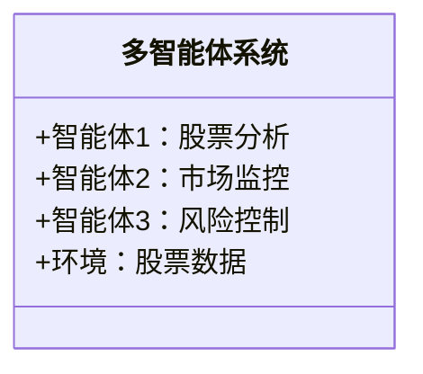
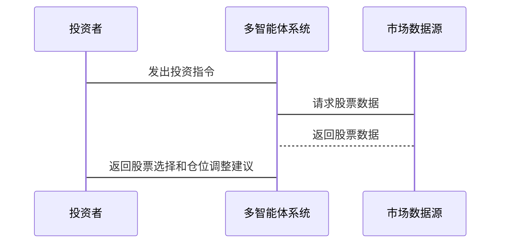

                 

<think>
好的，我现在要帮用户撰写一篇关于《多智能体强化学习在优化价值投资的仓位管理中的应用》的技术博客文章。首先，我需要理解用户的需求。用户希望我以一位技术专家的身份，撰写一篇结构清晰、内容详实的技术博客，涵盖从基础到应用的各个方面。

首先，我会分析用户提供的文章大纲，确保内容全面。文章分为几个部分：摘要、关键词、目录，以及详细的内容章节。我需要确保每个部分都包含必要的信息，并且逻辑连贯。

接下来，我需要考虑读者的背景。读者可能是对多智能体强化学习有一定了解的金融从业者或研究人员，他们希望了解如何将这一技术应用于价值投资的仓位管理。因此，文章需要平衡理论和实践，既有深入的算法分析，也有实际的案例展示。

在撰写过程中，我需要确保每个章节都有足够的细节。例如，在“多智能体强化学习概述”部分，我会先定义多智能体系统，然后解释强化学习的基本原理，最后讨论其在金融中的应用。这样读者可以逐步理解概念，为后续的应用分析打下基础。

在“价值投资与仓位管理基础”部分，我需要详细阐述价值投资的定义和策略，以及仓位管理的重要性。这部分内容需要清晰明了，帮助读者理解金融领域的基本概念，为接下来的技术应用做准备。

在“多智能体强化学习在价值投资中的应用”部分，我会详细介绍股票选择和仓位管理中的多智能体模型，以及这些模型如何帮助投资者优化策略。这部分需要结合实际案例，展示技术的实际应用效果。

在算法原理部分，我会选择合适的算法，如Q-learning和DQN，并用mermaid流程图展示算法的流程。同时，我会提供Python代码示例，帮助读者理解和实现这些算法。

在系统架构部分，我会设计一个完整的金融投资系统，展示多智能体如何协作完成任务。使用mermaid类图和架构图，可以帮助读者更好地理解系统结构。

在项目实战部分，我会详细指导读者如何安装环境、编写核心代码，并进行案例分析。这部分需要具体的操作步骤和代码示例，确保读者能够动手实践。

最后，在总结部分，我会回顾全文，强调多智能体强化学习在优化价值投资中的优势，并指出未来的研究方向。

在写作过程中，我会注意使用清晰、专业的技术语言，同时避免过于复杂的术语，确保内容易于理解。我会确保每个章节都有足够的细节，同时保持整体结构的紧凑和逻辑的连贯。

总之，我的目标是撰写一篇内容丰富、结构清晰、技术深入的博客文章，帮助读者全面理解多智能体强化学习在优化价值投资仓位管理中的应用，并能够实际应用这些技术。
</think>

# 多智能体强化学习在优化价值投资的仓位管理中的应用

> 关键词：多智能体强化学习，价值投资，仓位管理，股票选择，风险控制，动态调整

> 摘要：本文详细探讨了多智能体强化学习在优化价值投资仓位管理中的应用。首先，我们介绍了多智能体强化学习的基本概念和核心原理，以及价值投资和仓位管理的基本理论。接着，我们分析了多智能体强化学习在股票选择和仓位管理中的具体应用，提出了基于多智能体系统的优化策略。通过结合实际案例，我们展示了如何利用多智能体强化学习技术实现高效的股票选择和动态仓位调整，从而在金融投资中实现更高的收益和风险控制。最后，我们总结了多智能体强化学习在价值投资中的优势，并展望了未来的研究方向。

---

## 第一部分: 多智能体强化学习概述

### 第1章: 多智能体强化学习概述

#### 1.1 多智能体强化学习的定义
多智能体强化学习（Multi-Agent Reinforcement Learning, MARL）是指在多智能体系统中，多个智能体通过与环境交互，学习策略以实现各自目标或共同目标的过程。与单智能体强化学习相比，MARL的核心在于多个智能体之间的协作与竞争。

#### 1.2 多智能体强化学习的分类
1. **协作型多智能体系统**：智能体之间通过协作实现共同目标，例如分布式任务分配。
2. **竞争型多智能体系统**：智能体之间存在竞争关系，例如博弈论中的对抗性任务。
3. **分层次的多智能体系统**：智能体之间存在层次结构，例如主智能体和子智能体的分工合作。

#### 1.3 多智能体强化学习的应用领域
1. **金融领域中的应用**：多智能体可以分别负责不同的投资决策任务，例如股票选择和仓位管理。
2. **游戏AI中的应用**：例如在MOBA游戏中，多个AI角色协同合作完成任务。
3. **机器人协作中的应用**：多个机器人通过协作完成复杂的物理任务。

---

## 第二部分: 价值投资与仓位管理基础

### 第2章: 价值投资与仓位管理基础

#### 2.1 价值投资的基本原理
价值投资是一种以基本面分析为基础的投资策略，核心在于寻找被市场低估的股票进行长期投资。其核心思想是“买便宜的资产”，即通过分析公司的财务状况、行业地位和未来发展前景，找到具有投资价值的股票。

#### 2.2 股票仓位管理的重要性
股票仓位管理是指投资者根据市场变化和个人投资目标，动态调整持有的股票数量和比例的过程。有效的仓位管理可以帮助投资者在市场波动中降低风险，同时抓住收益机会。

#### 2.3 价值投资中的仓位管理策略
1. **股票选择策略**：基于基本面分析，选择具有长期增长潜力的股票。
2. **股票持有策略**：长期持有优质股票，避免频繁交易。
3. **动态调整策略**：根据市场变化和公司基本面调整持仓比例。

---

## 第三部分: 多智能体强化学习在价值投资中的应用

### 第3章: 多智能体强化学习在股票选择中的应用

#### 3.1 多智能体强化学习在股票选择中的应用
多智能体强化学习可以用于股票选择的多个环节，例如：
1. **智能体分工**：每个智能体负责分析不同的股票特征，如财务指标、行业趋势等。
2. **策略协作**：多个智能体协同合作，综合分析多维度信息，选出具有投资价值的股票。

#### 3.2 多智能体强化学习在仓位管理中的应用
1. **多智能体在仓位分配中的角色**：每个智能体负责不同的股票或资产类别，动态调整持仓比例。
2. **多智能体在风险控制中的应用**：通过协作智能体实时监控市场风险，调整仓位以规避风险。
3. **多智能体在动态调整中的策略**：根据市场变化，智能体之间协同调整持仓比例，实现收益最大化。

#### 3.3 多智能体强化学习在价值投资中的优势
1. **高效性**：多个智能体可以并行处理大量数据，提高决策效率。
2. **协作性**：智能体之间的协作可以覆盖多个维度的分析，提升决策的全面性。
3. **适应性**：智能体可以通过强化学习不断优化策略，适应市场的动态变化。

---

## 第四部分: 算法原理与系统架构

### 第4章: 多智能体强化学习算法原理

#### 4.1 基于Q-learning的多智能体算法
Q-learning是一种经典的强化学习算法，适用于离散动作空间的问题。在多智能体系统中，每个智能体可以独立学习自己的Q值表，同时与其他智能体协作完成任务。

#### 4.2 基于DQN的多智能体算法
Deep Q-Network（DQN）是一种基于深度学习的强化学习算法，适用于连续动作空间的问题。在多智能体系统中，可以使用DQN算法分别训练多个智能体，并通过协作机制优化整体策略。

#### 4.3 多智能体强化学习的数学模型
以下是多智能体强化学习的数学模型：
$$
V(s) = \max_{a} \left( r + V(s') \right)
$$
其中，$s$是当前状态，$a$是动作，$r$是奖励，$s'$是下一个状态。

### 第5章: 系统架构与实现

#### 5.1 系统功能设计
1. **股票选择模块**：基于多智能体强化学习，选择具有投资价值的股票。
2. **仓位管理模块**：根据市场变化，动态调整持仓比例。
3. **风险控制模块**：实时监控市场风险，避免过度投资。

#### 5.2 系统架构设计
以下是系统架构的类图：


#### 5.3 系统接口设计
1. **输入接口**：接收市场数据和投资者指令。
2. **输出接口**：输出股票选择和仓位调整建议。

#### 5.4 系统交互设计
以下是系统交互的序列图：


---

## 第五部分: 项目实战

### 第6章: 项目实战

#### 6.1 环境安装
以下是项目环境安装步骤：
```bash
pip install numpy
pip install gym
pip install tensorflow
```

#### 6.2 核心代码实现
以下是多智能体强化学习的核心代码：
```python
import numpy as np
import gym
import tensorflow as tf

class Agent:
    def __init__(self, state_space, action_space):
        self.state_space = state_space
        self.action_space = action_space
        self.model = self.build_model()

    def build_model(self):
        model = tf.keras.Sequential([
            tf.keras.layers.Dense(64, activation='relu'),
            tf.keras.layers.Dense(self.action_space, activation='linear')
        ])
        return model

    def act(self, state):
        state = np.array(state)
        prediction = self.model.predict(state[np.newaxis])
        return np.argmax(prediction[0])

# 初始化环境
env = gym.make('stock-trading-v0')
agent = Agent(env.observation_space.shape[0], env.action_space.n)

# 训练过程
for episode in range(1000):
    state = env.reset()
    total_reward = 0
    while True:
        action = agent.act(state)
        next_state, reward, done, _ = env.step(action)
        total_reward += reward
        if done:
            break
    print(f'Episode {episode}: Total Reward = {total_reward}')
```

#### 6.3 实际案例分析
以下是实际案例分析：
1. **股票选择**：智能体1负责分析财务指标，智能体2负责分析行业趋势，智能体3负责分析市场情绪。
2. **仓位管理**：根据智能体的协作结果，动态调整持仓比例，避免集中投资风险。

---

## 第六部分: 总结与展望

### 第7章: 总结与展望

#### 7.1 总结
多智能体强化学习在优化价值投资的仓位管理中具有显著优势，能够通过协作智能体实现高效、精准的投资决策。

#### 7.2 展望
未来的研究方向包括：
1. **复杂场景下的多智能体协作**：研究多智能体在更复杂金融场景中的协作机制。
2. **强化学习算法的优化**：进一步优化强化学习算法，提高决策效率。
3. **实际应用中的风险管理**：研究如何在实际应用中进一步降低投资风险。

---

作者：AI天才研究院/AI Genius Institute & 禅与计算机程序设计艺术 /Zen And The Art of Computer Programming

