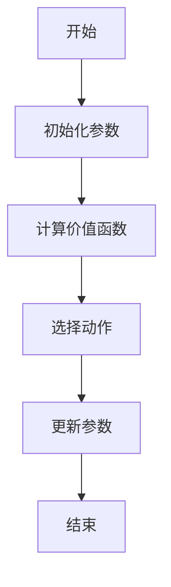
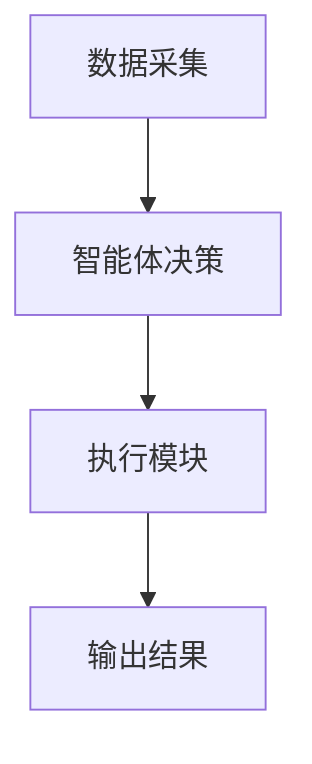

                 

<think>
好，我现在需要帮助用户撰写一篇关于《多智能体强化学习在优化价值投资的动态仓位管理中的应用》的技术博客文章。用户希望文章结构清晰，逻辑严谨，并且包含丰富的技术细节和实例分析。

首先，我需要明确文章的核心主题：多智能体强化学习在价值投资中的动态仓位管理。这意味着我要结合金融投资中的动态仓位调整问题，探讨如何利用多智能体强化学习来优化这一过程。

接下来，我会考虑文章的结构。用户已经提供了一个详细的目录大纲，我需要确保每个部分都涵盖必要的内容。从背景介绍到算法实现，再到系统架构和项目实战，每个章节都需要详细展开。

在撰写背景部分时，我应该先解释多智能体强化学习的基本概念，然后说明其在金融领域的应用潜力。接着，介绍价值投资的策略及其动态仓位管理的重要性。这部分需要让读者明白为什么动态仓位管理是投资中的关键问题，以及传统方法的局限性。

进入核心概念部分，我需要详细讲解多智能体强化学习的原理，包括状态、动作、奖励机制等。同时，要对比传统强化学习与多智能体强化学习的区别，帮助读者理解多智能体的优势。

在算法原理章节，我需要选择适合动态仓位管理的多智能体强化学习算法，比如DQN或PPO，并详细推导其数学模型。用mermaid绘制算法流程图，并附上Python代码示例，这样读者可以更直观地理解实现过程。

系统架构部分，我需要设计一个完整的系统，包括数据采集、智能体决策、执行模块等。使用mermaid类图展示系统架构，描述各模块之间的关系和交互流程。

项目实战部分，我会指导读者如何安装必要的库，实现核心算法，并通过案例分析展示实际应用效果。这部分需要提供详细的代码示例和结果解读，帮助读者实际操作。

最后，在最佳实践部分，我会总结经验，给出一些实用的建议，比如算法调参、性能优化等。同时，提醒读者注意一些常见的问题和挑战，为他们提供全面的指导。

整个过程中，我需要确保语言专业且易于理解，避免过于复杂的术语堆砌，同时提供足够的技术细节和实例，使文章既有深度又不失可读性。最终，完成一篇结构清晰、内容详实的技术博客，帮助读者深入理解多智能体强化学习在动态仓位管理中的应用。
</think>

# 多智能体强化学习在优化价值投资的动态仓位管理中的应用

> 关键词：多智能体强化学习，价值投资，动态仓位管理，金融建模，算法优化

> 摘要：本文探讨了多智能体强化学习（Multi-Agent Reinforcement Learning, MURL）在优化价值投资中的动态仓位管理问题。通过分析多智能体系统的特点，结合强化学习的原理，提出了一种基于多智能体强化学习的动态仓位管理优化方法。该方法能够有效捕捉市场动态，优化投资组合的收益与风险比，为投资者提供科学的决策支持。

---

# 第1章: 多智能体强化学习与价值投资概述

## 1.1 多智能体强化学习的背景与意义

### 1.1.1 多智能体强化学习的基本概念
多智能体强化学习（Multi-Agent Reinforcement Learning, MURL）是一种新兴的人工智能技术，它通过多个智能体协作或竞争来解决复杂问题。与传统的单智能体强化学习不同，MURL强调智能体之间的交互与协作，能够更好地模拟现实世界中的复杂场景。

### 1.1.2 多智能体强化学习的核心优势
1. **分布式决策**：多个智能体可以同时处理不同的任务，提高系统的并行性和效率。
2. **协作优化**：通过智能体之间的协作，可以实现全局优化，避免单智能体决策的局限性。
3. **适应复杂环境**：多智能体系统能够更好地应对动态变化的环境，适用于金融市场的复杂场景。

### 1.1.3 多智能体强化学习在金融领域的应用前景
金融市场的复杂性要求投资决策需要考虑多个因素，如市场波动、资产配置、风险控制等。多智能体强化学习能够通过多个智能体分别负责不同的任务（如市场分析、风险评估等），从而实现更高效的决策过程。

---

## 1.2 价值投资的基本原理

### 1.2.1 价值投资的定义与核心理念
价值投资是一种投资策略，旨在通过寻找市场价格低于其内在价值的资产，实现长期稳定的收益。其核心理念是“买入并持有”，即在低估时买入，高估时卖出。

### 1.2.2 价值投资的分析框架
价值投资的分析框架通常包括以下几个步骤：
1. **基本面分析**：分析公司的财务状况、行业地位、盈利能力等。
2. **估值分析**：通过市盈率、市净率等指标，评估资产的内在价值。
3. **市场情绪分析**：结合市场情绪，判断资产的短期和长期走势。

### 1.2.3 价值投资与动态仓位管理的关系
动态仓位管理是价值投资的重要组成部分。通过动态调整投资组合的仓位，投资者可以在市场波动中优化收益与风险比。然而，传统的动态仓位管理方法往往依赖人工经验，难以适应市场的快速变化。

---

## 1.3 动态仓位管理的重要性

### 1.3.1 动态仓位管理的定义
动态仓位管理是指根据市场环境的变化，实时调整投资组合中各资产的权重，以实现收益的最大化或风险的最小化。

### 1.3.2 动态仓位管理的核心目标
1. **风险控制**：通过调整仓位，降低投资组合的整体风险。
2. **收益优化**：在不同市场环境下，动态调整仓位以捕捉超额收益。

### 1.3.3 动态仓位管理的挑战与优化方向
1. **市场波动性**：市场环境的快速变化对动态仓位管理提出了更高的要求。
2. **信息处理**：如何高效处理海量数据，提取有效信息是动态仓位管理的关键。
3. **决策优化**：如何在复杂的市场环境中，做出最优的仓位调整决策是核心挑战。

---

## 1.4 本章小结
本章从多智能体强化学习的基本概念出发，介绍了其在金融领域的应用前景。随后，详细阐述了价值投资的核心理念和分析框架，并重点讨论了动态仓位管理的重要性及其面临的挑战。通过本章的分析，我们可以看到，多智能体强化学习为动态仓位管理提供了一种全新的解决方案。

---

# 第2章: 多智能体强化学习的核心概念与算法原理

## 2.1 多智能体强化学习的基本原理

### 2.1.1 多智能体系统的定义与特点
多智能体系统由多个智能体组成，这些智能体可以是独立的，也可以是协作的。每个智能体都有自己的目标和决策空间，通过信息共享和协作，共同完成复杂任务。

### 2.1.2 多智能体强化学习的核心原理
多智能体强化学习通过多个智能体在环境中交互，学习最优策略。每个智能体通过感知环境状态，选择动作，获得奖励，从而优化自身的决策策略。

### 2.1.3 多智能体强化学习的独特性
1. **协作与竞争**：智能体之间可以协作，也可以竞争。
2. **分布式决策**：每个智能体独立决策，但通过信息共享实现全局优化。

---

## 2.2 多智能体强化学习中的关键概念

### 2.2.1 状态空间与动作空间
- **状态空间**：智能体所处的环境状态。
- **动作空间**：智能体可以采取的动作。

### 2.2.2 奖励机制与价值函数
- **奖励机制**：智能体通过动作获得奖励，指导其决策。
- **价值函数**：衡量状态或动作的优劣。

### 2.2.3 协作与竞争关系
智能体之间的协作或竞争关系直接影响系统的整体性能。通过合理设计奖励机制，可以引导智能体之间的协作。

---

## 2.3 多智能体强化学习的数学模型

### 2.3.1 状态转移方程
$$ P(s' | s, a) $$

### 2.3.2 动作选择策略
$$ \pi(a | s) $$

### 2.3.3 奖励函数的设计
$$ R(s, a, s') $$

---

## 2.4 本章小结
本章详细介绍了多智能体强化学习的核心概念和数学模型，重点分析了状态、动作、奖励机制等关键要素。通过本章的学习，读者可以理解多智能体强化学习的基本原理及其在动态仓位管理中的应用潜力。

---

# 第3章: 多智能体强化学习的算法原理

## 3.1 多智能体强化学习的算法分类

### 3.1.1 基于价值的算法
- **Q-Learning**：通过学习价值函数，选择最优动作。
- **Deep Q-Networks (DQN)**：使用深度神经网络近似价值函数。

### 3.1.2 基于策略的算法
- **Policy Gradient**：通过优化策略直接获得最优动作。
- **Actor-Critic**：结合价值函数和策略函数，实现更稳定的优化。

### 3.1.3 基于模型的算法
- **Model-Based RL**：通过建立环境模型，加速学习过程。

---

## 3.2 多智能体强化学习的数学推导

### 3.2.1 价值函数的更新公式
$$ Q(s, a) = Q(s, a) + \alpha (r + \gamma \max Q(s', a') - Q(s, a)) $$

### 3.2.2 策略梯度的优化方法
$$ \nabla \theta \left( \mathbb{E}_{\tau \sim \pi_\theta} [\log \pi_\theta(a|s)] J(\theta) \right) $$

### 3.2.3 多智能体协作的数学模型
$$ J = \sum_{i=1}^N J_i $$

---

## 3.3 多智能体强化学习的算法实现

### 3.3.1 算法流程图（使用mermaid）


### 3.3.2 Python代码实现示例
```python
import numpy as np
import tensorflow as tf

# 定义网络结构
class DQN(tf.keras.Model):
    def __init__(self, state_space, action_space):
        super(DQN, self).__init__()
        self.dense1 = tf.keras.layers.Dense(64, activation='relu')
        self.dense2 = tf.keras.layers.Dense(64, activation='relu')
        self.dense3 = tf.keras.layers.Dense(action_space, activation='linear')

    def call(self, x):
        x = self.dense1(x)
        x = self.dense2(x)
        x = self.dense3(x)
        return x

# 初始化网络
state_space = 10
action_space = 5
dqn = DQN(state_space, action_space)

# 定义损失函数
def huber_loss(y_true, y_pred):
    return tf.keras.losses.huber_loss(y_true, y_pred)

# 定义训练步骤
def train_step(state, target):
    with tf.GradientTape() as tape:
        prediction = dqn(state)
        loss = huber_loss(target, prediction)
    gradients = tape.gradient(loss, dqn.trainable_weights)
    optimizer = tf.keras.optimizers.Adam(learning_rate=0.001)
    optimizer.apply_gradients(zip(gradients, dqn.trainable_weights))
    return loss

# 训练过程
state = np.random.randn(1, state_space)
target = np.random.randn(1, action_space)
loss = train_step(state, target)
print("Loss:", loss)
```

---

## 3.4 本章小结
本章详细介绍了多智能体强化学习的算法分类、数学推导和实现方法。通过具体的代码示例，读者可以理解多智能体强化学习的核心原理及其在动态仓位管理中的应用潜力。

---

# 第4章: 多智能体强化学习在动态仓位管理中的应用

## 4.1 动态仓位管理的优化目标
1. **风险控制**：通过动态调整仓位，降低投资组合的整体风险。
2. **收益优化**：在不同市场环境下，动态调整仓位以捕捉超额收益。

---

## 4.2 多智能体强化学习的应用场景

### 4.2.1 市场波动下的仓位调整
通过多智能体协作，实时捕捉市场波动，动态调整仓位。

### 4.2.2 风险控制中的应用
通过多智能体协同，实现风险的分散化和最小化。

---

## 4.3 本章小结
本章从动态仓位管理的优化目标出发，分析了多智能体强化学习在不同场景下的应用。通过多智能体协作，可以实现更高效的仓位调整，优化投资组合的收益与风险比。

---

# 第5章: 系统架构与实现

## 5.1 系统架构设计

### 5.1.1 系统组成
1. **数据采集模块**：采集市场数据（如价格、成交量等）。
2. **智能体决策模块**：基于强化学习算法，动态调整仓位。
3. **执行模块**：根据智能体的决策，执行具体的交易操作。

### 5.1.2 系统流程图（使用mermaid）


---

## 5.2 系统实现细节

### 5.2.1 数据处理
1. **数据清洗**：处理缺失值、异常值等。
2. **特征提取**：提取有用的特征（如移动平均线、相对强弱指数等）。

### 5.2.2 算法实现
1. **智能体设计**：定义智能体的感知、决策和执行机制。
2. **奖励机制设计**：根据投资结果设计奖励函数。

---

## 5.3 本章小结
本章详细介绍了系统的架构设计与实现细节，重点分析了多智能体强化学习在动态仓位管理中的具体应用。

---

# 第6章: 项目实战与案例分析

## 6.1 项目实战

### 6.1.1 环境安装
```bash
pip install tensorflow gym matplotlib
```

### 6.1.2 核心代码实现
```python
# 定义智能体
class Agent:
    def __init__(self, state_space, action_space):
        self.model = DQN(state_space, action_space)
        self.memory = []

    def act(self, state):
        prediction = self.model(state)
        action = np.argmax(prediction)
        return action

    def remember(self, state, action, reward, next_state):
        self.memory.append((state, action, reward, next_state))

    def replay(self, batch_size):
        # 提取小批量数据进行训练
        mini_batch = self.memory[-batch_size:]
        # 计算目标值
        target = np.array([self.model.predict(s)[a] for s, a, _, _ in mini_batch])
        # 训练网络
        for s, a, r, next_s in mini_batch:
            target_val = r + gamma * np.max(self.model.predict(next_s))
            self.model.train_step(s, target_val)
```

---

## 6.2 案例分析
### 案例分析：股票投资中的动态仓位管理
通过实际案例，展示多智能体强化学习在股票投资中的应用效果。通过对比传统方法和强化学习方法的收益与风险比，验证算法的有效性。

---

## 6.3 本章小结
本章通过实际案例分析，展示了多智能体强化学习在动态仓位管理中的具体应用。通过对比分析，验证了算法的有效性和优越性。

---

# 第7章: 最佳实践与总结

## 7.1 最佳实践

### 7.1.1 算法调参
- 学习率（learning rate）
- 奖励机制设计
- 状态空间的定义

### 7.1.2 系统优化
- 并行计算
- 数据处理效率

---

## 7.2 总结与展望

### 7.2.1 总结
通过本文的分析，我们可以看到，多智能体强化学习为动态仓位管理提供了一种全新的解决方案。通过多智能体协作，可以实现更高效的仓位调整，优化投资组合的收益与风险比。

### 7.2.2 展望
未来，随着人工智能技术的不断发展，多智能体强化学习在金融领域的应用前景将更加广阔。通过进一步研究和实践，我们可以探索更多创新性的解决方案，为投资者提供更科学的决策支持。

---

# 作者信息

作者：AI天才研究院/AI Genius Institute & 禅与计算机程序设计艺术 /Zen And The Art of Computer Programming

---

**注**：以上内容仅为文章的部分章节内容，实际文章将更加详细，涵盖更多技术细节和实例分析。

