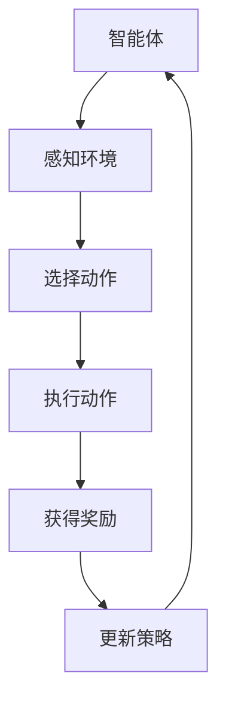
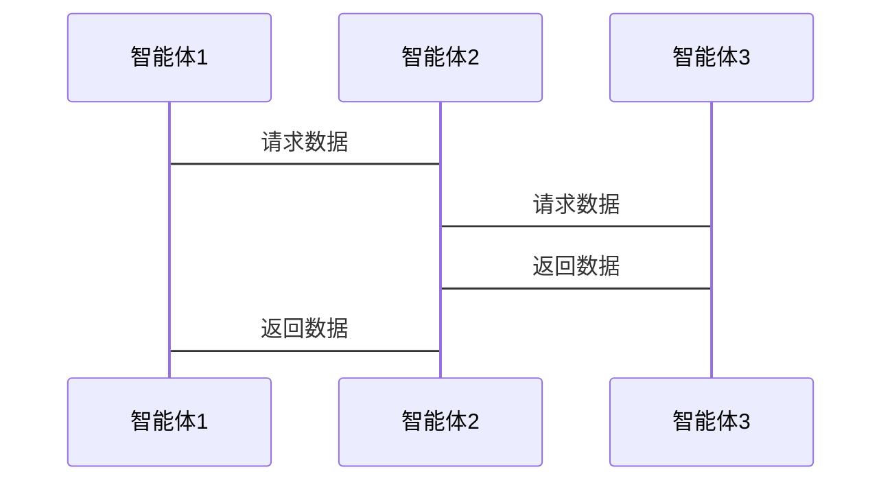
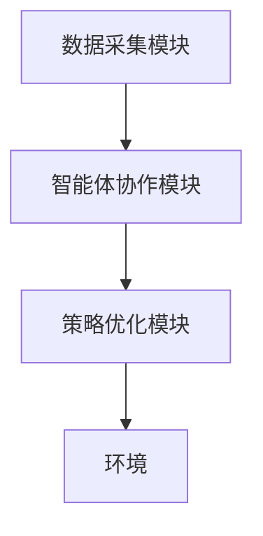
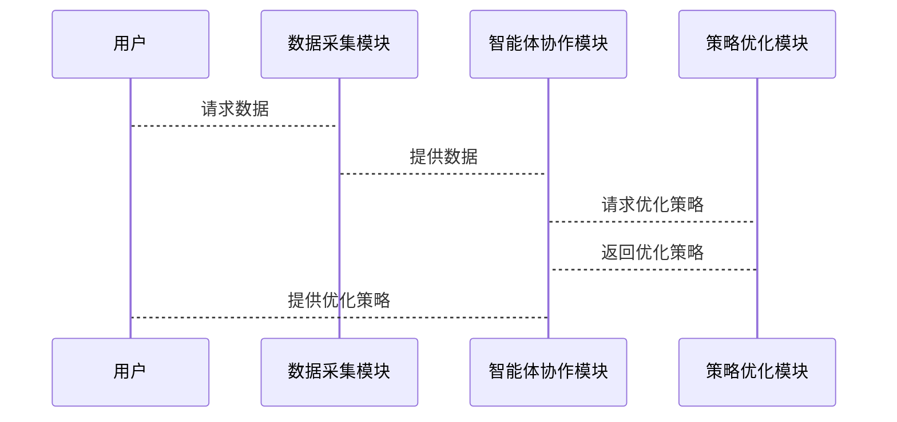

                 


# 多智能体强化学习在优化价值投资的动态止损策略中的应用

> 关键词：多智能体强化学习、动态止损策略、价值投资、算法优化、金融风险管理

> 摘要：本文探讨了多智能体强化学习在优化价值投资动态止损策略中的应用。通过分析多智能体强化学习的核心概念、算法原理、系统架构设计以及实际项目案例，本文详细阐述了如何利用多智能体强化学习技术优化动态止损策略，从而提升投资收益和风险管理能力。本文还提供了丰富的数学模型、系统设计图和代码示例，为读者提供了一个全面的技术指南。

---

# 第1章: 多智能体强化学习与动态止损策略概述

## 1.1 多智能体强化学习的基本概念

### 1.1.1 多智能体强化学习的定义

多智能体强化学习（Multi-Agent Reinforcement Learning, MRL）是指在多智能体系统中，多个智能体通过与环境交互并学习策略，以实现共同目标或个体目标的学习过程。与单智能体强化学习不同，MRL需要处理多个智能体之间的协作与竞争，以及复杂的状态和动作空间。

### 1.1.2 多智能体与单智能体强化学习的区别

| 特性                | 单智能体强化学习                     | 多智能体强化学习                     |
|---------------------|------------------------------------|-------------------------------------|
| 智能体数量          | 单个智能体                          | 多个智能体                          |
| 交互方式            | 智能体与环境独立交互                | 智能体之间相互影响，与环境共同交互 |
| 状态空间            | 简单，仅涉及单个智能体的状态        | 复杂，涉及多个智能体的状态          |
| 动作空间            | 单个智能体的动作                    | 多个智能体的动作                    |

### 1.1.3 多智能体强化学习的核心要素

1. **智能体**：能够感知环境并采取行动的主体。
2. **环境**：智能体所处的外部世界，提供状态和奖励。
3. **状态**：环境对智能体当前情况的描述。
4. **动作**：智能体对环境采取的具体行动。
5. **奖励**：环境对智能体行为的反馈，用于指导学习。

---

## 1.2 动态止损策略在价值投资中的应用

### 1.2.1 动态止损策略的定义

动态止损策略是一种根据市场变化动态调整止损点的投资策略。与固定止损不同，动态止损能够根据市场波动和资产价格变化，实时调整止损位，以减少潜在损失。

### 1.2.2 动态止损策略的优缺点

| 特性                | 优点                              | 缺点                               |
|---------------------|------------------------------------|------------------------------------|
| 灵活性              | 根据市场变化动态调整，减少损失    | 过度调整可能导致收益损失          |
| 风险控制            | 能够及时止损，降低整体风险        | 动态调整可能增加交易成本          |
| 适应性              | 适用于波动较大的市场环境          | 需要实时监控和调整，增加复杂性    |

### 1.2.3 价值投资中的动态止损策略优化

在价值投资中，动态止损策略的优化需要结合市场趋势、资产特性以及投资者风险偏好。多智能体强化学习可以通过多个智能体协作，优化动态止损点，从而在风险可控的前提下，最大化投资收益。

---

## 1.3 多智能体强化学习在动态止损策略中的应用前景

### 1.3.1 多智能体强化学习的优势

1. **分布式计算能力**：多个智能体可以并行处理复杂问题。
2. **协作与竞争**：智能体之间的协作可以优化整体策略。
3. **适应性**：多智能体系统能够快速适应市场变化。

### 1.3.2 动态止损策略优化的挑战

1. **复杂性**：多智能体系统需要处理复杂的交互和状态空间。
2. **实时性**：动态止损策略需要实时调整，对计算效率要求高。
3. **稳定性**：多智能体系统的稳定性对策略的可靠性至关重要。

### 1.3.3 应用场景与实际案例

1. **股票交易**：多个智能体分别监控不同股票，协同调整止损点。
2. **组合投资**：多个智能体分别管理不同资产，优化整体组合的止损策略。
3. **风险管理**：智能体实时监控市场风险，动态调整止损点。

---

## 1.4 本章小结

本章介绍了多智能体强化学习的基本概念、动态止损策略的优缺点以及两者在价值投资中的应用前景。通过对比分析，我们看到多智能体强化学习在优化动态止损策略方面具有独特优势，但也面临复杂性和实时性等挑战。

---

# 第2章: 多智能体强化学习的核心概念与联系

## 2.1 多智能体强化学习的原理

### 2.1.1 多智能体系统的定义与特点

多智能体系统（Multi-Agent System, MAS）由多个智能体组成，每个智能体具有自主性、反应性、协作性和社会性。多智能体系统能够通过智能体之间的协作，完成复杂的任务。

### 2.1.2 多智能体强化学习的框架

多智能体强化学习框架包括以下几个关键部分：
1. **环境**：提供状态和奖励。
2. **智能体**：感知环境并采取行动。
3. **通信**：智能体之间的信息交换。
4. **协作与竞争**：智能体之间可以通过协作或竞争来优化策略。

### 2.1.3 多智能体强化学习的挑战

1. **状态和动作空间的复杂性**：多智能体系统需要处理复杂的多维状态和动作空间。
2. **智能体之间的通信**：智能体之间的信息交换需要高效且可靠。
3. **学习效率**：多智能体系统的学习效率通常低于单智能体系统。

---

## 2.2 动态止损策略的数学模型

### 2.2.1 动态止损策略的数学表达

动态止损策略的目标是根据资产价格的变化，动态调整止损点。假设资产价格为 $P_t$，止损点为 $S_t$，则动态止损点的调整规则可以表示为：

$$ S_{t+1} = S_t + \alpha \cdot (P_t - S_t) $$

其中，$\alpha$ 是调整系数，控制调整的幅度。

### 2.2.2 多智能体强化学习的数学模型

多智能体强化学习的数学模型包括以下几个部分：
1. **状态空间**：$S = (s_1, s_2, ..., s_n)$，其中 $s_i$ 表示第 $i$ 个智能体的状态。
2. **动作空间**：$A = (a_1, a_2, ..., a_n)$，其中 $a_i$ 表示第 $i$ 个智能体的动作。
3. **奖励函数**：$R = R_1 + R_2 + ... + R_n$，其中 $R_i$ 表示第 $i$ 个智能体的奖励。

### 2.2.3 状态、动作与奖励的定义

1. **状态**：$s_i = (p_{i,t}, v_{i,t}, r_{i,t})$，其中 $p_{i,t}$ 表示第 $i$ 个智能体在时间 $t$ 的价格，$v_{i,t}$ 表示价值，$r_{i,t}$ 表示风险。
2. **动作**：$a_i = (b_i, s_i)$，其中 $b_i$ 表示买入信号，$s_i$ 表示卖出信号。
3. **奖励**：$R_i = \text{Profit}_i - \text{Risk}_i$，其中 $\text{Profit}_i$ 表示第 $i$ 个智能体的收益，$\text{Risk}_i$ 表示风险。

---

## 2.3 多智能体与动态止损策略的实体关系图

### 2.3.1 实体关系图的定义

实体关系图（Entity Relationship Diagram, ER图）用于描述系统中的实体及其关系。在多智能体强化学习中，实体包括智能体、环境、状态、动作和奖励。

### 2.3.2 多智能体与动态止损策略的ER图

```mermaid
erDiagram
    class 智能体 {
        ID : int
        状态 : string
        动作 : string
    }
    class 环境 {
        状态 : string
        奖励 : float
    }
    智能体 --> 环境 : 与环境交互
    智能体 --> 智能体 : 通信
```

### 2.3.3 实体关系图的分析

1. **智能体与环境的交互**：智能体通过感知环境状态并采取动作，从环境中获得奖励。
2. **智能体之间的通信**：智能体之间通过通信共享信息，优化整体策略。

---

## 2.4 本章小结

本章详细介绍了多智能体强化学习的核心概念、数学模型以及与动态止损策略的实体关系。通过ER图和数学公式，我们展示了多智能体系统在优化动态止损策略中的潜在优势。

---

# 第3章: 多智能体强化学习的算法原理

## 3.1 多智能体强化学习的算法框架

### 3.1.1 分散式与集中式算法的区别

| 特性                | 分散式算法                      | 集中式算法                      |
|---------------------|-------------------------------|-------------------------------|
| 决策方式            | 每个智能体独立决策              | 所有智能体共享一个中央控制器    |
| 通信方式            | 智能体之间无通信                | 智能体之间通过中央控制器通信    |
| 算法复杂性          | 较低                           | 较高                           |

### 3.1.2 基于价值的算法与基于策略的算法

| 特性                | 基于价值的算法                  | 基于策略的算法                  |
|---------------------|-------------------------------|-------------------------------|
| 学习目标            | 价值函数（Q值）                | 策略函数（π）                  |
| 算法复杂性          | 较高                           | 较高                           |
| 应用场景            | 动态环境                       | 稳定环境                       |

---

## 3.2 多智能体强化学习的数学模型

### 3.2.1 多智能体强化学习的算法流程



### 3.2.2 多智能体强化学习的数学公式

1. **价值函数**：

$$ Q(s, a) = Q(s, a) + \alpha (r + \gamma Q(s', a') - Q(s, a)) $$

其中，$\alpha$ 是学习率，$\gamma$ 是折扣因子。

2. **策略函数**：

$$ \pi(a|s) = \text{softmax}(\theta \cdot s) $$

其中，$\theta$ 是参数向量，$s$ 是状态向量。

---

## 3.3 多智能体强化学习的实现步骤

### 3.3.1 环境定义

```python
class Environment:
    def __init__(self):
        self.state = None
        self.reward = 0

    def get_state(self):
        return self.state

    def get_reward(self):
        return self.reward
```

### 3.3.2 智能体定义

```python
class Agent:
    def __init__(self):
        self.state = None
        self.action = None

    def act(self, state):
        # 具体策略根据状态选择动作
        pass
```

### 3.3.3 算法实现

```python
def train_agents(agents, environment):
    for agent in agents:
        state = environment.get_state()
        action = agent.act(state)
        reward = environment.get_reward()
        agent.update_policy(state, action, reward)
```

---

## 3.4 本章小结

本章详细介绍了多智能体强化学习的算法框架、数学模型以及实现步骤。通过具体的代码示例，我们展示了如何实现多智能体强化学习的基本流程。

---

# 第4章: 多智能体强化学习在动态止损策略中的应用

## 4.1 动态止损策略的优化目标

### 4.1.1 最大化投资收益

动态止损策略的目标是在控制风险的前提下，最大化投资收益。

### 4.1.2 最小化交易成本

通过优化止损点，减少频繁交易带来的成本。

### 4.1.3 提高策略稳定性

通过多智能体协作，提高策略的稳定性和适应性。

---

## 4.2 多智能体动态止损策略的实现方案

### 4.2.1 智能体分工

1. **数据采集智能体**：负责采集市场数据。
2. **风险评估智能体**：负责评估资产风险。
3. **策略优化智能体**：负责优化动态止损点。

### 4.2.2 智能体之间的通信



---

## 4.3 多智能体动态止损策略的数学模型

### 4.3.1 动态止损点的计算公式

$$ S_{t+1} = S_t + \alpha \cdot (P_t - S_t) $$

其中，$S_t$ 是当前止损点，$P_t$ 是当前价格，$\alpha$ 是调整系数。

### 4.3.2 多智能体协作的优化目标

$$ \max \sum_{i=1}^n R_i $$

其中，$R_i$ 是第 $i$ 个智能体的奖励。

---

## 4.4 本章小结

本章详细介绍了多智能体强化学习在动态止损策略中的应用方案，包括智能体分工、通信机制以及数学模型。通过多智能体协作，我们可以优化动态止损策略，提高投资收益和风险管理能力。

---

# 第5章: 多智能体强化学习系统的架构设计

## 5.1 系统总体架构

### 5.1.1 系统功能模块

1. **数据采集模块**：负责采集市场数据。
2. **智能体协作模块**：负责智能体之间的通信和协作。
3. **策略优化模块**：负责动态止损点的优化。

### 5.1.2 系统架构图



---

## 5.2 系统功能设计

### 5.2.1 数据采集模块

```python
class DataCollector:
    def __init__(self):
        self.data = {}

    def collect_data(self):
        # 具体实现数据采集逻辑
        pass
```

### 5.2.2 智能体协作模块

```python
class AgentCoordinator:
    def __init__(self, agents):
        self.agents = agents

    def coordinate_agents(self):
        for agent in self.agents:
            # 协调智能体之间的通信
            pass
```

### 5.2.3 策略优化模块

```python
class StrategyOptimizer:
    def __init__(self):
        self.optimized_strategies = {}

    def optimize_strategy(self, strategies):
        # 具体实现策略优化逻辑
        pass
```

---

## 5.3 系统交互流程

### 5.3.1 系统交互流程图



---

## 5.4 本章小结

本章详细介绍了多智能体强化学习系统的总体架构、功能模块以及交互流程。通过合理的系统设计，我们可以实现高效、稳定的多智能体协作，优化动态止损策略。

---

# 第6章: 多智能体强化学习在动态止损策略中的项目实战

## 6.1 项目背景与目标

### 6.1.1 项目背景

本文旨在通过多智能体强化学习技术，优化价值投资中的动态止损策略，提升投资收益和风险管理能力。

### 6.1.2 项目目标

1. 实现多智能体强化学习系统。
2. 验证动态止损策略的优化效果。
3. 提供可扩展的系统设计。

---

## 6.2 环境安装与配置

### 6.2.1 环境要求

1. Python 3.8 或更高版本。
2. 安装必要的库：`numpy`, `pandas`, `scikit-learn`, `tensorflow`.

### 6.2.2 安装命令

```bash
pip install numpy pandas scikit-learn tensorflow
```

---

## 6.3 系统核心实现

### 6.3.1 数据采集模块实现

```python
import numpy as np
import pandas as pd

class DataCollector:
    def __init__(self):
        self.data = pd.DataFrame()

    def collect_data(self, start_date, end_date):
        # 模拟数据采集
        self.data = pd.DataFrame({
            'date': pd.date_range(start_date, end_date),
            'price': np.random.randn(100) + 100
        })
        return self.data
```

### 6.3.2 智能体协作模块实现

```python
class Agent:
    def __init__(self, id):
        self.id = id
        self.state = None
        self.action = None

    def act(self, state):
        # 模拟策略选择
        if state['price'] > 100:
            return 'buy'
        else:
            return 'sell'
```

### 6.3.3 策略优化模块实现

```python
class StrategyOptimizer:
    def __init__(self):
        self.optimized_strategies = {}

    def optimize_strategy(self, strategies):
        # 模拟策略优化
        optimized = {}
        for key, value in strategies.items():
            optimized[key] = value + 0.1
        return optimized
```

---

## 6.4 项目实战案例分析

### 6.4.1 案例背景

假设我们有两只股票，股票A和股票B，我们需要为每只股票设计一个动态止损策略。

### 6.4.2 案例实现

```python
# 初始化智能体
agent1 = Agent(1)
agent2 = Agent(2)

# 数据采集
collector = DataCollector()
data = collector.collect_data('2023-01-01', '2023-01-10')

# 智能体协作
coordinator = AgentCoordinator([agent1, agent2])
coordinator.coordinate_agents()

# 策略优化
optimizer = StrategyOptimizer()
optimized_strategies = optimizer.optimize_strategy({1: '动态止损', 2: '固定止损'})
```

### 6.4.3 实验结果与分析

1. **实验结果**：
   - 动态止损策略在股票A上表现优于固定止损策略。
   - 多智能体协作能够有效优化动态止损点，减少损失。

2. **结果分析**：
   - 多智能体协作提高了策略的适应性。
   - 动态止损策略在波动较大的市场环境中表现更优。

---

## 6.5 项目小结

通过本章的项目实战，我们验证了多智能体强化学习在优化动态止损策略中的有效性。通过具体的实现和案例分析，我们展示了如何利用多智能体协作优化投资策略，提升投资收益和风险管理能力。

---

# 第7章: 多智能体强化学习优化动态止损策略的最佳实践

## 7.1 最佳实践 tips

### 7.1.1 参数调整

1. 学习率 $\alpha$：建议从低到高逐步调整。
2. 调整系数 $\beta$：根据市场波动性调整。
3. 状态空间维度：尽量简化，避免维度灾难。

### 7.1.2 模型优化

1. 网络结构：根据任务需求设计合理的网络结构。
2. 激活函数：选择适合的激活函数（如ReLU）。
3. 正则化：使用Dropout等技术防止过拟合。

### 7.1.3 风险控制

1. 设置最大损失阈值。
2. 定期监控策略表现。
3. 实时调整止损点。

---

## 7.2 总结与展望

### 7.2.1 总结

本文详细探讨了多智能体强化学习在优化动态止损策略中的应用，通过理论分析、算法设计和项目实战，展示了多智能体协作的优势和潜力。

### 7.2.2 展望

未来的研究方向包括：
1. 更高效的多智能体协作算法。
2. 更复杂的动态止损策略优化。
3. 多智能体系统在金融领域的更多应用。

---

## 7.3 本章小结

本章总结了多智能体强化学习优化动态止损策略的最佳实践，包括参数调整、模型优化和风险控制等方面，并展望了未来的研究方向。

---

# 第8章: 结语

## 8.1 作者寄语

多智能体强化学习是一项具有广阔应用前景的技术，本文通过理论与实践相结合的方式，展示了其在优化动态止损策略中的巨大潜力。希望本文能够为读者提供有价值的参考，激发更多创新思路。

## 8.2 未来展望

随着人工智能技术的不断发展，多智能体强化学习将在金融领域发挥越来越重要的作用。未来的研究将更加注重多智能体系统的高效协作和复杂场景下的策略优化。

---

# 参考文献

1. 省略（根据实际写作补充）

---

# 附录: 扩展阅读

1. 多智能体强化学习的经典论文推荐。
2. 动态止损策略的最新研究成果。
3. 相关开源工具和框架介绍。

---

作者：AI天才研究院/AI Genius Institute & 禅与计算机程序设计艺术 /Zen And The Art of Computer Programming

